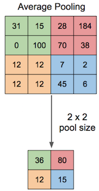

## 대제목(영어제목)
[원문 링크]()
> 문서 간략 소개

* 주요 키워드 1
* 주요 키워드 2
* 주요 키워드 3

### 중제목
> 간략 소개

#### 소제목

#### 소제목

### 참고문서
* [참고 사이트 1]()
* [참고 사이트 2]()

----
(예시입니다)

## 케라스로 ResNet fine-tuning 하기 + CoreML을 이용해 iOS 앱에 모델 심기(How to fine-tune ResNet in Keras and use it in an iOS App via Core ML)
[How to fine-tune ResNet in Keras and use it in an iOS App via CoreML 원문 바로 가기](https://heartbeat.fritz.ai/how-to-fine-tune-resnet-in-keras-and-use-it-in-an-ios-app-via-core-ml-ee7fd84c1b26)
> 이 문서는 머신러닝에 익숙하지 않은 모바일 개발자들을 위해 빠르고 쉽게 딥러닝을 애플리케이션에 적용하는 방법에 관해 설명합니다. 케라스를 이용해 기존에 생성된 모델을 fine-tuning 하는 방법과 생성된 모델을 iOS 애플리케이션에 심는 방법에 대해 자세히 설명합니다. 최종 생성할 프로젝트는 시각 장애인을 위한 애플리케이션으로, 지폐 이미지를 인식해 지폐의 금액이 얼마인지 음성으로 읽어주는 기능을 합니다.

* 케라스
* ResNet
* Fine-Tune
* CoreML
* iOS
* Mobile
* Application


### 개념 설명
> 애플리케이션을 생성하기 전에, 프로젝트를 이해하기 위해 꼭 알아야 하는 개념을 소개합니다. 케라스와 ResNet50에 대해 설명하며, 이미 알고 있는 내용이라면 프로젝트 구현으로 바로 건너뛰어도 무방합니다.

#### 케라스
구글 엔지니어 François Chollet가 개발한 것으로, 쉽고 빠른 딥러닝을 위한 오픈 소스 신경망 라이브러리입니다. 자세한 내용은 [Keras 공식 홈페이지](https://keras.io)를 참고하세요.

#### ResNet50
내용 설명...


### 프로젝트 구현
> 내용 설명...

#### Fine-Tuning

```python
def get_model():

    input_tensor = Input(shape=(224, 224, 3))  # this assumes K.image_data_format() == 'channels_last'

    # create the base pre-trained model
    base_model = ResNet50(input_tensor=input_tensor,weights='imagenet',include_top=False)

    for layer in base_model.layers:
        layer.trainable=False

    x = base_model.output
    x = GlobalAveragePooling2D(data_format='channels_last')(x)
    x = Dense(num_classes, activation='softmax')(x)

    updatedModel = Model(base_model.input, x)

    return  updatedModel
```

  
[이미지 출처](https://pythonmachinelearning.pro/introduction-to-convolutional-neural-networks-for-vision-tasks/)

### 참고 사이트
* [케라스 공식 홈페이지](https://keras.io)
* [김태영의 케라스 블로그](https://keras.io)
