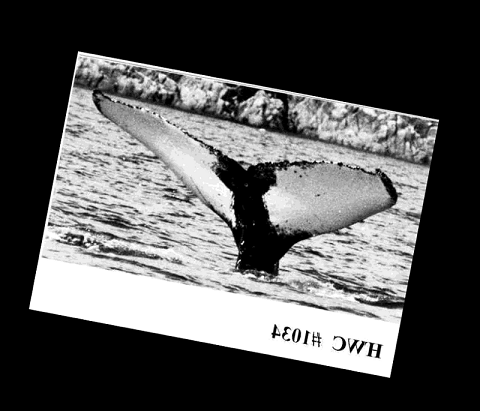
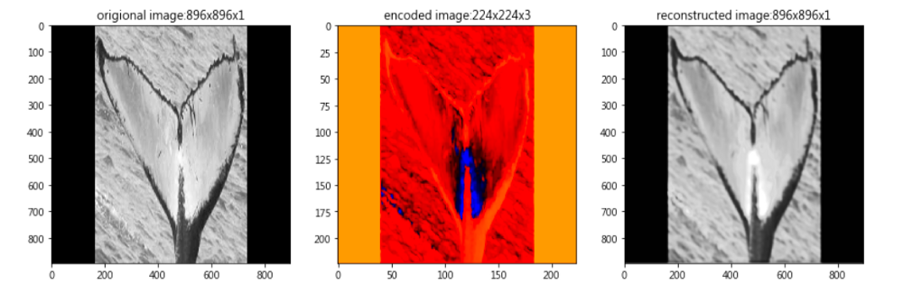

## Python과 Keras를 활용한 고래 식별 딥러닝

[Humpback Whale Identification Challenge on Kaggle (원문 바로가기)](https://medium.com/@evily.yang/humpback-whale-identification-challenge-on-kaggle-7c550a342df3)  

> 이 글은 저자가 Kaggle의 고래 식별 대회에 참여한 경험을 바탕으로 하고 있습니다. Keras를 활용하여 딥러닝으로 이미지 식별 문제를 접근한 방식과 그 과정에서 겪었던 어려움들을 서술하고 있습니다.  
> 원문을 번역하는 과정에서 설명이 필요한 부분을 덧붙여 작성하여 원문과 다를 수 있음을 알려드립니다. 또한, 원문에 첨부된 코드를 실습하는 과정에서 원저자의 환경과 실습환경이 상이하여 코드 상 차이가 있음을 알려드립니다.  (원문과 상이한 부분은 별도로 표기하였습니다).

* 딥러닝
* CNN
* Auto Encoder
* 이미지 분류기

[캐글 대회 링크 바로가기](https://www.kaggle.com/c/whale-categorization-playground/leaderboard)

### 요약

#### 도구 (Tools)
- 파이썬
- 케라스
- 텐서플로우
- GPU 2개 (번역자: Google Colab)

#### 사용 기법 (Methods)
- 오토인코더 (Auto Encoder)
- 합성곱 신경망 (CNN) : VGG19, ResNet50
- 트랜스퍼 러닝 (Transfer Learning)
- 로스(Loss) 함수에 다른 클래스 가중치 사용하기
- 데이터 오그멘테이션 (Data Augmentation)

#### 해결된 문제
- 224x224 보다 큰 이미지 처리
- 케라스로 여러 개 GPU 사용하기

#### 해결 안 된 문제
- 데이터 불균형 문제
- 낮은 정확도 (점수 : 0.32653, 벤치마크 : 0.36075 보다 낮음)

### 개요

  
*copyright from official website on kaggle* [(원본 링크)](https://cdn-images-1.medium.com/max/800/1*ZFLdPELtJUtC7BemmIfsNw.png)  

고래 감시 시스템을 사용하여 고래들의 활동을 추적할 때 종(Species)을 자동으로 분류하는 시스템이 필요합니다. 이 글에서 다루는 캐글 대회는 제공된 고래 꼬리 이미지를 기반으로 종을 분류하는 것을 목표로 합니다.  

대회에서 제공된 트레인 셋은 총 4,251종(클래스), 9,850개의 이미지로 구성되어 심한 클래스 불균형을 보이고 있는데 (그 중 2,220개의 클래스는 샘플 이미지가 한 장 뿐입니다), 이러한 불균형을 해결하기 위해서 글쓴이는 데이터 오그멘테이션(Data Augmentation) 기법과 로스(Loss) 함수에 클래스마다 다른 가중치를 적용하였습니다.  

게다가 트레인 셋의 모든 이미지는 합성곱 신경망(이하 CNN)의 기본 입력 사이즈인 224x224보다 크기 때문에 (트레인 셋 데이터의 11%는 크기가 1050x600인 이미지), 이를 해결하기 위해 오토인코더(Auto Encoder)를 사용하여 큰 사이즈의 이미지를 CNN 기본 입력 사이즈로 변환하는 과정을 거쳤습니다. 하지만 데이터 불균형이 심했기 때문에 오토인코더으로 인한 성능의 향상을 정확하게 측정할 수는 없습니다.  
테스트 셋은 총 15,610개의 이미지로 구성되어 있고, 해당 캐글 대회에서는 이미지를 5가지 종류를 분류하고, mAP(Mean Average Precision)을 지표로 평가합니다.   

#### 작업 흐름  
이미지 입력 → 이미지 처리 → 오토인코더 → CNN → 예측  

각 단계에 대한 자세한 내용은 아래에 설명되어 있습니다.  

### 데이터 불러오기

이번 단계는 이미지 정보를 읽어오기 전에 트레인 셋으로 주어진 이미지의 정보를 읽어오는 과정입니다 (데이터는 [캐글 대회 링크](https://www.kaggle.com/c/whale-categorization-playground/data)에서 다운받을 수 있습니다).  

`Download All` 버튼을 눌러 데이터 전체를 다운로드 받아 압축을 풀게 되면, `train.zip`, `test.zip`, `train.csv`, `sample_submission.csv` 총 4개의 파일이 있는 것을 확인할 수 있습니다.  
  - `train.zip` : 트레인 셋 데이터 압축 파일  
  - `test.zip` : 테스트 셋 데이터 압축 파일  
  - `train.csv` : 트레인 셋 이미지 정보 (이미지 파일명과 이미지 ID)  
  - `sample_submission.csv` : 제출 양식 (학습과는 무관)   

다음 코드를 실행하기 전에 `train.zip`과 `test.zip` 파일의 압축을 풀어야 합니다.  

> **1단계** : `train.csv` 파일을 `pandas` 패키지로 읽어온다.  
> **2단계** : `os` 패키지를 사용하여 트레인 셋과 테스트 셋에 데이터가 얼마나 있는지 확인한다.  
> **3단계** : 데이터 테이블을 구성한다.  
> **4단계** : `이미지이름:레이블` 형태로 구성된 딕셔너리를 구성한다.  

~~~python
import os

# pandas가 설치되어 있지 않다면 
# pip install pandas
# 명령어를 사용하여 pandas를 먼저 설치해야 한다.
import pandas as pd

# 1단계 : train.csv 파일을 읽어온다.
df = pd.read_csv(base_folder+'/train.csv')

# 2단계 : train / test 폴더의 이미지 파일 리스트를 가져온다.
train_images = os.listdir('train/')
test_images = os.listdir('test/')

# 3단계 : 폴더경로+파일명으로 이미지 파일의 전체 경로 열(Column)를 추가한다.
# 2단계에서의 폴더 경로와 같아야 한다. (예 : /user/workspace/train ...)
df['ImagePath'] = df['Image'].map(lambda x: 'train/' + x)

# 4단계 : 이미지 파일:ID 형태의 딕셔너리를 생성한다. 
ImageToLabelDict = dict(zip(df.Image, df['Id']))

# 최종 DataFrame 형태
df.head()
~~~

### 데이터 처리하기

> **1단계** : `opencv(cv2)` 패키지로 이미지를 불러온다.  
> **2단계** : 이미지를 RGB에서 Grayscale로 변환한다 (이전 단계에서 데이터가 실수 형태로 변경되면, 2단계에서 에러가 발생한다).  
> **3단계** : 이미지를 1:1 비율로 변경하기 위해 제로-패딩(Zero-padding)을 사용한다.  
> **4단계** : 이미지 크기를 896x896으로 변경한다 (다운샘플링을 2번 시행한 결과가 CNN 기본 사이즈인 224x224가 되도록 하기 위해서 896x896 사이즈로 변경).  
> **5단계** : 이미지를 0~255 사이값으로 조정한다.  

~~~python
# cv2가 설치되어 있지 않다면 
# pip install opencv-python
# 명령어를 사용하여 opencv(cv2)를 먼저 설치해야 한다.
import cv2

def imageProcess(imagePath, name, newFolder):
  # 1단계: cv2.imread()로 이미지 파일을 불러온다.
  img = cv2.imread(imagePath)
  height, width, channels = img.shape
  
  # 2단계: 이미지를 RGB에서 GRAY로 변환한다.
  if channels != 1:
    img = cv2.cvtColor(img, cv2.COLOR_RGB2GRAY)
  # 주의 : 반드시 GRAY로 변환한 다음 float 타입으로 변경하도록 한다.  
  img = img.astype(np.float)
  
  # 3단계: 제로-패딩으로 이미지를 1:1 비율로 변경한다. 
  newSize = max(width, height)
    
  if newSize % 2 == 1:
    newSize = newSize + 1
    
  newImg = np.zeros((newSize, newSize, 3))
  
  midh = int(newSize/2)
  whalf = int(math.floor(width/2))
  hhalf = int(math.floor(newSize/2))
  
  img = cv2.resize(img, ((whalf)*2, (hhalf)*2))
  newImg[(midh-hhalf):(midh+hhalf), (midh-whalf):(midh+whalf), :] = np.dstack((img, img, img))
  
  # 4단계: 이미지를 896x896으로 변경한다.
  newImg = cv2.resize(newImg, (896, 896))
  newImg = newImg.astype(np.float)
  
  # 5단계: 이미지 픽셀값을 0~255로 조정한다.
  newImg = (newImg-newImg.min())/(newImg.max() - newImg.min())
  newImg = newImg*255
  
  # 처리된 이미지를 저장한다.
  cv2.imwrite(newFolder+ '/' + name, newImg)

# 트레인 셋 이미지 처리
for i in range(len(train_images)):
  imageProcess(df['ImagePath'][i], df['Image'][i], "AutoEncoder_Data/Train/")
~~~  
  

### 오토인코더 (Auto Encoder)

오토인코더는 비지도적인(Unsupervised) 기법이기 때문에 레이블 없이 학습이 가능합니다. 오토인코더는 데이터 압축에 사용할 수 있을 뿐만 아니라 모델을 미리 학습시키는 용도로도 활용할 수 있어, 데이터가 충분치 않을 때 모델의 성능을 향상시킬 수 있습니다.  

필자는 합성곱 오토인코더(Convolutional Auto Encoder)를 사용하였습니다. 입력 사이즈는 896x896x1, 인코딩된 사이즈는 224x224x3 (CNN 입력 사이즈), 디코딩된 사이즈는 896x896x1로 구성되었습니다.  

오토인코더를 사용하면서 데이터 압축 효과와 함께 (다음 단계인) CNN을 적용하기 전에 이미지 특성 추출(Feature Extraction)의 효과까지 기대하였습니다. 이를 위해서 깊은 오토인코더를 설계하여, `Conv-BN-Relu(합성곱-배치정규화-Relu)` 구조를 2번 반복하고 샘플링을 1번 시행하였습니다.  

이 경우에, 배치 정규화(Batch Normalization)가 학습 효율을 향상시키는 데에 매우 효과적이었습니다.  

~~~python
from keras.layers import Input, Conv2D, BatchNormalization, Activation, UpSampling2D
from keras.layers.pooling import MaxPooling2D

input_img = Input(shape=(896, 896, 1))

x = Conv2D(16, (3, 3), padding='same')(input_img)
x = BatchNormalization()(x)
x = Activation('relu')(x)
x = Conv2D(16, (3, 3), padding='same')(x)
x = BatchNormalization()(x)
x = Activation('relu')(x)
x = MaxPooling2D((2, 2), padding='same')(x)

x = Conv2D(8, (3, 3), padding='same')(x)
x = BatchNormalization()(x)
x = Activation('relu')(x)
x = Conv2D(3, (3, 3), padding='same')(x)
x = BatchNormalization()(x)
x = Activation('relu')(x)
encoded = MaxPooling2D((2, 2), padding='same')(x)

# 위 과정을 거치면 이미지는 (224, 224, 3) 형태로 변경된다.
~~~  

~~~python
x = Conv2D(8, (3, 3), padding='same')(encoded)
x = BatchNormalization()(x)
x = Activation('relu')(x)
x = Conv2D(8, (3, 3), padding='same')(x)
x = BatchNormalization()(x)
x = Activation('relu')(x)
x = UpSampling2D((2, 2))(x)

x = Conv2D(16, (3, 3), padding='same')(x)
x = BatchNormalization()(x)
x = Activation('relu')(x)
x = Conv2D(16, (3, 3), padding='same')(x)
x = BatchNormalization()(x)
x = Activation('relu')(x)
x = UpSampling2D((2, 2))(x)
decoded = Conv2D(1, (3, 3), activation='sigmoid', padding='same')(x)
~~~  

레이어를 정의하고 나서, `Model(input, output)` 함수를 통해 입력값과 출력값을 지정합니다.  

필자는 Adam Optimizer가 보통의 SGD보다 빨리 학습시키는 장점 때문에 Adam Optimizer를 선택하였습니다.  

오토인코더의 레이블이 입력값으로 쓰이기 때문에 로스(Loss)함수는 `MSE`를 사용하도록 지정하였습니다.  

모델 정의가 끝나면 모델을 컴파일합니다.  

> 만약 여러 개의 GPU가 있다면, `CUDA_VISIBLE_DEVICES`를 사용하여 케라스에 원하는 GPU를 할당할 수 있습니다. 여러 개의 GPU를 학습에 사용하고자 한다면, Keras에서는 두가지 방법을 제공합니다. 필자는 `multi_gpu_model()`을 사용하여 병렬 컴퓨팅을 수행했습니다. 하지만 Keras에서 GPU를 발견하면 자동으로 할당하도록 되어 있어 `multi_gpu_model()`함수를 반드시 사용해야 하는지는 확실치 않습니다.   

~~~python
# GPU를 여러개 사용한다면, 사용하는 GPU를 할당한다.
import os
os.environ["CUDA_VISIBLE_DEVICES"] = "0,2"
~~~  

~~~python
from keras.models import Model
from keras.optimizers import Adam

# 모델의 입력값과 출력값을 설정한다.
auto_encoder = Model(input_img, decoded)
ot = Adam(lr=0.5, beta_1=0.9, beta_2=0.999, epsilon=None, decay=0.95, amsgrad=False)
~~~  

~~~python
from keras.utils import multi_gpu_model

epochsum = 20

# 여러 개의 GPU로 모델을 학습하기 위한 설정
auto_encoder = multi_gpu_model(auto_encoder, gpus = 2)

# 모델 컴파일
auto_encoder.compile(optimizer=ot, loss='mean_squared_error')
auto_encoder.summary()
~~~

#### 데이터 셋 만들기

이미지 데이터가 학습에 충분하지 않기 때문에, 데이터 오그멘테이션(Data Augmentation)이 필요한데, 케라스에서 제공하는 `ImageDataGenerator`를 사용하면 쉽게 할 수 있습니다.  

필자는 `ImageDataGenerator.flow_from_directory`를 사용하였는데, 모든 이미지 데이터를 한번에 메모리에 불러오게 되면 메모리 부하가 생기기 때문입니다. `ImageDataGenerator.flow_from_directory`는 필요할 때에만 지정된 폴더에서 데이터를 읽어오는 방식을 취합니다.  

데이터는 아래와 같은 포맷으로 저장됩니다 (단, 오토인코더 단계에서는 클래스를 나누지 않고 한 폴더에 위치합니다).  
- 트레인 셋
> AutoEncoder_Data/Train/Categories C(Labels)/ *.jpg  
> AutoEncoder_Data/Train/Categories B(Labels)/ *.jpg  

- 테스트 셋
> AutoEncoder_Data/Test/Categories C(Labels)/ *.jpg  
> AutoEncoder_Data/Test/Categories B(Labels)/ *.jpg  

주의할 점은 `color_mode`의 기본값이 `rgb`이기 때문에, 반드시 `grayscale`로 바꾸어야 합니다. 또한, `class_mode`는 `input`으로 설정해야 합니다.  

~~~python
from keras.preprocessing.image import ImageDataGenerator

batch_size = 32
seednum = 1

train_gen = ImageDataGenerator(rescale=1./255, 
                               rotation_range=15, 
                               width_shift_range=.15, 
                               height_shift_range=.15, 
                               horizontal_flip=True)

# 첫번째 인자인 대상 폴더 하위에는 이미지가 있는 폴더가 있어야 합니다.
# 예 : AutoEncoder_Data/Train/Train/image.jpg
trainD = train_gen.flow_from_directory('AutoEncoder_Data/Train',
                                      class_mode='input',
                                      target_size=(896, 896),
                                      color_mode = 'grayscale',
                                      batch_size=batch_size,
                                      seed=seednum)

test_gen = ImageDataGenerator(rescale=1./255)
testD = train_gen.flow_from_directory('AutoEncoder_Data/Test',
                                      class_mode='input',
                                      target_size=(896, 896),
                                      color_mode = 'grayscale',
                                      batch_size=batch_size,
                                      seed=seednum+1)
# 실행 결과
# Found 9856 images belonging to 1 classes.
# Found 15626 images belonging to 1 classes.
~~~  

*Rotated + Shift + Flap* [(원본 링크)](https://cdn-images-1.medium.com/max/800/1*3N1cfyBQitAriCMHBOEIkg.png)  

이제 학습을 시켜봅시다!  

전 단계에서 `ImageDataGenerator.flow_from_directory`를 사용했기 때문에 학습을 할 때 `Model.fit_generator`를 사용해야 합니다. 만약 `ImageDataGenerator.flow_from_directory`를 사용하지 않았다면, `Model.fit`를 사용하면 됩니다.  

`steps_per_epoch` 옵션 값은 정수여야 하기 때문에, `//` 연산자를 사용하는 것에 주의하시기 바랍니다.

~~~python
from keras.callbacks import TensorBoard

auto_encoder.fit_generator(trainD,
                          epochs=1,
                          verbose=1,
                          shuffle=True,
                          validation_data=testD,
                          steps_per_epoch=len(train_images)//batch_size,
                          validation_steps=len(test_images)//batch_size,
                          callbacks=[TensorBoard(log_dir='/tmp/trainae5')])
~~~  

#### 오토인코더에서 특성 추출하기

오토인코더에서 이미지 특성을 추출하기 위해서 `Model(autoencoder.inpt, autoencoder.get_layer(레이어 이름).output)`로 새로운 모델을 정의합니다. `autoencoder.summary()`를 사용하면 레이어 이름을 확인할 수 있습니다.  

여기서 주의할 점은 케라스에서 여러 GPU를 사용하게 되면 모델이 자동적으로 저장되지 않기 때문에 따로 모델을 저장을 해주어야 하고, 모델을 불러온 다음 컴파일을 다시 해주어야 한다는 것입니다.  

~~~python
# GPU를 사용하지 않거나 한 개 사용할 경우 건너뛰면 된다.
model = auto_encoder.get_layer('model_116')

# 모델 저장
auto_encoder.save("./autoencoder.h5")
~~~   
  

~~~python
from keras.models import load_model

# 저장된 모델을 불러오기
model = load_model("./autoencoder.h5")

# GPU를 사용하지 않거나 한 개 사용할 경우 건너뛰어도 된다.
ot = Adam(lr=0.5, beta_1=0.9, beta_2=0.999, epsilon=None, decay=0.95)
model.compile(optimizer=ot, loss="mean_squared_error")
~~~  

~~~python
# 오토인코더 학습 결과 이미지 출력

# 이미지 불러오기
img = cv2.imread("./AutoEncoder_Data/Test/Test/000bc353.jpg")
height, width, channels = img.shape

# RGB에서 Grayscale로 변환
newImg = cv2.cvtColor(img, cv2.COLOR_RGB2GRAY)
# uint8에서 float으로 변환
newImg = newImg.astype(np.float)
# 정규화
newImg = newImg/255
# 입력값과 같은 형식으로 변환
newImg = newImg.reshape((1, 896, 896, 1))
# 예측
predictImage = model.predict(newImg)
# 이미지 형태 변환
predictImage = predictImage.reshape((896, 896))
plt.imshow(predictImage)
~~~

~~~python
# max_pooling2d_2 레이어의 이미지 특성 추출
model_ext = Model(inputs=model.input, outputs=model.get_layer('max_pooling2d_2').output)

img = cv2.imread(base_folder + "/AutoEncoder_Data/Test_1/Test/000bc353.jpg")
height, width, channels = img.shape

newImg = cv2.cvtColor(img, cv2.COLOR_RGB2GRAY)
newImg = newImg.astype(np.float)
newImg = newImg/255
newImg = newImg.reshape((1, 896, 896, 1))
predictImage = model_ext.predict(newImg)
predictImage = predictImage.reshape((224, 224, 3))
plt.imshow(predictImage)
~~~

*The result of Auto Encoder* [(원본 링크)](https://cdn-images-1.medium.com/max/1000/1*_7nPjUl_nzptD-UOGh0vbA.png)  

### 이미지 분류
#### 클래스 가중치 정하기 & 레이블 인코딩 & 원-핫 인코딩

클래스 불균형이 심하기 때문에 클래스 가중치를 정해주어야 합니다. 샘플 데이터가 적은 클래스일수록 가중치를 크게 주어, CNN이 이미지를 분류할 때 샘플이 적은 클래스를 틀리면, 로스가 커지게 됩니다. 따라서, CNN은 로스를 줄이기 위해서 샘플이 적은 클래스에 대해 잘못된 예측을 줄이는 방향으로 학습을 할 것입니다.  

### 결론

### 참고문서
* [참고 사이트 1]()
* [참고 사이트 2]()

