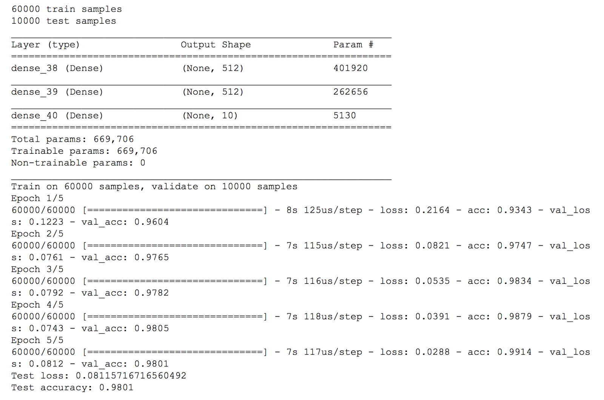

## Keras와 ML Kit을 활용한 손 글씨 숫자 인식하기(feat.Android)
[From Keras to ML Kit 원문 바로가기](https://proandroiddev.com/from-keras-to-ml-kit-eeaf578a01df)
> 문서 간략 소개

* 케라스
* ML Kit
* TensorFlow Lite
* Android

### From Keras to ML Kit
> 간략 소개

### How can I use my Keras model with ML Kit?
Keras는 텐서플로 위에서 작동할 수 있는 파이썬 기반의 신경망 라이브러리 오픈소스 입니다. 신경망을 쉽게 구현할 수 있는 라이브러리 입니다. TensorFlow와 완벽하게 호환되면서 TensorFlow의 세부사항을 추상화합니다. 신경망  공부를 시작하게 되면 더 많이 사용하게 될 것입니다.
<br>
이 튜토리얼에서는 [Keras repository](https://github.com/keras-team/keras/blob/master/examples/mnist_mlp.py)에 있는 기본적인 예를 제 [Jupyter Notebook](https://github.com/miquelbeltran/deep-learning/blob/master/android-mlkit-sample/Keras%20Sample.ipynb)을 통해 살펴볼 것 입니다.
<br>
이번 예제에서 Keras 원작자는 MNIST 데이터 셋으로부터 손 글씨 숫자를 읽을 수 있는 모델을 만들었습니다. MNIST 데이터 셋은 머신 러닝에서 많이 사용되는 데이터 셋이며, 저는 이것을 이용하여 [myFace Generator 프로젝트](https://proandroiddev.com/deep-learning-nd-face-generator-fa92ddbb8c4a)를 진행했습니다.
<br>


Keras로 모델을 생성하는 부분입니다.
```
model = Sequential()

model.add(Dense(512, activation='relu', input_dim=784))
#model.add(Dropout(0.2))
model.add(Dense(512, activation='relu'))
#model.add(Dropout(0.2))
model.add(Dense(num_classes, activation='softmax'))

model.summary()
```
이 모델은 세 개의 레이어로 단순하게 구성되어 있습니다. 입력 차원은 784차원이며, 출력 차원은 10개의 클래스에 해당하는 10차원이고, 각각 완전 연결 레이어로 구성되어 있습니다.
참고로 원본 샘플의 드롭 아웃은 주석 처리했는데 그 이유는 나중에 설명하겠습니다.
> MNIST데이터 셋의 이미지 크기는 28X28인 2차원입니다. 이를 완전 연결 레이어에 적용시키기 위해선 1X784인 1차원으로 리사이징 해야합니다.

### Training the model
학습 과정은 주피터 노트북에서 확인할 수 있습니다. [케라스 샘플](https://github.com/miquelbeltran/deep-learning/blob/master/android-mlkit-sample/Keras%20Sample.ipynb)
<br>
결과는 다음과 같습니다.



이 모델의 정확도는 0.98이며 우수하지는 않습니다. 저는 오직 5에폭만 학습시켰고, 드롭 아웃 레이어를 뺏기 때문에 정확도가 원래의 예시에 비해 약간 떨어졌습니다.

### Exporting a Keras model

### Running on a Google Colab

### Running the exported model on Android

### 참고문서
* [참고 사이트 1]()
* [참고 사이트 2]()

> 이 글은 2018 컨트리뷰톤에서 [Contribute to Keras](https://github.com/KerasKorea/KEKOxTutorial) 프로젝트로 진행했습니다. <br>
> Translator : [김수정](https://github.com/SooDevv) <br>
> Translator email : [soojung.dev@gmail.com](soojung.dev@gmail.com)
