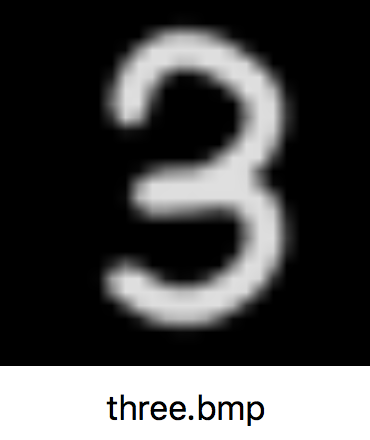

## Keras와 ML Kit을 활용한 손 글씨 숫자 인식하기(feat.Android)
[From Keras to ML Kit 원문 바로가기](https://proandroiddev.com/from-keras-to-ml-kit-eeaf578a01df)
> 이 튜토리얼의 목적은 Keras모델을 안드로이드에 올려서 모바일 머신러닝을 구현함에 있습니다.

* Keras
* ML Kit
* TensorFlow Lite
* Android

<br>
### From Keras to ML Kit
> Keras모델을 생성하고, 학습시키며, 내보내며(export), ML Kit에서 실행시키는 일련의 과정에 대한 튜토리얼입니다.

<p>
이 튜토리얼은 제가 쓴 ML Kit 시리즈 중 에 한 예시입니다.
<p>
<u>[TensorFlow 모델 ML Kit 으로 export하기기](https://proandroiddev.com/exporting-tensorflow-models-to-ml-kit-bce13b914f31)</u>는 여러분이 Python 코드로 작성한 모델을 export하기 쉽게 작성한 튜토리얼입니다. 이 튜토리얼에서는 온라인에서 볼 수 있는 다른 예시들보다 설치, 과정들이 많지 않습니다.

<p>
<u>[커스텀한 TensorFlow 모델들 ML Kit에 올리기: 입력과 출력 이해하기](https://proandroiddev.com/custom-tensorflow-models-on-ml-kit-understanding-input-and-output-ca0b2c27be5f)</u>는 ML Kit을 사용하여 export시킨 모델을 안드로이드 앱에 로드시켰습니다. 이 튜토리얼에서는 ML Kit 예제 코드를 자세히 살펴보고 적절한 입력 및 출력을 구성하는 방법을 알 수 있습니다.

<p>
오늘 저는 다음 질문에 답하려고 노력할 것입니다.

<br>
### How can I use my Keras model with ML Kit?
Keras는 TensorFlow 위에서 작동할 수 있는 파이썬 기반의 신경망 라이브러리 오픈소스 입니다. TensorFlow와 완벽하게 호환되면서 TensorFlow의 세부사항을 추상화합니다. 신경망 공부를 시작하게 되면 더 많이 사용하게 될 것입니다.

<p>
이 튜토리얼에서는 [Keras repository](https://github.com/keras-team/keras/blob/master/examples/mnist_mlp.py)에 있는 기본적인 예제를 저의 [Jupyter Notebook](https://github.com/miquelbeltran/deep-learning/blob/master/android-mlkit-sample/Keras%20Sample.ipynb)을 통해 살펴볼 것 입니다.
<br>
이번 예제에서 Keras 원작자는 MNIST 데이터 셋으로부터 손 글씨 숫자를 읽을 수 있는 모델을 만들었습니다. MNIST 데이터 셋은 머신 러닝에서 많이 사용되는 데이터 셋이며, 저는 이것을 이용하여 [myFace Generator 프로젝트](https://proandroiddev.com/deep-learning-nd-face-generator-fa92ddbb8c4a)를 진행했었습니다.
<br>


자세히 살펴봅시다. 아래의 코드는 Keras로 모델을 생성하는 부분입니다.
```
model = Sequential()

model.add(Dense(512, activation='relu', input_dim=784))
#model.add(Dropout(0.2))
model.add(Dense(512, activation='relu'))
#model.add(Dropout(0.2))
model.add(Dense(num_classes, activation='softmax'))

model.summary()
```

이 모델은 세 개의 레이어로 단순하게 구성되어 있습니다. 입력 차원은 784차원이며, 출력 차원은 10개의 클래스에 해당하는 10차원이고, 각각 완전 연결 레이어로 구성되어 있습니다.
참고로 원본 샘플의 드롭 아웃은 주석 처리했는데 그 이유는 나중에 설명하겠습니다.
> MNIST데이터 셋의 이미지 크기는 28X28인 2차원입니다. 이를 완전 연결 레이어에 적용시키기 위해선 1X784인 1차원으로 리사이징 해야합니다.

---
<br>
### Training the model
학습 과정은 주피터 노트북에서 확인할 수 있습니다. [케라스 샘플](https://github.com/miquelbeltran/deep-learning/blob/master/android-mlkit-sample/Keras%20Sample.ipynb)
<br>
결과는 다음과 같습니다.


이 모델의 정확도는 0.98이며 우수하지는 않습니다. 저는 오직 5에폭만 학습시켰고, 드롭 아웃 레이어를 뺏기 때문에 정확도가 원래의 예시에 비해 약간 떨어졌습니다.

---

### Exporting a Keras model
모델 훈련을 마친 후, Keras 모델을 TF Lite로 변환해야 합니다. [텐서플로 모델을 ML Kit으로 내보내기](https://proandroiddev.com/exporting-tensorflow-models-to-ml-kit-bce13b914f31)와 같은 과정이지만 추가적인 과정이 필요합니다. <br>

> 코드 설명은 아래에 있습니다.

```
from keras import backend as K

custom_input_tensor = tf.placeholder(tf.float32, shape=(1, 784))
output_tensor = model(custom_input_tensor)

frozen_graph = freeze_session(K.get_session(), output_names[output_tensor.op.name])

tflite_model = tf.contrib.lite.toco_convert(frozen_graph,[custom_input_tensor], [output_tensor])
open("app/src/main/assets/nmist_mlp.tflite", "wb").write(tflite_model)
```

Keras모델을 입력 텐서로 감싸고, 출력 텐서를 구해야 합니다. 우리는 이 텐서들을 ML Kit의 입력과 출력으로 사용합니다.

<br>`freeze_session` 전에, 입력 텐서로 `(1, 784)`벡터의 TensorFlow의 `placeholder`를 정의하였습니다. 그리고 나서 Keras로 만든 `model`을 가지고 입력 텐서를 인자값으로 넣어줍니다. 결과 값은 `output_tensor`입니다.

<br>두번째로, `freeze_session`을 호출합니다. 이것은 링크로 걸어놓은 나의 예전 글에 나와있습니다. 하지만 이번에는 Keras 뒷단으로 부터 TensorFlow세션을 반환하는 `K.get_session()`을 호출합니다.

<br>마지막으로, 방금 만든 입력과 출력 텐서를 `toco_convert`메소드에 전달하고, 변수를 고정시켜서 모델을 ```tflite```파일에 저장합니다.

<br>그러나, 원래 모델은 잠시동안 **TF Lite가 지원하지 않는**`Dropout`을 사용하였습니다. 저는 원래의 모델을 내보내는 과정에서 문제가 생겼었는데, 드롭아웃 레이어를 제거하니깐 해결되었습니다. 저는 TensorFlow의 다음 버전에서 이 문제가 해결되길 기대합니다.

---


### Running on a Google Colab
이 과정을 [Jupyter Notebook](https://github.com/miquelbeltran/deep-learning/blob/master/android-mlkit-sample/Keras%20Sample.ipynb)을 통해 똑같이 구현할 수 있습니다. [Google Colab](https://colab.research.google.com/)에서 을 통해  GPU 가속을 사용하여 무료로 사용해보세요. 방법은 [notebook](https://github.com/miquelbeltran/deep-learning/blob/master/android-mlkit-sample/Keras%20Sample.ipynb)을 다운로드하고 Google Colab에서 열면 됩니다.
<br>
만약 Google Colab에서 만든 모델을 내보내고 싶다면, 내보내기 단계에서 파일 경로를 변경하고 `files.download`를 호출하면 됩니다. 그러면 브라우저에서 파일 다운로드가 시작됩니다.
<br>

```
from google.colab import files
...
open("nmist_mlp.tflite", "wb").write(tflite_model)
files.download('nmist_mlp.tflite')
```
---
### Running the exported model on Android
우리의 모델이 실제로 작동하는지 보기위해서 Android Studio로 뛰어 가보겠습니다.
<p>
이 모델이 실행되는 액티비티는 <u>[MnistActivity.kt](https://github.com/miquelbeltran/deep-learning/blob/master/android-mlkit-sample/app/src/main/java/work/beltran/mlkitsample/MnistActivity.kt)</u> 에서 열 수 있습니다.
<p>
```
// 입력 : 1x784 텐서
val inputDims = intArrayOf(1, 784)
// 출력 : 1x10 텐서
val outputDims = intArrayOf(1, 10)
```
<p>
이를 테스트하기 위해 손으로 숫자 3을 써서 색상을 뒤집어 회색 스케일 비트 맵으로 변환했습니다.
> 색상을 뒤집은 이유는 MNIST 데이터 셋의 이미지들이 검은색 배경에 흰색 손 글씨 숫자가 써있기 때문입니다.


<p>
두번째, 비트맵을 받고 하나의 0과 1 사이의 실수 배열로 변환하는 과정이 필요합니다.
<p>
```
// ML Kit Input
val inp = arrayOf(FloatArray(784) { 0f })

// Read our Bitmap
val bitmap = BitmapFactory.decodeStream(assets.open("three.bmp"))

// Read pixels
val intValues = IntArray(784)
bitmap.getPixels(intValues, 0, bitmap.width, 0, 0, bitmap.width, bitmap.height)

intValues.forEachIndexed { index, i ->
    // Take one color channel, convert it to float, and divide it by 265 to obtain a [0, 1] value
    val f = (i and 0xFF).toFloat()
    inp[0][index] = f / 256
}

// Pass the inputs
val inputs = FirebaseModelInputs.Builder().add(inp).build()
```
<p>
이제 우리는 입력을 가지고 모델을 실행할 시간입니다.
<p>
```
interpreter.run(inputs, dataOptions)
    .continueWith { task ->
         val output = task.result.getOutput<Array<FloatArray>>(0)
    }
```
<p>
출력 배열을 확인했을 때, 다음과 같은 결과를 얻었습니다.
<p>
```
7.771087E-15,
3.1033683E-13,
1.7879811E-9,
0.9999988,
3.5368996E-16,
5.594893E-7,
8.98838E-16,
3.1935377E-12,
5.8121117E-7,
3.0227494E-9
```
<p>
보이는 것처럼, 우리는 출력 배열의 3번째 위치하고 있는 0.999의 값을 얻었습니다. 이것은 **숫자3의 카테고리와 일치합니다!** 우리의 모델은 Android에서 작동합니다!
> 배열의 위치는 0부터 시작하기 때문에 순서대로 0, 1, 2, 3이여서 3번째 위치라고 표현합니다.

<br>
**이 시리즈가 TensorFlow, Keras 및 ML Kit가 어떻게 함께 작동하는지 이해하는데 도움이 되었기를 바랍니다.** 추가 도움이 필요하다면 도와 드리겠습니다! 저는 모바일 및 머신러닝에서 프리랜서 기회를 찾고 있습니다. 저의 정보입니다. <u>http://beltran.work/with-me/</u>

<br>
### 참고문서
* [참고 사이트 1]()
* [참고 사이트 2]()

> 이 글은 2018 컨트리뷰톤에서 [Contribute to Keras](https://github.com/KerasKorea/KEKOxTutorial) 프로젝트로 진행했습니다. <br>
> Translator : [김수정](https://github.com/SooDevv) <br>
> Translator email : [soojung.dev@gmail.com](soojung.dev@gmail.com)
