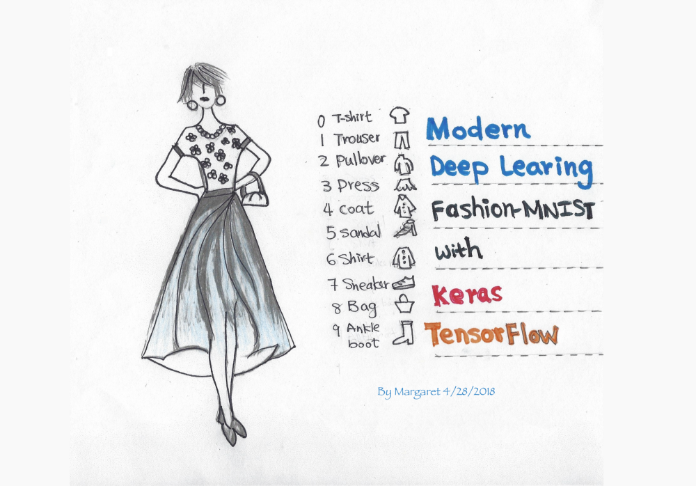
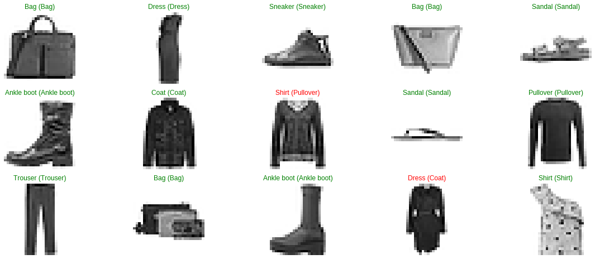

## 딥러닝의 Hello World, Fashion-MNIST <br> (Fashion-MNIST with tf.Keras)

[Fashion-MNIST with tf.Keras 원문 바로 가기](https://medium.com/tensorflow/hello-deep-learning-fashion-mnist-with-keras-50fcff8cd74a)

> 이 문서는 MNIST 데이터셋을 대신해서 사용할 수 있는 Fashion-MNIST 데이터셋을 사용한 튜토리얼 입니다. <br>딥러닝 입문자들은 tf.keras를 사용하여 손쉽게 모델을 구현할 수 있습니다.

* 케라스
* Fashion-MNIST
* Convolution Neural Networks

<br>

### Fashion-MNIST with tf.Keras

이 문서는 컨볼루션 신경망(CNN)을 사용하여 tf.keras로 Fashion-MNIST 데이터셋을 분류하는 튜토리얼입니다. 몇 줄의 코드를 통해, 많은 최적화 과정 없이도 90% 이상의 정확도로 이미지를 분류 할 수있는 모델을 정의하고 학습 할 수 있습니다.



<br>

[Fashion-MNIST](https://github.com/zalandoresearch/fashion-mnist)는 기존의 [MNIST](http://yann.lecun.com/exdb/mnist/) 데이터셋(10개 카테고리의 손으로 쓴 숫자)을 대신해 사용할 수 있습니다. 그 이유는 MNIST와 동일한 이미지 크기(28x28)이며 동일한 학습 셋 (60,000), 테스트 셋(10,000)으로 나눌 수 있기 때문입니다. 따라서 딥러닝의 "hello world" 튜토리얼이라고 할 수 있습니다.
>기계학습 분야에서 유명한 데이터셋인 MNIST(손글씨 숫자 이미지)는 0부터 9까지의 숫자 이미지로 구성되어 있습니다. 학습 이미지가 60,000장, 테스트 이미지가 10,000장으로 준비되어 있고, Fashion-MNIST와 마찬가지로 28x28 크기의 회색조 이미지입니다.

[Keras](https://keras.io/)는 인기있는 고수준(high-level)의 딥러닝 API으로 알려져있습니다. 독립적인 오픈 소스 프로젝트일 뿐만 아니라 TensorFlow로 빌드 될 수 있으며, ```tf.keras```를 임포트해 훌륭한 Keras 프로그램을 작성할 수 있습니다. ```tf.keras```를 사용하면 실행 및 ```tf.data```와 같은 기능을 활용할 수 있습니다. 여기서는 기초를 다룰 것 입니다.

저는 몇가지의 딥러닝 용어에 관해 검토할 것입니다. 만약 당신이 딥러닝 입문자라면, 저의 튜토리얼과 저수준(low-level)의 TensorFlow API을 사용한 훨씬 오래된 [MNIST 튜토리얼](https://www.tensorflow.org/tutorials/)을 비교하고 대조해서 보길 권합니다. 얼마나 쉬운 일이 일어났는지 볼 수 있기 때문입니다.  

<br>

#### Colab에서 실행 (Run this notebook in Colab)

모든 코드는 저의 GitHub에 있습니다. Google의 Colab을 사용해 [저의 Gitub의 Jupyter Notebook](https://colab.research.google.com/github/margaretmz/deep-learning/blob/master/fashion_mnist_keras.ipynb)을 직접 열어서 실행할 수 있습니다. 빨리 노트북을 열어 튜토리얼을 따라가고 싶다면 이 옵션을 선택해보세요. Colab에 대해 더 알고싶다면 [공식 블로그](https://medium.com/tensorflow/colab-an-easy-way-to-learn-and-use-tensorflow-d74d1686e309) 혹은 [블로그](https://medium.com/@margaretmz/running-jupyter-notebook-with-colab-f4a29a9c7156)를 참고하세요.

<br>

### 데이터 (Data)

Fashion-MNIST 데이터셋에는 10개의 카테고리가 있습니다.

**레이블 설명**

0 티셔츠/탑 <br>
1 바지 <br>
2 풀오버(스웨터의 일종) <br>
3 드레스 <br>
4 코트 <br>
5 샌들 <br>
6 셔츠 <br>
7 스니커즈 <br>
8 가방 <br>
9 앵클 부츠

<br>

#### Fashion_mnist 데이터셋 불러오기 (Import the fashoin_mnist dataset)

데이터셋을 가져와서 학습, 검증, 테스트 셋을 준비합니다.

keras.datasets API를 사용하여 한 줄의 코드만으로 fashion_minst 데이터를 불러오세요. 그런 다음 학습 셋과 테스트 셋을 불러오면 각각 흑백 이미지 28x28을 볼 수 있습니다.

```python
!pip install -q -U tensorflow>=1.10.1
# 원문에서는 1.8.0 버전을 사용했지만 18.08월 기준 1.10 버전이 release되어 1.10.1로 설치했습니다.
import tensorflow as tf
import numpy as np
import matplotlib.pyplot as plt

# 미리 섞여진 fashoin-mnist의 학습 데이터와 테스트 데이터 로드
# (학습 이미지, 학습 레이블), (테스트 이미지, 테스트 레이블)
(x_train, y_train), (x_test, y_test) = tf.keras.datasets.fashion_mnist.load_data()

print("x_train shape:", x_train.shape, "y_train shape:", y_train.shape)
```

<br>

#### 데이터 시각화 (Visualize the data)

제가 Jupyter Notebook에서 가장 좋아하는 기능은 시각화 입니다. matplotlib 라이브러리의 ```imshow()```를 사용해 학습 데이터셋의 이미지를 시각화하여 데이터셋의 이미지 중 하나를 살펴볼 수 있습니다. 각 이미지는 28x28 모양의 흑백 이미지입니다.

 ```python
 # 학습 셋 크기(shape) - 이미지 크기가 28x28 인 60,000 개의 학습 이미지 데이터, 60,000 개의 레이블
 print("x_train shape:", x_train.shape, "y_train shape:", y_train.shape)

 # 학습 셋과 테스트 셋의 데이터 개수
 print(x_train.shape[0], 'train set')
 print(x_test.shape[0], 'test set')

 # 레이블 정의
 fashion_mnist_labels = ["T-shirt/top",  # 인덱스 0
                         "Trouser",      # 인덱스 1
                         "Pullover",     # 인덱스 2
                         "Dress",        # 인덱스 3
                         "Coat",         # 인덱스 4
                         "Sandal",       # 인덱스 5
                         "Shirt",        # 인덱스 6
                         "Sneaker",      # 인덱스 7
                         "Bag",          # 인덱스 8
                         "Ankle boot"]   # 인덱스 9

 # 이미지 인덱스, 0에서 59,999 사이의 숫자를 선택할 수 있습니다.
 img_index = 5
 # y_train 은 에서 9까지의 레이블 포함합니다.
 label_index = y_train[img_index]
 # 레이블 출력해 봅니다. 예를들어 2 Pullover
 print ("y = " + str(label_index) + " " +(fashion_mnist_labels[label_index]))
 # 학습 데이터 중에서 이미지 한 장을 보여줍니다.
 plt.imshow(x_train[img_index])
 ```
 

<br>

#### 데이터 정규화 (Data normalization)

그런 다음 데이터 크기를 정규화하여 대략적으로 데이터 크기를 동일하게 맞춥니다.

```python
x_train = x_train.astype('float32') / 255
x_test = x_test.astype('float32') / 255
```

<br>

#### 데이터를 학습/검증/테스트 셋으로 나누기 (Split the data into train/validation/test datasets)

데이터를 임포팅하는 과정에서, 60,000개의 학습 셋과 10,000개의 테스트셋을 얻을 수 있습니다. 이제 학습 셋을 학습 셋/검증 셋으로 나누고자 합니다. 딥러닝에서 각 유형의 데이터셋이 사용되는 방법은 다음과 같습니다.
  - Training data(학습 데이터) - 모델을 학습에 사용하는 데이터
  - Validation data(검증 데이터) - 하이퍼파라미터를 튜닝하고 모델을 검증하기 위해 사용하는 데이터
  - Test data(테스트 데이터) - 검증 셋으로 모델의 초기 검사를 마친 후에, 모델을 테스트하는 데이터

```python
# 학습 데이터 셋을 학습 / 평가 셋으로 나눈다. (# 학습 셋: 55,000, 검증 셋: 5000)
(x_train, x_valid) = x_train[5000:], x_train[:5000]
(y_train, y_valid) = y_train[5000:], y_train[:5000]

# 입력 이미지의 크기를 (28, 28) 에서 (28, 28, 1) 로 배열 차원을 변경(reshape)
w, h = 28, 28
x_train = x_train.reshape(x_train.shape[0], w, h, 1)
x_valid = x_valid.reshape(x_valid.shape[0], w, h, 1)
x_test = x_test.reshape(x_test.shape[0], w, h, 1)

# 레이블에 원-핫 인코딩 적용
# 원-핫 벡터는 단 하나의 차원에서만 1이고, 나머지 차원에서는 0인 벡터입니다.
y_train = tf.keras.utils.to_categorical(y_train, 10)
y_valid = tf.keras.utils.to_categorical(y_valid, 10)
y_test = tf.keras.utils.to_categorical(y_test, 10)

# 학습 셋 크기
print("x_train shape:", x_train.shape, "y_train shape:", y_train.shape)

# 학습용, 검증용, 테스트용 데이터셋의 개수
print(x_train.shape[0], 'train set')
print(x_valid.shape[0], 'validation set')
print(x_test.shape[0], 'test set')
```
<br>

### 모델 (Model)

모델을 구성하고 학습시켜 봅시다.

#### 모델 아키텍처 만들기 (Create the model architecture)

Keras에서 모델을 정의하기위한 두 가지 API는 다음과 같습니다.

1. [시퀀스 모델 API](https://keras.io/models/sequential/)(순차 모델 API)
2. [함수 API](https://keras.io/models/model/)

이 튜토리얼에서는 시퀀스 모델 API를 사용하여  컨볼루션 레이어(CNN)을 반복하는 간단한 CNN 모델을 만들고 풀링 레이어, 드롭 아웃 레이어를 만듭니다. 만약 함수 API에 관심이 있다면 Sara Robinson의 블로그 [Kearas 함수 API와 TensorFlow로 와인 가격 예측하기](https://medium.com/tensorflow/predicting-the-price-of-wine-with-the-keras-functional-api-and-tensorflow-a95d1c2c1b03)를 확인해보세요. <br>

입력 데이터의 크기(shape)는 첫 번째 레이어에서만 정의해주면 됩니다. 마지막 레이어의 결과 값은 소프트맥스 활성화 함수를 거치며, 여기서 Fashion-MNIST의 10가지 범주의 데이터를 분류합니다.
마지막 레이어는 덴스(dense)레이어 로 소프트맥스 활성화가 되어있으며, fashion_mnist에서 10가지 범주의 데이터를 분류합니다.
> 소프트맥스 함수는 다중 클래스분류 문제에서 출력층에 주로 쓰입니다. <br>
> 덴스(dense)레이어는 이전 레이어의 모든 뉴런과 결합된 형태의 레이어입니다.

<br>


```python
model = tf.Keras.Sequential()

# 신경망의 첫 번째 레이어에서 입력 데이터 크기를 정의해야 합니다.
model.add(tf.keras.layers.Conv2D(filters=64, kernel_size=2, padding='same', activation='relu', input_shape=(28,28,1)))
model.add(tf.keras.layers.MaxPooling2D(pool_size=2))
model.add(tf.keras.layers.Dropout(0.3))

model.add(tf.keras.layers.MaxPooling2D(pool_size=2))
model.add(tf.keras.layers.Dropout(0.3))

model.add(tf.keras.layers.Flatten()) # Flatten()은 이미지를 일차원으로 바꿔줍니다.
model.add(tf.keras.layers.Dense(256, activation='relu'))
model.add(tf.keras.layers.Dropout(0.5))
model.add(tf.keras.layers.Dense(10, activation='softmax'))

# model.summary()를 통해 모델을 살펴보세요.
model.summary()
```

<br>

#### 모델 컴파일하기 (Compile the model)

이제 ```model.compile()```을 사용하여 모델을 학습시키기 전에 학습 프로세스를 구성합니다. 이 과정에서는 손실 함수, 옵티마이저의 종류 및 학습 과 테스트 중 모델을 평가할 지표(metrics)를 정의합니다.

```python
model.compile(loss='categorical_crossentropy',
             optimizer='adam',
             metrics=['accuracy'])
```

<br>

#### 모델 학습시키기 (Train the model)

`fit`을 사용하여 배치(batch) 사이즈는 64, 에포크(epochs)는 10으로 모델을 학습시킵니다. `ModelCheckpoint API`를 사용하여 에폭(epoch)마다 모델을 저장할 수 있습니다. 검증 정확도(validation accuracy)가 향상되었을 때 저장하려면 "save_best_only = True"로 설정하면 됩니다.
>배치(batch)는 전체 데이터 셋 중에서 64개씩 학습시키는 것을 말하며, 에포크(epochs)는 전체 데이터셋을 몇번 학습시킬 것인지를 나타냅니다.

```python
from keras.callbacks import ModelCheckpoint

checkpointer = ModelCheckpoint(filepath='model.weights.best.hdf5', verbose = 1, save_best_only=True)
model.fit(x_train,
         y_train,
         batch_size=64,
         epochs=10,
         validation_data=(x_valid, y_valid),
         callbacks=[checkpointer])
```

<br>

#### 가장 높은 검증 정확도의 모델 불러오기(Load Model with the best validation accuracy)

```python
# 가장 높은 검증 정확도의 가중치 불러오기
model.load_weights('model.weights.best.hdf5')
```

<br>

#### 테스트 정확도 (Test Accuracy)

90% 이상의 테스트 정확도를 얻었습니다!

```python
# 테스트 셋으로 모델 평가
score = model.evaluate(x_test, y_test, verbose=0)

# 테스트 정확도
print('\n', 'Test accuracy:', score[1])
```

<br>

### 예측값 시각화하기 (Visualize the predictions)

이제 훈련 된 모델을 사용하여 ```model.predict(x_test)``` 으로 테스트 셋을 예측/분류 하고 시각화할 수 있습니다 . 레이블이 빨간색으로 보인다면 실제 레이블과 매칭되지 않음(예측 틀림)을 나타냅니다. 반대로 초록색으로 보인다면 잘 예측한 것 입니다.

```python
# y_hat은 test 데이터셋 예측
y_hat = model.predict(x_test)

# 무작위 샘플로 10 개의 테스트 이미지와 예측 레이블 및 실제 레이블을 그려줍니다.
figure = plt.figure(figsize=(20, 8))
for i, index in enumerate(np.random.choice(x_test.shape[0], size=15, replace=False)):
    ax = figure.add_subplot(3, 5, i + 1, xticks=[], yticks=[])
    # 각각의 이미지를 보여줌
    ax.imshow(np.squeeze(x_test[index]))
    predict_index = np.argmax(y_hat[index])
    true_index = np.argmax(y_test[index])
    # 각각의 이미지에 예측레이블 (실제레이블) 표시
    ax.set_title("{} ({})".format(fashion_mnist_labels[predict_index],
                                  fashion_mnist_labels[true_index]),
                                  color=("green" if predict_index == true_index else "red"))
```



<br>

> 이 글은 2018 컨트리뷰톤에서 [Contribute to Keras](https://github.com/KerasKorea/KEKOxTutorial) 프로젝트로 진행했습니다. <br>
> Translator : [김수정](https://github.com/SooDevv) <br>
> Translator email : [soojung.dev@gmail.com](soojung.dev@gmail.com)
