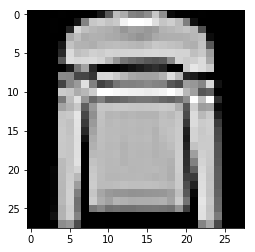

# 딥러닝의 Hello World, Fashion-MNIST(Fashion-MNIST with tf.Keras)

[Fashion-MNIST with tf.Keras 원문 바로 가기](https://medium.com/tensorflow/hello-deep-learning-fashion-mnist-with-keras-50fcff8cd74a)

> 이 문서는 MNIST 데이터 셋을 대신해서 사용할 수 있는 Fashion-MNIST 데이터 셋을 사용한 튜토리얼 입니다. 딥러닝 입문자들은 tf.keras 를 사용하여 손쉽게 모델을 구현할 수 있습니다.

* 케라스
* Fashoin-MNIST
* Convolution Neural Networks

## Fashion-MNIST with tf.Keras

이 문서는 컨볼루션 신경망(CNN)을 사용하여 tf.keras로 Fashion-MNIST 데이터 셋을 분류하는 튜토리얼입니다. 몇 줄의 코드를 통해, 많은 최적화 과정 없이도 90% 이상의 정확도로 이미지를 분류 할 수있는 모델을 정의하고 학습 할 수 있습니다.


[Fashion-MNIST](https://github.com/zalandoresearch/fashion-mnist)는 기존의 [MNIST](http://yann.lecun.com/exdb/mnist/) 데이터 셋(10개 카테고리의 손으로 쓴 숫자)을 대신해 사용할 수 있는데, 그 이유는 동일한 이미지 크기(28x28)이며 동일한 학습 셋 (60,000), 테스트 셋(10,000)으로 나눌 수 있기 때문입니다. 또한 딥러닝의 "hello world" 튜토리얼이라고 할 수 있습니다.

[Keras](https://keras.io/)는 인기있고 고수준(high-level)의 딥러닝 API으로 알려져있습니다. 독립적인 오픈 소스 프로젝트일 뿐만 아니라 TensorFlow에 내장되어 있습니다. ```tf.keras``` 를 임포트하여 훌륭한 Keras 프로그램을 작성할 수 있습니다. ```tf.keras``` 를 사용하면 실행 및 ```tf.data```와 같은 기능을 활용할 수 있습니다. 여기서는 기초를 다룰 것 입니다.

저는 몇가지의 딥러닝 용어에 관해 검토할 것입니다. 만약 당신이 딥러닝 입문자라면, 저의 튜토리얼과 저수준(low-level)의 TensorFlow API을 사용한 훨씬 오래된 [MNIST 튜토리얼](https://www.tensorflow.org/tutorials/)을 비교하고 대조해서 보길 권합니다. 얼마나 쉬운 일이 일어났는지 볼 수 있기 때문입니다.  

## Colab에서 실행 (Run this notebook in Colab)

모든 코드는 저의 GitHub에 있습니다. Google의 Colab을 사용하여 [저의 Gitub의 Jupyter Notebook](https://colab.research.google.com/github/margaretmz/deep-learning/blob/master/fashion_mnist_keras.ipynb)을 직접 열어서 실행할 수 있습니다. 빨리 노트북을 열여서 튜토리얼을 따라가고 싶으시다면 이 옵션을 선택해보세요. Colab에 대해 더 알기 원하신다면 [공식 블로그](https://medium.com/tensorflow/colab-an-easy-way-to-learn-and-use-tensorflow-d74d1686e309) 혹은 저의 [블로그](https://medium.com/@margaretmz/running-jupyter-notebook-with-colab-f4a29a9c7156)를 참고하세요.

# 데이터 (Data)

Fashion-MNIST 데이터 셋에는 10개의 카테고리가 있습니다.

**레이블 설명**

0 티셔츠/탑 <br>
1 바지 <br>
2 풀오버(스웨터의 일종) <br>
3 드레스 <br>
4 코트 <br>
5 샌들 <br>
6 셔츠 <br>
7 스니커즈 <br>
8 가방 <br>
9 앵클 부츠

## fashion_mnist 데이터셋 불러오기 (Import the fashoin_mnist dataset)

데이터 셋을 가져와서 학습, 검증, 테스트 셋을 준비해 봅니다.

keras.datasets API를 사용하여 한 줄의 코드만으로 fashion_minst 데이터를 불러오세요. 그런 다음 학습 셋과 테스트 셋을 불러오면 각각 흑백 이미지 28x28 을 볼 수 있습니다.

```
!pip install -q -U tensorflow>=1.10.1
# 원문에서는 1.8.0 버전을 사용했지만 18.08월 기준 1.10 이 release되어 1.10.1로 설치했습니다.
import tensorflow as tf

import numpy as np
import matplotlib.pyplot as plt

# 미리 섞여진 fashoin-mnist 의 학습 데이터와 테스트 데이터 로드
(x_train, y_train), (x_test, y_test) = tf.keras.datasets.fashion_mnist.load_data()

print("x_train shape:", x_train.shape, "y_train shape:", y_train.shape)
```

## 데이터 시각화 (Visualize the data)

Jupyter Notebook에서 가장 좋아하는 것은 시각화 입니다. matplotlib 라이브러리의 ```imshow()```를 사용하여 학습 데이터 셋의 이미지를 시각화하여 데이터 셋의 이미지 중 하나를 살펴볼 수 있습니다. 각 이미지는 28x28 모양의 흑백 이미지입니다.

 ```
 # 학습 데이터 셋 중에서 하나의 이미지 보여주기
 plt.imshow(x_train[img_index])
 ```
 

## 데이티 정규화 (Data normalization)

그런 다음 데이터 크기를 정규화하여 대략적으로 데이터 크기를 동일하게 맞춥니다.
```
x_train = x_train.astype('float32') / 255
x_test = x_test.astype('float32') / 255
```

## 데이터를 학습/검증/테스트 셋으로 나누기 (Split the data into train/validation/test datasets)

데이터를 임포팅하는 과정에서, 60,000개의 학습 셋과 10,000개의 테스트셋을 얻었다. 이제 학습 셋을 학습 셋/검증 셋으로 나누고자 한다. 딥러닝에서 각 유형의 데이터셋이 사용되는 방법:
  - Training data(학습 데이터) - 모델을 학습에 사용하는 데이터
  - Validation data(검증 데이터) - 하이퍼파라미터를 튜닝하고 모델들을 검증하기 위해 사용하는 데이터
  - Test data(테스트 데이터) - 검증 셋으로 모델의 초기 검사를 마친 후에, 모델을 테스트하는 데 사용하는 데이터

# 모델 (Model)

모델을 구성하고 학습시켜 봅시다.

## 모델 아키텍처 만들기 (Create the model architecture)

Keras에서 모델을 정의하기위한 두 가지 API:

1. [시퀀스 모델 API](https://keras.io/models/sequential/)(순차 모델 API)
2. [함수 API](https://keras.io/models/model/)

이 튜토리얼에서는 시퀀스 모델 API를 사용하여  컨볼루션 레이어(CNN)을 반복하는 간단한 CNN 모델을 만들고 풀링 레이어, 드롭 아웃 레이어를 만듭니다. 만약 함수 API에 관심이 있다면 Sara Robinson의 블로그 [Kearas 함수 API와 TensorFlow로 와인 가격 예측하기](https://medium.com/tensorflow/predicting-the-price-of-wine-with-the-keras-functional-api-and-tensorflow-a95d1c2c1b03)를 확인해보세요. <br>

첫 번째 레이어에 입력 데이터 크기(shape)을 정의합니다. 마지막 레이어는 소프트맥스 활성화가 되어있으며, fashion_mnist에서 10가지 범주의 데이터를 분류합니다.

```
model = tf.Keras.Sequential()

# 신경망의 첫 번째 레이어에서 입력 데이터 크기를 정의해야 합니다.
model.add(tf.keras.layers.Conv2D(filters=64, kernel_size=2, padding='same', activation='relu', input_shape=(28,28,1)))
model.add(tf.keras.layers.MaxPooling2D(pool_size=2))
model.add(tf.keras.layers.Dropout(0.3))


model.add(tf.keras.layers.MaxPooling2D(pool_size=2))
model.add(tf.keras.layers.Dropout(0.3))

model.add(tf.keras.layers.Flatten())
model.add(tf.keras.layers.Dense(256, activation='relu'))
model.add(tf.keras.layers.Dropout(0.5))
model.add(tf.keras.layers.Dense(10, activation='softmax'))

# model.summary()를 통해 모델을 살펴보세요.
model.summary()
```

## 모델 컴파일하기 (Compile the model)

이제 ```model.compile()```을 사용하여 모델을 학습시키기 전에 학습 프로세스를 구성합니다. 이 과정에서는 손실함수, 옵티 마이저의 종류 및 학습 및 테스트 중 모델을 평가할 metrics를 정의합니다.

```
model.compile(loss='categorical_crossentropy',
             optimizer='adam',
             metrics=['accuracy'])
```

## 모델 학습시키기 (Train the model)

배치 사이즈는 64, 에폭(Epochs)는 10으로 하여 모델을 학습시킵니다.
```
model.fit(x_train,
         y_train,
         batch_size=64,
         epochs=10,
         validation_data=(x_valid, y_valid),
         callbacks=[checkpointer])
```

## 테스트 정확도 (Test Accuracy)

90% 이상의 테스트 정확도를 얻었습니다!
```
# 테스트 셋으로 모델 평가
score = model.evaluate(x_test, y_test, verbose=0)

# 테스트 정확도
print('\n', 'Test accuracy:', score[1])
```

# 예측값 시각화하기 (Visualize the predictions)

이제 훈련 된 모델을 사용하여 테스트 셋을 예측/분류를 하고 ```model.predict(x_test)```   시각화 할 수 있습니다 . 레이블이 빨간색으로 보인다면 실제 레이블과 매칭되지 않음(예측 틀림)을 나타냅니다. 반대로 초록색으로 보인다면 잘 예측한 것 입니다.


<br>

> 이 글은 2018 컨트리뷰톤에서 [Contribute to Keras](https://github.com/KerasKorea/KEKOxTutorial) 프로젝트로 진행했습니다. <br>
> Translator : [김수정](https://github.com/SooDevv)
<br>
> Translator email : soojung.dev@gmail.com
