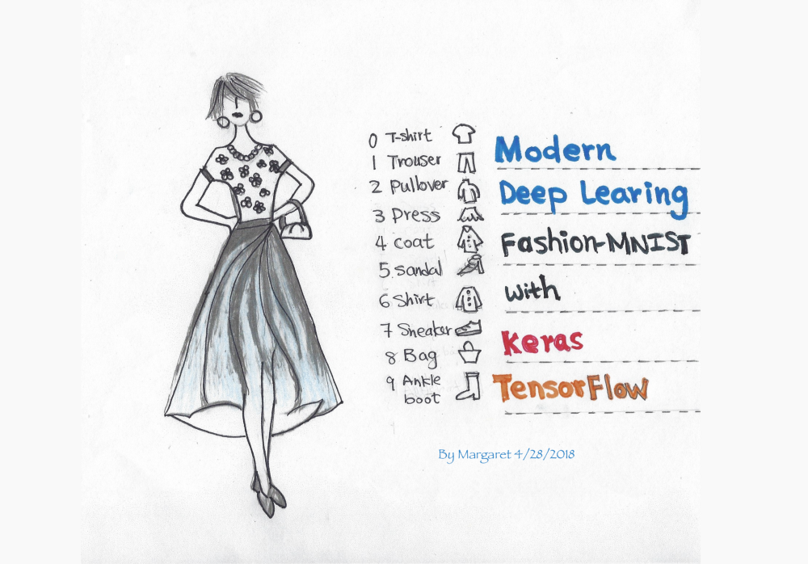

# 딥러닝의 Hello World, Fashion-MNIST(Fashion-MNIST with tf.Keras)

[Fashion-MNIST with tf.Keras 원문 바로 가기](https://medium.com/tensorflow/hello-deep-learning-fashion-mnist-with-keras-50fcff8cd74a)

> 이 문서는 MNIST 데이터 셋을 대신해서 사용할 수 있는 Fashion-MNIST 데이터 셋을 사용한 튜토리얼 입니다. 딥러닝 입문자들은 tf.keras 를 사용하여 손쉽게 모델을 구현할 수 있습니다.

* 케라스
* CNN
* tf.Keras
* Fashoin-MNIST

## Fashion-MNIST with tf.Keras

이 문서는 컨볼루션 신경망(CNN)을 사용하여 tf.keras로 Fashion-MNIST 데이터 셋을 분류하는 튜토리얼입니다. 몇 줄의 코드를 통해, 많은 최적화 과정 없이도 90% 이상의 정확도로 이미지를 분류 할 수있는 모델을 정의하고 학습 할 수 있습니다.



[Fashion-MNIST](https://github.com/zalandoresearch/fashion-mnist)는 기존의 [MNIST](http://yann.lecun.com/exdb/mnist/) 데이터 셋(10개 카테고리의 손으로 쓴 숫자)을 대신해 사용할 수 있는데, 그 이유는 동일한 이미지 크기(28x28)이며 동일한 학습 셋 (60,000), 테스트 셋(10,000)으로 나눌 수 있기 때문입니다. 또한 딥러닝의 "hello world" 튜토리얼이라고 할 수 있습니다.

[Keras](https://keras.io/)는 인기있고 고수준(high-level)의 딥러닝 API으로 알려져있습니다. 독립적인 오픈 소스 프로젝트일 뿐만 아니라 TensorFlow에 내장되어 있습니다. ```tf.keras``` 를 임포트하여 훌륭한 Keras 프로그램을 작성할 수 있습니다. ```tf.keras``` 를 사용하면 실행 및 ```tf.data```와 같은 기능을 활용할 수 있습니다. 여기서는 기초를 다룰 것 입니다.

저는 몇가지의 딥러닝 용어에 관해 검토할 것입니다. 만약 당신이 딥러닝 입문자라면, 저의 튜토리얼과 저수준(low-level)의 TensorFlow API을 사용한 훨씬 오래된 [MNIST 튜토리얼](https://www.tensorflow.org/tutorials/)을 비교하고 대조해서 보길 권합니다. 얼마나 쉬운 일이 일어났는지 볼 수 있기 때문입니다.  

## Run this notebook in Colab

모든 코드는 저의 GitHub에 있습니다. Google의 Colab을 사용하여 [저의 Gitub의 Jupyter Notebook](https://colab.research.google.com/github/margaretmz/deep-learning/blob/master/fashion_mnist_keras.ipynb)을 직접 열어서 실행할 수 있습니다. 빨리 노트북을 열여서 튜토리얼을 따라가고 싶으시다면 이 옵션을 선택해보세요. Colab에 대해 더 알기 원하신다면 [공식 블로그](https://medium.com/tensorflow/colab-an-easy-way-to-learn-and-use-tensorflow-d74d1686e309) 혹은 저의 [블로그](https://medium.com/@margaretmz/running-jupyter-notebook-with-colab-f4a29a9c7156)를 참고하세요.

## Data

Fashion-MNIST 데이터 셋에는 10개의 카테고리가 있습니다.

**레이블 설명**

0 티셔츠 <br>
1 바지 <br>
2 풀오버(스웨터의 일종) <br>
3 드레스 <br>
4 코트 <br>
5 샌들 <br>
6 셔츠 <br>
7 스니커즈 <br>
8 가방 <br>
9 앵클 부츠

## Import the fashoin_mnist dataset

데이터 셋을 임포트하고 학습, 평가, 테스트 셋을 준비해봅시다

keras.datasets API를 사용하여 한 줄의 코드만으로 fashion_minst 데이터를 로드하세요. 그런 다음 학습 셋과 테스트 셋을 로드하면 각각 회색의 이미지 28x28 을 볼 수 있습니다.

```
!pip install -q -U tensorflow>=1.10.1
# 원문에서는 1.8.0 버전을 사용했지만 18.08월 기준 1.10 이 release되어 1.10.1로 설치했습니다.
import tensorflow as tf

import numpy as np
import matplotlib.pyplot as plt

# 미리 섞여진 fashoin-mnist 의 학습 데이터와 테스트 데이터 로드
(x_train, y_train), (x_test, y_test) = tf.keras.datasets.fashion_mnist.load_data()

print("x_train shape:", x_train.shape, "y_train shape:", y_train.shape)
```

## Visualize the data
