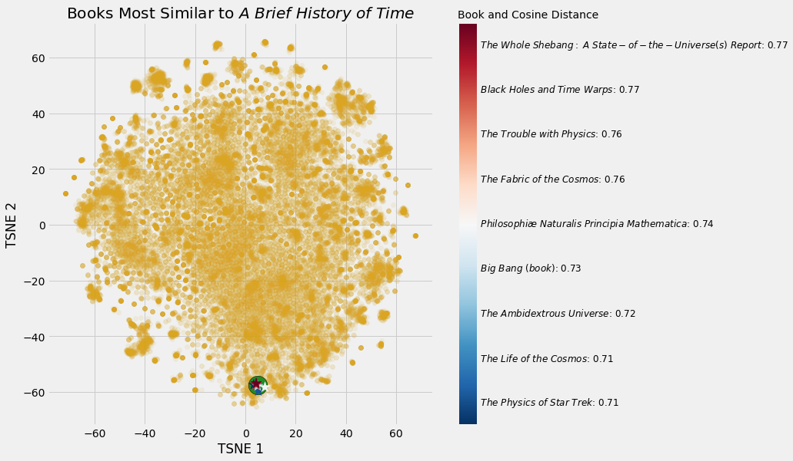
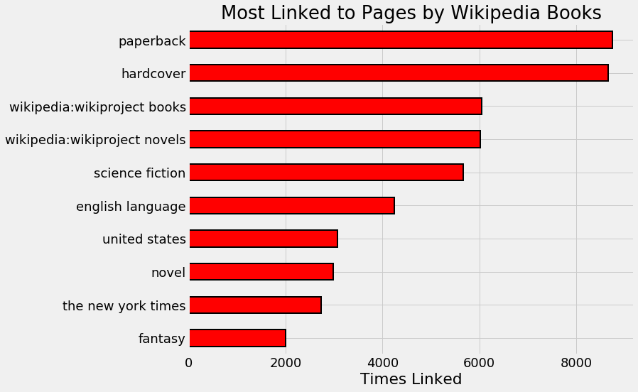
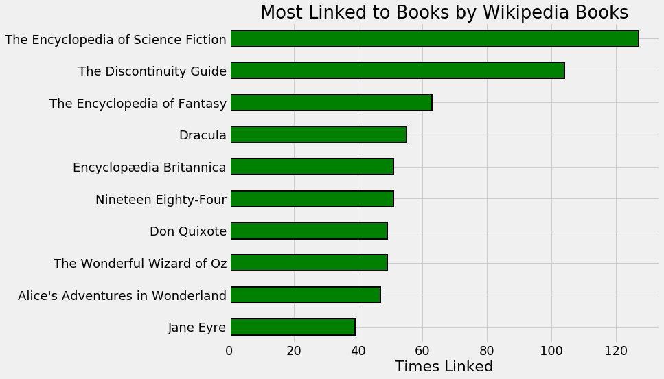
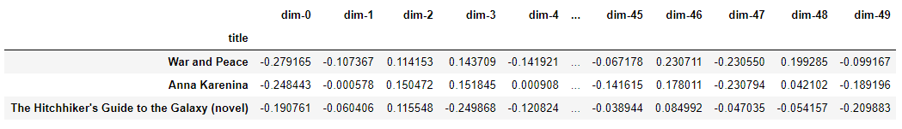
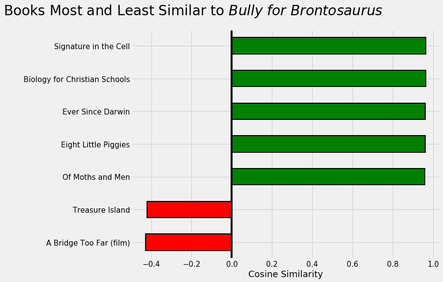
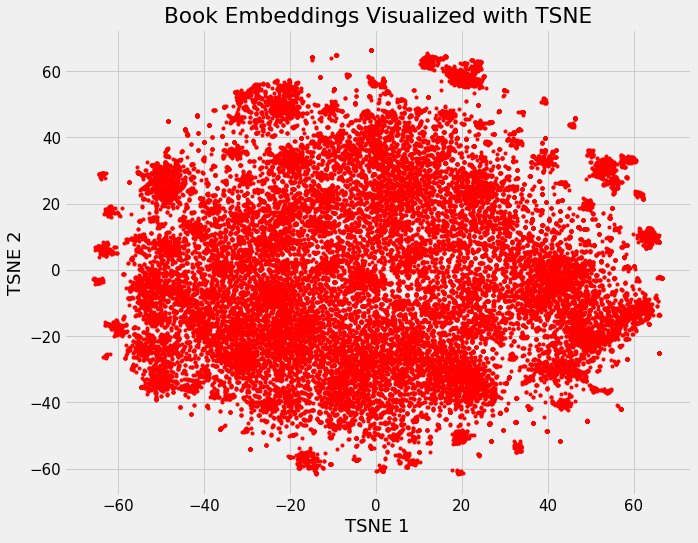
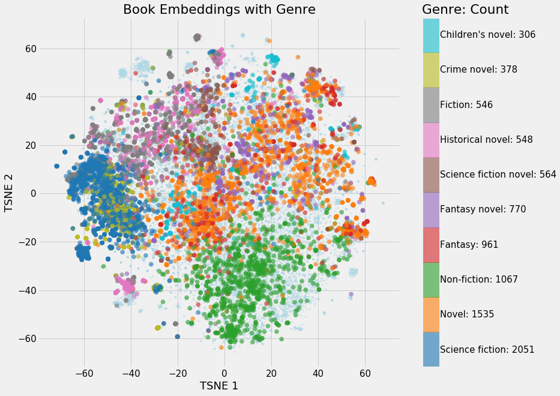
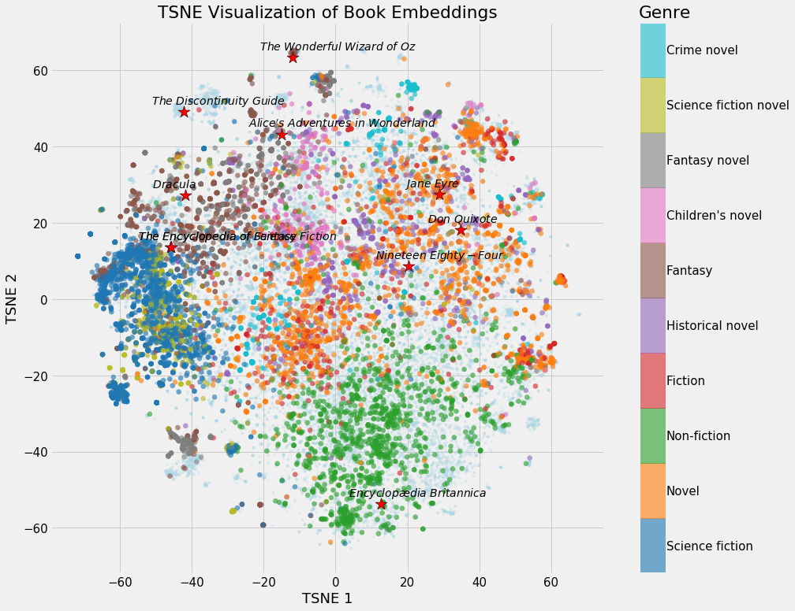

## 뉴럴 네트워크 임베딩을 이용한 추천 시스템 만들기(Building a Recommendation System Using Neural Network Embeddings)
딥러닝과 위키피디아를 이용해서 책 추천 시스템을 어떻게 만들 수 있을까? 🤔 🤔 (How to use deep learning and Wikipedia to create a book recommendation system)
[원문 링크](https://towardsdatascience.com/building-a-recommendation-system-using-neural-network-embeddings-1ef92e5c80c9)
> 이 튜토리얼은 위키피디아에 있는 책에 대한 정보와 위키피디아 내용에 있는 다른 책들의 링크들을 임베딩한 후, 코사인 유사도(cosine similarity)를 이용해 비슷한 책을 추천합니다.

* Keras
* Recommendation System
* Neural Network
* Embedding

### Introduction

딥러닝은 [놀라운 일](https://blog.statsbot.co/deep-learning-achievements-4c563e034257?gi=f0d6d88ccb09)을 할 수 있지만, 종종 그 용도는 [학술지](https://arxiv.org/abs/1301.3781)에 가려지거나 대기업에만 제공되는 [컴퓨팅 자원](https://dawn.cs.stanford.edu/benchmark/ImageNet/train.html)을 요구합니다. 그럼에도 불구하고, 고급 학위를 요구하지 않는 개인용 컴퓨터에서 할 수 있는 딥러닝 어플리케이션들이 있습니다. 이 튜토리얼에서 우리는 신경망 임베딩(neural network embeddings)을 사용하여 책에 관한 모든 위키피디아 기사를 사용하는 책 추천 시스템을 만드는 방법을 이야기할 것입니다.

우리의 추천 시스템은 유사한(similarity) 위키피디아 페이지로 연결되는 책들이 서로 비슷하다는 생각을 바탕으로 만들어질 것입니다. 우리는 이러한 유사도를 나타낼 수 있고, 따라서 신경망을 이용하여 책과 위키피디아 링크를 임베딩하는 것을 배움으로써 추천 시스템을 만들 수 있습니다. 최종 결과는 효과적인 추천 시스템이며 딥러닝의 실질적인 사용입니다. 😊

<br></br>

  
*figure1 : 스티븐 호킹의 A Brief History of Time 라는 책과 가장 유사도가 높은 책들*

<br></br>

이 프로젝트의 전체 코드는 GitHub에서 [Jupyter 노트북](https://github.com/WillKoehrsen/wikipedia-data-science/blob/master/notebooks/Book%20Recommendation%20System.ipynb)으로 사용할 수 있습니다. 만약 GPU가 없다면 GPU로 신경망을 무료로 학습시킬 수 있는 [Kaggle의 노트북](https://www.kaggle.com/willkoehrsen/neural-network-embedding-recommendation-system)도 있습니다. 이 튜토리얼은 [이전 튜토리얼](https://towardsdatascience.com/neural-network-embeddings-explained-4d028e6f0526)에서 다루었던 신경망 개념과 함께 적용하는 것에 초점을 맞출 것입니다. (우리가 사용할 데이터를 검색하는 방법은 – [all book articles on Wikipedia](https://towardsdatascience.com/wikipedia-data-science-working-with-the-worlds-largest-encyclopedia-c08efbac5f5c) - 이 튜토리얼을 보세요.)

이 프로젝트는 [딥러닝 쿡북](http://shop.oreilly.com/product/0636920097471.do)에서 채용했는데, 딥러닝의 실제 예를 보여주는 훌륭한 [책](https://github.com/DOsinga/deep_learning_cookbook)입니다. 👍

<br></br>
<br></br>

### 신경망 임베딩 (Neural Network Embeddings)

임베딩은 이산형 변수를 연속 벡터로 나타내는 방법 중 하나입니다. 원-핫 인코딩과 같은 인코딩 방법과 대조적으로 신경망 임베딩은 저차원이며 학습을 해야합니다. 즉, 임베딩 공간에 서로 유사한 실체를 서로 가깝게 배치한다는 뜻입니다.

임베딩을 하기위해서, 우리는 신경망 모델과 지도학습(supervised learning) 작업이 필요합니다. 우리 네트워크의 최종 결과는 각각의 책들을 50개의 연속된 숫자 벡터로 표현하는 것이 될 것입니다.

임베딩 자체에는 그다지 흥미로울 것이 없습니다. 그저 벡터들일 뿐이에요. 하지만 임베딩을 아래 세가지 목적을 위해 활용할 수 있습니다.

1. 임베딩 공간에서 가장 가까운 이웃(nearest neighbor) 찾기
2. 기계 학습 모델에 대한 입력주기
3. 저차원 시각화하기

> 위에서 **가까운 이웃**은 번역자가 좋아하는 spiderman의 별명 friendly neighborhood spider man을 <U>친절한 이웃 스파이더맨</U>과 같이 예쁘게 번역한 단어같지만 `nearest neighbor`라는 알고리즘 이름입니다.

이 프로젝트에서는 첫 번째 목적을 주로 다루지만, 임베딩에서 시각화를 하는 방법도 살펴볼 것입니다. 신경망 임베딩의 실질적인 적용에는 기계 번역을 위한 [<U>워드 임베딩(word embedding)</U>](https://towardsdatascience.com/building-a-recommendation-system-using-neural-network-embeddings-1ef92e5c80c9) 및 카테고리컬 변수를 위한 [<U>엔티티 임베딩(entity embedding)</U>](https://arxiv.org/abs/1604.06737) 등이 있습니다.

<br></br>
<br></br>

### 데이터 : 위키피디아의 모든 책들 (Data: All Books on Wikipedia)

여느 데이터 사이언스 프로젝트와 마찬가지로, 우리는 고품질의 데이터 셋을 준비하는 것부터 시작해야 합니다. 이 [글](https://towardsdatascience.com/wikipedia-data-science-working-with-the-worlds-largest-encyclopedia-c08efbac5f5c)에서, 위키피디아에 있는 모든 자료를 다운로드 받고 처리하는 방법을 보았습니다. 책에 관한 모든 페이지를 검색해 책의 제목, 기본 정보, 다른 위키피디아 페이지(위키링크)를 가리키는 링크, 외부 사이트 링크를 저장했습니다. 이 중에서 추천 시스템을 만들기 위해 필요한 정보는 *제목*과 *위키링크* 두 가지입니다.

<br></br>

```
Book Title: 'The Better Angels of Our Nature'
Wikilinks:  
['Steven Pinker',
  'Nation state',
  'commerce',
  'literacy',
  'Influence of mass media',
  'Rationality',
  "Abraham Lincoln's first inaugural address",
  'nature versus nurture',
  'Leviathan']
```

<br></br>

신경망을 사용할 때도 데이터를 탐색하고 정리하는 것이 중요하기 때문에 원시 데이터를 몇 가지 수정했습니다. 아래는 수정의 예로, 가장 많이 연결된 페이지를 살펴본 것입니다.

<br></br>

  
*figure2 : 위키피디아의 페이지는 위키피디아에 있는 책들로 가장 자주 연결됩니다.*

<br></br>

우리는 figure2를 보고 상위 4개 페이지는 일반적이며 추천 시스템을 만드는 데 도움이 되지 않는다는 것을 알 수 있습니다. 책의 형식은 그 내용과 관련이 없다는 것을 알고 있기 때문입니다.🤨 한 책이 `종이로 된 책`인지 `하드커버`인지에 대한 정보로 신경망을 통해 책과 내용이 유사한 다른 책을 알아낼 수는 없습니다. 그러므로, 우리는 이 연결고리를 제거할 것입니다.

최종 목적에 대해 생각하는 것은 데이터 정리 단계에서 도움이 될 수 있고, 이러한 방법만으로도 추천 시스템을 크게 개선할 수 있습니다.

순수한 호기심에서, 저는 위키피디아에 관한 다른 책들과 가장 관련이 많은(링크가 많은) 책을 찾고 싶었습니다. figure 3은 "가장 많이 연결된" 10권의 위키피디아 책입니다.

<br></br>


*figure3 : 위키피디아의 다른 책들과 가장 많이 연결되어 있는 위키피디아의 책들*

<br></br>

이것은 참고서적과 고전서적들 입니다.

데이터 클리닝 후, 우리는 **41758**개의 유니크한 위키링크와 **37020**개의 유니크한 책을 가지게 되었습니다. 모든 사람들을 위한 책이 이 중에 있기를 바랍니다! 🙏

데이터가 깨끗하다고 확신이 들고, (책 제목, 위키링크) 쌍이 주어지면, 위키링크(wikilink)가 책의 기사에 존재하는지 확인합니다.

<br></br>
<br></br>

### 지도학습하기 (Supervised Learning Task)

**의미 있는 임베딩**을 학습하기 위해서, 우리의 신경망이 목표를 달성하도록 훈련해야 합니다. 프로젝트의 가정(비슷한 책이 비슷한 위키피디아 페이지와 연결된다는)을 통해 우리는 문제를 다음과 같이 정의할 수 있습니다. (책 제목, 위키링크) 쌍이 주어지면, 위키링크가 있는지 확인합니다.

신경망에 책 내용을 제공할 필요는 없습니다. 대신 책 제목, 위키링크, 라벨로 구성된 수십만 개의 교육 예제를 제공할 것입니다. 신경망에 True 데이터셋과 False 데이터셋을 입력하고, 마지막으로 임베딩에 대한 정보를 학습하여 위키링크가 책 페이지에 표시되는 시점을 구분합니다.

이 프로젝트의 가장 중여한 부분은 지도학습을 표현하는 것입니다. 임베딩은 특정 작업에 대해 학습되며 해당 문제와만 관련이 있습니다. 만약 우리의 임무가 제인 오스틴이 쓴 책들을 찾아내는 것이었다면, 이 임베딩들은 그 목표를 반영하여 오스틴이 쓴 책들을 임베딩 공간에서 더 가깝게 함께 놓았을 것입니다. 우리는 책 페이지에 특정 위키링크가 있는지 알아보기 위한 학습을 통해, 네트워크는 콘텐츠 측면에서 유사한 책을 서로 가까이 두는 것을 배우기를 희망하고 있습니다.

우리가 해야할 일들이 정리가 되었다면, 이제는 그것을 코드로 구현해야 합니다. 신경망에는 정수만 입력할 수 있기 때문에 각 고유 책자에서 정수로의 매핑을 만듭니다.

<br></br>

```python
# 책 이름과 책의 고유 인덱스 index 맵핑
book_index = {book[0]: idx for idx, book in enumerate(books)}

book_index['Anna Karenina']
22494
```

<br></br>

링크에도 동일한 작업을 합니다. 그런 다음 학습 데이터 셋을 만들기 위해 데이터에 있는 모든(책, 위키링크) 쌍을 나열합니다. 이를 위해서는 각 책을 반복하고 페이지에 있는 각 위키링크에 대한 예를 기록해야 합니다.

<br></br>

```python
pairs = []

# 각각 책이 나오도록 반복
for book in books:

    title = book[0]
    book_links = book[2]
    # 책에 관한 글에 있는 wikilinks 들을 반복
    for link in book_links:
        # 책의 인덱스와 링크 페어 저장
        pairs.extend((book_index[title],                
                      link_index[link]))
```

<br></br>

이것은 우리가 모델을 훈련시키기 위해 표본으로 추출할 수 있는 총 **772798개**의 `True` 예를 보여줍니다. `False` 예제를 생성하려면(나중에 수행됨) 링크 인덱스와 책 인덱스를 무작위로 선택하고, 그 두 개가 `True`가 아닌지 확인한 다음 `False` 예제로 사용하면 됩니다.

> `True`인 예라는 것은 링크(정확히는 링크 인덱스)가 책(정확히는 책 인덱스)이 가지고 있는 인덱스라는 것이고, `False`인 예는 링크가 책이 가지고 있는 링크가 아닐 때의 경우입니다. 따라서 링크와 책이 올바른 한 쌍일 때는 `True`, 아닐 때는 `False`라고 할 수 있는 것입니다.

##### 학습/테스트 세트에 대한 참고 사항 (Note about Training / Testing Sets)

별도의 검증(validation set) 및 테스트 세트를 사용하는 것이 일반적인 지도학습 작업의 필수 사항이지만, 이 경우 가장 정확한 모델을 만드는 것이 아니라 임베딩 모델을 생성하는 것이 주된 목표입니다. 예측 작업은 임베딩을 위해 네트워크를 학습하는 수단일 뿐입니다. 교육이 끝나면 새 데이터에 대한 모델을 테스트하지 않으므로 성능을 평가하거나 검증 세트를 사용하여 오버핏(overfitting)을 방지할 필요가 없습니다. 최상의 임베딩 값을 확보하기 위해 모든 데이터를 학습에 사용할 것입니다. 😬

<br></br>
<br></br>

### 임베딩 모델 (Embedding Model)

신경망이 기술적으로 복잡한 것처럼 들리지만, [케라스 딥러닝 프레임워크](https://keras.io)로 비교적 쉽게 구현할 수 있습니다. 👍👍 텐서플로우(TensorFlow)는 더 많은 더 많은 것을 제어할 수 있지만, 구현의 편리함에 있어 케라스를 능가할 수는 없습니다.

임베딩 모델은 5개의 레이어를 가지고 있습니다.

1. Input: 책 및 링크에 대한 병렬 입력.
2. Embedding: 책 및 링크를 위한 병렬 길이 50개의 임베딩.
3. Dot: 내적(dot product)을 계산하여 임베딩 합치기.
4. Reshape: 임베딩 shape를 단일 숫자로 형성.
5. Dense: 시그모이드 활성화를 이용한 출력.

[Embedding neural network](https://keras.io/layers/embeddings/)에서 임베딩은 목표의 손실을 최소화하기 위해 훈련 중에 조정되는 신경망의 가중치(weight)입니다. 신경망은 책과 링크를 정수로 사용하여 0과 1 사이의 예측을 출력하며, 이는 실제 값과 비교됩니다. 이 모델은 [`Adam Optimizer`(Stochastic Gradient Descent Descent Descent의 변형)](https://machinelearningmastery.com/adam-optimization-algorithm-for-deep-learning/)로 컴파일되며, 이 과정에서 이 이진 분류 문제에 대한 `binary_crossentropy`값을 최소화합니다.

<br></br>

아래는 모델 코드입니다:

```python
from keras.layers import Input, Embedding, Dot, Reshape, Dense
from keras.models import Model

def book_embedding_model(embedding_size = 50, classification = False):
    """Model to embed books and wikilinks using the Keras functional API.
       Trained to discern if a link is present in on a book's page"""

    # 1차원의 입력
    book = Input(name = 'book', shape = [1])
    link = Input(name = 'link', shape = [1])

    # 책 임베딩 (shape will be (None, 1, 50))
    book_embedding = Embedding(name = 'book_embedding',
                               input_dim = len(book_index),
                               output_dim = embedding_size)(book)

    # 링크 임베딩 (shape will be (None, 1, 50))
    link_embedding = Embedding(name = 'link_embedding',
                               input_dim = len(link_index),
                               output_dim = embedding_size)(link)

    # 내적으로 책 임베딩과 링크 임베딩을 한 개의 임베딩 벡터로 변형
    # (shape will be (None, 1, 1))
    merged = Dot(name = 'dot_product', normalize = True,
                 axes = 2)([book_embedding, link_embedding])

    # 단일 숫자로 shape 변형 (shape will be (None, 1))
    merged = Reshape(target_shape = [1])(merged)

    # 분류를 위한 결과값 출력
    out = Dense(1, activation = 'sigmoid')(merged)
    model = Model(inputs = [book, link], outputs = out)

    # 원하는 optimizer 와 loss 함수로 모델 학습 시작
    model.compile(optimizer = 'Adam', loss = 'binary_crossentropy',
                  metrics = ['accuracy'])

    return model
```

<br></br>

이 프레임워크는 많은 임베딩 모델에 사용될 수 있습니다. 중요한 점은 임베딩이 모델의 가중치이며 또한 우리가 원하는 최종 결과라는 것입니다. 우리는 그 모델이 정확한지 그다지 신경쓰지 않을 것 입니다, 우리가 원하는 것은 적절한 임베딩 벡터입니다.

우리는 모델의 가중치를 정확한 예측을 위한 수단으로서 사용하는 것에 익숙해져 있습니다. 하지만 임베딩 모델에서는 가중치가 목표이고 예측은 단지 임베딩을 학습하기 위한 수단일 뿐입니다.

<br></br>

약 400 만 개의 weight를 model summary로 확인할 수 있습니다:

```
__________________________________________________________________________________________________
Layer (type)                    Output Shape         Param #     Connected to                     
==================================================================================================
book (InputLayer)               (None, 1)            0                                            
__________________________________________________________________________________________________
link (InputLayer)               (None, 1)            0                                            
__________________________________________________________________________________________________
book_embedding (Embedding)      (None, 1, 50)        1851000     book[0][0]                       
__________________________________________________________________________________________________
link_embedding (Embedding)      (None, 1, 50)        2087900     link[0][0]                       
__________________________________________________________________________________________________
dot_product (Dot)               (None, 1, 1)         0           book_embedding[0][0]             
                                                                 link_embedding[0][0]             
__________________________________________________________________________________________________
reshape_1 (Reshape)             (None, 1)            0           dot_product[0][0]                
==================================================================================================
Total params: 3,938,900
Trainable params: 3,938,900
Non-trainable params: 0
```

<br></br>

이 접근법으로 우리는 책뿐만 아니라 책으로 연결된 모든 위키피디아의 페이지를 비교할 수 있는 링크들에 대한 임베딩도 얻을 수 있습니다.

<br></br>
<br></br>

### 학습 샘플 만들기 (Generating Training Samples)

신경망은 [<U>batch learner</U>](https://en.wikipedia.org/wiki/Online_machine_learning#Batch_learning)입니다. 왜냐하면 한 번에 하나의 작은 표본 집합(관찰)을 통해 epoch라고 불리는 많은 라운드에서 훈련을 받기 때문입니다. 신경망을 훈련시키는 일반적인 방법은 generator를 이용하는 것입니다. 전체 결과가 메모리에 저장되지 않도록, `yields`(not `returns`)하는 기능입니다. 우리가 하려고 하는 주제는 아니지만 generator의 이점은 큰 사이즈의 학습 데이터 셋을 모두 메모리에 로드할 필요가 없다는 것입니다.

> 여기서 말하는 generator는 GANs 의 generator가 아니라 python에서 제공하는 generator를 말합니다.

우리의 Generator는 `페어(pairs)`로 학습되었고, 한 배치 당 긍정 샘플  수(`n_positive`) 및 한 배치 당 부정 샘플:긍정 샘플 비율(`negative_ratio`)를 사용합니다. generator는 호출할 때마다 긍정 샘플과 부정 샘플의 새 배치를 생성합니다. 긍정적인 예를 얻기 위해, 우리는 무작위로 `Ture` 쌍(pair)을 표본으로 추출합니다. `False`인 예제의 경우, 무작위로 책과 링크를 샘플링하여 이 쌍이 실제 쌍에 있지 않은지 확인한 다음 배치에 추가합니다.

<br></br>

아래 코드는 generator 전체를 나타냅니다.

```python
import numpy as np
import random
random.seed(100)

def generate_batch(pairs, n_positive = 50, negative_ratio = 1.0):
    """Generate batches of samples for training.
       Random select positive samples
       from pairs and randomly select negatives."""

    # batch를 저장할 numpy 배열을 준비합니다.
    batch_size = n_positive * (1 + negative_ratio)
    batch = np.zeros((batch_size, 3))

    while True:
        # 랜덤으로 True인 샘플을 준비합니다.
        for idx, (book_id, link_id) in enumerate(random.sample(pairs, n_positive)):
            batch[idx, :] = (book_id, link_id, 1)
        idx += 1

        # 배치 사이즈가 다 찰 때까지 False인 샘플을 추가합니다.
        while idx < batch_size:

            # Random selection
            random_book = random.randrange(len(books))
            random_link = random.randrange(len(links))

            # Ture인 샘플이 아니라는 것(False인 샘플이라는 것)을 체크합니다.
            if (random_book, random_link) not in pairs_set:

                # False인 샘플을 배치에 추가합니다.
                batch[idx, :] = (random_book, random_link, neg_label)
                idx += 1

        # 배치에 저장된 데이터들의 순서를 섞습니다.
        np.random.shuffle(batch)
        yield {'book': batch[:, 0], 'link': batch[:, 1]}, batch[:, 2]
```

<br></br>

우리가 generator로 `next`를 부를 때 마다, 새 학습 데이터 배치를 가져옵니다.

<br></br>
<br></br>

### 모델 학습하기 Training Model

선택할 수 있는 학습 파라미터가 몇 가지 있습니다. 첫 번째는 각 배치에 포함된 긍정 데이터 수입니다. 일반적으로 [작은 배치 크기로 시작하여 성능이 저하될 때까지 늘립니다.](https://arxiv.org/abs/1609.04836) 또한, 우리는 각각의 긍정 데이터에 대해 훈련된 부정 데이터 수를 선택할 필요가 있습니다. 어떤 것이 가장 잘 작동하는지 알아보기 위해 몇 가지 옵션으로 실험하는 것을 추천합니다. 우리는 [early stopping](https://keras.io/callbacks/#earlystopping)을 구현하기 위해 validation 셋을 사용하지 않기 때문에, training loss이 감소하지 않는 여러 epochs 을 선택합니다.

<br></br>

```python
n_positive = 1024

gen = generate_batch(pairs, n_positive, negative_ratio = 2)

# Train
h = model.fit_generator(gen, epochs = 15,
                        steps_per_epoch = len(pairs) // n_positive)
```

<br></br>

(학습 파라미터가 막연하게 느껴진다면, [<U>Deep Learning</U>](https://www.deeplearningbook.org)에 설명된 모범 사례를 기반으로 해보세요. 대부분의 기계학습과 마찬가지로 신경망 학습도 대부분 경험에서 나온 결과입니다.)

<br></br>

일단 네트워크가 훈련을 마치면, 우리는 임베딩을 추출할 수 있습니다.

```python
# 임베딩 벡터 추출하기
book_layer = model.get_layer('book_embedding')
book_weights = book_layer.get_weights()[0]
```

<br></br>
<br></br>

### 임베딩 적용하기: 추천 하기 (Applying Embeddings: Making Recommendations)

임베딩 자체는 꽤 흥미롭지 않습니다. 각 책과 링크마다 50개의 숫자 벡터에 불과합니다.

<br></br>


*figure4 : What War and Peace Looks Like 라는 이름의 책을 임베딩 벡터로 표현한 것*

<br></br>

하지만, 우리는 이 벡터를 두 가지 다른 목적으로 사용할 수 있고, 그 중 첫 번째는 우리의 책 추천 시스템을 만드는 것입니다. 임베딩 공간에서 가장 가까운 책을 찾기 위해, 우리는 그 책의 벡터와 다른 모든 책의 벡터와 함께 내적을 합니다. 임베딩이 정규화된 경우 벡터 간의 내적은 가장 유사하지 않은 -1 에서 가장 유사한 +1 까지의 [cosine similarity](http://blog.christianperone.com/2013/09/machine-learning-cosine-similarity-for-vector-space-models-part-iii/)을 나타냅니다.

<br></br>

레오 톨스토이의 War and Peace와 비슷한 책 찾기 결과:

```
Books closest to War and Peace.

Book: Anna Karenina               Similarity: 0.92
Book: The Master and Margarita    Similarity: 0.92
Book: Demons (Dostoevsky novel)   Similarity: 0.91
Book: The Idiot                   Similarity: 0.9
Book: Crime and Punishment        Similarity: 0.9
```

<br></br>

추천들이 꽤 맞아 떨어지지 않나요?!🤩 이들은 모두 러시아 고전 소설입니다. 물론 우리는 이와 같은 추천을 위해 [GoodReads](https://www.goodreads.com/book/show/656.War_and_Peace?ac=1&from_search=true)로 갈 수 있었겠지만, 우리 스스로 시스템을 만드는 것은 어떨까요? 저는 여러분이 notebook으로 직접 임베딩을 해볼 것을 권합니다.

<br></br>

```
Books closest to The Fellowship of the Ring.
Book: The Return of the King       Similarity: 0.96
Book: The Silmarillion             Similarity: 0.93
Book: Beren and Lúthien            Similarity: 0.91
Book: The Two Towers               Similarity: 0.91
```

<br></br>

책을 임베딩하는 것 외에도, 주어진 위키피디아 페이지에서 주어진 가장 유사한 링크를 찾을 수 있는 링크도 포함했습니다.

```
Pages closest to steven pinker.

Page: the blank slate           Similarity: 0.83
Page: evolutionary psychology   Similarity: 0.83
Page: reductionism              Similarity: 0.81
Page: how the mind works        Similarity: 0.79
```


<br></br>

현재, 저는 <U>Bully for Brontosaus</U>라고 불리는 Stephen Jay Gould의 환상적인 수필을 읽고 있습니다. 다음에는 무엇을 읽어야 하는지 생각한다면 어떻게 될까요?


*figure5 : 내가 다음에 읽어야 할 책에 대한 추천*

<br></br>
<br></br>

### 임베딩 시각화 (Visualizations of Embeddings)

임베딩의 가장 흥미로운 측면 중 하나는 서로 상대적으로 *소설* 또는 *논픽션*과 같은 개념을 시각화하는데 사용할 수 있다는 것입니다. 이를 위해서는 차원을 2차원 또는 3차원으로 감소시키는 dimension reduction 기술이 필요합니다. 가장 인기 있는 차원 감소 기술은 다음의 방법입니다: [t-Distributed Stochastic Neighbor Embedding(TSNE)](https://distill.pub/2016/misread-tsne/).

위키피디아에 있는 모든 책의 37,000차원 공간을 시작으로, 우리는 임베딩을 사용하여 50개의 차원으로 매핑한 다음 TSNE로 2차원에 매핑합니다. 이것은 다음 이미지를 생성합니다.

<br></br>


*figure6 : 위키피디아에 있는 모든 책들에 대한 임베딩의 결과*

<br></br>

이 이미지 자체에 색이 있는 것은 아니지만, 일단 책 특성에 따라 색칠하기 시작하면, 우리는 클러스터가 나타나는 것을 볼 수 있습니다.


*figure7 : 색으로 구분되는 임베딩 벡터 시각화*

논픽션과 공상과학 소설에 뚜렷한 부분이 있는 몇 개의 분명한 클러스터가 있습니다. 소설 내용의 다양성을 고려할 때, 소설들은 어디에나 있는 것처럼 보입니다.

<br></br>

나라에 따라 임베딩을 시각화 해 볼 수 있습니다.


*figure8 : 나라별 임베딩 벡터 시각화*

나라별 구분이 얼마나 특이한지에 대해 조금 놀랐습니다! 😮 명백히 오스트레일리아의 책들은 매우 독특하게 보입니다.

<br></br>

또한 Wikipedia 지도에서 특정 책을 강조 표시할 수 있습니다.


*figure9 : 특정 임베딩 벡터의 강조*

<br></br>

엄청나게 많은 시각화가 notebook에 있고, 스스로도 만들어 볼 수 있을 겁니다. 가장 많이 연결된 10권의 책을 한 권 더 보여 드리겠습니다.


*figure10 : 책과 장르에 가장 많이 연결된 10개의 책들이 보입니다*

<br></br>

TSNE에 대해 주목해야 할 한 가지는 원래 공간에서 벡터 간의 거리를 유지하려고 하지만 차수가 줄어들기 때문에 원래 공간을 왜곡할 수 있다는 것입니다. 따라서 50차원 매립 공간에서 서로 가까운 책들은 2차원 TSNE 매립에서 가장 가까운 이웃이 아닐 수 있습니다.

<br></br>
<br></br>

## Interactive 시각화 (Interactive Visualizations)

이러한 시각화는 매우 흥미롭지만, 신경망 임베딩을 시각화하도록 특별히 설계된 텐서플로우의 projector 도구를 사용하여 놀라운 인터랙티브 시각화를 해 볼 수 있습니다. 이 도구의 사용 방법에 대한 글을 쓸 계획이지만, 몇 가지 결과는 다음과 같습니다.

<br></br>


*figure11 : tensorflow의 projector를 사용한 Interactive visualization*

<br></br>

책에 대한 Interactive 시각화를 보고싶다면 [여기](https://projector.tensorflow.org/?config=https://raw.githubusercontent.com/WillKoehrsen/wikipedia-data-science/master/embeddings/metadata/metadata_sample.json)를 참고하세요.

<br></br>
<br></br>

### 해볼 수 있는 다른 프로젝트들 (Potential Other Projects)

데이터 과학 프로젝트는 대개 완전히 저절로 발명되지는 않습니다. 제가 연구하는 많은 프로젝트는 제가 독특한 프로젝트를 만들기 위해 적응하고, 개선하고, 구축하는 다른 데이터 과학자들의 아이디어들입니다. (이 프로젝트는 [Deep Learning Cookbook](https://github.com/DOsinga/deep_learning_cookbook)의 영화 추천을 위한 유사한 프로젝트에서 영감을 받았습니다.)

<br></br>

이러한 태도를 염두에 두고 이 작업을 구축하는 몇 가지 방법이 있습니다.

1. 위키링크 대신 <U>외부 링크</U>를 사용하여 임베딩을 만듭니다. 이것은 위키피디아의 외부에 있는 웹페이지에 대한 것이며 다른 임베딩 임베딩을 만들 수도 있습니다.

2. 임베딩을 사용하여 지도 학습 모델을 학습하여 장르, 작가 및 국가가 포함된 책의 특성을 예측할 수 있습니다.

3. 위키피디아에서 주제 카테고리를 선택하고 자신만의 추천 시스템을 만드세요. 사람, 랜드마크 또는 역사적 사건을 사용할 수 있습니다. 이 [notebook](https://github.com/WillKoehrsen/wikipedia-data-science/blob/master/notebooks/Downloading%20and%20Parsing%20Wikipedia%20Articles.ipynb)을 사용하여 데이터를 얻을 수 있고, 이 [notebook](https://github.com/WillKoehrsen/wikipedia-data-science/blob/master/notebooks/Book%20Recommendation%20System.ipynb)으로 임베딩 할 수 있습니다.

<br></br>

이것은 결코 숙제가 아니라, 당신이 읽은 것을 실행에 옮기고 싶을때의 아이디어 일뿐입니다. 만약 당신이 어떤 프로젝트에 참여하기로 결정하면, 해당 프로젝트에 관련된 이야기를 듣고싶은 것처럼! 🤗

<br></br>
<br></br>

### 결과 (Conclusions)

신경망 임베딩은 이산형 categorical 변수를 연속 벡터로 나타내는 방법입니다. 학습된 저차원 표현은 기계 학습 모델에 입력되는 것과 같은 유사한 카테고리를 찾거나 컨셉을 시각화하는 데 유용합니다. 이 프로젝트에서, 우리는 유사한 페이지로 연결되는 책들이 서로 유사하다는 생각을 바탕으로 효과적인 책 추천 시스템을 만들기 위해 신경망 임베딩을 사용했습니다.

<br></br>

신경망 임베딩을 하는 과정은 다음과 같습니다.

1. 데이터를 수집합니다. 신경망은 많은 훈련 데이터를 필요로 합니다.
2. 문제를 반영하는 임베딩을 배우기 위해 지도 학습 모델을 구성합니다.
3. 신경망 임베딩 모델을 만들고 훈련시킵니다.
4. 임베딩 벡터를 추출하여 권장 사항 및 시각화합니다.

<br></br>

자세한 내용은 notebook에서 확인할 수 있으며 이 프로젝트를 진행하시기를 권합니다. 딥러닝은 기술적인 복잡함이나 계산적 자원 때문에 압도적으로 보일 수도 있지만, 제한된 양의 학습으로 개인용 컴퓨터에서 할 수 있는 많은 응용 프로그램들 중 하나입니다. 딥러닝은 끊임없이 발전하는 분야이며, 이 프로젝트는 유용한 시스템을 구축함으로써 시작하는 좋은 방법입니다다. 그리고, 여러분이 딥러닝을 공부하고 있지 않는다면, 여러분은 지금 무엇을 읽고 있어야 하는지 알고 있어요! 😎

<br></br>

> 이 글은 2018 컨트리뷰톤에서 [`Contribute to Keras`](https://github.com/KerasKorea/KEKOxTutorial) 프로젝트로 진행했습니다.  
>
> Translator: [박정현](https://github.com/parkjh688)
>
> Translator email : <parkjh688@gmail.com>
