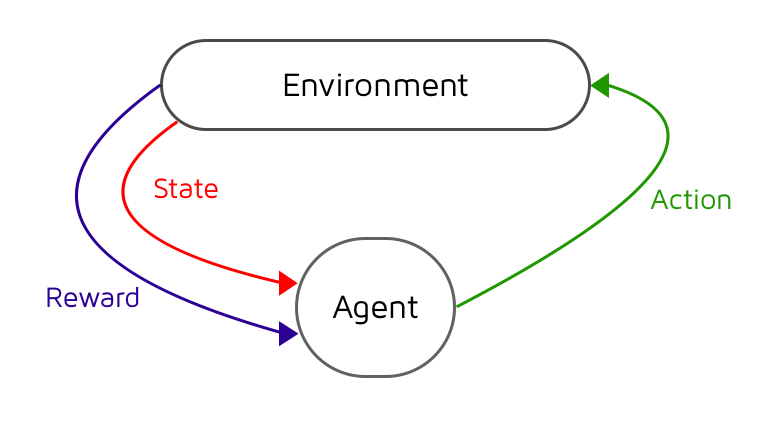
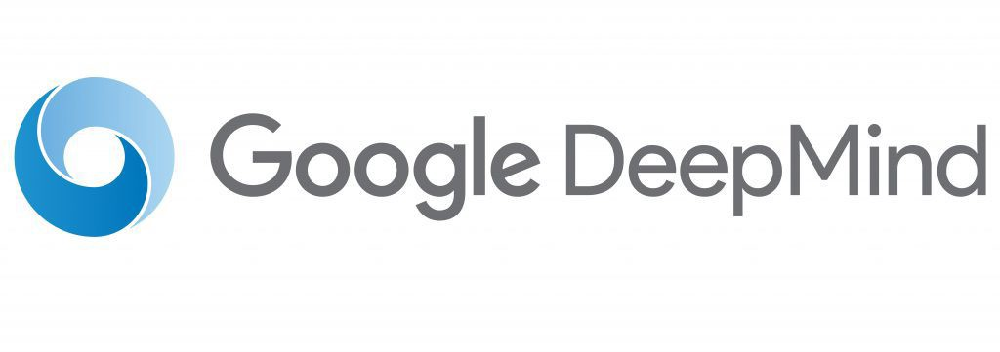
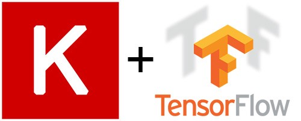
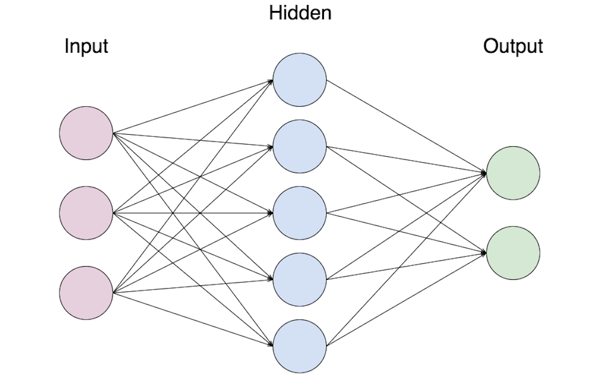
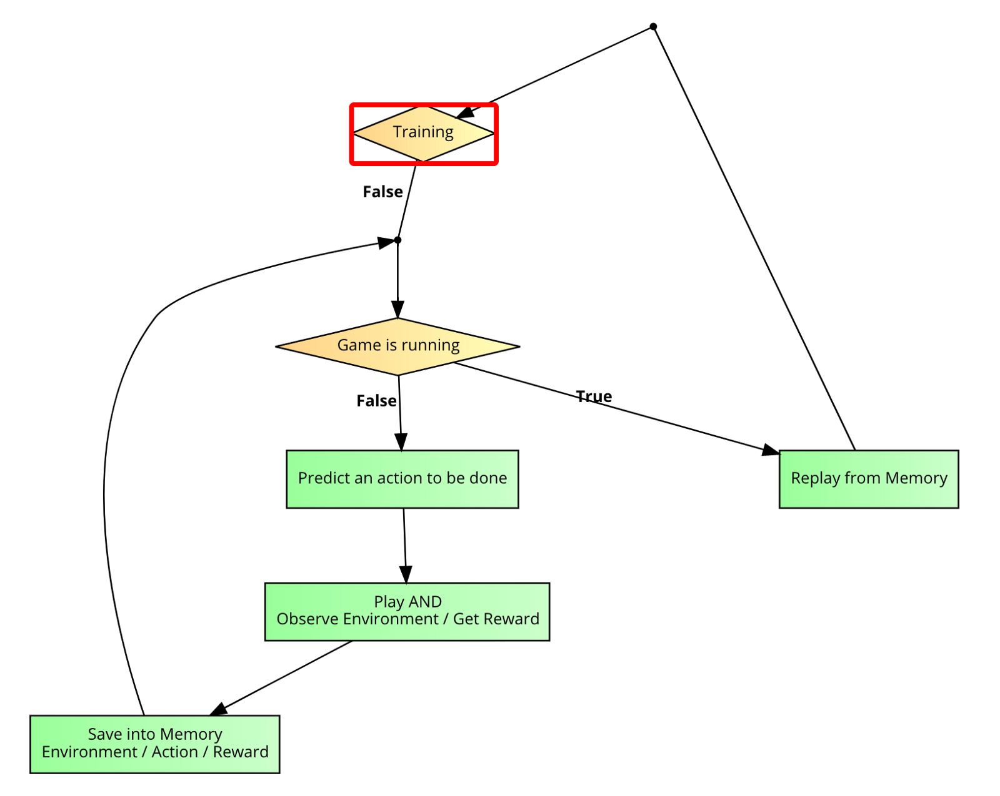
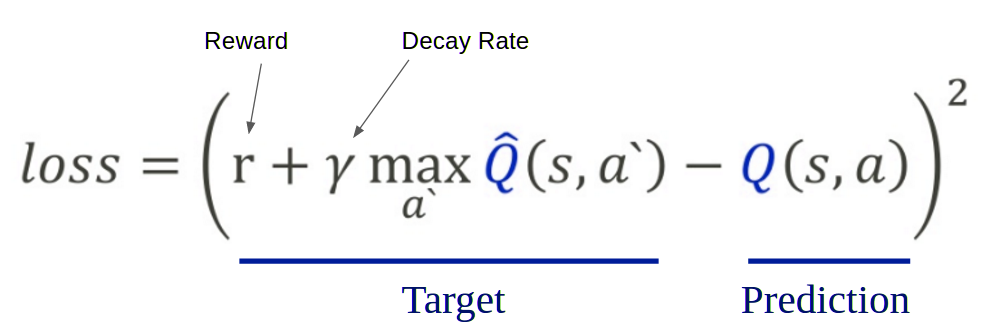
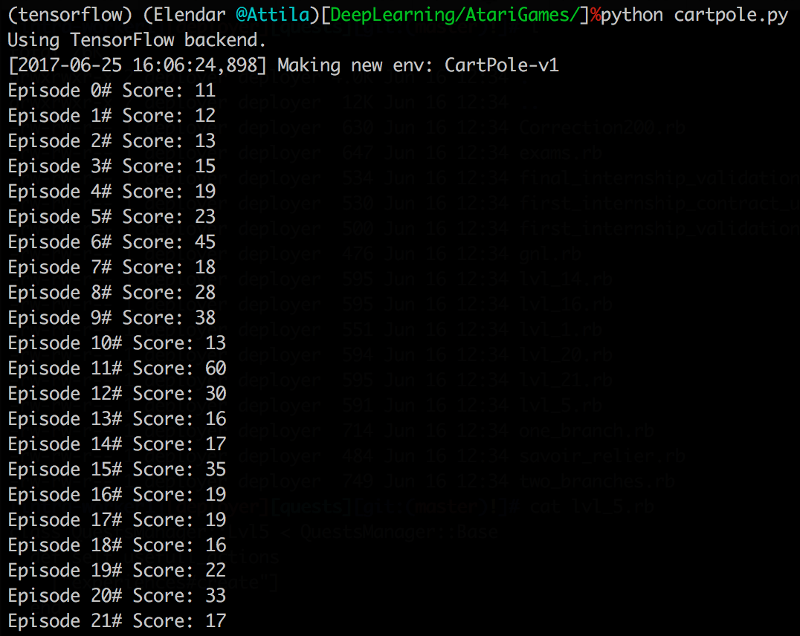
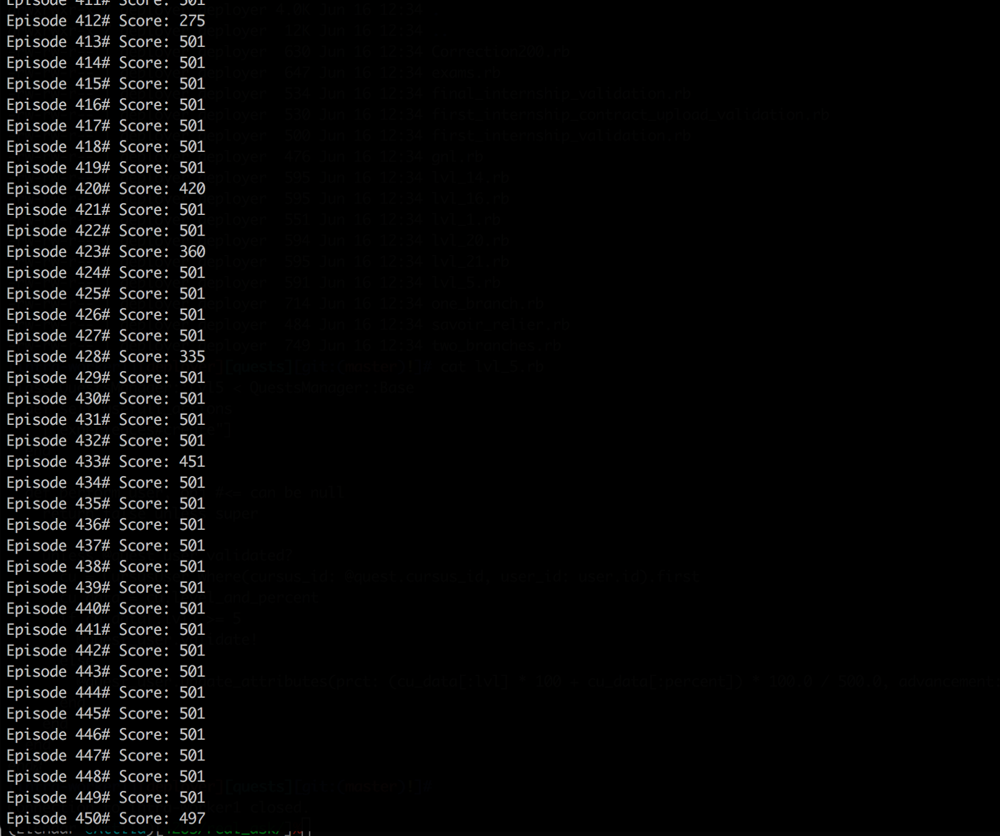
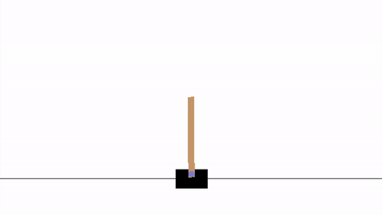

## Keras 와 Gym 과 함께하는 Deep Q-Learning 을 향한 여행 🛫(My Journey Into Deep Q-Learning with Keras and Gym
[원문 링크](https://medium.com/@gtnjuvin/my-journey-into-deep-q-learning-with-keras-and-gym-3e779cc12762)
> 이 튜토리얼은 Deep Q-Learning 으로 CartPole 이라는 게임을 학습시키는 것에 대한 것입니다. 기본적인 내용을 차근차근 다루니 Deep Reinforcement Learning 초보자에게 좋을 것이라고 생각합니다.

* Keras
* Deep Reinforcement Learning
* Deep Q-Learning
* Gym

### Introduction

*figure1 : CartPole 게임*

<br></br>

이 글은 오래된 게임인 **CartPole** 을 해보기위해 적용된 **Deep Reinforcement Learning(Deep Q-Learning)** 을 구현하는 방법을 보여줍니다.

작업을 용이하게 하기 위해 두 가지 도구를 사용했습니다.

* [OpenAI Gym](https://gym.openai.com): 많은 오래된 비디오 게임 환경과의 상호작용을 위한 간단한 인터페이스를 제공합니다(Atari 게임 콜렉션은 아주 훌륭합니다 🤩).
* [Keras](https://keras.io): 인기절정의 Deep Learning 라이브러리

결국 우리는 100줄 미만의 코드로 스스로 학습하는 "AI"를 만들게 될 것입니다. 🤖

또한 나는 독자들이 Deep Reinforcement Learning에 대한 사전 요구 조건을 갖추지 않아도 되도록 설명해 줄 것 입니다.

이 튜토리얼에 있는 코드는 [*Github*](https://github.com/GaetanJUVIN/Deep_QLearning_CartPole)에서 가져왔습니다.

<br></br>
<br></br>

### 강화학습은 무엇일까? (What is Reinforcement Learning?)

강화학습(Reinforcement Learning)은 기계학습(Machine Learning)의 한 종류입니다. 이를 통해 환경(입력/출력)에서 상호 작용하여 학습하는 AI 에이전트(Agent)를 만들 수 있습니다. AI 에이전트는 [시행착오](https://en.wikipedia.org/wiki/Trial_and_error)를 통해 배울 것입니다. 많은 노력 끝에, 환경에서 성공할 수 있는 충분한 경험을 갖게 될 것입니다.

이런 종류의 기계 학습은 인간의 학습 방식과 매우 유사합니다. 예를 들어, 이것은 우리가 걷는 법을 배울 때와 같습니다. 우리는 한 발을 다른 발 앞에 놓으려고 여러 번 시도하지만, 우리가 걷는 데 성공하는 것은 많은 실패와 관찰 후에만 가능합니다.

<br></br>


*figure2 : 강화학습이란?*

<br></br>
<br></br>

### Deep Reinforcement Learning 이란? (What is Deep Reinforcement Learning?)
[구글의 딥마인드(DeepMind)](https://deepmind.com/blog/deep-reinforcement-learning/)는 [Playing Atari with Deep Reinforcement Learning](https://arxiv.org/abs/1312.5602)이라는 유명한 논문을 발표했습니다. 👀

<br></br>


*figure3 : DeepMind 로고*

<br></br>

2013년 말, 구글은 **Deep Q Network(DQN)** 라는 새로운 알고리즘을 선보였습니다. AI 에이전트가 화면을 관찰하는 것만으로 어떻게 게임을 배울 수 있는지를 보여줬습니다. AI 에이전트는 게임에 대한 사전 정보를 받지 않고도 게임을 어떻게 하는지 배울 수 있습니다.

그것은 상당히 인상적이었으며 이 논문은 **딥러닝** 과 **강화학습** 이 혼합된 **'Deep Reinforcement Learning'** 이라는 새로운 시대를 열게 되었습니다.

[클릭해서 보세요: <U>DeepMind의 Atari Player</U>](https://www.youtube.com/watch?v=V1eYniJ0Rnk)

Deep Q Network 알고리즘에서 신경망은 환경을 기반으로 최고의 동작을 수행하는 데 사용됩니다(일반적으로 "State"라고 합니다).

우리는 **Q 함수** 이라 불리는 함수을 가지고, 이 funtion은 State를 기반으로 잠재적인 보상을 추정하는 데 사용됩니다. 우리는 그것을 Q(State, Action)라고 부릅니다. 여기서 Q는 `State` 및 `Action`을 기준으로 예상되는 미래 값을 계산하는 함수 입니다.

<br></br>
<br></br>

### 어린시절 하던 오래된 게임 CartPole (An old game from our childhood: CartPole)
이 게시물에서는 에이전트에게 복잡한 게임을 교육하는 데 시간이 좀 걸릴 수 있기 때문에 "단순한" 게임을 선택했습니다(몇 시간에서 하루 종일 💤).

**CartPole** 의 목표는 움직이는 카트 위에 있는 폴의 균형을 맞추는 것입니다.

나는 게임 시뮬레이터인 `OpenAI Gym`이라는 도구를 사용할 것입니다. 따라서 픽셀 정보를 제공하는 대신 사용 가능한 변수(State, 폴 각도, 카트 위치 등)를 제공합니다.

게임과의 상호작용을 위해, 우리 에이전트는 카트에 0 또는 1의 일련의 동작을 수행하여 카트를 왼쪽이나 오른쪽으로 밀어서 옮길 수 있습니다.

Gym은 게임 환경과의 모든 상호작용을 단순화함으로써 AI 에이전트의 "두뇌"에 초점을 맞추도록 합니다.

```python
# INPUT
# action은 0 또는 1

# OUTPUT
# 다음 State, 보상, 정보 : 우리가 무엇을 위해서 학습하는지에 대한 것
# done : 게임이 끝났는지 아닌지에 대한 boolean 타입의 값
next_state, reward, done, info = env.step(action)
```

<br></br>
<br></br>

### 단순 신경망을 사용하기 위한 Keras 사용 (Using Keras To Implement a Simple Neural Network)


*figure4 : 인기 많은 TensorFlow, CNTK or Theano 처럼 Keras.io 는 high-level 의 신경망 API 입니다.*

이 글은 **딥러닝** 이나 **신경망** 에 관한 것이 아닙니다. 따라서 **신경망** 은 입력을 출력에 맵핑하는 블랙 박스 알고리즘으로 간주할 것입니다.

**신경망** 은 기본적으로 데이터 쌍(입력 및 출력 데이터)을 기반으로 학습하고, 특정 유형의 패턴을 탐지하고, 또 다른 입력 데이터를 기반으로 출력을 예측하는 알고리즘입니다.

<br></br>


*figure5 : 3개의 입력, 1개의 히든 레이어, 2개의 출력*

<br></br>

우리가 이 포스트에서 사용할 **신경망** 은 figure4와 유사합니다. 그것은 4개의 정보를 받는 입력 레이어와 3개의 히든 레이어를 가질 것입니다. 그리고 게임 버튼이 2개(0과 1)이므로 출력 레이어에 노드가 2개 있을 것입니다.

**Keras** 는 Python으로 작성되었으며 TensorFlow, CNTK 또는 Theano의 위에서 실행할 수 있는 높은 수준의 신경 네트워크 API입니다. "이것은 빠른 실험을 가능하게 하는 것에 초점을 맞추어 개발되었습니다. 아이디어에서 최소의 지연으로 결과를 얻을 수 있는 것이 좋은 연구를 하는 열쇠입니다."

**Keras** 는 기본적인 **신경망** 을 구현하는 것을 정말 간단하게 만듭니다. 🤓

<br></br>
<br></br>

### 0# 모델 만들기 (Initialization)

```Python
# Deep Q Learning 을 위한 신경망 만들기
# Sequential() 은 레이어를 쌓아줍니다.
model = Sequential()
# ‘Dense’ 는 신경망의 기본 form 입니다.
# State 의 입력 사이즈는 size(4) 이고, 히든 레이어는 24개의 노드로 이루어집니다.
model.add(Dense(24, input_dim=self.state_size, activation=’relu’))
# 24개의 노드를 가진 히든 레이어
model.add(Dense(24, activation=’relu’))
# 출력 레이어 : 2개의 노드 (left, right)
model.add(Dense(self.action_size, activation=’linear’))
# 정보를 토대로 모델을 만듭니다.
model.compile(loss=’mse’, optimizer=Adam(lr=self.learning_rate))
```

<br></br>
<br></br>

### 1# 신경망 학습 (Training of our neural network)

우리의 신경망을 이해하고 예측하기 위해서, 우리는 모델에 데이터를 입력으로 줘야합니다.

이를 위해 **Keras** 는 입력 및 출력 쌍을 모델에 공급하는 method `fit()`을 제공합니다. 그런 다음 모델은 이러한 데이터를 기반으로 학습되고 입력을 기준으로 출력을 추정합니다.

이 학습 과정은 **신경망** 이 `state` 로부터 보상을 예측할 수 있게 합니다.

```Python
model.fit(state, reward_value, epochs=1, verbose=0)
```

<br></br>
<br></br>

### 2# 예측하기 (Prediction)

이제 모델은 학습 후, 처음 보는 데이터 로부터의 출력(결과)을 예측할 수 있습니다. 모형에서 `predict()` 함수를 호출하면 모델은 훈련된 데이터를 기반으로 현재 state의 보상을 예측합니다.

```python
prediction = model.predict(state)
```

<br></br>
<br></br>

### Deep Q Network 만들기 (Deep Q Network Implementation)


*figure6 : Deep Q Network*

<br></br>

게임에서 보상은 성과와 관련이 있습니다. 그것은 종종 숫자, 즉 점수와 관련이 있습니다.

CartPole의 경우 점수가 없습니다. 그 보상은 그 선수가 얼마나 오래 살아남느냐에 기초합니다. Cart를 AND로 화면 안에 보관합니다. 생존은 숫자만큼 "실제"가 아니기 때문에 *직관* 은 중요한 역할을 합니다: 기둥이 오른쪽으로 밀리는 상황을 상상해보세요. 플레이어는 오른쪽 버튼이나 왼쪽 버튼을 누릅니다. 더 오래 생존하려면 오른쪽 버튼을 눌러야 합니다. DQN에서 직접 번역하면 오른쪽 버튼을 누르는 것에 대한 보상이 왼쪽 버튼을 누르는 것보다 더 높다는 것입니다.

**DQN 알고리즘** 에는 *기억* 과 *재생* 이라는 두 가지 매우 중요한 method도 있습니다. 둘 다 아주 간단한 개념이고 우리가 인간으로서 어떻게 사는지 더 잘 설명할 수 있습니다: 여러분은 각각의 행동을 한 후에 무엇을 했는지 기억하고, 충분한 요소를 가지고 있을 때 여러분은 마음 속에 상황을 재현하려고 합니다. 그리고 그것은 항상 "그렇게 했어야 했는데 😞"로 끝납니다.

<br></br>
<br></br>

### 0# Global Parameters

* `Learning_rate` - 이는 신경 네트워크가 대상과 각 반복에서 예측 사이의 손실로부터 얼마나 많은 것을 학습하는지 나타냅니다.

* `gamma` : 향후 discounted future reward를 계산하는 데 사용됩니다.

* `exploration_rate` : 초기에 에이전트 경험이 부족하면 작업을 임의로 선택할 수 있으며 에이전트가 더 많은 경험을 쌓으면 어떤 조치를 취해야 할지 결정할 수 있습니다.

* `exploration_decay` : 우리는 그것이 게임을 하는 데 점점 더 좋아지면서 탐색의 수를 줄이고 싶습니다.

* `episodes` : 우리가 에이전트에게 훈련을 시키기 위해 얼마나 많은 게임을 하기를 원하는 지를 보여줍니다.

> `discounted future reward`를 처음 봤을 때, 직역하면 할인된 미래 보상..? 😵 이게 뭐지 라고 생각했고 커뮤니티에 질문하게 되었습니다. `discounted future reward`는 현재 받을 보상을 미래에 받을 보상보다 더 큰 가중치를 준다는 것이라고 합니다.
> 그 이유가 무엇인지 재질문을 했더니 '직관적으로 100년 뒤에 받는 천만원보다 현재 받는 천만원의 가치가 더 크다고 보는거죠. agent를 학습시킬 때에도 우리가 이렇게 기대하는 것처럼 학습시켜주기 위함일 것 같습니다' 라고 답을 받았습니다. 사람이랑 정말 비슷하네요.

<br></br>
<br></br>

### 1# 어떻게 우리는 더 오래 생존하기 위해 이러한 직관을 논리적으로 표현할까? (How do we logically represent this intuition to survive longer?)


*figure7: Q-learning의 수학적 표현*

<br></br>

손실은 예측이 실제 목표에서 얼마나 멀리 떨어져 있는지를 나타내는 값입니다. 예를 들어, 모델의 예측은 오른쪽 버튼을 눌러 더 많은 보상을 얻을 수 있을 때 왼쪽 버튼을 누르는 것이 더 많은 손실을 나타낸다는 것을 나타낼 수 있습니다.

우리의 목표는 손실을 줄이는 것이고, 손실은 실제 값과 예측 값 사이의 갭입니다.

우리는 먼저 무작위로 Action을 선택하고 보상을 관찰합니다. 이것은 또한 새로운 State를 만들 것입니다.

Keras는 우리의 가장 어려운 일을 맡을 것입니다. 이 공식에서는 목표값만 계산하면 됩니다. 😊

```python
# import numpy as np
# amax 는 축을 따라 배열의 최대값 또는 최대값을 반환합니다.
target = reward + gamma * np.amax(model.predict(next_state))
```

<br></br>

`fit()` 함수의 경우, **Keras** 는 신경망 출력에서 대상을 빼서 제곱을 계산합니다. 그런 다음 신경 네트워크를 초기화할 때 정의한 learning rate를 적용합니다.

이 기능은 우리의 예측과 목표 사이의 차이를 학습 비율로 감소시킵니다. 업데이트 프로세스를 반복하면서 Q-값의 근사치가 실제 Q-값에 수렴됩니다. 즉, 손실이 감소하고 점수가 높아집니다.

<br></br>
<br></br>

### 2# Remember

학습 과정에서 가장 중요한 단계 중 하나는 과거에 우리가 무엇을 했는지를 그리고 그 보상이 어떻게 그 행동에 속하는지 기억하는 것이다. 따라서 이전 경험과 관찰의 목록이 필요합니다.

우리는 우리의 경험을 `memory`라 불리는 배열에 저장하고, state, action, 보상, 그리고 next state를 배열 `memory`에 추가할 `remember()` 함수을 만들 것이다.

```Python
memory.append((state, action, reward, next_state, done))
```

그리고 remember() 함수는 단순히 state, action 및 보상을 메모리에 저장합니다.

```Python
def remember(self, state, action, reward, next_state, done):
        self.memory.append((state, action, reward, next_state, done))
```

<br></br>
<br></br>

### 3# Replay

이제 우리는 과거 경험이 배열에 있고, 이것으로 **신경망** 을 훈련시킬 수 있습니다. `replay()`를 만듭시다. 우리는 우리의 모든 기억을 한번에 이용할 수 없습ㄴ니다. 그것은 너무 많은 자원을 필요로 할 것이기 때문입니다. 따라서 샘플(`sample_batch_size`, 여기서 32로 설정)을 몇 개만 취하고 무작위로 선택하겠습니다.

```Python
sample_batch = random.sample(self.memory, sample_batch_size)
```

<br></br>

에이전트가 오랫동안 잘 수행되도록 하려면 즉각적인 보상뿐만 아니라 앞으로 받게 될 보상도 고려해야 합니다.

그것을 실행하기 위해서 우리는 `gamma`를 사용할 것입니다. 이러한 방식으로, 우리의 DQN agent는 주어진 State에서 discounted future reward를 최대화하는 법을 배울 것입니다

```Python
def replay(self, batch_size):
        sample_batch = random.sample(self.memory, sample_batch_size)
        for state, action, reward, next_state, done in sample_batch:
            target = reward
            if not done:
              target = reward + self.gamma * np.amax(self.brain.predict(next_state)[0])
            target_f = self.brain.predict(state)
            target_f[0][action] = target
            self.brain.fit(state, target_f, epochs=1, verbose=0)
        if self.exploration_rate > self.exploration_min:
            self.exploration_rate *= self.exploration_decay
```

<br></br>
<br></br>

### 4# Act

우리의 에이전트는 처음에는 'exploration rate'(또는 'epsilon')라고 불리는 일정 퍼센티지의 조치를 무작위로 선택할 것입니다. 처음에는 DQN 에이전트가 패턴을 검색하기 전에 다른 시도들을 하는 것이 좋습니다.

DQN 에이전트가 충분한 경험을 가지고 있으면 에이전트는 현재 state를 기준으로 보상 값을 예측합니다. 💰💰 그것은 가장 높은 보상을 줄 조치를 선택할 것입니다.

`np.argmax()`는 act_values[0]에서 두 요소 사이의 가장 높은 값의 지수를 반환하는 함수입니다. 예를 들어, 각 숫자는 조치 0과 1을 선택하는 보상을 나타내는 [0.21, 0.42]와 같이 보일 수 있습니다. 이 경우 1이 반환됩니다.

```Python
def act(self, state):
        if np.random.rand() <= self.exploration_rate:
            return random.randrange(self.action_size)
        act_values = self.brain.predict(state)
        return np.argmax(act_values[0])
```

<br></br>
<br></br>

### Let’s code!
#### 0# DQL Agent

```Python
class Agent():
    def __init__(self, state_size, action_size):
        self.weight_backup      = "cartpole_weight.h5"
        self.state_size         = state_size
        self.action_size        = action_size
        self.memory             = deque(maxlen=2000)
        self.learning_rate      = 0.001
        self.gamma              = 0.95
        self.exploration_rate   = 1.0
        self.exploration_min    = 0.01
        self.exploration_decay  = 0.995
        self.brain              = self._build_model()
def _build_model(self):
        # Neural Net for Deep-Q learning Model
        model = Sequential()
        model.add(Dense(24, input_dim=self.state_size, activation='relu'))
        model.add(Dense(24, activation='relu'))
        model.add(Dense(self.action_size, activation='linear'))
        model.compile(loss='mse', optimizer=Adam(lr=self.learning_rate))
if os.path.isfile(self.weight_backup):
            model.load_weights(self.weight_backup)
            self.exploration_rate = self.exploration_min
        return model
def save_model(self):
            self.brain.save(self.weight_backup)
def act(self, state):
        if np.random.rand() <= self.exploration_rate:
            return random.randrange(self.action_size)
        act_values = self.brain.predict(state)
        return np.argmax(act_values[0])
def remember(self, state, action, reward, next_state, done):
        self.memory.append((state, action, reward, next_state, done))
def replay(self, sample_batch_size):
        if len(self.memory) < sample_batch_size:
            return
        sample_batch = random.sample(self.memory, sample_batch_size)
        for state, action, reward, next_state, done in sample_batch:
            target = reward
            if not done:
              target = reward + self.gamma * np.amax(self.brain.predict(next_state)[0])
            target_f = self.brain.predict(state)
            target_f[0][action] = target
            self.brain.fit(state, target_f, epochs=1, verbose=0)
        if self.exploration_rate > self.exploration_min:
            self.exploration_rate *= self.exploration_decay
```

<br></br>

#### 1# main() function

```Python
class CartPole:
    def __init__(self):
        self.sample_batch_size = 32
        self.episodes          = 10000
        self.env               = gym.make('CartPole-v1')
self.state_size        = self.env.observation_space.shape[0]
        self.action_size       = self.env.action_space.n
        self.agent             = Agent(self.state_size, self.action_size)
def run(self):
        try:
            for index_episode in range(self.episodes):
                state = self.env.reset()
                state = np.reshape(state, [1, self.state_size])
                done = False
                index = 0
                while not done:
#                    self.env.render()
                     action = self.agent.act(state)
                     next_state, reward, done, _ = self.env.step(action)
                     next_state = np.reshape(next_state, [1, self.state_size])
                     self.agent.remember(state, action, reward, next_state, done)
                     state = next_state
                     index += 1
                print("Episode {}# Score: {}".format(index_episode, index + 1))
                self.agent.replay(self.sample_batch_size)
        finally:
            self.agent.save_model()
if __name__ == "__main__":
    cartpole = CartPole()
    cartpole.run()
```

<br></br>

### Training time!

우리는 스크립트를 시작할 수 있습니다. Gym OpenAI는 최대 점수를 501점으로 제한합니다.

그리고 처음에 우리의 DQL 에이전트는 임의로 행동함으로써 탐색한다는 것을 기억하십시오. 표시된 점수를 통해 진행 상황을 볼 수 있습니다.


*figure8 : 진행사항*

<br></br>

학습 단계에서는 여러 단계를 거칩니다.

1. 폴의 균형을 잡는 것.
2. 경계 유지.
3. 경계를 벗어나려고 하는 동안 막대기를 떨어뜨리지 않는 것.

수백 편(5분)의 에피소드를 진행한 후(게임을 하는 것을 에피소드라고 위에서 이야기 하였습니다 🙂), 점수를 극대화하기 위해 균형을 맞추는 법을 배우기 시작합니다.


*figue9 : 늘어난 점수*

<br></br>

바로 이겁니다, 우리는 숙련된 CartPole 플레이어를 만들었어요! 👍 👍


*figure10 : 학습중인 CartPole*

[GitHub](https://github.com/GaetanJUVIN/Deep_QLearning_CartPole)에서 이 게시물에 사용된 코드를 찾을 수 있습니다. game renderer를 켜려면 아래 주석을 풀어야 합니다. :-)

```Python
#                    self.env.render()
```
