# EyeNet
[원문 링크](https://github.com/llSourcell/AI_in_Medicine_Clinical_Imaging_Classification)
> 이 글은 신경망을 이용하여 당뇨망막병증(Diabetic Retinopathy)을 검출하는 튜토리얼 문서입니다. 

## 개요
이 자료에는 의료영상 분류에 관한 Siraj Raval의 [Youtube 영상](https://youtu.be/DCcmFXXAHf4)의 소스코드가 포함되어 있습니다. 
 
## 딥러닝을 이용하여 당뇨망막병증(Diabetic Retinopathy) 검출하기 

## 목적

당뇨망막병증은 선진국의 근로 연령(working-age) 인구들이 실명하는 주요 원인으로,  9,300만 명이 넘는 사람들에게 영향을 미칠 것으로 추정됩니다.

이러한 질병을 자동화된 일련의 과정을 통해 진단하고자 하는 수요는 아주 오랫동안 있었으며, 이미지 분류, 패턴 인식, 그리고 기계학습과 같은 방법들을 이용해 큰 진전이 이루어지고 있습니다. 여기에서 풀고자 하는 것은, 안구 이미지를 받아서 실제 병리 진단에 활용 가능한 만큼의 이상적인 결과를 얻을 수 있는 새로운 모델을 만드는 것입니다.

이 프로젝트를 진행하게 된 계기는 다음과 같습니다:

* 우선 대규모의 데이터셋을 분류하는 것을 비롯한, 이미지 분류는 다년간 저의 개인적인 관심사였습니다. 
  
* 환자들이 안구를 스캔하고 이 안구 영상을 의사가 분석하여 다음 진료를 예약하기까지는 상당한 시간이 소요됩니다. 실시간으로 이미지를 처리할 수 있는 EyeNet을 사용한다면, 환자가 검사 & 치료를 하루에 전부 진행할 수 있을 것입니다. 

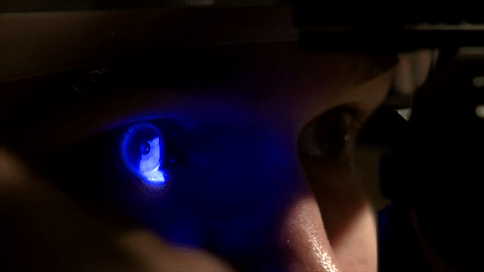

## 목차
- [EyeNet](#eyenet)
    - [개요](#%EA%B0%9C%EC%9A%94)
    - [딥러닝을 이용하여 당뇨망막병증(Diabetic Retinopathy) 검출하기](#%EB%94%A5%EB%9F%AC%EB%8B%9D%EC%9D%84-%EC%9D%B4%EC%9A%A9%ED%95%98%EC%97%AC-%EB%8B%B9%EB%87%A8%EB%A7%9D%EB%A7%89%EB%B3%91%EC%A6%9Ddiabetic-retinopathy-%EA%B2%80%EC%B6%9C%ED%95%98%EA%B8%B0)
    - [목적](#%EB%AA%A9%EC%A0%81)
    - [목차](#%EB%AA%A9%EC%B0%A8)
    - [데이터](#%EB%8D%B0%EC%9D%B4%ED%84%B0)
    - [탐색적 데이터 분석](#%ED%83%90%EC%83%89%EC%A0%81-%EB%8D%B0%EC%9D%B4%ED%84%B0-%EB%B6%84%EC%84%9D)
    - [데이터 전처리](#%EB%8D%B0%EC%9D%B4%ED%84%B0-%EC%A0%84%EC%B2%98%EB%A6%AC)
        - [EC2에 모든 이미지 다운로드하기](#ec2%EC%97%90-%EB%AA%A8%EB%93%A0-%EC%9D%B4%EB%AF%B8%EC%A7%80-%EB%8B%A4%EC%9A%B4%EB%A1%9C%EB%93%9C%ED%95%98%EA%B8%B0)
        - [이미지 크롭 & 리사이즈](#%EC%9D%B4%EB%AF%B8%EC%A7%80-%ED%81%AC%EB%A1%AD--%EB%A6%AC%EC%82%AC%EC%9D%B4%EC%A6%88)
        - [이미지 회전(rotate) 및 좌우반전(mirror)](#%EC%9D%B4%EB%AF%B8%EC%A7%80-%ED%9A%8C%EC%A0%84rotate-%EB%B0%8F-%EC%A2%8C%EC%9A%B0%EB%B0%98%EC%A0%84mirror)
    - [신경망 모델 구조](#%EC%8B%A0%EA%B2%BD%EB%A7%9D-%EB%AA%A8%EB%8D%B8-%EA%B5%AC%EC%A1%B0)
    - [결과](#%EA%B2%B0%EA%B3%BC)
    - [향후 과제](#%ED%96%A5%ED%9B%84-%EA%B3%BC%EC%A0%9C)
    - [참고자료](#%EC%B0%B8%EA%B3%A0%EC%9E%90%EB%A3%8C)
    - [Tech Stack](#tech-stack)
    - [크레딧](#%ED%81%AC%EB%A0%88%EB%94%A7)

## 데이터
이 데이터는 [2015 Kaggle competition](https://www.kaggle.com/c/diabetic-retinopathy-detection) 에 있습니다. 하지만 기존의 캐글 데이터셋과는 다릅니다. 대부분의 캐글 대회에서는 데이터가 이미 정제되어 있고, 우리가 할 일이 크지 않습니다만, 이 데이터셋의 경우에는 다릅니다. 

이미지들이 다양한 사람들, 다양한 카메라, 다양한 사이즈로 수집되었습니다. [preprocessing](#데이터 전처리) 세션에서 자세히 다루겠지만, 데이터에는 노이즈가 심하기 때문에 이 데이터로 모델을 학습시키려면 여러 단계의 전처리 과정이 필요합니다. 

학습 데이터는 35,126 장의 이미지이고 전처리 과정에서 더 늘어납니다.

## 탐색적 데이터 분석
우선 학습 데이터의 레이블부터 살펴보겠습니다. 총 5개의 클래스가 있는데, 그래프를 보면 데이터가 상당히 불균형합니다. 

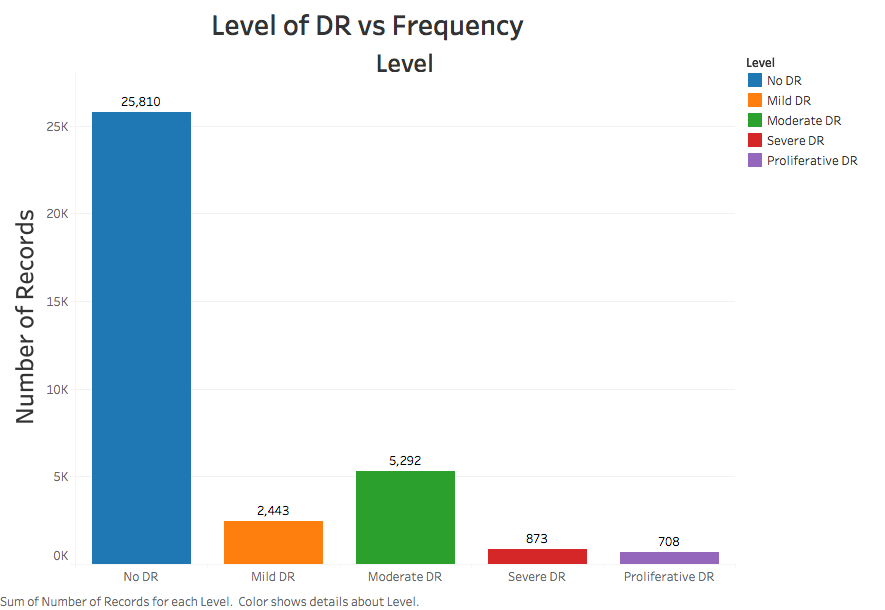

25,810개의 이미지는 전부 망막병증이 없는 이미지들이고, 9,316개의 데이더만이 망막병증이 존재하는 데이터입니다. 이러한 클래스 불균형 문제 때문에, [preprocessing](#데이터 전처리) 세션에서는 모델을 학습시키기 전에 클래스 불균형 문제를 완화시켜야 합니다.
게다가, 각 안구 이미지도 각양각색(high variance)입니다. 상당에 두 행은 망막병증이 없는 이미지이고, 나머지 두 행은 망막병증이 있는 안구 이미지입니다. 

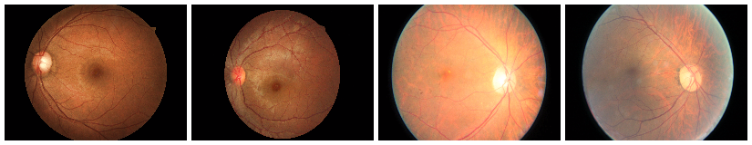
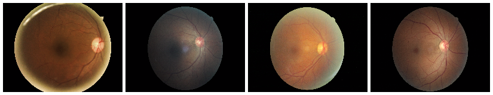
  
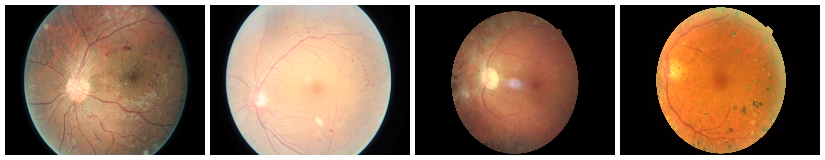
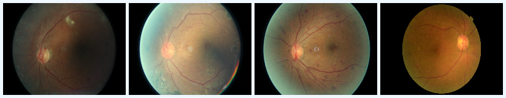

## 데이터 전처리

전처리 파이프라인은 다음과 같습니다. 

1. [다운로드 스크립트](src/download_data.sh)를 통해서 EC2에 모든 이미지를 다운로드합니다. 
2. [리사이즈 스크립트](src/resize_images.py)와 [전처리 스크립트](src/preprocess_images.py)를 통해서 모든 이미지를 크롭, 리사이즈 합니다. 
3. [회전 스크립트](src/rotate_images.py)를 이용해서 모든 이미지를 회전 및 좌우반전 시킵니다. 
4. [변환 스크립트](src/image_to_array.py)를 시용해서 모든 이미지를 Numpy array로 변환합니다. 

### EC2에 모든 이미지 다운로드하기 
이미지는 Kaggle CLI를 이용하여 다운로드 받도록 합니다. EC2 인스턴스로 실행을 하게 되면, 다운로드 시간이 약 30분 정도 소요됩니다. 모든 이미지들이 각 폴더에 저장되며, 압축 형식에 따라 확장됩니다. 원본 데이터셋의 크기는 총 35 기가바이트입니다. 

### 이미지 크롭 & 리사이즈
모든 이미지를 255x255 스케일로 줄입니다. 이미지의 크기가 크면 학습이 오래걸리긴 하겠지만, 이미지의 디테일을 위해서는 사이즈가 128x128보다는 커야합니다. 추가적으로, 403개의 이미지는 학습 집합에서 제외시킵니다. Scikit-Image는 아무 색도 존재하지 않는 이미지를 리사이즈하는 경우 여러가지 에러가 발생할 수 있습니다. 따라서 완전히 검정색인 이미지는 학습 데이터에서 제외시킵니다. 

### 이미지 회전(rotate) 및 좌우반전(mirror)
모든 이미지에 대해서 회전 및 좌우반전을 수행합니다. 
망막병증이 없는 이미지의 경우에는 좌우반전만 수행합니다. 망막병증 이미지의 경우에는 좌우반전과 90도, 120도, 180도, 270도 회전을 모두 수행하여 추가적인 데이터를 생성합니다. 

첫 번째 줄의 이미지는 두 쌍의 이미지를 나타냅니다. 검은색 테두리가 있습니다. 부 번째 줄의 이미지를 살펴보면, 크롭 및 회전을 통해 검은색 테두리와 같은 노이즈가 얼마나 제거되는지를 알 수 있습니다. 

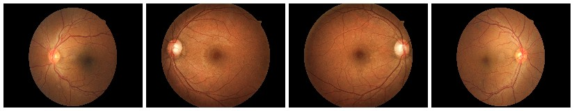
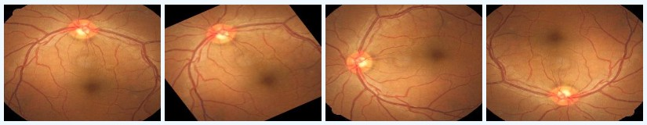

회전 및 좌우대칭 이미지를 추가하면, 클래스 불균형 문제가 완화됩니다. 망막병증이 존재하는 이미지가 수천 장 더 많긴 하지만 말이죠. 이제는 전체 106,386 장의 이미지가 신경망을 학습하는데 사용됩니다. 

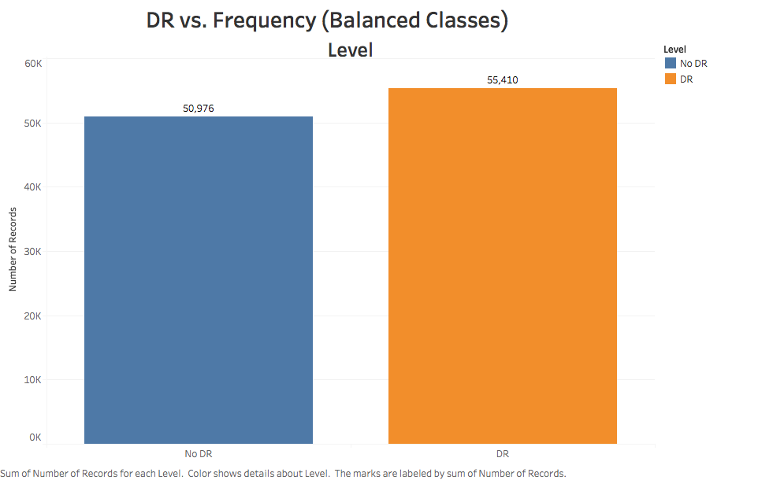

## 신경망 모델 구조 
모델은 Tensorflow를 백엔드로하는 Keras에서 구현합니다. Theano 벡엔드보다는 Tensorflow 백엔드의 성능이 더 좋습니다. 그리고 TensorBoard를 활용한 아주 훌륭한 시각화 도구도 사용할 수 있습니다. 

EyeNet은 두 가지 카테고리를 예측하기 위해서 세 개의 컨볼루션 레이어를 이용합니다. 각 레이어의 깊이는 32입니다. 그리고 (2,2) 사이즈의 맥스 풀링 레이어가 각 레이어의 마지막에 적용됩니다. 

컨볼루션 레이어의 마지막 풀링이 끝나면 데이터는 128 사이즈의 단일 dense 레이어로 들어가서 최종적인 출력을 반환합니다. 최종적인 출력은 2개의 소프트맥스 노드들로 이루어집니다.

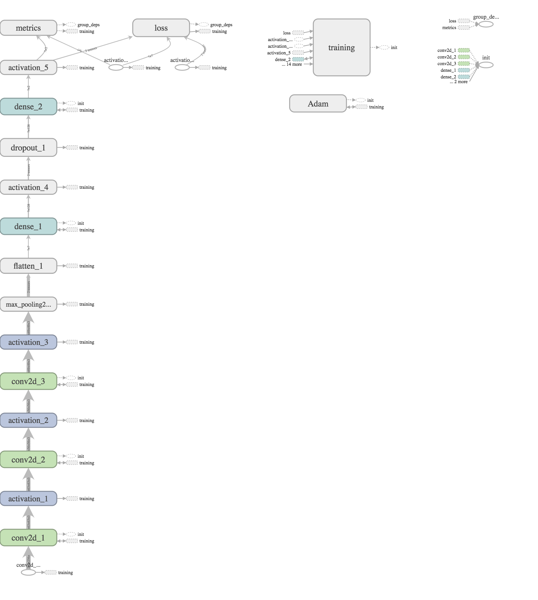

## 결과
EyeNet은 환자가 망막병증이 있는지 없는지를 분류합니다. 이 모델은 아래와 같은 방법으로 성능을 측정해 볼 수 있습니다. 

| Metric | Value |
| :-----: | :-----: |
| Accuracy (Train) | 82% |
| Accuracy (Test) | 80% |
| Precision | 88% |
| Recall | 77% |

어떻게 이렇게 괜찮을 성능을 낼 수 있었던 것일까요? 우선 클래스 불균형 문제를 해소했으며, 이미지를 크롭하는 과정도 네트워크의 성능을 끌어올리는데 확실히 도움이 된 것 같습니다. 그리고 이미지에서 검은색 테두리 부분들을 최대한 제거함으로써 네트워크가 안구가 위치한 부분만을 잘 처리할 수 있었습니다. 

## 향후 과제
1. 새로운 이미지들을 가지고 다시 학습시키는 것은 아주 일반적인 일입니다. 이는 단지 모델을 최적화시키는 역할입니다. 대신 새로운 이미지의 퀄리티가 안좋아서 분류기의 성능을 악화시킬 수 있으므로, 새로운 이미지에 대한 검증 절차가 필요할 것입니다.  

2. Keras 모델을 CoreML로 포팅하고, IOS 어플리케이션으로 배포합니다. CoreML은 기계학습 모델을 IOS 디바이스에 심을 수 있도록 Apple이 만든 프레임워크 입니다. CoreML을 통해서 Python 개발자들은 모델을 `.mlmodel` 파일로 내보내고, IOS 개발 사이클에 추가시킬 수 있습니다.  

나아가, 모델이 로컬 디바이스에서 내부적으로 동작하게 되면, 어플리케이션이 동작하기 위한 인터넷 연결이 필요없습니다. 이때 EyeNet은 아주 유용하고 간편한 역할을 할 수 있습니다. 

## 참고자료

1. [당뇨망막병증이란?(영문)](http://www.mayoclinic.org/diseases-conditions/diabetic-retinopathy/basics/definition/con-20023311)

2. [당뇨망막병증 데이터셋 첼린지 우승자들 인터뷰 : 4위, Julian & Daniel(영문))](http://blog.kaggle.com/2015/08/14/diabetic-retinopathy-winners-interview-4th-place-julian-daniel/)

3. [Tensorflow : 모두를 위한 기계학습(영문)](https://youtu.be/mWl45NkFBOc)

## Tech Stack
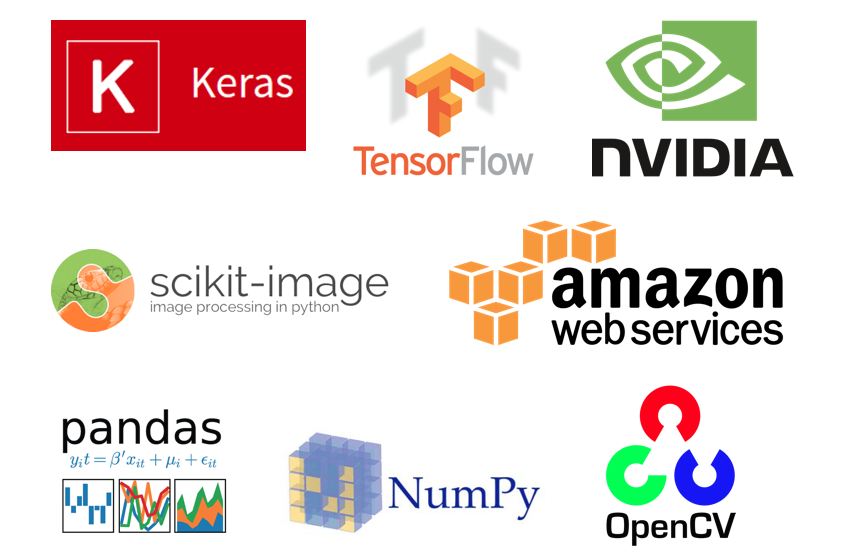

## 크레딧

The credits for this code go to [gregwchase](https://github.com/gregwchase/dsi-capstone). I've merely created a wrapper to get people started. 

> 이 글은 2018 컨트리뷰톤에서 Contribute to Keras 프로젝트로 진행했습니다.  
> Translator: visionNoob(Jaewon Lee)  
> Translator email : insurgent92@kangwon.ac.kr
