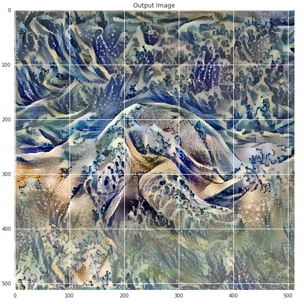
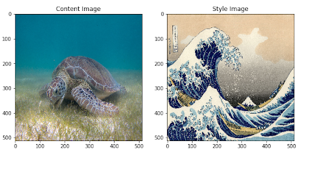
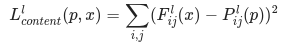
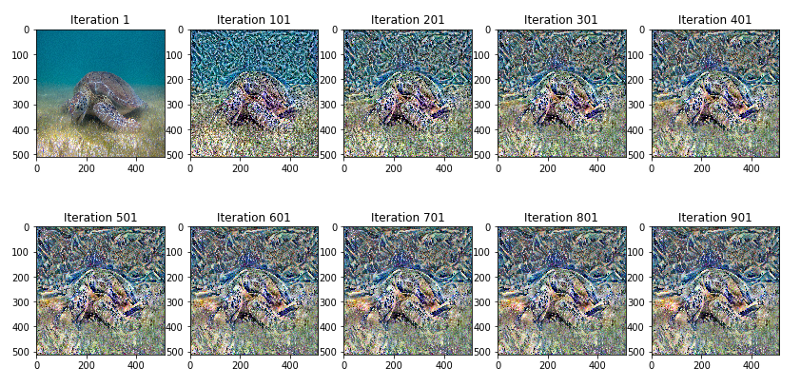
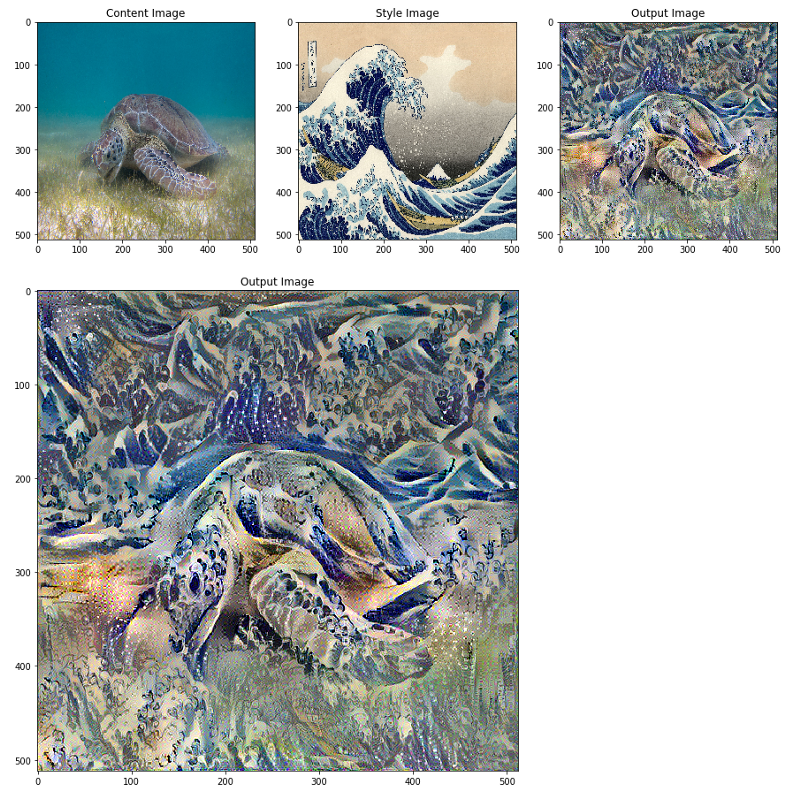
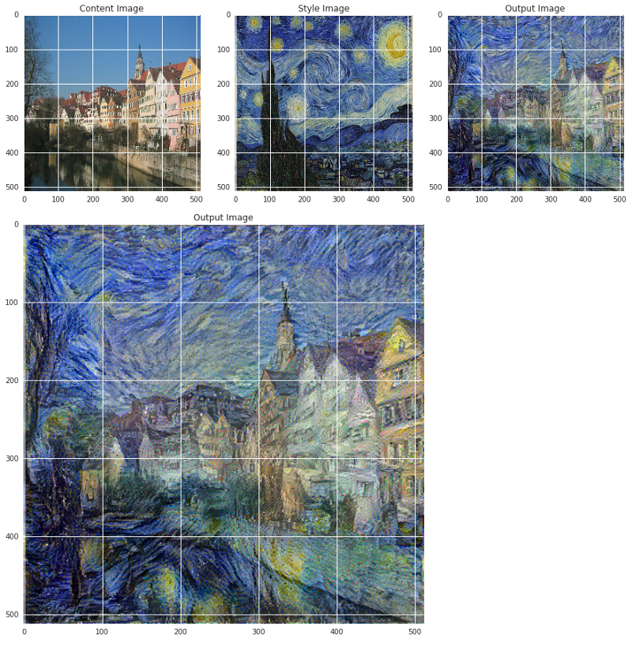
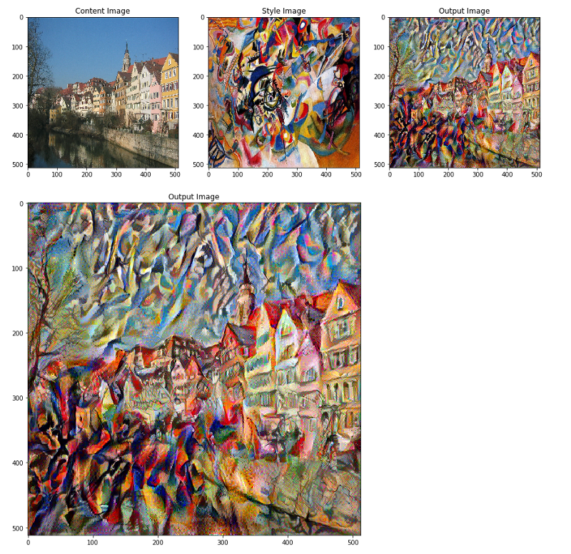
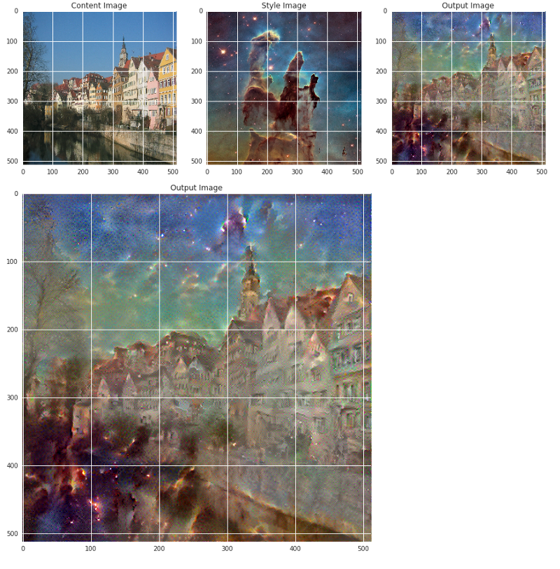

## Neural Style Transfer : tf.keras와 eager execution를 이용한 딥러닝 미술 작품 만들기(Neural Style Transfer: Creating Art with Deep Learning using tf.keras and eager execution)
[원문 링크](https://medium.com/tensorflow/neural-style-transfer-creating-art-with-deep-learning-using-tf-keras-and-eager-execution-7d541ac31398)
> 이 글은 Tensorflow의 Raymond Yuan가 작성한 글로 tf.keras와 eager execution을 이용해 입력 이미지를 특정 미술 작품의 스타일로 변화시키는 딥러닝 튜토리얼입니다.

* keras
* eager execution
* style transfer
* convolution neural network

### 주요 개념 설명
[이 글](https://colab.sandbox.google.com/github/tensorflow/models/blob/master/research/nst_blogpost/4_Neural_Style_Transfer_with_Eager_Execution.ipynb)을 통해 어떻게 딥러닝으로 다른 이미지의 스타일로 이미지를 재구성하는지 알아봅시다 (그대가 피카소 혹은 고흐처럼 그림을 그리길 원한다면). 이는 **Neural style transfer**로 알려져 있습니다. [예술 스타일의 신경 알고리즘](https://arxiv.org/abs/1508.06576) 이라는 Leon A. Gatys의 논문에 서술되 있습니다. 이 알고리즘은 훌륭한 읽을 거리이기에 반드시 확인을 해야합니다.

Neural style transfer는 컨텐츠 이미지, 스타일 참조용 이미지(마치 유명화가의 예술 작품같은) 그리고 스타일을 적용할 입력 이미지, 총 3가지 이미지를 가져와 "입력 이미지가 컨텐츠 이미지와 비슷하게 변환되도록" 각각을 혼합하는 데 사용되는 최적화 기술입니다.

예를 들어, 밑에 Katsushika Hokusai의 *The Great Wave off kanagawa*
라는 작품과 거북이 이미지가 있습니다.:


녹색 바다 거북이 (P. Lindgren, [Wikimedia Commons](https://commons.wikimedia.org/wiki/File:Green_Sea_Turtle_grazing_seagrass.jpg)) 

Hokusai 이미지에서 파도의 질감과 스타일을 거북이 이미지에 추가한다면 어떻게 보일까요? 마치 이것처럼 보일까요?



이건 마술, 아니면 그저 딥러닝일까요? 다행히도, 어떠한 마술도 들어가 있지 않습니다 : style transfer는 신경망 내부의 표현과 기능을 보여주는 재밌고 흥미로운 기술입니다.

neural style transfer의 원리는 2가지 다른 함수를 정의하는 것으로 하나는 **어떻게 두 이미지의 컨텐츠가 차이나는지 설명**하고(Lcontent), 다른 하나는 **두 이미지의 스타일의 차이를 설명**합니다(Lstyle). 그런 다음, 3가지 이미지(원하는 스타일 이미지, 원하는 콘텐츠 이미지, 입력 이미지(콘텐츠 이미지로 초기화된)를 줌으로써 입력 이미지를 변환해 콘텐츠 이미지와 스타일의 차이를 최소화 합니다.

요약하자면, 기본 입력 이미지, 일치시키고 싶은 컨텐츠 이미지와 스타일 이미지를 선택합니다. 컨텐츠와 스타일간 차이를 역전파(backpropagation)로 최소화함으로써 기본 입력 이미지를 변환 합니다. 다시말해, 컨텐츠 이미지의 컨텐츠와 스타일 이미지의 스타일과 일치하는 이미지를 생성합니다.
  

#### 습득하게 될 특정 개념들 : 
튜로리얼 중에서, 실전 경험을 쌓고 하단의 개념들에 대한 직관력이 생길 것입니다.

- **Eager Execution** : 작업을 즉시 평가하는 텐서플로우의 필수 프로그래밍 환경을 사용
- [Eager execution](https://www.tensorflow.org/guide/eager)에 대해 자세히 알아보기.
- [실제로 해보기](https://www.tensorflow.org/tutorials) ([Colaboratory](http://colab.research.google.com/)에서 대부분의 튜토리얼을 진행할 수 있습니다)
- **model 정의를 위한 [실용 API](https://keras.io/getting-started/functional-api-guide/)를 사용** : 실용 API를 사용해 필요한 중간 활성화에 접근할 수 있도록 model 일부를 구성합니다. 
- **선행학습한 model의 특징 맵 활용** : 선행학습한 model과 해당 특징 맵을 사용하는 방법을 배웁니다.
- **맞춤형 학습 루프를 생성** : 입력 매개변수에 대해 주어진 손실을 최소화하기 위해 최적화 도구를 어떻게 설정할지 알아봅니다.


#### Style fransfer를 수행하는 일반적인 과정 : 

1. 데이터 시각화
2. 데이터에 대한 기본 선행 처리/준비
3. 손실 함수 설정
4. model 생성
5. 손실 함수 최적화

독자들에게 : 이 게시물은 기본적인 머신러닝 개념에 익숙한 중급 사용자들을 대상으로 합니다. 이 게시물을 최대한 활용하려면 다음을 하셔야 합니다.:
- [Gatys 논문](https://arxiv.org/abs/1508.06576) 읽기 : 아래에서 설명하겠지만, 이 논문은 한층 더 이해할 수 있게 해줍니다.
- [기울기 상승 이해하기](https://developers.google.com/machine-learning/crash-course/reducing-loss/gradient-descent)

**예상 시간** : 60분

**Code:**  
이 게시물의 전체 코드는 [이곳](https://github.com/tensorflow/models/tree/master/research/nst_blogpost)에서 찾아볼 수 있습니다. 만약, 예제에 따라 단계졀로 진행하고 싶다면, [colab](https://colab.sandbox.google.com/github/tensorflow/models/blob/master/research/nst_blogpost/4_Neural_Style_Transfer_with_Eager_Execution.ipynb)에서 찾아볼 수 있습니다.


### 구현

먼저, [Eager excution](https://www.tensorflow.org/guide/eager)을 가능하도록 하는 것부터 시작합니다. Eager excution은 우리가 가장 명확하고 읽기 쉬운 방법으로 이 기술을 연구할 수 있도록 해줍니다.

```python
  tf.enable_eager_execution()
  print("Eager execution: {}".format(tf.executing_eagerly()))
 
  Here are the content and style images we will use: 
  plt.figure(figsize=(10,10))

  content = load_img(content_path).astype('uint8')
  style = load_img(style_path)

  plt.subplot(1, 2, 1)
  imshow(content, 'Content Image')

  plt.subplot(1, 2, 2)
  imshow(style, 'Style Image')
  plt.show()
```
> [show_images.py](https://gist.github.com/raymond-yuan/dee15872cb18e628ad7bd984a7411d2c#file-show_images-py) 를 통해 볼 수 있습니다.



  Image of Green Sea Turtle -By P .Lindgren from [Wikimedia Commons](https://commons.wikimedia.org/wiki/File:Green_Sea_Turtle_grazing_seagrass.jpg) and Image of The Great Wave Off Kanagawa from by Katsushika Hokusai [Public Domain](https://commons.wikimedia.org/wiki/File:The_Great_Wave_off_Kanagawa.jpg)


#### 컨텐츠와 스타일 표현 정의

이미지의 컨텐츠와 스타일 표현을 얻기 위해, model 내에 몇 가지 중간 레이어(layer)를 볼 수 있습니다. 중간 레이어들은 피쳐맵(feature map)을 나타나는데 이는 깊어질 수록 높이가 커지게 됩니다. 이번 경우, 미리 학습된 이미지 분류 신경망인 VGG19 신경망을 사용합니다. 이 신경망의 중간 레이어들은 이미지의 스타일과 컨텐츠 표현을 정의하는데 필요합니다. 입력 이미지의 경우, 중간 레이어들에서 해당 스타일 및 컨텐츠가 목적 표현에도 맞춰지도록 시도합니다.

**왜 중간 레이어인가?**

학습된 이미지 분류 신경망의 중간 레이어 출력값들이 스타일과 컨텐츠 표현을 정의하도록 하는지 궁금할 겁니다. 높은 단계에서, 이 현상은 신경망이 (신경망이 학습해온)이미지 분류를 하기 위해서는 반드시 이미지를 이해해야 하는 사실로 설명될 수 있습니다. 이는 원본 이미지를 입력 픽셀(pixel)로 사용하고 원본 이미지 픽셀을 이미지 내 피쳐들의 복잡한 이해형태로 변형하는 방식으로 내부 표현을 설계합니다. 이는 CNN(convolution neural network)가 얼마자 잘 일반화될 수 있는 이유이기도 합니다. CNN은 배경이나 다른 노이즈들에 영향을 받지 않는 클래스 내에 존재하는 불변성(invariances)을 포착하고 피쳐들을 정의할 수 있습니다. 그러므로, 원본 이미지가 입력되고 분류 레이블(label)이 출력되는 구간 어딘가에서 model은 복잡한 피쳐 추출기로서 작동합니다. 따라서 중간 레이어에 접근함으로써 입력 이미지의 컨텐츠와 스타일을 설명할 수 있습니다.

특히 신경망에서 다음과 같은 중간 레이어를 추출합니다.

```python
  # 피쳐맵을 추출하려는 컨텐츠 레이어
  content_layers = ['block5_conv2'] 

  # 관심있는 스타일 레이어들
  style_layers = ['block1_conv1',
                  'block2_conv1',
                  'block3_conv1', 
                  'block4_conv1', 
                  'block5_conv1'
                  ]

  num_content_layers = len(content_layers)
  num_style_layers = len(style_layers)
```
> [content_style_layers.py](https://gist.github.com/raymond-yuan/e5a9012acdee3295408c5019d2a2ef3c#file-content_style_layers-py)에서 확인할 수 있습니다.

#### model

이번 글에선, [VGG19](https://keras.io/applications/#vgg19)를 로드하고 model에 입력 텐서를 제공합니다. 이렇게 하면 컨텐츠, 스타일 그리고 생성된 이미지의 피쳐맵(나중에 콘텐츠와 스타일을 표현함)을 추출할 수 있습니다.

논문에서 제안했듯이 VGG19를 사용합니다. 게다가, Vgg19는 (ResNet, Inception과 비교해) 상대적으로 간단한 모델이기에 피쳐맵이 style transfer하기에 더 효과적입니다.

스타일과 컨텐츠 피쳐맵에 해당하는 중간 레이어 접근을 위해, 케라스 [실용 API](https://keras.io/getting-started/functional-api-guide/)를 사용해 원하는 출력 activation으로 model을 정의함으로써 해당 출력값을 얻습니다.

실용 API에서, 모델을 정의하는 건 입력과 출력을 정의하는 것도 포함하고 있습니다. : `model = Model(inputs, outputs)`

```python
def get_model():
  """ 중간 레이어에 접근할 수 있는 모델을 생성
  
    이 함수는 VGG19를 로드하고 중간 레이어에 접근할 수 있습니다.
    이런 레이어들을 사용해 입력 이미지를 가져오고 VGG 모델의 중간 레이어에서 출력값을 반환하는 새로운 model을 만듭니다.
  
  반환 :
    이미지 입력값과 스타일과 컨텐츠 중간 레이어의 결과값을 이용하는 케라스 model을 반환합니다. 

  """
  # `imagenet`으로 미리 학습된 VGG모델을 로드합니다.
  vgg = tf.keras.applications.vgg19.VGG19(include_top=False, weights='imagenet')
  vgg.trainable = False

  # 스타일과 컨텐츠 레이어와 관련된 출력 레이어를 설정합니다.
  style_outputs = [vgg.get_layer(name).output for name in style_layers]
  content_outputs = [vgg.get_layer(name).output for name in content_layers]
  model_outputs = style_outputs + content_outputs
  # model을 생성하고 반환합니다.
  return models.Model(vgg.input, model_outputs)
```
> [get_model.py](https://gist.github.com/raymond-yuan/231fe86a0d49ed40c4fa0aed4b430bc9#file-get_model-py)을 통해 확인할 수 있습니다.

위 코드를 통해, 미리 학습된 이미지 분류 신경망을 로드할 수 있습니다. 그리고 앞서 정의한 관심 레이어를 잡아둡니다. 그런 다음 model의 입력을 이미지, 출력을 스타일과 컨텐츠 레이어의 출력으로 설정하여 model을 정의합니다. 다시 말해, 입력 이미지를 가져와서 콘텐츠와 스타일 중간 레이어를 출력할 model을 만들었습니다!

#### 손실 함수(컨텐츠와 스타일 격차)를 정의 및 생성

**콘텐츠 손실관련 :**

콘텐츠 손실 함수는 실제론 꽤나 간단합니다. 적용하고픈 콘텐츠 이미지와 기본 입력 이미지를 신경망으로 통과시킬 수 있습니다. 이는 설계한 model에서 (위에서 설정한 레이어들) 중간 레이어의 출력을 반환됩니다. 그런 다음 그저 이미지들 간의 중간 표현들 사이에 유클리드 거리(Euclidean distance)를 취합니다.

좀 더 수식화하면, 콘텐츠 손실 함수는 입력 이미지 x와 컨텐츠 이미지 p, 두 이미지 사이의 거리를 설명합니다. Cₙₙ을 미리 학습된 깊은 CNN라고 합시다. 즉, [VGG19](https://keras.io/applications/#vgg19)를 사용합니다. X는 어떤 이미지이고 Cₙₙ(X)를 X를 전달받는 신경망이라고 합시다. Fˡᵢⱼ(x)∈ Cₙₙ(x)와 Pˡᵢⱼ(x) ∈ Cₙₙ(x) 는 l 레이어에서 x, p 입력을 갖는 신경망의 각각의 중간 피쳐 표현들이라고 합시다. 그런 다음 컨텐츠 거리(손실)을 수식화하면 아래와 같습니다.



이러한 콘텐츠 손실을 최소화하기 위해 일반 방식으로 역전파(backpropagation)을 수행합니다. 따라서 특정 레이어(content_layer에 정의된)에서 원본 컨텐츠 이미지로 유사한 반응을 생성할 때까지 초기 이미지를 변화시킵니다.

이건 꽤나 단순하게 구현될 수 있습니다. 다시 말해, 입력 이미지인 x와 컨텐츠 이미지인 p를 전달받는 신경망의 L 레이어에서 피쳐 맵을 입력으로 받도록하고 콘텐츠 거리(손실)을 반환합니다.

```python
  def get_content_loss(base_content, target):
    return tf.reduce_mean(tf.square(base_content - target))
```
> [content_loss.py](https://gist.github.com/raymond-yuan/bfa389a77341b4f643c8e0ac8a21b6e1#file-content_loss-py)를 통해 확인할 수 있습니다.

**스타일 손실관련 :**

#### 기울기 하강(Gradient Descent) 실행

#### 손실과 기울기 계산하기

#### Style fransfer 절차를 실행, 적용










### 주요 요점들

#### (이 글에서) 얻을 수 있는 것은:


### 참고문서
* [A Neural Algorithm of Artistic Style](https://arxiv.org/abs/1508.06576)
