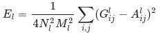
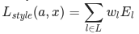
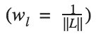

## Neural Style Transfer : tf.keras와 eager execution를 이용한 딥러닝 미술 작품 만들기(Neural Style Transfer: Creating Art with Deep Learning using tf.keras and eager execution)
[원문 링크](https://medium.com/tensorflow/neural-style-transfer-creating-art-with-deep-learning-using-tf-keras-and-eager-execution-7d541ac31398)
> 이 글은 TensorFlow의 Raymond Yuan이 작성한 글로 tf.keras와 eager execution을 이용해 입력된 이미지를 특정 미술 작품의 스타일로 변화시키는 딥러닝 튜토리얼입니다.

* keras
* eager execution
* neural style
* style transfer
* convolution neural network

### 주요 개념 설명
[이 글](https://colab.sandbox.google.com/github/tensorflow/models/blob/master/research/nst_blogpost/4_Neural_Style_Transfer_with_Eager_Execution.ipynb)을 통해 딥러닝을 이용해 어떻게 다른 이미지의 스타일로 이미지를 재구성하는지 알아봅시다(피카소 혹은 고흐처럼 그림을 그리길 원한다면 꼭 필요한 글입니다). 이 방법은 **Neural Style Transfer**로 알려져 있으며, [예술 스타일의 신경 알고리즘](https://arxiv.org/abs/1508.06576)이라는 Leon A. Gatys의 논문에 서술되어 있습니다. 이 알고리즘은 훌륭한 읽을거리기에 꼭 확인해보십시오.

Neural Style Transfer는 콘텐츠 이미지, 스타일 참조용 이미지(예 : 유명화가의 예술 작품) 그리고 스타일을 적용할 입력 이미지, 총 3가지 이미지를 가져와 입력 이미지가 콘텐츠 이미지로 보일 뿐만 아니라, 스타일 이미지의 스타일이 "그려지도록" 각각을 혼합하는 데 사용되는 최적화 기술입니다.

예를 들어, 밑에 Katsushika Hokusai의 *The Great Wave off kanagawa*
라는 작품과 거북이 이미지가 있습니다.:

  
녹색 바다거북이 (P. Lindgren, [Wikimedia Commons](https://commons.wikimedia.org/wiki/File:Green_Sea_Turtle_grazing_seagrass.jpg))

Hokusai 이미지에서 파도의 질감과 스타일을 거북이 이미지에 추가한다면 어떻게 보일까요? 아래처럼 보일까요?


마술일까요, 아니면 단지 딥러닝일까요? 다행히도, 어떠한 마술도 들어가 있지 않습니다: style transfer는 신경망 내부의 표현과 기능을 보여주는 재밌고 흥미로운 기술입니다.

Neural Style Transfer의 원리는 2가지 다른 함수를 정의하는 것으로 하나는 **어떻게 두 이미지의 콘텐츠가 차이나는지 설명**하고(Lcontent), 다른 하나는 **두 이미지의 스타일의 차이를 설명**합니다(Lstyle). 그런 다음, 3가지 이미지(원하는 스타일 이미지, 원하는 콘텐츠 이미지, 입력 이미지(콘텐츠 이미지로 초기화된)를 줌으로써 입력 이미지를 변환해 콘텐츠 이미지와 스타일의 차이를 최소화합니다.

요약하면, 기본 입력 이미지, 일치시키고 싶은 콘텐츠 이미지와 스타일 이미지를 선택합니다. 콘텐츠와 스타일 간 차이를 역전파(backpropagation)로 최소화함으로써 기본 입력 이미지를 변환합니다. 다시 말해, 콘텐츠 이미지의 콘텐츠와 스타일 이미지의 스타일과 일치하는 이미지를 생성합니다.


#### 습득하게 될 특정 개념들 :
튜토리얼을 따라하다 보면 실전 경험이 쌓이고, 아래 개념에 대한 직관력이 생길 것입니다.

- **Eager Execution** : 작업을 즉시 평가하는 TensorFlow의 필수 프로그래밍 환경
	- [Eager execution](https://www.tensorflow.org/guide/eager)에 대해 자세히 알아보기.
	- [실제로 해보기](https://www.tensorflow.org/tutorials) ([Colaboratory](http://colab.research.google.com/)에서 대부분의 튜토리얼을 진행할 수 있습니다)
- **model 정의를 위한 [실용 API](https://keras.io/getting-started/functional-api-guide/)** : 실용 API를 사용한 필수 중간 활성화에 접근할 수 있는 model 구성
- **선행 학습한 model의 특징 맵 활용** : 선행 학습한 model과 해당 특징 맵(map)을 사용하는 방법
- **맞춤형 학습 루프를생성** : 입력 매개변수에 대해 주어진 손실을 최소화하기 위한 최적화 도구 설정


#### Style Transfer를 수행하는 일반적인 과정 :

1. 데이터 시각화
2. 데이터에 대한 기본 선행 처리/준비
3. 손실 함수 설정
4. model 생성
5. 손실 함수 최적화
독자들에게 : 이 글은 기본적인 머신러닝 개념에 익숙한 중급 사용자들을 대상으로 합니다. 이 글을 최대한 활용하기위해 아래 글을 읽는 것을 추천합니다:
- [Gatys 논문](https://arxiv.org/abs/1508.06576) : 아래에서 설명하겠지만, 이 논문을 한층 더 이해할 수 있게 해줍니다.
- [기울기 상승 이해하기](https://developers.google.com/machine-learning/crash-course/reducing-loss/gradient-descent)

**예상 시간** : 60분

**Code:** 
이 글의 전체 코드는 [이곳](https://github.com/tensorflow/models/tree/master/research/nst_blogpost)에서 찾아볼 수 있습니다. 만약, 예제에 따라 단계별로 진행하고 싶다면, [colab](https://colab.sandbox.google.com/github/tensorflow/models/blob/master/research/nst_blogpost/4_Neural_Style_Transfer_with_Eager_Execution.ipynb)에서 찾아볼 수 있습니다.


### 구현

먼저, [Eager excution](https://www.tensorflow.org/guide/eager)이 가능하도록 설계하는 것부터 시작합니다. Eager excution은 우리가 가장 명확하고 읽기 쉬운 방법으로 Neural Style Transfer를 공부할 수 있게 해줍니다.

```python
  tf.enable_eager_execution()
  print("Eager execution: {}".format(tf.executing_eagerly()))

  Here are the content and style images we will use:
  plt.figure(figsize=(10,10))

  content = load_img(content_path).astype('uint8')
  style = load_img(style_path)

  plt.subplot(1, 2, 1)
  imshow(content, 'Content Image')

  plt.subplot(1, 2, 2)
  imshow(style, 'Style Image')
  plt.show()
```
> [show_images.py](https://gist.github.com/raymond-yuan/dee15872cb18e628ad7bd984a7411d2c#file-show_images-py)를 통해 볼 수 있습니다.


  
 Green Sea Turtle -By P .Lindgren from [Wikimedia Commons](https://commons.wikimedia.org/wiki/File:Green_Sea_Turtle_grazing_seagrass.jpg)(좌)  
 Image of The Great Wave Off Kanagawa from by Katsushika Hokusai [Public Domain](https://commons.wikimedia.org/wiki/File:The_Great_Wave_off_Kanagawa.jpg)(우)


#### 콘텐츠와 스타일 표현 정의

이미지의 콘텐츠와 스타일 표현을 얻기 위해, model 내 중간 레이어(layer)를 살펴보겠습니다. 중간 레이어들은 피쳐맵(feature map)을 나타나는데 이는 깊어질수록 높이가 커지게 됩니다. 이번 경우, 미리 학습된 이미지 분류 신경망인 VGG19 신경망을 사용합니다. 이 신경망의 중간 레이어들은 이미지의 스타일과 콘텐츠 표현을 정의하는 데 필요합니다. 중간 레이어들에서 입력 이미지의 해당 스타일 및 콘텐츠가 목적 표현에도 맞춰지도록 시도합니다.

**왜 중간 레이어인가?**

학습된 이미지 분류 신경망의 중간 레이어 출력값들이 스타일과 콘텐츠 표현을 어떻게 정의하는지 궁금할 겁니다. 높은 단계에서, 이 현상은 신경망이 (신경망이 학습해 온)이미지 분류를 하기 위해서는 반드시 이미지를 이해해야 하는 사실로 설명될 수 있습니다. 이는 원본 이미지를 입력 픽셀(pixel)로 사용하고 원본 이미지 픽셀을 이미지 내 피쳐들의 복잡한 이해형태로 변형하는 방식으로 내부 표현을 설계합니다. 이는 CNN(Convolution Neural Network)이 얼마나 잘 일반화될 수 있는지에 대한 이유이기도 합니다. CNN은 배경이나 다른 노이즈들에 영향을 받지 않는 클래스 내에 존재하는 불변성(invariances)을 포착하고 피쳐들을 정의할 수 있습니다. 그러므로 원본 이미지가 입력되고 분류 레이블(label)이 출력되는 구간 어딘가에서 model은 복잡한 피쳐 추출기로서 작동합니다. 따라서 중간 레이어에 접근함으로써 입력 이미지의 콘텐츠와 스타일을 설명할 수 있습니다.

특히 신경망에서 다음과 같은 중간 레이어를 추출합니다.

```python
  # 피쳐맵을 추출하려는 컨텐츠 레이어
  content_layers = ['block5_conv2']

  # 관심있는 스타일 레이어들
  style_layers = ['block1_conv1',
                  'block2_conv1',
                  'block3_conv1',
                  'block4_conv1',
                  'block5_conv1'
                  ]

  num_content_layers = len(content_layers)
  num_style_layers = len(style_layers)
```
> [content_style_layers.py](https://gist.github.com/raymond-yuan/e5a9012acdee3295408c5019d2a2ef3c#file-content_style_layers-py)에서 확인할 수 있습니다.

#### model

이번 글에선, [VGG19](https://keras.io/applications/#vgg19)를 불러와 model에 입력 텐서(tensor)를 제공합니다. 이렇게 하면 콘텐츠, 스타일 그리고 생성된 이미지의 피쳐맵(나중에 콘텐츠와 스타일을 표현함)을 추출할 수 있습니다.

논문에서 제안했듯이 VGG19를 사용합니다. 게다가, VGG19는 (ResNet, Inception과 비교해) 상대적으로 간단한 모델이기에 피쳐맵이 style transfer하기에 더 효과적입니다.

스타일과 콘텐츠 피쳐맵에 해당하는 중간 레이어 접근을 위해, 케라스 [실용 API](https://keras.io/getting-started/functional-api-guide/)를 사용해 원하는 출력 activation으로 model을 정의함으로써 해당 출력값을 얻습니다.

실용 API에서, 모델을 정의하는 건 입력과 출력을 정의하는 것도 포함하고 있습니다. : `model = Model(inputs, outputs)`

```python
def get_model():
  """ 중간 레이어에 접근할 수 있는 모델을 생성

    이 함수는 VGG19를 로드하고 중간 레이어에 접근할 수 있습니다.
    이런 레이어들을 사용해 입력 이미지를 가져오고 VGG 모델의 중간 레이어에서 출력값을 반환하는 새로운 model을 만듭니다.

  반환 :
    이미지 입력값과 스타일과 콘텐츠 중간 레이어의 결과값을 이용하는 케라스 model을 반환합니다.

  """
  # `imagenet`으로 미리 학습된 VGG모델을 로드합니다.
  vgg = tf.keras.applications.vgg19.VGG19(include_top=False, weights='imagenet')
  vgg.trainable = False

  # 스타일과 콘텐츠 레이어와 관련된 출력 레이어를 설정합니다.
  style_outputs = [vgg.get_layer(name).output for name in style_layers]
  content_outputs = [vgg.get_layer(name).output for name in content_layers]
  model_outputs = style_outputs + content_outputs
  # model을 생성하고 반환합니다.
  return models.Model(vgg.input, model_outputs)
```
> [get_model.py](https://gist.github.com/raymond-yuan/231fe86a0d49ed40c4fa0aed4b430bc9#file-get_model-py)을 통해 확인할 수 있습니다.

위 코드를 통해, 미리 학습된 이미지 분류 신경망을 로드할 수 있습니다. 그리고 앞서 정의한 관심 레이어를 잡아둡니다. 그런 다음 model의 입력을 이미지, 출력을 스타일과 콘텐츠 레이어의 출력으로 설정하여 model을 정의합니다. 다시 말해, 입력 이미지를 가져와서 콘텐츠와 스타일 중간 레이어를 출력할 model을 만들었습니다!

#### 손실 함수(콘텐츠와 스타일 격차)를 정의 및 생성

**콘텐츠 손실**

콘텐츠 손실 함수는 실제론 꽤나 간단합니다. 적용하고픈 콘텐츠 이미지와 기본 입력 이미지를 신경망으로 통과시킬 수 있습니다. 이는 설계한 model에서 (위에서 설정한 레이어들) 중간 레이어의 출력을 반환됩니다. 그런 다음 그저 이미지들 간의 중간 표현들 사이에 유클리드 거리(Euclidean distance)를 취합니다.

좀 더 수식화하면, 콘텐츠 손실 함수는 입력 이미지 x와 콘텐츠 이미지 p, 두 이미지 사이의 거리를 설명합니다. Cₙₙ을 미리 학습된 깊은 CNN라고 합시다. 즉, [VGG19](https://keras.io/applications/#vgg19)를 사용합니다. X는 어떤 이미지이고 Cₙₙ(X)를 X를 전달받는 신경망이라고 합시다. Fˡᵢⱼ(x)∈ Cₙₙ(x)와 Pˡᵢⱼ(x) ∈ Cₙₙ(x) 는 l 레이어에서 x, p 입력을 갖는 신경망의 각각의 중간 피쳐 표현들이라고 합시다. 그런 다음 콘텐츠 거리(손실)을 수식화하면 아래와 같습니다.


이러한 콘텐츠 손실을 최소화하기 위해 일반 방식으로 역전파(backpropagation)를 수행합니다. 따라서 특정 레이어(content_layer에 정의된)에서 원본 콘텐츠 이미지로 유사한 반응을 생성할 때까지 초기 이미지를 변화시킵니다.

이건 꽤나 간단하게 구현될 수 있습니다. 다시 말해, 입력 이미지인 x와 콘텐츠 이미지인 p를 전달받는 신경망의 L 레이어에서 피쳐 맵을 입력으로 받도록하고 콘텐츠 거리(손실)을 반환합니다.

```python
  def get_content_loss(base_content, target):
    return tf.reduce_mean(tf.square(base_content - target))
```
> [content_loss.py](https://gist.github.com/raymond-yuan/bfa389a77341b4f643c8e0ac8a21b6e1#file-content_loss-py)를 통해 확인할 수 있습니다.

**스타일 손실**

스타일 손실을 계산하는 건 약간 더 어렵지만, 동일한 원칙을 따릅니다. 이번에는 신경망에 기본 입력 이미지와 스타일 이미지를 입력으로 사용합니다. 그러나 기본 입력 이미지와 스타일 이미지의 중간 출력을 비교하는 대신, 두 출력의 Gram 매트릭스를 비교합니다.

수학적으로, 기본 입력 이미지 `x` 와 스타일 이미지 `a` 의 스타일 손실을 스타일 표현(Gram 매트릭스) 사이의 거리로 설명합니다. 또한 우리는 이미지의 스타일 표현을, 다른 필터를 거친 이미지의 결과값의 상관관계(correlation) 이라고 설명합니다.
Gram 매트릭스를 Gˡ 로 표현하고, Gˡᵢⱼ 는 l 번째 레이어에서 피쳐맵 i, j 의 내적입니다.

기본 입력 이미지를 위한 스타일을 생성하려면, 콘텐츠 이미지에서 기울기 하강(Gradient Descent)을 수행하여 원래 이미지의 스타일 표현과 일치하는 이미지로 변환합니다. 스타일 이미지의 피쳐 상관관계(correlation) 맵과 입력 이미지 사이의 평균 제곱 거리(MSE)를 최소화함으로써 이 작업을 수행합니다. 총 스타일 손실에 대한 각 계층의 기여는 아래와 같습니다.



여기서 Gˡᵢⱼ와 Aˡᵢⱼ는 각각 l 계층의 입력 이미지 x의 스타일 이미지 a의 스타일을 나타냅니다. Nl은 피쳐맵의 수를 설명하며, 각 크기는 Ml=height∗width 입니다. 그러므로, 모든 계층에서의 총 스타일 손실은 아래와 같습니다.



여기서 우리는 wl로 부터 각 층의 손실에 대한 기여도를 어느 정도 가늠할 수 있습니다. 우리의 경우, 각 레이어의 weight를 동일하게 설정할 것입니다.



스타일 손실을 구하는 코드는 아래와 같습니다.

```python
def gram_matrix(input_tensor):
  # 이미지용 채널(channel)을 만듭니다.
  channels = int(input_tensor.shape[-1])
  a = tf.reshape(input_tensor, [-1, channels])
  n = tf.shape(a)[0]
  gram = tf.matmul(a, a, transpose_a=True)
  return gram / tf.cast(n, tf.float32)

def get_style_loss(base_style, gram_target):
  """두 이미지의 차원(h, w, c)을 얻습니다."""
  # 각 레이어의 높이, 너비, 채널의 형태
  height, width, channels = base_style.get_shape().as_list()
  gram_style = gram_matrix(base_style)

  return tf.reduce_mean(tf.square(gram_style - gram_target))
```
> [style_loss.py](https://gist.github.com/raymond-yuan/17d41af4383937501ec814ad34d1543f#file-style_loss-py)를 통해 볼 수 있습니다.

#### 기울기 하강(Gradient Descent) 실행

기울기 하강/역전파(backpropagation)가 익숙하지 않거나 재교육이 필요한 경우 이 [리소스](https://developers.google.com/machine-learning/crash-course/reducing-loss/gradient-descent)를 확실히 확인해주세요.

우리는 손실을 최소화하기 위해서 Adam Optimizer를 사용할 것입니다. 그리고 손실을 최소화하도록 반복적으로 출력 이미지를 업데이트할 것입니다. 신경망과 관련된 가중치를 업데이트하지 않고, 대신 손실을 최소화하기 위해 입력 이미지를 훈련시킵니다. 이를 위해서는 손실과 기울기를 어떻게 계산해야 하는지 알아야 합니다. L-BFGS 최적화 도구를 사용하는 것이 좋습니다. 이 알고리즘에 익숙하다면 사용하는 것을 추천하지만 이 튜토리얼에서 사용하지 않을 것 입니다. 이 튜토리얼의 주된 동기는 eager execution 으로 모범 사례를 설명하는 것이기 때문입니다. Adam을 사용하면 맞춤식 교육 루프를 통해 Autograd/gradient tape 기능을 시연할 수 있기 때문에 Adam Optimizer 를 사용할 것입니다.

#### 손실과 기울기 계산하기

콘텐츠 및 스타일 이미지를 로드하는 기능을 할 작은 함수를 정의하여 신경망에 이미지들을 입력으로 주고, 우리의 모델에서 콘텐츠 및 스타일 피쳐 표현을 출력할 것입니다.

```python
def get_feature_representations(model, content_path, style_path):
  """Helper 함수 : 콘텐츠 이미지와 스타일 이미지의 피쳐를 계산합니다.

  이 함수는 path에 존재하는 콘텐츠 이미지와 스타일 이미지를 로드하고 전처리 합니다. 그것을 신경망의 입력으로 주고, 중간 레이어의 출력(피쳐맵)을 얻습니다.

  Arguments:
    model: 우리가 사용할 모델
    content_path: 콘텐츠 이미지 경로
    style_path: 스타일 이미지 경로

  Returns:
    스타일 이미지와 콘텐츠 이미지의 피쳐맵을 리턴합니다.
  """
  # 이미지를 로드합니다
  content_image = load_and_process_img(content_path)
  style_image = load_and_process_img(style_path)

  # 콘텐츠 이미지와 스타일 이미지의 배치(batch)를 계산합니다.
  stack_images = np.concatenate([style_image, content_image], axis=0)
  model_outputs = model(stack_images)

  # 우리가 사용할 모델로부터 스타일 이미지와 콘텐츠 이미지의 피쳐맵을 얻습니다.
  style_features = [style_layer[0] for style_layer in model_outputs[:num_style_layers]]
  content_features = [content_layer[1] for content_layer in model_outputs[num_style_layers:]]
  return style_features, content_features
```
> [get_feature_representations.py](https://gist.github.com/raymond-yuan/b36fe04d4225f484df9d0b74ca3835bb#file-get_feature_representations-py) 를 통해 볼 수 있습니다.

여기서 우리는 [tf.GradientTape](https://www.tensorflow.org/programmers_guide/eager#computing_gradients) 를 사용하여 기울기를 계산합니다. 추후 기울기 계산을 위한 추적 작업을 통해 이용 가능한 자동 기울기 하강 계산을 할 수 있습니다. tf.GradientTape 는 `forward pass`를 하는 동안 연산을 기록하기 때문에 `backwards pass` 를 위해 입력 이미지와 관련하여 손실 함수의 기울기를 계산할 수 있습니다.

```python
def compute_loss(model, loss_weights, init_image, gram_style_features, content_features):
  """이 함수는 손실을 계산합니다.

  Arguments:
    model: 중간 레이어에 대한 접근을 하는 모델
    loss_weights: 각 손실 함수에 대한 가중치(weight) - (style weight, content weight, and total variation weight)
    init_image: 기본 이미지. 이 이미지는 최적화 프로세스를 통해 업데이트 됩니다. 우리는 우리가 계산하고 있는 손실에 대한 기울기들을 이 이미지에 적용합니다.
    gram_style_features: 스타일 이미지의 미리 계산된 그램 매트릭스
    content_features: 콘텐츠 이미지의 미리 계산된 그램 매트릭스

  Returns:
    total 손실, 스타일 손실, 콘텐츠 손실, total variational loss을 반환합니다.
  """
  style_weight, content_weight, total_variation_weight = loss_weights

  # 우리의 모델에 스타일 표현과 콘텐츠 이미지를 입력으로 줍니다.
  # 우리의 모델은 다른 함수처럼 호출할 수 있습니다!
  model_outputs = model(init_image)

  style_output_features = model_outputs[:num_style_layers]
  content_output_features = model_outputs[num_style_layers:]

  style_score = 0
  content_score = 0

  # 모든 계층에서 스타일 손실을 누적합니다.
  # 여기서, 우리는 위에서 설명한 것과 같이 모든 레이어에 대한 같은 가중치(weight)를 사용합니다.
  weight_per_style_layer = 1.0 / float(num_style_layers)
  for target_style, comb_style in zip(gram_style_features, style_output_features):
    style_score += weight_per_style_layer * get_style_loss(comb_style[0], target_style)

  # 모든 계층에서 콘텐츠 손실을 누적합니다.
  weight_per_content_layer = 1.0 / float(num_content_layers)
  for target_content, comb_content in zip(content_features, content_output_features):
    content_score += weight_per_content_layer* get_content_loss(comb_content[0], target_content)

  style_score *= style_weight
  content_score *= content_weight
  total_variation_score = total_variation_weight * total_variation_loss(init_image)

  # total 손실을 얻습니다.
  loss = style_score + content_score + total_variation_score
  return loss, style_score, content_score, total_variation_score
```
> [compute_losses.py](https://gist.github.com/raymond-yuan/fff9f105962d861b5a7613acd580a412#file-compute_losses-py)를 통해 볼 수 있습니다.

그 다음에 기울기를 계산하는 것은 아주 쉽습니다:

```python
def compute_grads(cfg):
  with tf.GradientTape() as tape:
    all_loss = compute_loss(**cfg)
  # 입력 이미지에 대한 기울기 계산
  total_loss = all_loss[0]
  return tape.gradient(total_loss, cfg['init_image']), all_loss
```
> [compute_grads.py](https://gist.github.com/raymond-yuan/f3c6c71d956449e67fd127444a408426#file-compute_grads-py)를 통해 볼 수 있습니다.

#### Style fransfer 절차를 실행, 적용

그리고 style transfer를 수행합니다:

```python
def run_style_transfer(content_path,
                       style_path,
                       num_iterations=1000,
                       content_weight=1e3,
                       style_weight = 1e-2):
  display_num = 100
  # 우리는 우리가 사용하는 모델을 학습시킬 필요가 없기 때문에
  # layer.trainable 을 False 로 지정합니다.
  model = get_model()
  for layer in model.layers:
    layer.trainable = False

  # 중간 레이어로부터 스타일 피쳐와 콘텐츠 피쳐에 대한 표현을 얻습니다.
  style_features, content_features = get_feature_representations(model, content_path, style_path)
  gram_style_features = [gram_matrix(style_feature) for style_feature in style_features]

  # 초기 이미지를 세팅합니다.
  init_image = load_and_process_img(content_path)
  init_image = tfe.Variable(init_image, dtype=tf.float32)
  # Optimizer 를 설정합니다.
  opt = tf.train.AdamOptimizer(learning_rate=10.0)

  # style transfer 과정에서 이미지를 보여주기 위한 변수
  iter_count = 1

  # 우리의 결과 중 가장 좋은 결과를 저장하기 위한 변수
  best_loss, best_img = float('inf'), None

  # config 를 설정합니다.
  loss_weights = (style_weight, content_weight)
  cfg = {
      'model': model,
      'loss_weights': loss_weights,
      'init_image': init_image,
      'gram_style_features': gram_style_features,
      'content_features': content_features
  }

  # 이미지 보여주기
  plt.figure(figsize=(15, 15))
  num_rows = (num_iterations / display_num) // 5
  start_time = time.time()
  global_start = time.time()

  norm_means = np.array([103.939, 116.779, 123.68])
  min_vals = -norm_means
  max_vals = 255 - norm_means   
  for i in range(num_iterations):
    grads, all_loss = compute_grads(cfg)
    loss, style_score, content_score = all_loss
    # grads, _ = tf.clip_by_global_norm(grads, 5.0)
    opt.apply_gradients([(grads, init_image)])
    clipped = tf.clip_by_value(init_image, min_vals, max_vals)
    init_image.assign(clipped)
    end_time = time.time()

    if loss < best_loss:
      # 결과가 좋은 손실 값과 이미지로 업데이트 합니다.
      best_loss = loss
      best_img = init_image.numpy()

      if i % display_num == 0:
        print('Iteration: {}'.format(i))        
        print('Total loss: {:.4e}, '
              'style loss: {:.4e}, '
              'content loss: {:.4e}, '
              'time: {:.4f}s'.format(loss, style_score, content_score, time.time() - start_time))
        start_time = time.time()

        # style transfer 과정의 이미지를 보여줍니다.
        if iter_count > num_rows * 5: continue
        plt.subplot(num_rows, 5, iter_count)
        # numpy 상수 배열을 사용하기 위해 .numpy() 함수를 사용합니다.
        plot_img = init_image.numpy()
        plot_img = deprocess_img(plot_img)
        plt.imshow(plot_img)
        plt.title('Iteration {}'.format(i + 1))

        iter_count += 1
    print('Total time: {:.4f}s'.format(time.time() - global_start))

    return best_img, best_loss
```
> [run_style_transfer.py](https://gist.github.com/raymond-yuan/beb64629c3e88f34f241f9373fcc9079#file-run_style_transfer-py)를 통해 볼 수 있습니다.


이게 전부입니다!

이제는 거북이 이미지와 Hokusai의 Greate Wave off Kanagawa 작품에 style transfer를 해봅시다:

```python
best, best_loss = run_style_transfer(content_path,
                                     style_path,
                                     verbose=True,
                                     show_intermediates=True)
```                 
> [run_generic.py](https://gist.github.com/raymond-yuan/f6dfab1740152849da4326a33382e4e0#file-run_generic-py)를 통해 볼 수 있습니다.                 


시간의 흐름에 따른 Style transfer 과정의 학습 결과 사진들을 확인해보세요:


여기에 다른 이미지들에 대한 Neural Style Transfer 에 대한 예제들이 존재합니다. 확인해보세요!


이제는 당신이 원하는 이미지로 Style transfer 를 실험해보세요!

### 주요 요점

* 우리는 여러 가지 다른 손실 함수를 구축하고, 이러한 손실을 최소화하고 입력 이미지를 변환하기 위해 역전파(backpropagation)를 사용했습니다.

* 이를 위해 **미리 학습된 모델(pretrained model)** 을 로드하고 이미지의 내용과 스타일을 설명하는 학습된 피쳐 맵을 사용했습니다.

* 우리의 주된 손실 기능은 주로 이러한 다른 표현의 관점에서 거리를 계산하는 것이었습니다.

* Style transfer 를 위해 맞춤형 모델과 **eager excution** 을 사용하였습니다.

* 맞춤형 모델을 실용 API로 만들었습니다.

* Eager execution 은 natural 파이썬을 통해 tensors를 동적으로 실행할 수 있게 해주었습니다.

* tensors를 직접 조작하여 tensors를 쉽게 디버깅하고 작업할 수 있었습니다.

* tf.radient를 사용하여 Optimizers 업데이트 규칙을 적용하여 반복적으로 우리의 이미지를 업데이트 했습니다. Optimizers 는 우리의 입력 이미지와 관련하여 주어진 손실을 최소화해주었습니다.

### 참고문서
* [A Neural Algorithm of Artistic Style](https://arxiv.org/abs/1508.06576)

> 이 글은 2018 컨트리뷰톤에서 Contribute to Keras 프로젝트로 진행했습니다.  
> Translator: 송문혁, 박정현  
> Translator email : firefinger07@gmail.com, parkjh688@gmail.com
