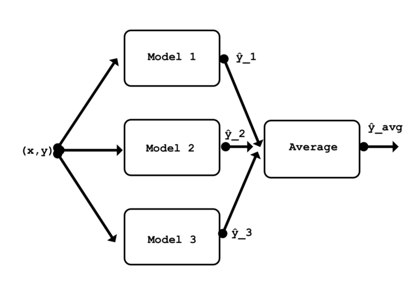
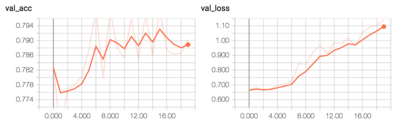

## Ensembling ConvNets using Keras

[원문 링크](https://towardsdatascience.com/ensembling-convnets-using-keras-237d429157eb)

> 이 문서는 케라스를 활용하여 ConvNets 을 앙상블 하는 방법에 대하여 설명합니다.
> 2018년 8월을 기준으로, 동작하지 않는 코드는 동작하지 않는 부분을 동작하도록 변형하였기 때문에 코드는 원문과 같지 않을 수 있습니다. 또한 그대로 번역한 것이 아닌 필요한 설명과 합쳐서 다시 쓴 글이기 때문에 원문과 다를 수 있습니다.
> 원문에서 나온 코드들을 이해를 돕기 위해 jupyter notebook 파일을 첨부합니다.

* 케라스
* LSTM
* Neural Networks layer


## Introduction
"통계 및 기계 학습에서 앙상블 기법은 단일 구성 학습 알고리즘만으로 얻을 수있는 것보다 더 나은 예측 성능을 얻기 위해 여러 학습 알고리즘을 사용합니다. 일반적으로 무한한 통계 역학의 앙상블과 달리 기계 학습 앙상블은 여러 모델의 구체적인 유한 집합이지만, 대체로 그러한 모델들 사이에 훨씬 더 유연한 구조가 존재할 수 있습니다." \[[1](https://en.wikipedia.org/wiki/Ensemble_learning)\]

앙상블을 사용하는 이유는 주로 그것이 만들어지는 모형의 가설 공간내에 포함되지 않는 다른 가설을 찾는 것입니다. 경험적으로, 앙상블은 모델 사이의 다양성이 클 때, 더 좋은 결과를 도출하는 경향이 있습니다.\[[2](https://jair.org/index.php/jair/article/view/10239)\]

## Motivation

여러 큰 규모의 머신러닝 경쟁대회의 결과를 보면, 상위권의 결과는 단일 모델보다는 앙상블 모델로 만들어졌을 가능성이 높습니다. 예를 들어, [ILSVRC2015](http://www.image-net.org/challenges/LSVRC/2015/results)의 단일 모델 아키텍처의 최고 등수는 13위였습니다. 1-12위는 앙상블을 사용하여 구성되었습니다.

 여러 신경 네트워크를 앙상블로 사용하는 방법에 대한 튜토리얼이나 문서를 보지 못했기 때문에 제가 사용하는 방식을 공유하기로 하였습니다. 

 저는 [케라스](https://keras.io/)의 [API](https://keras.io/models/model/)를 사용하여, 비교적 잘 알려진 논문의 3가지 작은 CNNs(ResNet50, Inception 등) 모델을 새로 만들 것입니다. [CIFAR-10](https://www.cs.toronto.edu/~kriz/cifar.html) 학습 데이터 세트를 활용하여 각 모델을 각각 학습할 것입니다.\[[3](https://www.cs.toronto.edu/~kriz/learning-features-2009-TR.pdf)\] 그런다음 각 모델을 테스트 세트를 사용하여 평가할 것입니다. 그 후 3가지 모델 모두를 앙상블에 넣고 평가할 것입니다. 앙상블은 앙상블 내의 각각의 단일 모델보다 더 나은 성능을 낼 것으로 기대됩니다.

앙상블에는 여러 가지 방법이 있습니다; 스태킹 역시 그중 하나입니다. 보다 일반적인 방법 중 하나이며 다른 모든 앙상블 기술을 이론적으로 나타낼 수 있습니다. 스태킹은 다른 여러 학습 알고리즘의 예측을 결합하는 알고리즘을 학습하는 것과 관련이 있습니다. \[[1](https://en.wikipedia.org/wiki/Ensemble_learning)\] 이 예제에서는 앙상블에서 각 모델의 결과값의 평균을 취하는 것과 관련된 가장 간단한 스태킹 중 하나를 사용하겠습니다. 평균을 취하는것은 매개 변수를 필요로 하지 않으므로 이 앙상블(모델 만)을 교육 할 필요가 없습니다.



## Preparing the data

첫번째로 의존 라이브러리를 임포트 합니다.

```python
from keras.models import Model, Input
from keras.layers import Conv2D, MaxPooling2D, GlobalAveragePooling2D, Dropout, Activation, Average
from keras.utils import to_categorical
from keras.losses import categorical_crossentropy
from keras.callbacks import ModelCheckpoint, TensorBoard
from keras.optimizers import Adam
from keras.datasets import cifar10

import numpy as np
```

저는 CIFAR-10 데이터셋을 사용하고 있습니다. 이 데이터셋을 활용하여 잘 동작하게끔 만들어진 아키텍쳐에 대한 문서를 쉽게 찾을수 있기 때문입니다. 인기있는 데이터셋을 사용하면 이 예제를 쉽게 재현할 수 있습니다.

여기선 데이터셋을 가져옵니다. 학습 , 테스트 데이터셋은 모두 정규화 됩니다. 학습 레이블의 벡터는 one-hot-matrix로 변환됩니다. 테스트 레이블은 학습중에 쓰일일이 없기 때문에 변환이 필요없습니다.

```python
(x_train, y_train), (x_test, y_test) = cifar10.load_data()
x_train = x_train / 255.
x_test = x_test / 255.
y_train = to_categorical(y_train, num_classes=10)
```

데이터셋은 10개의 클래스를 가진 60,000개의 32x32 RGB 이미지들로 구성되어 있습니다. 학습/검증을 위해 50,000개의 이미지가, 테스트를 위해 10,000개의 이미지가 존재합니다.

```PYTHON
print('x_train shape: {} | y_train shape: {}\nx_test shape : {} | y_test shape : {}'.format(x_train.shape, y_train.shape,x_test.shape, y_test.shape))
```

>>> x_train shape: (50000, 32, 32, 3) | y_train shape: (50000, 10)
>>> x_test shape : (10000, 32, 32, 3) | y_test shape : (10000, 1)

세개의 모델에서 같은 형태의 데이터를 사용할 것이므로, 모든 모델에서 사용할 단일 입력 레이어를 정의하는것이 좋습니다.

```python
input_shape = x_train[0,:,:,:].shape
model_input = Input(shape=input_shape)
```

## First model: ConvPool-CNN-C

제가 학습시킬 첫번째 모델은 ConvPool-CNN-C입니다. \[[4](https://arxiv.org/abs/1412.6806)\] 링크된 논문의 4페이지에 이 모델에 대하여 설명되어 있습니다.

이 모델은 매우 간단합니다. 여러 가지 컨볼루션 계층 뒤에 풀링 계층이 오는 공통 패턴을 특징으로합니다. 이 모델에서 몇몇 사람들에게 익숙하지 않은 유일한 부분은 최종 계층입니다. 완전히 연결된(fully-connected) 여러 개의 레이어를 사용하는 대신 전역 평균 풀링 계층(global average pooling layer)이 사용됩니다.

다음은 글로벌 풀링 계층의 작동 방식에 대한 간략한 개요입니다. 마지막 컨볼루션 계층 `Conv2D (10, (1,1))`은 10 개의 출력 클래스에 해당하는 10 개의 특성 맵을 출력합니다. 그런 다음 `lobalAveragePooling2D ()`레이어는 이러한 10 개의 특성 맵의 공간 평균을 계산합니다. 즉, 출력은 길이가 10 인 벡터입니다. 그 후 소프트맥스 활성화가 해당 벡터에 적용됩니다. 보시다시피 이 방법은 모델 상단에서 FC 레이어를 사용하는 것과 비슷합니다. 전역 풀링 계층과 그 이점에 대한 자세한 내용은 [Network in Network](https://arxiv.org/abs/1312.4400) 문서를 참조하십시오.

주목해야 할 중요한 점은 이 레이어의 출력은 먼저 `GlobalAveragePooling2D ()`를 거쳐야하기 때문에 마지막 `Conv2D (10, (1,1))` 레이어의 출력에 활성화 기능이 적용되지 않는다는 것입니다.

```python
def conv_pool_cnn(model_input):
    
    x = Conv2D(96, kernel_size=(3, 3), activation='relu', padding = 'same')(model_input)
    x = Conv2D(96, (3, 3), activation='relu', padding = 'same')(x)
    x = Conv2D(96, (3, 3), activation='relu', padding = 'same')(x)
    x = MaxPooling2D(pool_size=(3, 3), strides = 2)(x)
    x = Conv2D(192, (3, 3), activation='relu', padding = 'same')(x)
    x = Conv2D(192, (3, 3), activation='relu', padding = 'same')(x)
    x = Conv2D(192, (3, 3), activation='relu', padding = 'same')(x)
    x = MaxPooling2D(pool_size=(3, 3), strides = 2)(x)
    x = Conv2D(192, (3, 3), activation='relu', padding = 'same')(x)
    x = Conv2D(192, (1, 1), activation='relu')(x)
    x = Conv2D(10, (1, 1))(x)
    x = GlobalAveragePooling2D()(x)
    x = Activation(activation='softmax')(x)
    
    model = Model(model_input, x, name='conv_pool_cnn')
    
    return model
```

모델을 인스턴스화 합니다.

```python
conv_pool_cnn_model = conv_pool_cnn(model_input)
```

단순화를 위하여 각 모델은 동일한 매개 변수를 사용하여 컴파일되고 교육됩니다. 32의 배치 사이즈로 (1 epoch당 1250번의 스텝) 20 epoch을 사용하면 3가지 모델중 어떤 모델이라도 국소 최소치를 얻는 데는 충분할 것으로 보입니다. 훈련 데이터 세트에서 무작위로 선택된 20%의 데이터가 검증에 사용됩니다.

```python
def compile_and_train(model, num_epochs): 
    
    model.compile(loss=categorical_crossentropy, optimizer=Adam(), metrics=['acc']) 
    filepath = 'weights/' + model.name + '.{epoch:02d}-{loss:.2f}.hdf5'
    checkpoint = ModelCheckpoint(filepath, monitor='loss', verbose=0, save_weights_only=True, save_best_only=True, mode='auto', period=1)
    tensor_board = TensorBoard(log_dir='logs/', histogram_freq=0, batch_size=32)
    history = model.fit(x=x_train, y=y_train, batch_size=32, epochs=num_epochs, verbose=1, callbacks=[checkpoint, tensor_board], validation_split=0.2)
    return history
```

테슬라 K80 GPU 를 사용할 경우, 각 모델의 한번의 epoch당 1분정도의 시간이 소요욉니다. CPU를 사용한다면, 좀더 많은 시간이 걸릴수 있습니다.

```python
_ = compile_and_train(conv_pool_cnn_model, num_epochs=20)
```

이 모델은 약 79%의 유효성 검사 정확도를 달성합니다.



모델을 평가하는 가장 단순한 방법은 테스트 세트의 에러율을 계산하는 것입니다.

```python
def evaluate_error(model):
    pred = model.predict(x_test, batch_size = 32)
    pred = np.argmax(pred, axis=1)
    pred = np.expand_dims(pred, axis=1) # make same shape as y_test
    error = np.sum(np.not_equal(pred, y_test)) / y_test.shape[0]    
    return error

evaluate_error(conv_pool_cnn_model)
```

>>> 0.2414

## Second model: ALL-CNN-C

The next CNN, ALL-CNN-C, comes from the same paper [[Springenberg et al., 2015, Striving for Simplicity: The All Convolutional Net](https://arxiv.org/abs/1412.6806)]. This model is very similar to the previous one. Really, the only difference is that convolutional layers with a stride of 2 are used in place of max pooling layers. Again, note that there is no activation function used immediately after the `Conv2D(10, (1, 1))` layer. The model will fail to train if a `relu` activation is used immediately after that layer.