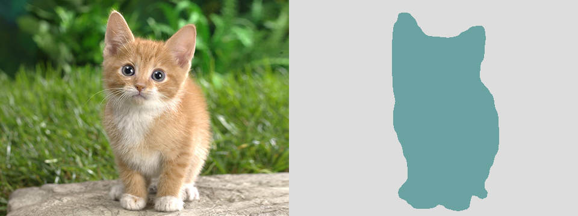

# Caffe 모델 Keras 모델로 바꾸기

[원문 링크](https://nicolovaligi.com/converting-deep-learning-model-caffe-keras.html)


> 이 문서는 딥러닝 프레임워크인 Caffe로 학습된 모델을 Keras에서 사용하기 위해 Keras 모델로 바꾸는 내용에 대한 튜토리얼입니다. Pre-trained 모델을 사용하는데 도움이 될 것입니다. 설명, 원활한 번역을 위해 원문과 조금 다를 수 있습니다.

* Keras

* Caffe 프레임워크

* Pre-trained 모델

</br>
</br>



</br>

많은 딥러닝 연구자들은 새로운 딥러닝 네트워크와 모델을 개발하기 위해 [**Caffee 프레임워크**](http://caffe.berkeleyvision.org/)를 사용합니다. 내가 그렇게 생각하는 이유는 [**Model Zoo**](https://github.com/albertomontesg/keras-model-zoo)에 있는 pre-trained 모델(학습되어 있는 모델)들 때문입니다. Pre-trained 가중치(weight)를 사용하는 것은 몇 가지의 장점이 있습니다:

* 데이터를 충분히 구하는 것은 굉장히 어려운 일입니다.
* 모델을 처음부터 학습시키는 것은 오래 걸리고, 소모적입니다.

그러나, Caffe가 너무 무겁기 때문에 계속 사용하기 어렵고, Caffe의 부족한 유연성 때문에 이미지 처리와 같은 사소한 세부 사항들을 위해 모든 사람들이 코드 베이스에 포크할 수 밖에 없습니다. 그리고 여러분은 C++와 같은 언어를 사용할 수 밖에 없겠죠.

나는 TensorFlow와 그와 비슷한 친구들의 접근을 훨씬 더 선호하는데, 이러한 프레임워크들은 Python 함수의 힘을 빌려 계산 그래프를 작성할 수 있습니다. 이러한 유연성은 프레임워크 코드 밖에서 스크립트 언어로 작성되었을 때 재사용 가능한 사전 처리 단계로 확장됩니다. 나는 보통 케라스로 일하는 것을 즐깁니다. 왜냐하면 그것은 쉬운 일을 쉽게, 힘든 일을 가능하게 하기 때문입니다. 

이 포스트에서는 pre-trianed Caffe 네트워크를 다른 데이터 셋 대한 학습 및 파인 튜닝에 사용할 수 있는 Keras 모델로 전환하는 과정을 살펴볼 것입니다. 최종 결과(코드)는 여기서 확인하세요 : [Keras DilatedNet](https://github.com/nicolov/segmentation_keras). Python과 Keras로 만들어져 있습니다.

</br>

### Picking a model for image segmentation

최근에, 나는 이미지 세그멘테이션에 대한 최신 기술을 연구해왔고, 이해하고 연구하고 싶은 몇 가지 잠재적인 모델들을 선택해보았고 아래와 같습니다.

* [**SegNet**](http://mi.eng.cam.ac.uk/projects/segnet/)은 표준 인코더-디코더 네트워크를 사용하며, 또한 흥미로운 Bayesian extension에 대한 내용도 가지고 있습니다.. CamVid로 weight를 학습.

* [**DirmedNet**](https://github.com/fyu/dilation)은 픽셀 단위 라벨링에 더 좋은 dilated 컨볼루션들을 사용해서 오토인코더 구조를 제거합니다.

* [**Semantic Segmentation**](https://arxiv.org/pdf/1411.4038.pdf)을 위한 Fully Convolutional Networks는 출력에 대해 fully connected layer를 가진 분류 네트워크와 유사합니다.

*dilated 컨볼루션* 덕분에 더 좋은 결과를 얻었고, 매우 깨끗한 Caffe 코드가 제공되기 때문에 두 번째로 말한 네트워크로 진행해보기로 했습니다.

</br>

### Converting the weights

Caffe는 직렬화 된 프로토콜 버퍼인 `* .caffemodel` 파일에 가중치를 저장합니다. [*caffe-tensorflow*](https://github.com/ethereon/caffe-tensorflow)를 사용하여 이들을 numpy에 쉽게 로드 할 수 있는 HD5 파일로 변환 할 것입니다. 스크립트는 `.prototxt`(네트워크 정의) 및 `.caffemodel` 파일을 변환하여 가중치 및 TensorFlow 그래프를 생성합니다.

```
python convert.py \
  --caffemodel=~/dilation/pretrained/dilation8_pascal_voc.caffemodel \
  --code-output-path=./pascal_voc_tf/dil8_net.py \
  --data-output-path=./pascal_voc_tf/ \
  ~/dilation/models/dilation8_pascal_voc_deploy.prototxt
```

가중치는 잘 변환되지만 네트워크는 그렇지 않습니다(몇 가지 중요한 세부 사항이 누락되어 있는 경우로는 작동하지 않을 것입니다). 어쨌든 우리는 Keras를 위해 그것을 직접 해볼 것입니다.

</br>

### Converting the network definition

이 단계는 네트워크 정의의 계층별로 암기한 것을 옮기는 작업이 될 것입니다. 나는 VGG16에 대한 Keras의 예와 그에 상응하는 Caffe의 정의를 사용하여 그 과정의 요령을 파악했습니다. 

예를 들어, 이렇게 생긴 Caffe .prototxt를:

```
layer {
  name: "conv1_2"
  type: "Convolution"
  bottom: "conv1_1"
  top: "conv1_2"
  convolution_param {
    num_output: 64
    kernel_size: 3
  }
}
layer {
  name: "relu1_2"
  type: "ReLU"
  bottom: "conv1_2"
  top: "conv1_2"
}

```

이렇게 생긴 Keras로 동등하게 바꿀 수 있습니다:
> model.add(Convolution2D(64, 3, 3, activation='relu', name='conv1_2'))

이 과정에서 몇 가지 염두해야 할 것이 있습니다:

* Keras/Tensorflow는 이미지를 (행, 열, 채널) 순서로 저장하고, Caffe는 (채널, 행, 열) 순서로 저장한다는 것입니다. `caffe-tensorflow`는 가중치를 자동으로 수정하지만 사전 처리 단계도 필요합니다. 
* Padding은 또 다른 까다로운 세부사항 입니다: 여러분은 중간 단계마다 덤프하여 각 단계에서 모양이 일치하는지 확인할 수 있습니다.
a
이제 정의는 끝났고, 우리는 HD5 파일로 부터 가중치를 로드하는 코드를 추가할 것입니다. 이것을 레이어 마다 쌓게해서 새로운 레이어를 문제없이 맨 위에 추가할 것입니다.

```
weights_data = np.load(weights_path).item()
model = get_model()

for layer in model.layers:
    if layer.name in weights_data.keys():
        layer_weights = weights_data[layer.name]

        layer.set_weights((layer_weights['weights'],
            layer_weights['biases']))
```

shape이 맞지 않을까봐 걱정하지 마세요, 그럴 경우에 Keras는 에러 메세지를 던져줄 것입니다.

</br>

### Tips and tricks

어떤 분류 문제와 마찬가지로, semantic 세그멘테이션은 정규화된 확률을 산출하기 위해 최상단에 Softmax 층이 필요합니다. 이 경우 네트워크에서 이미지의 각 픽셀에 대한 레이블을 생성해야하므로 픽셀 단위로 softmax가 필요합니다. Keras의 softmax 레이어는 4D 배열에서 작동하지 않으므로 미리 픽셀 데이터를 1D 벡터로 재구성해야합니다. Softmax는 마지막 축(채널)에 적용되므로 모양 일반적으로)은 분류하려는 클래스 수에 해당합니다. 다음 코드는 이 작업을 수행합니다.

```
curr_width, curr_height, curr_channels = model.layers[-1].output_shape[1:]
model.add(Reshape((curr_width*curr_height, curr_channels)))
model.add(Activation('softmax'))
model.add(Reshape((curr_width, curr_height, curr_channels)))
```

문제를 해결하는 동안 네트워크의 중간 레이어들을 확인하는 것이 좋습니다. 우리는 forward pass만 진행하기 때문에 Keras `Sequential` 모델의 일부를 잘라내어 중간 레이어를 볼 수 있습니다. Caffe의 Python wrapper의 경우 `Net` 객체의 `blob`속성을 볼 수 있습니다.

> np.save(layer_name, net.blobs[layer_name].data)

</br>

### Next up: training

나의 [Github](https://github.com/nicolov/segmentation_keras)에 전체 코드를 올렸는데, 오리지널 논문과 샘플 이미지 몇 개를 사용하여 결과를 확인할 수 있습니다. 이제 추론이 작동하므로, 다음 단계는 학습 인프라를 설정하여 서로 다른 데이터셋의 pre-trained 네트워크를 파인 튜닝하는 것입니다. 