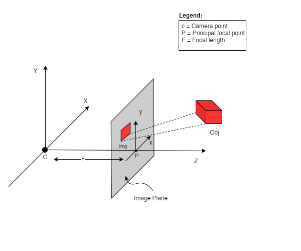

## NeRF로 해보는 3D volumetric rendering
[원문 링크](https://keras.io/examples/vision/nerf/)
> 이 튜토리얼은 3D 볼륨 렌더링하는 모델인 NeRF를 구현 코드 및 이해를 위한 배경지식으로 구성되어 있습니다.

* Keras
* NeRF
* 3D Reconstruction

### Introduction
이 튜토리얼에서는 우리는 Ben Mildenhall et. al가 쓴 [NeRF: Representing Scenes as Neural Radiance Fields for View Synthesis](https://arxiv.org/abs/2003.08934) 논문의 최소로 필요한 만큼만을 구현하고 있습니다. 저자들은 뉴럴넷을 이용한 볼륨렌더링 방법으로 novel view synthesis 하는 독창적인 방법에 대해 제안합니다.

위 설명에 대해 당신을 직관적으로 돕기 위해, 이 질문으로 시작해봅시다: 이미지에서 픽셀의 위치를 뉴럴넷에 주고 그 위치의 색을 예측하도록 요청하는 것이 가능할까요?

</br>
<div style ="text-align:center";><figcaption>Figure 1: 뉴럴넷에 이미지내의 좌표를 주고 해당 좌표의 색 예측하기</figcaption></img></div>
</br>


뉴럴넷은 아마도 이미지를 외울 것(오버피팅)입니다. 이것은 우리의 뉴럴넷이 이미지 전체에 대해 wieghts로 인코딩한다는 것을 의미합니다. 우리는 각 위치에 대해 조회해볼 수 있고, 결국 전체 이미지를 reconstruction 할 수 있습니다.

</br>
<div style ="text-align:center";><figcaption>Figure 2: 훈련된 신경망은 이미지를 스크래치부터 reconstrut 한다</figcaption></img></div>
</br>

이제 한 가지 질문이 떠오릅니다. 그럼 우리는 이걸 어떻게 3D 볼륨 렌더링으로 확장시킬 수 있을까? 위에서 본 비슷한 프로세스를 구현하려면 모든 복셀(볼륨 픽셀)에 대한 지식이 필요합니다. 알고 보니, 이것은 해보기에 꽤 어려운 작업입니다.

NeRF 논문의 저자들의 미니멀하고 우아한 방법은 3D 장면을 몇 개의 사진을 통해 학습하는 것을 제안합니다. 복셀을 학습에 사용하지 않기로 한다는 것입니다. 뉴럴넷은 volumetric scene을 모델링하는 방법을 학습하여 학습 시간에 모델이 본 적 없는 3D 장면의 새로운 뷰(이미지)를 생성합니다.

----

### Setup
```python
# 재현 가능한 결과를 얻기 위해 랜덤 시드 설정
import tensorflow as tf

tf.random.set_seed(42)

import os
import glob
import imageio
import numpy as np
from tqdm import tqdm
from tensorflow import keras
from tensorflow.keras import layers
import matplotlib.pyplot as plt

# global variables 초기화
AUTO = tf.data.AUTOTUNE
BATCH_SIZE = 5
NUM_SAMPLES = 32
POS_ENCODE_DIMS = 16
EPOCHS = 20
```

---
### Download and load the data

`npz` 데이터 파일은 이미지, 카메라 포즈(camera poses), 초점 거리(focal length) 정보를 가지고 있습니다. 이미지는 Figure 3에서 보이는 것처럼 다양한 뷰에서 찍은 사진입니다.

</br>
<div style ="text-align:center";><figcaption>Figure 3: Multiple camera angles (출처 : NeRF 논문)</figcaption></img></div>
</br>

위에서 나온 카메라 포즈에 대해 이해하기 위해서 먼저 카메라는 실제와 2-D 이미지 사이의 매핑(mapping)이라고 생각해야합니다.


아래의 수식을 봅시다:
<div style ="text-align:center";></img></div></br>

**x**는 2-D 이미지 상의 어떤 한 점이고, **X**는 3-D 월드의 한 점 그리고 **P**는 카메라-매트릭스(camera-matrix) 입니다. **P**는 실제 물체를 이미지 평면에 매핑하는 데 중요한 역할 3 x 4 매트릭스 입니다

</br>
<div style ="text-align:center";></img></div></br>

카메라-매트릭스는 포즈 매트릭스를 생성하기 위해 3 x 1 열 [image height, image width, focal length]와 연결된 아핀 변환 매트릭스(affine transform amtrix)입니다. 첫 번째 3 x 3 블록이 카메라의 시점입니다. 축은 카메라가 앞으로 -z를 향하는 [아래, 오른쪽, 뒤] 또는 [-y, x, z]입니다.

</br>
<div style ="text-align:center";><figcaption>Figure 5: The affine transformation.</figcaption></img></div></br>

COLMAP 프레임은 [right, down, forwards] 또는 [x, -y, -z] 입니다. COLMAP에 대한 자세한 설명은 [여기](https://colmap.github.io/)를 참고하세요.

```python
# 데이터가 존재하지 않으면 다운로드
file_name = "tiny_nerf_data.npz"
url = "https://people.eecs.berkeley.edu/~bmild/nerf/tiny_nerf_data.npz"
if not os.path.exists(file_name):
    data = keras.utils.get_file(fname=file_name, origin=url)

data = np.load(data)
images = data["images"]
im_shape = images.shape
(num_images, H, W, _) = images.shape
(poses, focal) = (data["poses"], data["focal"])

# 랜덤한 이미지를 시각화
plt.imshow(images[np.random.randint(low=0, high=num_images)])
```

```bash
Downloading data from https://people.eecs.berkeley.edu/~bmild/nerf/tiny_nerf_data.npz
12730368/12727482 [==============================] - 0s 0us/step
```
<div style ="text-align:center";></img></div></br>

---
### Data pipeline

이제 카메라 매트릭스의 개념과 3D 장면에서 2D 이미지로의 매핑을 이해했으므로, 역매핑(inverse mapping), 즉 2D 이미지에서 3D 장면으로의 매핑에 대해 이야기해 보겠습니다.

우리는 레이 캐스팅(ray casting) 및 트레이싱(tracing)과 더불어 일반적인 컴퓨터 그래픽 기술 볼륨 렌더링에 대한 이야기를 해야할 것 같습니다. 이 장에서는 이러한 기술에 대한 이야기는 이해에 가속도를 줄 것입니다.

N픽셀의 이미지를 생각해봅시다. 우리는 각 픽셀을 통해 레이를 쏘고 레이의 몇 가지 점을 샘플링 합니다. 레이는 일반적으로 r(t) = o + td 식에 의해 파라미터화되며, 여기서 t는 파라미터, o는 원점, d는 Figure 6과 같이 단위 방향 벡터입니다.

</br>
<div style ="text-align:center";><figcaption>Figure 6: t가 3일 때의 r(t) = o + td</figcaption></img></div></br>

Figure 7에서, 우리는 레이를 고려하여, 우리는 레이의 몇 가지 랜덤한 점을 샘플링합니다. 이러한 샘플링 포인트는 각각 고유한 위치(x, y, z)를 가지며 레이는 시야각(theta, phi)을 가집니다. 시야각(viewing angle)은 특히 흥미로운데, 우리는 각각 독특한 시야각을 가진 다양한 방법으로 하나의 픽셀을 통해 레이를 촬영할 수 있기 때문입니다. 여기서 주목해야 할 또 다른 흥미로운 점은 샘플링 프로세스에 추가되는 노이즈입니다. 우리는 샘플이 연속적인 분포에 해당하도록 각 샘플에 균일한 노이즈를 추가합니다. Figure 7에서 파란색 점은 고르게 분포되었고, 흰색 점(t1, t2, t3)은 표본 사이에 무작위로 배치되었습니다.

</br>
<div style ="text-align:center";><figcaption>Figure 7: 레이의 샘플링 포인트들</figcaption></img></div></br>

Figure 8은 전체 샘플링 과정을 3D로 보여주며, 여기서 흰색 이미지에서 나오는 레이를 볼 수 있습니다. 즉, 각 픽셀에 해당하는 레이가 존재하고 각 레이의 서로 다른 지점에서 샘플링 한다는 것입니다.

</br>
<div style ="text-align:center";><figcaption>Figure 8: 3D상에 있는 이미지의 모든 픽셀에서 레이 쏘기</figcaption></img></div></br>

이 샘플링된 포인트들은 NeRF 모델의 인풋입니다. 그리고 모델은 샘플링된 포인트에 대한 RGB 컬러와 볼륨 밀도(volume density)를 물어봅니다.


</br>
<div style ="text-align:center";><figcaption>Figure 9: 데이터 파이프라인 (출처 : NeRF 논문)</figcaption></img></div></br>

```python
def encode_position(x):
    """Fourier feature로 위치를 인코딩합니다.

    Args:
        x: 좌표

    Returns:
        좌표의 Fourier features 텐서
    """
    positions = [x]
    for i in range(POS_ENCODE_DIMS):
        for fn in [tf.sin, tf.cos]:
            positions.append(fn(2.0 ** i * x))
    return tf.concat(positions, axis=-1)


def get_rays(height, width, focal, pose):
    """레이의 원점(origin point)과 방향 벡터(direction vector)를 계산

    Args:
        height: 이미지 Height
        width: 이미지 Width
        focal: 이미지와 카메라의 초점 거리
        pose: 카메라 포즈 매트릭스

    Returns:
        레이의 원점과 방향 벡터로 구성된 튜플
    """
    # Build a meshgrid for the rays.
    i, j = tf.meshgrid(
        tf.range(width, dtype=tf.float32),
        tf.range(height, dtype=tf.float32),
        indexing="xy",
    )

    # Normalize the x axis coordinates.
    transformed_i = (i - width * 0.5) / focal

    # Normalize the y axis coordinates.
    transformed_j = (j - height * 0.5) / focal

    # Create the direction unit vectors.
    directions = tf.stack([transformed_i, -transformed_j, -tf.ones_like(i)], axis=-1)

    # Get the camera matrix.
    camera_matrix = pose[:3, :3]
    height_width_focal = pose[:3, -1]

    # Get origins and directions for the rays.
    transformed_dirs = directions[..., None, :]
    camera_dirs = transformed_dirs * camera_matrix
    ray_directions = tf.reduce_sum(camera_dirs, axis=-1)
    ray_origins = tf.broadcast_to(height_width_focal, tf.shape(ray_directions))

    # Return the origins and directions.
    return (ray_origins, ray_directions)


def render_flat_rays(ray_origins, ray_directions, near, far, num_samples, rand=False):
    """레이를 렌더링하고 flatten 시킨다

    Args:
        ray_origins: 레이의 원점
        ray_directions: 레이의 방향 벡터
        near: 3D 공간의 근처 경계.
        far: 3D 공간의 먼 경계.
        num_samples: 레이의 샘플 포인트 수
        rand: 무작위 노이즈 추가 여부 (True 또는 False)

    Returns:
        각 레이의 flattened 레이와 샘플 포인트로 구성된 튜플
    """
    # 3D point를 계산
    # 수식: r(t) = o+td -> "t"를 여기서 만듭니다.
    t_vals = tf.linspace(near, far, num_samples)
    if rand:
        # 샘플 공간에 균일한 노이즈를 주입하여 샘플링을 조금 더 다양하게 만듭니다.
        shape = list(ray_origins.shape[:-1]) + [num_samples]
        noise = tf.random.uniform(shape=shape) * (far - near) / num_samples
        t_vals = t_vals + noise

    # Equation: r(t) = o + td -> Building the "r" here.
    rays = ray_origins[..., None, :] + (
        ray_directions[..., None, :] * t_vals[..., None]
    )
    rays_flat = tf.reshape(rays, [-1, 3])
    rays_flat = encode_position(rays_flat)
    return (rays_flat, t_vals)


def map_fn(pose):
    """개별 포즈를 flattened 레이 및 샘플 점에 매핑

    Args:
        pose: 카메라 포즈 매트릭스

    Returns:
        카메라 포즈에 대응되는 flattened 레이와 샘플포인트로 구성된 튜플
    """
    (ray_origins, ray_directions) = get_rays(height=H, width=W, focal=focal, pose=pose)
    (rays_flat, t_vals) = render_flat_rays(
        ray_origins=ray_origins,
        ray_directions=ray_directions,
        near=2.0,
        far=6.0,
        num_samples=NUM_SAMPLES,
        rand=True,
    )
    return (rays_flat, t_vals)


# train, validation 데이터 나눌 비율 정하기
split_index = int(num_images * 0.8)

# train, validation 이미지 데이터 나누기
train_images = images[:split_index]
val_images = images[split_index:]

# train, validation 포즈 데이터 나누기
train_poses = poses[:split_index]
val_poses = poses[split_index:]

# train 파이프라인 만들기
train_img_ds = tf.data.Dataset.from_tensor_slices(train_images)
train_pose_ds = tf.data.Dataset.from_tensor_slices(train_poses)
train_ray_ds = train_pose_ds.map(map_fn, num_parallel_calls=AUTO)
training_ds = tf.data.Dataset.zip((train_img_ds, train_ray_ds))
train_ds = (
    training_ds.shuffle(BATCH_SIZE)
    .batch(BATCH_SIZE, drop_remainder=True, num_parallel_calls=AUTO)
    .prefetch(AUTO)
)

# validation 파이프라인 만들기
val_img_ds = tf.data.Dataset.from_tensor_slices(val_images)
val_pose_ds = tf.data.Dataset.from_tensor_slices(val_poses)
val_ray_ds = val_pose_ds.map(map_fn, num_parallel_calls=AUTO)
validation_ds = tf.data.Dataset.zip((val_img_ds, val_ray_ds))
val_ds = (
    validation_ds.shuffle(BATCH_SIZE)
    .batch(BATCH_SIZE, drop_remainder=True, num_parallel_calls=AUTO)
    .prefetch(AUTO)
)
```

### NeRF model

이 모델은 ReLU를 사용하는 다층 퍼셉트론(MLP)입니다.

논문에서 발췌한 내용:

"우리는 네트워크가 볼륨 밀도 시그마(volume density sigma)를 위치 x의 함수로 예측하도록 제한하고 RGB 색상 c를 위치와 보기 방향 모두의 함수로 예측할 수 있도록 함으로써 표현이 멀티 뷰 일관성을 갖도록 장려합니다. 이를 위해 MLP는 먼저 입력 3D 좌표 x를 8개의 fully-connected 레이어로 처리하고(ReLU activations 및 레이어당 256 채널 사용), 시그마 및 256차원 피처 벡터를 출력합니다. 이 특징 벡터는 카메라 광선의 레이 방향과 연결되고 ReLU activations과 128 채널을 사용하여 하나의 추가 fully-connected 레이어로 전달되어 뷰에 의존 하는 RGB 색상을 출력합니다."

여기서 우리는 최소한의 구현을 위해 노력했고 논문에서 언급한 256개 대신 64개의 Dense 유닛을 사용했습니다.

The model is a multi-layer perceptron (MLP), with ReLU as its non-linearity.

```python
def get_nerf_model(num_layers, num_pos):
    """NeRF 뉴럴넷 만들기

    Args:
        num_layers: MLP 레이어 개수
        num_pos: positional encoding 차원 수

    Returns:
        The [`tf.keras`](https://www.tensorflow.org/api_docs/python/tf/keras) model.
    """
    inputs = keras.Input(shape=(num_pos, 2 * 3 * POS_ENCODE_DIMS + 3))
    x = inputs
    for i in range(num_layers):
        x = layers.Dense(units=64, activation="relu")(x)
        if i % 4 == 0 and i > 0:
            # Inject residual connection.
            x = layers.concatenate([x, inputs], axis=-1)
    outputs = layers.Dense(units=4)(x)
    return keras.Model(inputs=inputs, outputs=outputs)


def render_rgb_depth(model, rays_flat, t_vals, rand=True, train=True):
    """RGB image와 뎁스 맵(depth map) 예측

    Args:
        model: The MLP model이 rgb 값과 볼륨 밀도를 학습하고 예측
        rays_flat: NeRF 모델의 인풋으로 사용될 flattened 레이
        t_vals: 레이의 샘플 포인트
        rand: 랜덤화의 유무 (True of False)
        train: 모델이 현재 학습 과정인지 혹은 테스트 과정인지 (True of False)

    Returns:
        rgb 이미지와 뎁스 맵으로 구성된 튜플
    """
    # nerf 모델의 예측값을 얻고 reshape
    if train:
        predictions = model(rays_flat)
    else:
        predictions = model.predict(rays_flat)
    predictions = tf.reshape(predictions, shape=(BATCH_SIZE, H, W, NUM_SAMPLES, 4))

    # 예측값에서 rgb 부분 sigma 부분 잘라내기
    rgb = tf.sigmoid(predictions[..., :-1])
    sigma_a = tf.nn.relu(predictions[..., -1])

    # 인접 구간의 거리 가져오기
    delta = t_vals[..., 1:] - t_vals[..., :-1]
    # delta shape = (num_samples)
    if rand:
        delta = tf.concat(
            [delta, tf.broadcast_to([1e10], shape=(BATCH_SIZE, H, W, 1))], axis=-1
        )
        alpha = 1.0 - tf.exp(-sigma_a * delta)
    else:
        delta = tf.concat(
            [delta, tf.broadcast_to([1e10], shape=(BATCH_SIZE, 1))], axis=-1
        )
        alpha = 1.0 - tf.exp(-sigma_a * delta[:, None, None, :])

    # 투과율(transmittance) 얻기
    exp_term = 1.0 - alpha
    epsilon = 1e-10
    transmittance = tf.math.cumprod(exp_term + epsilon, axis=-1, exclusive=True)
    weights = alpha * transmittance
    rgb = tf.reduce_sum(weights[..., None] * rgb, axis=-2)

    if rand:
        depth_map = tf.reduce_sum(weights * t_vals, axis=-1)
    else:
        depth_map = tf.reduce_sum(weights * t_vals[:, None, None], axis=-1)
    return (rgb, depth_map)
```
---

### Training

학습 과정은 사용자 커스텀 keras.Model의 일부로 구현하여 model.fit을 사용할 수 있습니다.

```python
class NeRF(keras.Model):
    def __init__(self, nerf_model):
        super().__init__()
        self.nerf_model = nerf_model

    def compile(self, optimizer, loss_fn):
        super().compile()
        self.optimizer = optimizer
        self.loss_fn = loss_fn
        self.loss_tracker = keras.metrics.Mean(name="loss")
        self.psnr_metric = keras.metrics.Mean(name="psnr")

    def train_step(self, inputs):
        # 이미지와 레이 가져오기
        (images, rays) = inputs
        (rays_flat, t_vals) = rays

        with tf.GradientTape() as tape:
            # 모델 예측값 얻기
            rgb, _ = render_rgb_depth(
                model=self.nerf_model, rays_flat=rays_flat, t_vals=t_vals, rand=True
            )
            loss = self.loss_fn(images, rgb)

        # trainable variables 가져오기
        trainable_variables = self.nerf_model.trainable_variables

        # trainiable variables의 graidents 가져오기
        gradients = tape.gradient(loss, trainable_variables)

        # grads 적용하고 모델 최적화 하기
        self.optimizer.apply_gradients(zip(gradients, trainable_variables))

        # reconstructed한 이미지와 소스 이미지의 PSNR 값 얻기
        psnr = tf.image.psnr(images, rgb, max_val=1.0)

        # 자체 메트릭 계산
        self.loss_tracker.update_state(loss)
        self.psnr_metric.update_state(psnr)
        return {"loss": self.loss_tracker.result(), "psnr": self.psnr_metric.result()}

    def test_step(self, inputs):
        # 이미지와 레이 가져오기
        (images, rays) = inputs
        (rays_flat, t_vals) = rays

        # 모델 예측값 얻기
        rgb, _ = render_rgb_depth(
            model=self.nerf_model, rays_flat=rays_flat, t_vals=t_vals, rand=True
        )
        loss = self.loss_fn(images, rgb)

        # reconstructed한 이미지와 소스 이미지의 PSNR 값 얻기
        psnr = tf.image.psnr(images, rgb, max_val=1.0)

        # 자체 메트릭 계산
        self.loss_tracker.update_state(loss)
        self.psnr_metric.update_state(psnr)
        return {"loss": self.loss_tracker.result(), "psnr": self.psnr_metric.result()}

    @property
    def metrics(self):
        return [self.loss_tracker, self.psnr_metric]


test_imgs, test_rays = next(iter(train_ds))
test_rays_flat, test_t_vals = test_rays

loss_list = []


class TrainMonitor(keras.callbacks.Callback):
    def on_epoch_end(self, epoch, logs=None):
        loss = logs["loss"]
        loss_list.append(loss)
        test_recons_images, depth_maps = render_rgb_depth(
            model=self.model.nerf_model,
            rays_flat=test_rays_flat,
            t_vals=test_t_vals,
            rand=True,
            train=False,
        )

        # rgb, depth, loss 플롯팅
        fig, ax = plt.subplots(nrows=1, ncols=3, figsize=(20, 5))
        ax[0].imshow(keras.preprocessing.image.array_to_img(test_recons_images[0]))
        ax[0].set_title(f"Predicted Image: {epoch:03d}")

        ax[1].imshow(keras.preprocessing.image.array_to_img(depth_maps[0, ..., None]))
        ax[1].set_title(f"Depth Map: {epoch:03d}")

        ax[2].plot(loss_list)
        ax[2].set_xticks(np.arange(0, EPOCHS + 1, 5.0))
        ax[2].set_title(f"Loss Plot: {epoch:03d}")

        fig.savefig(f"images/{epoch:03d}.png")
        plt.show()
        plt.close()


num_pos = H * W * NUM_SAMPLES
nerf_model = get_nerf_model(num_layers=8, num_pos=num_pos)

model = NeRF(nerf_model)
model.compile(
    optimizer=keras.optimizers.Adam(), loss_fn=keras.losses.MeanSquaredError()
)

# 학습 중에 만든 이미지를 저장할 디렉토리 만들기
if not os.path.exists("images"):
    os.makedirs("images")

model.fit(
    train_ds,
    validation_data=val_ds,
    batch_size=BATCH_SIZE,
    epochs=EPOCHS,
    callbacks=[TrainMonitor()],
    steps_per_epoch=split_index // BATCH_SIZE,
)


def create_gif(path_to_images, name_gif):
    filenames = glob.glob(path_to_images)
    filenames = sorted(filenames)
    images = []
    for filename in tqdm(filenames):
        images.append(imageio.imread(filename))
    kargs = {"duration": 0.25}
    imageio.mimsave(name_gif, images, "GIF", **kargs)


create_gif("images/*.png", "training.gif")
```

```bash
Epoch 1/20
16/16 [==============================] - 15s 753ms/step - loss: 0.1134 - psnr: 9.7278 - val_loss: 0.0683 - val_psnr: 12.0722
```
<div style ="text-align:center";></div></br>

```bash
Epoch 2/20
16/16 [==============================] - 13s 752ms/step - loss: 0.0648 - psnr: 12.4200 - val_loss: 0.0664 - val_psnr: 12.1765
```
<div style ="text-align:center";></div></br>

```bash
Epoch 3/20
16/16 [==============================] - 13s 746ms/step - loss: 0.0607 - psnr: 12.5281 - val_loss: 0.0673 - val_psnr: 12.0121
```
<div style ="text-align:center";></div></br>

```bash
Epoch 4/20
16/16 [==============================] - 13s 758ms/step - loss: 0.0595 - psnr: 12.7050 - val_loss: 0.0646 - val_psnr: 12.2768
```
<div style ="text-align:center";></div></br>

```bash
Epoch 5/20
16/16 [==============================] - 13s 755ms/step - loss: 0.0583 - psnr: 12.7522 - val_loss: 0.0613 - val_psnr: 12.5351
```
<div style ="text-align:center";></div></br>

```bash
Epoch 6/20
16/16 [==============================] - 13s 749ms/step - loss: 0.0545 - psnr: 13.0654 - val_loss: 0.0553 - val_psnr: 12.9512
```
<div style ="text-align:center";></div></br>

```bash
Epoch 7/20
16/16 [==============================] - 13s 744ms/step - loss: 0.0480 - psnr: 13.6313 - val_loss: 0.0444 - val_psnr: 13.7838
```
<div style ="text-align:center";></div></br>

```bash
Epoch 8/20
16/16 [==============================] - 13s 763ms/step - loss: 0.0359 - psnr: 14.8570 - val_loss: 0.0342 - val_psnr: 14.8823
```
<div style ="text-align:center";></div></br>

```bash
Epoch 9/20
16/16 [==============================] - 13s 758ms/step - loss: 0.0299 - psnr: 15.5374 - val_loss: 0.0287 - val_psnr: 15.6171
```
<div style ="text-align:center";></div></br>

```bash
Epoch 10/20
16/16 [==============================] - 13s 779ms/step - loss: 0.0273 - psnr: 15.9051 - val_loss: 0.0266 - val_psnr: 15.9319
```
<div style ="text-align:center";></div></br>

```bash
Epoch 11/20
16/16 [==============================] - 13s 736ms/step - loss: 0.0255 - psnr: 16.1422 - val_loss: 0.0250 - val_psnr: 16.1568
```
<div style ="text-align:center";></div></br>

```bash
Epoch 12/20
16/16 [==============================] - 13s 746ms/step - loss: 0.0236 - psnr: 16.5074 - val_loss: 0.0233 - val_psnr: 16.4793
```
<div style ="text-align:center";></div></br>

```bash
Epoch 13/20
16/16 [==============================] - 13s 755ms/step - loss: 0.0217 - psnr: 16.8391 - val_loss: 0.0210 - val_psnr: 16.89502
```
<div style ="text-align:center";></div></br>

```bash
Epoch 14/20
16/16 [==============================] - 13s 741ms/step - loss: 0.0197 - psnr: 17.2245 - val_loss: 0.0187 - val_psnr: 17.3766
```
<div style ="text-align:center";></div></br>

```bash
Epoch 15/20
16/16 [==============================] - 13s 739ms/step - loss: 0.0179 - psnr: 17.6246 - val_loss: 0.0179 - val_psnr: 17.5445
```
<div style ="text-align:center";></div></br>

```bash
Epoch 16/20
16/16 [==============================] - 13s 735ms/step - loss: 0.0175 - psnr: 17.6998 - val_loss: 0.0180 - val_psnr: 17.5154
```
<div style ="text-align:center";></div></br>

```bash
Epoch 17/20
16/16 [==============================] - 13s 741ms/step - loss: 0.0167 - psnr: 17.9393 - val_loss: 0.0156 - val_psnr: 18.1784
```
<div style ="text-align:center";></div></br>

```bash
Epoch 18/20
16/16 [==============================] - 13s 750ms/step - loss: 0.0150 - psnr: 18.3875 - val_loss: 0.0151 - val_psnr: 18.2811
```
<div style ="text-align:center";></div></br>

```bash
Epoch 19/20
16/16 [==============================] - 13s 755ms/step - loss: 0.0141 - psnr: 18.6476 - val_loss: 0.0139 - val_psnr: 18.6216
```
<div style ="text-align:center";></div></br>

```bash
Epoch 20/20
16/16 [==============================] - 14s 777ms/step - loss: 0.0139 - psnr: 18.7131 - val_loss: 0.0137 - val_psnr: 18.7259
```
<div style ="text-align:center";></div></br>

```bash
100%|██████████| 20/20 [00:00<00:00, 57.59it/s]
```
---

### Visualize the training step

여기 학습 과정이 있습니다. 손실이 감소함에 따라 렌더링된 이미지와 뎁스 맵이 개선되고 있습니다. 로컬 시스템에서 생성된 training.gif 파일을 볼 수 있습니다.

<div style ="text-align:center";></div></br>
---

### Inference

이 섹션에서는 모델에게 장면의 새로운 뷰를 만들어내도록 할 것입니다. 모델에게 학습 단계에서 장면의 106개 보기가 주어졌습니다. 학습용 이미지 모음에서 장면(scene)의 각도가 모두 포함될 수는 없습니다. 학습된 모델은 희소 학습 이미지 셋으로 전체 3-D 장면을 만들어낼 수 있습니다.

여기서는 모델에 다른 포즈를 제공하고 해당 카메라 뷰에 해당하는 2-D 이미지를 제공하도록 할것입니다. 모든 360도 뷰에 대해 모델을 추론한다면, 그것은 모든 주변의 전체 경관에 대한 오버뷰를 제공할 것입니다.

```python
# 학습된 NeRF 모델을 가져오고 추론
nerf_model = model.nerf_model
test_recons_images, depth_maps = render_rgb_depth(
    model=nerf_model,
    rays_flat=test_rays_flat,
    t_vals=test_t_vals,
    rand=True,
    train=False,
)

# 서브플롯 그리기
fig, axes = plt.subplots(nrows=5, ncols=3, figsize=(10, 20))

for ax, ori_img, recons_img, depth_map in zip(
    axes, test_imgs, test_recons_images, depth_maps
):
    ax[0].imshow(keras.preprocessing.image.array_to_img(ori_img))
    ax[0].set_title("Original")

    ax[1].imshow(keras.preprocessing.image.array_to_img(recons_img))
    ax[1].set_title("Reconstructed")

    ax[2].imshow(
        keras.preprocessing.image.array_to_img(depth_map[..., None]), cmap="inferno"
    )
    ax[2].set_title("Depth Map")
```
<div style ="text-align:center";></div></br>
---

### Render 3D Scene

여기서 우리는 새로운 3D 뷰를 합성하고 그것들을 모두 엮어서 360도 뷰를 아우르는 비디오를 렌더링할 것입니다.

```python
def get_translation_t(t):
    """t translation matrix 가져오기"""
    matrix = [
        [1, 0, 0, 0],
        [0, 1, 0, 0],
        [0, 0, 1, t],
        [0, 0, 0, 1],
    ]
    return tf.convert_to_tensor(matrix, dtype=tf.float32)


def get_rotation_phi(phi):
    """phi rotation matrix 가져오기"""
    matrix = [
        [1, 0, 0, 0],
        [0, tf.cos(phi), -tf.sin(phi), 0],
        [0, tf.sin(phi), tf.cos(phi), 0],
        [0, 0, 0, 1],
    ]
    return tf.convert_to_tensor(matrix, dtype=tf.float32)


def get_rotation_theta(theta):
    """theta rotation matrix 가져오기"""
    matrix = [
        [tf.cos(theta), 0, -tf.sin(theta), 0],
        [0, 1, 0, 0],
        [tf.sin(theta), 0, tf.cos(theta), 0],
        [0, 0, 0, 1],
    ]
    return tf.convert_to_tensor(matrix, dtype=tf.float32)


def pose_spherical(theta, phi, t):
    """
    theta, phi 및 t에 대한 카메라를 월드 매트릭스로 가져오기
    """
    c2w = get_translation_t(t)
    c2w = get_rotation_phi(phi / 180.0 * np.pi) @ c2w
    c2w = get_rotation_theta(theta / 180.0 * np.pi) @ c2w
    c2w = np.array([[-1, 0, 0, 0], [0, 0, 1, 0], [0, 1, 0, 0], [0, 0, 0, 1]]) @ c2w
    return c2w


rgb_frames = []
batch_flat = []
batch_t = []

# 다른 세타 값에 대해 반복하여 장면을 생성
for index, theta in tqdm(enumerate(np.linspace(0.0, 360.0, 120, endpoint=False))):
    # 월드 매트릭스로 가져오기
    c2w = pose_spherical(theta, -30.0, 4.0)

    #
    ray_oris, ray_dirs = get_rays(H, W, focal, c2w)
    rays_flat, t_vals = render_flat_rays(
        ray_oris, ray_dirs, near=2.0, far=6.0, num_samples=NUM_SAMPLES, rand=False
    )

    if index % BATCH_SIZE == 0 and index > 0:
        batched_flat = tf.stack(batch_flat, axis=0)
        batch_flat = [rays_flat]

        batched_t = tf.stack(batch_t, axis=0)
        batch_t = [t_vals]

        rgb, _ = render_rgb_depth(
            nerf_model, batched_flat, batched_t, rand=False, train=False
        )

        temp_rgb = [np.clip(255 * img, 0.0, 255.0).astype(np.uint8) for img in rgb]

        rgb_frames = rgb_frames + temp_rgb
    else:
        batch_flat.append(rays_flat)
        batch_t.append(t_vals)

rgb_video = "rgb_video.mp4"
imageio.mimwrite(rgb_video, rgb_frames, fps=30, quality=7, macro_block_size=None)
```

### Visualize the video

여기서 우리는 렌더링된 360도 장면의 뷰를 볼 수 있습니다. 이 모델은 20 에폭 만에 희소 이미지 세트를 통해 전체 볼륨메트릭 스페이스를 성공적으로 학습했습니다. **rgb_video.mp4**라는 이름으로 로컬에 저장된 렌더링된 비디오를 볼 수 있습니다.

<div style ="text-align:center";></div></br>

---

### Conclusion

우리는 NeRF의 핵심 아이디어와 방법론에 대한 직관을 제공하기 위해 NeRF의 최소 구현을 해보았습니다. 이 방법은 컴퓨터 그래픽스 분야의 다양한 다른 작품에서 사용되어 왔습니다.

우리는 독자들이 이 코드를 예시로 사용하고 하이퍼파라미터를 가지고 놀아보고 출력을 시각화할 것을 권장하고 싶습니다. 아래에서는 더 많은 에폭 동안 학습된 모델의 결과도 보여줍니다.

<table>
  <tr>
    <th>Epochs</th>
    <th>GIF of the training step</th>
  </tr>
  <tr>
    <th>100</th>
    <th><div style ="text-align:center";></img></div></th>
   </tr> 
  <tr>
    <th>200</th>
    <th><div style ="text-align:center";></th>
   </tr> 
</table>

---

### Way forward

누구든 NeRF에 대해 더 알고 싶다면, 우리가 만든 [PyImageSearch](https://pyimagesearch.com/)의 블로그 시리즈를 살펴보세요.

* [Prerequisites of NeRF](https://pyimagesearch.com/2021/11/10/computer-graphics-and-deep-learning-with-nerf-using-tensorflow-and-keras-part-1/)
* [Concepts of NeRF](https://pyimagesearch.com/2021/11/17/computer-graphics-and-deep-learning-with-nerf-using-tensorflow-and-keras-part-2/)
* [Implementing NeRF](https://pyimagesearch.com/2021/11/24/computer-graphics-and-deep-learning-with-nerf-using-tensorflow-and-keras-part-3/)

---

### Reference

[NeRF repository](https://github.com/bmild/nerf): 공식 NeRF repository
[NeRF paper](https://arxiv.org/abs/2003.08934): NeRF 논문
[Manim Repository](https://github.com/3b1b/manim): 우리는 모든 애니메이션을 위해 manim을 사용했습니다.
[Mathworks](https://kr.mathworks.com/help/vision/ug/camera-calibration.html): Mathworks의 카메라 캘리브레이션 아티클을 사용했습니다.
[Mathew's video](https://www.youtube.com/watch?v=dPWLybp4LL0): NeRF를 설명하는 멋진 비디오입니다.

[Hugging Face Spaces](https://huggingface.co/spaces/keras-io/NeRF)에서 모델을 사용해볼 수 있습니다.
