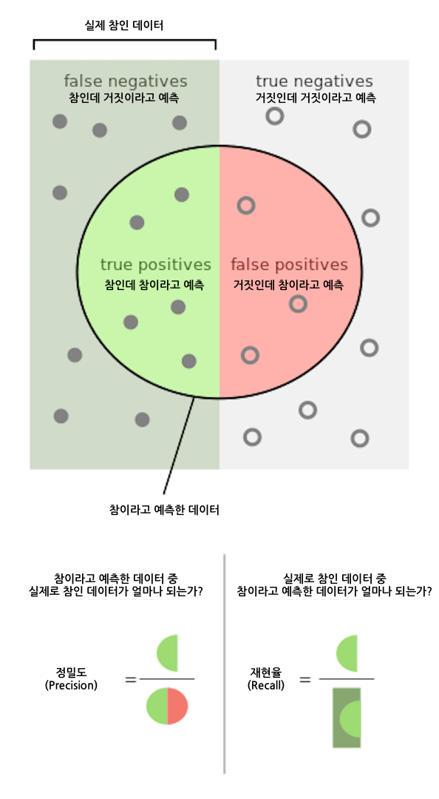

# Keras의 Autoencoder를 활용해 신용카드 이상 거래 탐지하기

[원문 링크](https://medium.com/@curiousily/credit-card-fraud-detection-using-autoencoders-in-keras-tensorflow-for-hackers-part-vii-20e0c85301bd)


## 문서 소개

> 이 문서에서는 Autoencoder에 대한 기본 개념과 불균형한 데이터셋을 학습한 모델의 평가 방법을 설명하고, 신용카드 이상 거래를 탐지하는 Autoencoder 모델을 만들어봅니다. 


- Autoencoder
- Keras
- Anomaly detection
- ROC curve
- Precision / Recall


## **3줄 요약**

1. Autoencoder는 어떤 데이터의 입력을 받은 후, 정보를 압축시켰다가 다시 확장하며 입력받은 것과 최대한 비슷한 결과값을 반환하는 '재구성'의 방법을 통해 특정 데이터의 패턴을 인코딩합니다.
2. 신용카드 거래 데이터셋은 대부분 정상 거래 데이터로 이루어져 있으며, 이상 거래 데이터는 적게 포함되어 있는 불균형한 데이터셋입니다.
3. Autoencoder 모델을 정상 거래 데이터만으로 학습시키면 이상 거래 데이터가 입력으로 주어지는 경우에는 재구성이 잘 안 되는데, 이 원리를 활용해 신용카드 이상 거래를 탐지합니다.


## **신용카드 이상 거래 탐지는 어떻게 이루어질까?**

조용한 일요일 아침, 당신은 입가에 미소를 띄우며 일어납니다.

*오늘은 좋은 날이 될거야!* 

당신의 핸드폰이, 그것도 상당히 '국제적으로' 울리는 일만 아니었다면...

당신은 핸드폰을 천천히 집어들었고, 무언가 별난 말을 듣게 되었습니다.  

 - "Bonjour, je suis Michele, 아, 이런. 죄송합니다. 저는 미셸이예요. 당신이 쓰고 있는 은행의 직원인데요."   
    대체 뭐가 그렇게 급하길래 스위스에 있는 누군가가 이 시간에 당신에게 전화를 걸게 했을까요? 

 - "혹시 디아블로 3100장을 사기 위해 3,358.65 달러를 지불하신 적이 있나요?" 

 - "아뇨, 그런 적 없는데요!?" 

    미셸의 대답은 빠르고 간결했습니다.  

 - "감사합니다, 저희가 처리하겠습니다."  

 *휴, 하마터면 어쩔 뻔했어!* 

그런데 미셸이 어떻게 이 거래가 이상하다는 것을 알게 되었을까요? 사실 지난 주에 같은 은행 계좌를 통해 10개의 새로운 스마트폰을 구매하기도 했는데, 그 때는 이렇게 미셸이 전화를 걸지 않았습니다.


(의역) "야레야레.. 온라인 신용카드 결제 승인은 간단하게 나지 않는다고?!"


[Nilson Report](https://www.nilsonreport.com/upload/content_promo/The_Nilson_Report_10-17-2016.pdf)에 따르면, 신용카드 사기로 인한 연간 피해액은 국제적으로 218억 달러에 달합니다(2015년 기준). 당신이 사기꾼이라면 아마 매우 운이 좋다고 생각할지도 모르겠습니다. 같은 해에 미국에서는 100달러당 12센트를 도둑맞았으니까요. 우리의 친구 미셸은 이 때문에 심각한 문제들을 해결해야 할지도 모릅니다.


이 글에서, 우리는 Keras로 구현된 Autoencoder 신경망을 `비지도학습(unsupervised)` 또는 `반지도학습(semi-supervised)` 방식으로 학습하여 신용카드 이상 거래를 탐지해봅니다. 그렇게 학습된 모델은 미리 정답을 알고 있는, 익명화된 데이터셋을 기반으로 평가합니다.


[이 글에서 쓴 코드와 학습된 모델은 이 GitHub Repository에서 확인할 수 있습니다.](https://github.com/curiousily/Credit-Card-Fraud-Detection-using-Autoencoders-in-Keras)


## 기본 설정(Setup)

우리는 `Tensorflow 1.2`와 `Keras 2.0.4`를 사용할 예정입니다. 그럼 이제 시작해봅시다:

```python
# 필요한 라이브러리 로드
import pandas as pd
import numpy as np
import pickle
import matplotlib.pyplot as plt
from scipy import stats
import tensorflow as tf
import seaborn as sns
from pylab import rcParams
from sklearn.model_selection import train_test_split
from keras.models import Model, load_model
from keras.layers import Input, Dense
from keras.callbacks import ModelCheckpoint, TensorBoard
from keras import regularizers

# 시각화 라이브러리 설정
%matplotlib inline

sns.set(style='whitegrid', palette='muted', font_scale=1.5)

rcParams['figure.figsize'] = 14, 8

# RANDOM_SEED와 LABELS 설정
RANDOM_SEED = 42
LABELS = ["Normal", "Fraud"]
```


## 데이터 가져오기(Loading the data)

우리가 사용하려는 데이터는 [Kaggle](https://www.kaggle.com/mlg-ulb/creditcardfraud/version/3)에서 다운로드 받을 수 있습니다. 이는 이틀 동안 발생한 신용 카드 거래 데이터들이며, 총 284,807개의 거래 기록과 그 중 492개의 이상 거래 기록이 포함되어 있습니다.


데이터셋에 있는 모든 변수는 수치 데이터입니다. 데이터는 개인 정보보호 문제로 인해 `PCA 변환` 과정을 거쳤습니다. 딱 두 가지 변환하지 않은 것은 `시간(Time)`과 `거래액(Amount)`입니다. `시간`은 데이터셋 내 첫번째 거래가 이루어진 시점부터 각 거래가 이루어진 시점  사이의 시간을 초(second) 단위로 기록한 것입니다.


```python
df = pd.read_csv("data/creditcard.csv")
```


## 데이터 둘러보기(Exploration)

```python
df.shape
```

=> `(204808,31)`

데이터는 31개의 열(column)로 구성되어 있으며, 그 중 2개는 각각 `시간`과 `거래액`입니다. 다른 데이터들은 PCA 변환을 통해 나온 결과값입니다. 


그럼 결측값(missing value)이 있는지 확인해봅시다.

```python
df.isnull().values.any()
```

=> `False`


```python
count_classes = pd.value_counts(df['Class'], sort = True)
count_classes.plot(kind = 'bar', rot=0)
plt.title("Transaction class distribution")
plt.xticks(range(2), LABELS)
plt.xlabel("Class")
plt.ylabel("Frequency");
```


우리는 상당히 불균형한 데이터를 가지고 있습니다. 정상 거래가 이상 거래에 비해 압도적으로 많죠. 


두 거래 유형에 대해 살펴봅시다. 

```python
frauds = df[df.Class == 1]
normal = df[df.Class == 0]
frauds.shape
```

=> `(492, 31)`

```python
normal.shape
```

=> `(284315, 31)`


각 거래 유형의 `거래액`은 어떻게 다를까요?

```python
frauds.Amount.describe()
```

=>

```
count     492.000000
mean      122.211321
std       256.683288
min         0.000000
25%         1.000000
50%         9.250000
75%       105.890000
max      2125.870000
Name: Amount, dtype: float64
```


```python
normal.Amount.describe()
```

=>

```
count    284315.000000
mean         88.291022
std         250.105092
min           0.000000
25%           5.650000
50%          22.000000
75%          77.050000
max       25691.160000
Name: Amount, dtype: float64
```


좀 더 그래픽적인 요소를 더해봅시다.

```python
f, (ax1, ax2) = plt.subplots(2, 1, sharex=True)
f.suptitle('Amount per transaction by class')

bins = 50

ax1.hist(frauds.Amount, bins = bins)
ax1.set_title('Fraud')

ax2.hist(normal.Amount, bins = bins)
ax2.set_title('Normal')

plt.xlabel('Amount ($)')
plt.ylabel('Number of Transactions')
plt.xlim((0, 20000))
plt.yscale('log')
plt.show();
```


이상 거래가 특정 `시간`에 더 자주 발생하기도 할까요?

```python
f, (ax1, ax2) = plt.subplots(2, 1, sharex=True)
f.suptitle('Time of transaction vs Amount by class')

ax1.scatter(frauds.Time, frauds.Amount)
ax1.set_title('Fraud')

ax2.scatter(normal.Time, normal.Amount)
ax2.set_title('Normal')

plt.xlabel('Time (in Seconds)')
plt.ylabel('Amount')
plt.show()
```


거래가 발생한 `시간`이 그렇게 중요한 것 같지는 않아 보입니다.


## Autoencoder

Autoencoder는 처음에는 이상해보일 수도 있습니다. 이러한 모델들은 입력값을 받아서, 입력값을 예측하는 일을 합니다. 어리둥절한가요? 적어도 제가 처음 이 설명을 들었을 때는 그랬거든요.

좀 더 자세히, Autoencoder 신경망에 대해 살펴봅시다. 이 Autoencoder는 다음과 같은 항등 함수를 근사하도록 학습됩니다.


> 역자 추가 설명: 
>
> 다음 수학식에서 f는 신경망, W는 가중치(weight), b는 바이어스(bias)입니다. 
>
> 즉 이 식을 풀어서 설명하자면, 왼쪽에 있는 항은 입력값인 x가 신경망에 들어가는 것을 의미하며, 그 결과가 오른쪽에 있는 x와 같아지도록 근사하는 것을 뜻합니다. 
>
> 다시 정리하자면 '입력값 x를 받아서 다시 입력값 x를 결과로 뱉어내는 함수'가 바로 Autoencoder 신경망이라는 것이죠.


처음에는 이렇게 하는 것이 대수롭지 않게 보일 수도 있지만, 우리가 특정한 데이터의 압축된 표상(representation)을 학습시키고 그 구조(structure)를 찾고 싶어한다는 점이 중요합니다. 이것은 모델 안에 있는 은닉 유닛(hidden unit)의 수를 제한하는 방법을 통해 가능합니다. 이런 종류의 autoencoder들은 *미완성(undercomplete)* 이라 불립니다.


여기 Autoencoder의 학습 과정을 시각적으로 표현해보았습니다.


## 재구성 오류(Reconstruction error)

우리는 Autoencoder 모델의 파라미터(parameter)들을 학습 오류가 최소화되도록 최적화시킵니다. 이 때 쓰이는 학습 오류는 조금 특별한 종류인데, 바로 `재구성 오류(reconstruction error)`입니다. 실전에서는 다음과 같이 전통적인 제곱식으로 오류를 구합니다.


만약 Autoencoder들에 대해 더 알고 싶다면, Hugo Larochelle의 [다음 비디오](https://youtu.be/FzS3tMl4Nsc)들을 매우 추천합니다.


## 데이터 준비

먼저, `시간` 열은 쓰지 않을 것이기 때문에 삭제하고 `Scikit-learn`의 `StandardScaler`를 `거래액` 열에 적용해봅시다. `StandardScaler`는 평균을 제거하고 값들을 단위 분산(unit variance)에 맞게 스케일링해줍니다.

```python
from sklearn.preprocessing import StandardScaler

data = df.drop(['Time'], axis=1)

data['Amount'] = StandardScaler().fit_transform(data['Amount'].values.reshape(-1, 1))
```


Autoencoder를 훈련하는 것은 우리에게 익숙한 방식과는 조금 다릅니다. 우리가 가진 데이터셋 내에 이상이 없는 거래기록이 대부분이라고 가정해봅시다. 그리고 새로운 거래가 생길 때 어떤 이상이 있으면 그것을 탐지해내고 싶다고 합시다. **그렇다면 우리는 모델을 오직 정상 거래기록으로만 훈련시킵니다.** 정상 거래기록을 테스트셋에 넣으면 모델의 성능을 평가할 수 있습니다. 우리는 가진 데이터의 20%를 테스트에 사용할 것입니다.

```python
X_train, X_test = train_test_split(data, test_size=0.2, random_state=RANDOM_SEED)
X_train = X_train[X_train.Class == 0]
X_train = X_train.drop(['Class'], axis=1)

y_test = X_test['Class']
X_test = X_test.drop(['Class'], axis=1)

X_train = X_train.values
X_test = X_test.values

X_train.shape
```

=> `(227451, 29)`


## 모델 만들기

우리가 만들 Autoencoder는 4개의 fully connected layer로 만들어져 있으며, 각 layer는 14, 7, 7, 29개의 뉴런으로 구성되어 있습니다. 처음 두 개의 layer들은 `encoder`로 쓰이며, 뒤의 두 개는 `decoder`가 됩니다. 또, `L1 정규화(regularization)`를 사용합니다.

```python
input_dim = X_train.shape[1]
encoding_dim = 14

input_layer = Input(shape=(input_dim, ))

encoder = Dense(encoding_dim, activation="tanh", 
                activity_regularizer=regularizers.l1(10e-5))(input_layer)
encoder = Dense(int(encoding_dim / 2), activation="relu")(encoder)
decoder = Dense(int(encoding_dim / 2), activation='tanh')(encoder)
decoder = Dense(input_dim, activation='relu')(decoder)
autoencoder = Model(inputs=input_layer, outputs=decoder)
```


우리가 만든 모델을 100 에폭(epoch) 동안 32의 배치 사이즈(batch size)로 훈련시킨 후, 가장 우수한 성능을 가진 모델을 파일로 저장해봅시다. Keras에서 제공되는 `ModelCheckpoint`가 이러한 일들을 하는 데 매우 편리합니다. 추가적으로, 훈련 과정은 `TensorBoard`에 맞는 포맷으로 저장됩니다.

```python
nb_epoch = 100
batch_size = 32
autoencoder.compile(optimizer='adam', 
                    loss='mean_squared_error', 
                    metrics=['accuracy'])
checkpointer = ModelCheckpoint(filepath="model.h5",
                               verbose=0,
                               save_best_only=True)
tensorboard = TensorBoard(log_dir='./logs',
                          histogram_freq=0,
                          write_graph=True,
                          write_images=True)
history = autoencoder.fit(X_train, X_train,
                    epochs=nb_epoch,
                    batch_size=batch_size,
                    shuffle=True,
                    validation_data=(X_test, X_test),
                    verbose=1,
                    callbacks=[checkpointer, tensorboard]).history
```


그리고 다음과 같이 저장된 모델을 로드할 수 있습니다.

```python
autoencoder = load_model('model.h5')
```


## 평가하기(Evaluation)

```python
plt.plot(history['loss'])
plt.plot(history['val_loss'])
plt.title('model loss')
plt.ylabel('loss')
plt.xlabel('epoch')
plt.legend(['train', 'test'], loc='upper right');
```


트레이닝 데이터와 테스트 데이터에 대한 `재구성 오류`가 예쁘게 수렴하고 있는 것처럼 보입니다. 이 정도면 충분히 낮을까요? 


오류 분포에 대해 좀 더 자세히 살펴봅시다.

```python
predictions = autoencoder.predict(X_test)
mse = np.mean(np.power(X_test - predictions, 2), axis=1)
error_df = pd.DataFrame({'reconstruction_error': mse,
                        'true_class': y_test})
error_df.describe()
```


### 정상 거래 데이터들의 `재구성 오류` 분포

```python
fig = plt.figure()
ax = fig.add_subplot(111)
normal_error_df = error_df[(error_df['true_class']== 0) & (error_df['reconstruction_error'] < 10)]
_ = ax.hist(normal_error_df.reconstruction_error.values, bins=10)
```


### 이상 거래 데이터들의 `재구성 오류` 분포

```python
fig = plt.figure()
ax = fig.add_subplot(111)
fraud_error_df = error_df[error_df['true_class'] == 1]
_ = ax.hist(fraud_error_df.reconstruction_error.values, bins=10)
```


### `ROC 곡선`을 통한 평가

```python
from sklearn.metrics import (confusion_matrix, precision_recall_curve, auc,
                             roc_curve, recall_score, classification_report, f1_score,
                             precision_recall_fscore_support)
```

`ROC 곡선`은 이진 분류기(binary classifier)의 성능을 평가하는 유용한 도구입니다. 그러나 우리의 경우는 살짝 일반적이지는 않습니다. 우리는 굉장히 불균형한 데이터셋을 가지고 있기 때문입니다. 그럼에도, 일단은 우리의 `ROC 곡선`을 살펴봅시다.


```python
fpr, tpr, thresholds = roc_curve(error_df.true_class, error_df.reconstruction_error)
roc_auc = auc(fpr, tpr)

plt.title('Receiver Operating Characteristic')
plt.plot(fpr, tpr, label='AUC = %0.4f'% roc_auc)
plt.legend(loc='lower right')
plt.plot([0,1],[0,1],'r--')
plt.xlim([-0.001, 1])
plt.ylim([0, 1.001])
plt.ylabel('True Positive Rate')
plt.xlabel('False Positive Rate')
plt.show();
```


`ROC 곡선`은 각 `기준치(threshold)`가 달라질 때마다 '틀린 것을 맞다고 할 확률'(`false positive rate`)에 따른 '맞는 것을 맞다고 한 확률'(`true positive rate`)을 그래프로 그린 것입니다. 기본적으로, 파란색 곡선이 왼쪽 위 모퉁이에 가까워질수록 좋습니다. 우리의 결과가 꽤 좋아보이긴 하지만, 우리 데이터가 가진 특징을 염두하고 있어야 합니다. `ROC 곡선`은 우리에게 그다지 유용해보이진 않네요. 그렇다면..


### 정밀도(Precision)와 재현율(Recall)



정밀도(Precision)와 재현율(Recall)은 다음과 같이 정의됩니다:


정밀도(Precision) = 참인데 참이라고 예측한 데이터 / 참이라고 예측한 데이터


재현율(Recall) = 참인데 참이라고 예측한 데이터 / 실제로 참인 데이터


정밀도와 재현율을 보다 잘 이해하기 위해 정보 검색 분야에서 한 가지 예를 가져와보려고 합니다. 정밀도는 검색한 결과들 중에서 실제 찾으려는 대상과 관련된 결과가 얼마나 있는지를 수치화합니다. 반대로, 재현율은 실제 찾으려는 대상과 관련된 전체 데이터 중 얼마나 찾았는지를 수치화합니다. 두 수치 모두 0과 1사이구요. 수치가 1에 가까울수록 좋습니다.


그럼 다시 우리의 예시로 돌아와보겠습니다. 우리의 예시에서 재현율이 높지만 정밀도가 낮다는 것은 찾은 데이터의 수가 많지만 그 중 실제 찾으려는 대상의 비율은 낮았다는 것을 의미합니다. 이와 반대로 정밀도가 높지만 재현율이 낮다는 것은 찾은 데이터의 수는 작지만 그 중 실제 찾으려는 대상의 비율은 높다는 것을 의미합니다. 이상적으로는, 정밀도와 재현율이 모두 높은 것이 좋습니다. 이는 찾은 데이터 수가 많으며 그 중 실제 찾으려는 대상의 비율이 높다는 것을 의미합니다.

```python
precision, recall, th = precision_recall_curve(error_df.true_class, error_df.reconstruction_error)
plt.plot(recall, precision, 'b', label='Precision-Recall curve')
plt.title('Recall vs Precision')
plt.xlabel('Recall')
plt.ylabel('Precision')
plt.show()
```


곡선 아래 영역 중 위쪽 부분은 높은 재현율과 높은 정밀도를 나타냅니다. 높은 정밀도는 거짓인데 참이라고 예측한 것들의 비율이 낮은 것과 관련 있고, 높은 재현율은 참인데 거짓이라고 예측한 것들의 비율이 낮은 것과 관련 있습니다. 두 값 모두 높다면 해당 분류기가 실제 참인 데이터들 중 대부분을 찾아낼(높은 재현율)뿐만 아니라, 정확한 결과(높은 정밀도)를 가진다는 것을 의미합니다.


```python
plt.plot(th, precision[1:], 'b', label='Threshold-Precision curve')
plt.title('Precision for different threshold values')
plt.xlabel('Threshold')
plt.ylabel('Precision')
plt.show()
```


`재구성 오류`가 증가할수록 정밀도가 올라간다는 것을 확인할 수 있습니다.

재현율도 살펴보자:

```python
plt.plot(th, recall[1:], 'b', label='Threshold-Recall curve')
plt.title('Recall for different threshold values')
plt.xlabel('Reconstruction error')
plt.ylabel('Recall')
plt.show()
```


여기에서는 정반대의 상황이 나타납니다. `재구성 오류`가 증가할수록 재현율은 낮아집니다.


## 예측하기

이번에는 우리의 모델이 좀 다릅니다. 우리의 모델은 새로운 값을 어떻게 예측해야 하는지 알지 못합니다. 그러나 우리는 그럴 필요가 없죠. 새로운, 본 적 없는 데이터가 정상 거래인지 이상 거래인지 알기 위해서는 그 데이터에서 나온 `재구성 오류`를 계산하면 됩니다. 만약 오류가 미리 정해놓은 `기준치(threshold)`보다 크다면, 우리는 그것을 이상거래로 판단합니다.(정상 거래 데이터에서는 우리의 모델이 작은 오류를 가질 것이기 때문에) 그럼 한 번 `기준치`를 정해볼까요:

```python
threshold = 2.9
```


그리고 두 가지 유형의 거래를 얼마나 잘 나누는지 확인해봅시다.

```python
groups = error_df.groupby('true_class')
fig, ax = plt.subplots()

for name, group in groups:
    ax.plot(group.index, group.reconstruction_error, marker='o', ms=3.5, linestyle='',
            label= "Fraud" if name == 1 else "Normal")
ax.hlines(threshold, ax.get_xlim()[0], ax.get_xlim()[1], colors="r", zorder=100, label='Threshold')
ax.legend()
plt.title("Reconstruction error for different classes")
plt.ylabel("Reconstruction error")
plt.xlabel("Data point index")
plt.show();
```


이 차트만으로는 이해하기 힘들 것 같네요. `Confusion matrix`(분류한 결과를 보여주는 행렬)를 확인해봅시다.

```python
y_pred = [1 if e > threshold else 0 for e in error_df.reconstruction_error.values]
conf_matrix = confusion_matrix(error_df.true_class, y_pred)
plt.figure(figsize=(12, 12))
sns.heatmap(conf_matrix, xticklabels=LABELS, yticklabels=LABELS, annot=True, fmt="d");
plt.title("Confusion matrix")
plt.ylabel('True class')
plt.xlabel('Predicted class')
plt.show()
```


우리의 모델이 많은 이상 거래 데이터를 잡아낸 것으로 보입니다. 물론, 문제점도 있긴 합니다. 정상 거래 데이터 중 이상 거래 데이터로 분류된 것들이 꽤 많습니다. 이게 진짜 문제일까요? 그렇겠죠. 아마 독자님의 문제에 따라 `기준치`를 높이거나 낮추고 싶을 겁니다. 그리고 그렇게 하는 건 독자님의 판단에 달렸습니다.


## 결론

우리는 지금까지 `Keras`로 정상 거래 기록을 재구성하는 매우 간단한 Deep Autoencoder를 만들어보았습니다. 저도 처음에는 이 모든 것들이 제대로 작동할지에 대해 회의적이었지만, 이게 되긴 됩니다. 생각해볼까요, 우리는 수많은 단일 클래스 예시(정상 거래 기록)들만 주었을 뿐인데 모델이 어떻게든 학습해서 새로운 것이 같은 클래스인지 아닌지를 구별할 수 있게 되었습니다. 멋지지 않은가요? 우리의 데이터셋이 마치 마법 같았죠. 우리는 심지어 원래 데이터가 어떻게 생겼는지도 모릅니다.(이미 한 차례 `PCA 변환`을 거쳤기 때문에)


`Keras`는 우리에게 자칫 어려울 수도 있는 Deep Autoencoder를 매우 깔끔하고 쉽게 만들 수 있는 API를 제공합니다. `Tensorflow` 구현체를 찾고 하나를 학습시키기 위해 얼마나 많은 상용코드(boilerplate code, 최소한의 수정만을 거쳐 여러 곳에 필수적으로 사용되는 코드)가 필요한지 직접 확인하는 방법도 있긴 합니다. 자, 그럼 이제 비슷한 모델을 다른 문제에 적용해 볼까요?


## 참조

- [Building Autoencoders in Keras](https://blog.keras.io/building-autoencoders-in-keras.html)
- [Stanford tutorial on Autoencoders](http://ufldl.stanford.edu/tutorial/unsupervised/Autoencoders/)
- [Stacked Autoencoders in TensorFlow](http://cmgreen.io/2016/01/04/tensorflow_deep_autoencoder.html)


> 이 글은 2018 컨트리뷰톤에서 [`Contributue to Keras`](https://github.com/KerasKorea/KEKOxTutorial) 프로젝트로 진행했습니다.
>
>
>
> Translator : [karl6885](https://github.com/karl6885)(김영규)
>
>
>
> Translator Email : karl6885@gmail.com
