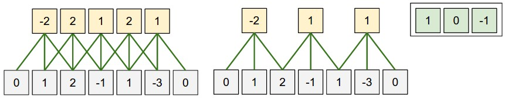
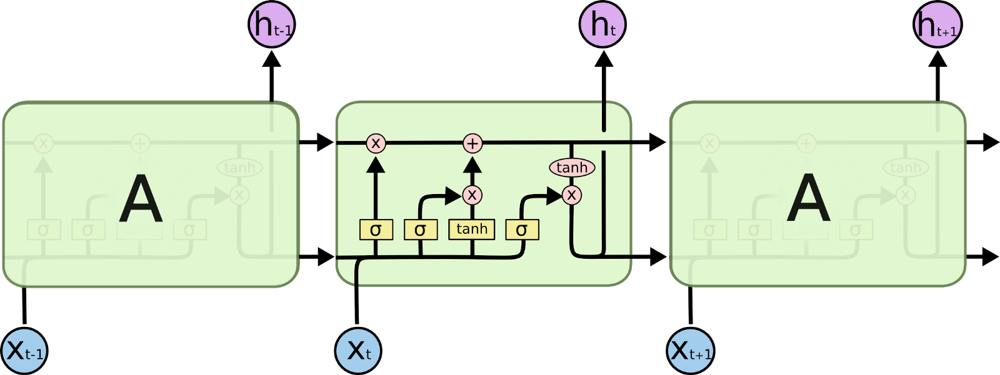
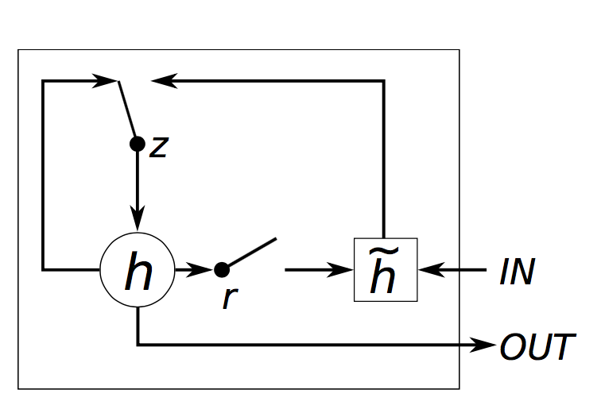
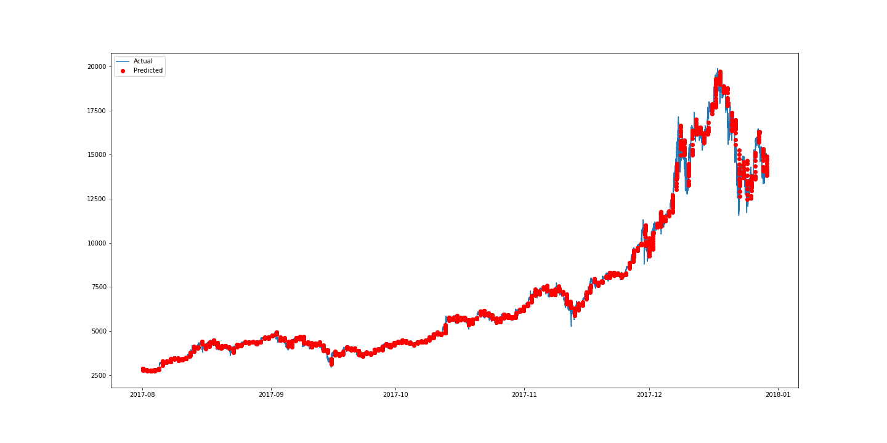
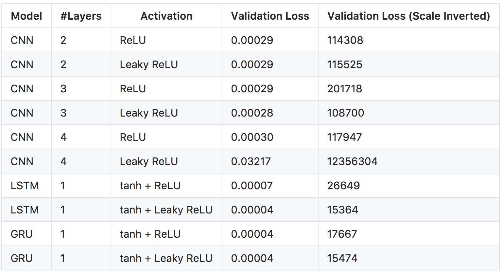
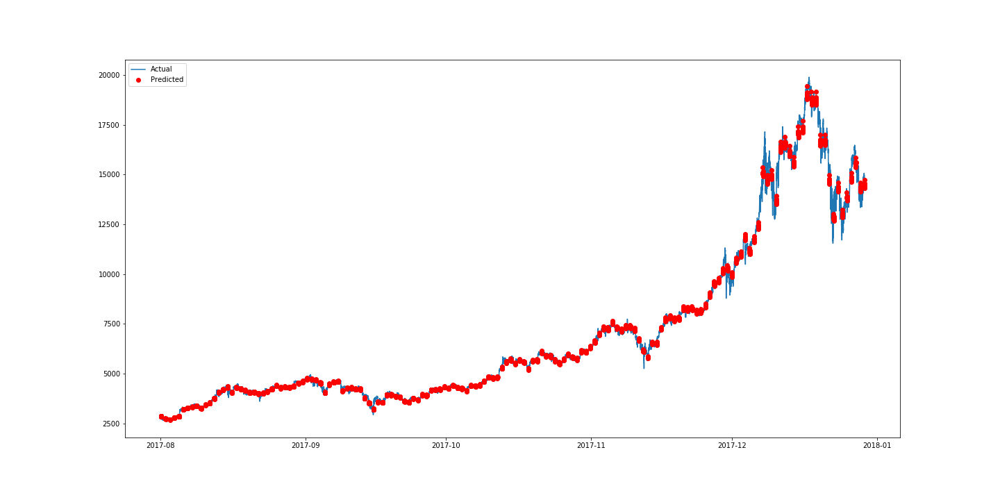
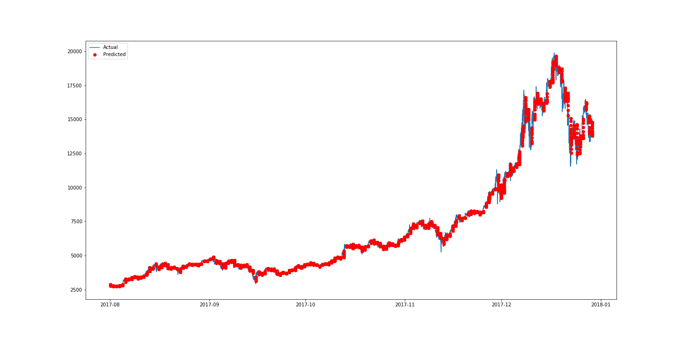
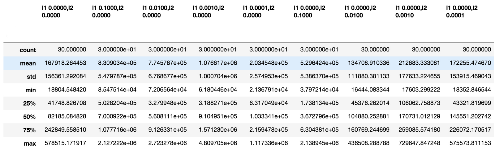

## Tensorflow와 Keras를 활용한 가상화폐 가격 예측하기 💸
[원문 링크](https://medium.com/@huangkh19951228/predicting-cryptocurrency-price-with-tensorflow-and-keras-e1674b0dc58a)
> 이 튜토리얼은 Tensorflow와 Keras를 활용해서 가상화폐 가격을 예측해봅니다.

* Keras
* CNN
* LSTM, GRU

### Introduction

가상화폐, 특히 Bitcoin은 최근 소셜 미디어와 검색 엔진에서 가장 큰 인기를 얻고 있는 것 중 하나입니다. 지능적인 발명 전략을 취한다면 그들(Bitcoin)의 높은 변동성은 높은 수익으로 이어질 수 있습니다! 이제는 전 세계 모든 사람들이 갑자기 가상화폐에 대해 이야기하기 시작한 것 같습니다. 불행히도, index가 부족하기 때문에 기존의 금융상품과 비교할 때 가상화폐는 상대적으로 예측 불가능하죠. 이 튜토리얼은 가상화폐의 미래 추세를 파악하기 위해 Bitcoin을 예로 들어 딥러닝(Deep Learning)으로 이러한 가상화폐의 가격을 예측하는 것을 목표로 합니다.

<br></br>
<br></br>

### Getting Started

아래 코드를 실행하려면 다음 환경과 라이브러리를 설치해야 합니다.

1. Python 2.7
2. Tensorflow=1.2.0
3. Keras=2.1.1
4. Pandas=0.20.3
5. Numpy=1.13.3
6. h5py=2.7.0
7. sklearn=0.19.1

<br></br>
<br></br>

### Data Collection

예측 데이터는 `Kaggle` 또는 `Poloniex`에서 수집할 수 있습니다. 일관성을 유지하기 위해 `Poloniex`에서 수집된 데이터의 열 이름이 `Kaggle`의 열 이름과 일치하도록 변경됩니다.

<br></br>

```python
import json
import numpy as np
import os
import pandas as pd
import urllib2

# poloniex's API에 연결합니다.
url = 'https://poloniex.com/public?command=returnChartData&currencyPair=USDT_BTC&start=1356998100&end=9999999999&period=300'

# API를 통해 얻은 json을 파싱하고, pandas의 DataFrame으로 바꿔줍니다.
openUrl = urllib2.urlopen(url)
r = openUrl.read()
openUrl.close()
d = json.loads(r.decode())
df = pd.DataFrame(d)

original_columns=[u'close', u'date', u'high', u'low', u'open']
new_columns = ['Close','Timestamp','High','Low','Open']
df = df.loc[:,original_columns]
df.columns = new_columns
df.to_csv('data/bitcoin2015to2017.csv',index=None)
view raw
```

<br></br>
<br></br>

### Data Preparation

예측을 위해 소스에서 수집된 데이터를 파싱해야 합니다. 이 [블로그](https://nicholastsmith.wordpress.com/2017/11/13/cryptocurrency-price-prediction-using-deep-learning-in-tensorflow/)의 PastSampler 클래 이용하여 데이터를 분할하여 데이터 리스트와 라벨 리스트를 얻을 수 있습니다. 입력 크기(N)는 256이고 출력 크기(K)는 16입니다. Poloniex에서 수집된 데이터는 5분 단위로 체크 표시됩니다. 이는 입력이 1280분 동안 지속되고 출력이 80분 이상임을 나타냅니다.

<br></br>

```Python
import numpy as np
import pandas as pd

class PastSampler:
    '''
    학습 데이터(training samples)를 과거 데이터를 이용해서 미래를 예측할 수 있도록 형태를 갖춰줍니다.
    '''

    def __init__(self, N, K, sliding_window = True):
        '''
        N개의 과거 데이터를 이용해 K개의 미래를 예측합니다.
        '''
        self.K = K
        self.N = N
        self.sliding_window = sliding_window

    def transform(self, A):
        M = self.N + self.K     #한개의 row당 데이터 개수 (sample + target)
        #indexes
        if self.sliding_window:
            I = np.arange(M) + np.arange(A.shape[0] - M + 1).reshape(-1, 1)
        else:
            if A.shape[0]%M == 0:
                I = np.arange(M)+np.arange(0,A.shape[0],M).reshape(-1,1)

            else:
                I = np.arange(M)+np.arange(0,A.shape[0] -M,M).reshape(-1,1)

        B = A[I].reshape(-1, M * A.shape[1], A.shape[2])
        ci = self.N * A.shape[1]    #한 데이터당 feature 개수
        return B[:, :ci], B[:, ci:] #학습 matrix, 타겟 matrix

#데이터 파일 위치(path)
dfp = 'data/bitcoin2015to2017.csv'

# 가격 데이터 컬럼(열, columns)
columns = ['Close']
df = pd.read_csv(dfp)
time_stamps = df['Timestamp']
df = df.loc[:,columns]
original_df = pd.read_csv(dfp).loc[:,columns]
```

<br></br>

PastSampler 클래스를 만든 후 수집된 데이터에 적용했습니다. 원래 데이터의 범위는 0에서 10000 사이이므로, 신경망이 데이터를 더 쉽게 이해할 수 있도록 데이터 스케일링이 필요합니다.

<br></br>

```Python
file_name='bitcoin2015to2017_close.h5'

from sklearn.preprocessing import MinMaxScaler
scaler = MinMaxScaler()
# normalization
for c in columns:
    df[c] = scaler.fit_transform(df[c].values.reshape(-1,1))

#Features are input sample dimensions(channels)
A = np.array(df)[:,None,:]
original_A = np.array(original_df)[:,None,:]
time_stamps = np.array(time_stamps)[:,None,None]

#Make samples of temporal sequences of pricing data (channel)
NPS, NFS = 256, 16         #과거 데이터, 미래 데이터 개수
ps = PastSampler(NPS, NFS, sliding_window=False)
B, Y = ps.transform(A)
input_times, output_times = ps.transform(time_stamps)
original_B, original_Y = ps.transform(original_A)

import h5py
with h5py.File(file_name, 'w') as f:
    f.create_dataset("inputs", data = B)
    f.create_dataset('outputs', data = Y)
    f.create_dataset("input_times", data = input_times)
    f.create_dataset('output_times', data = output_times)
    f.create_dataset("original_datas", data=np.array(original_df))
    f.create_dataset('original_inputs',data=original_B)
    f.create_dataset('original_outputs',data=original_Y)
```

<br></br>
<br></br>

#### Building Models

##### CNN
1D CNN(Convolutional Neural Network)은 커널이 입력데이터 위를 슬라이딩하면서 지역적인(위치의) 특징을 잘 잡아냅니다. figure1을 한 번 보세요.

<br></br>



*figure1 : CNN Illustration (retrieved from http://cs231n.github.io/convolutional-networks/)*

<br></br>

```Python
import pandas as pd
import numpy as numpy
from keras.models import Sequential
from keras.layers import Dense, Dropout, Activation, Flatten
from keras.layers import Conv1D, MaxPooling1D, LeakyReLU, PReLU
from keras.utils import np_utils
from keras.callbacks import CSVLogger, ModelCheckpoint
import h5py
import os
import tensorflow as tf
from keras.backend.tensorflow_backend import set_session


# 한 개의 GPU만을 사용하도록 설정
os.environ['CUDA_DEVICE_ORDER'] = 'PCI_BUS_ID'
os.environ['CUDA_VISIBLE_DEVICES'] = '1'
os.environ['TF_CPP_MIN_LOG_LEVEL']='2'

config = tf.ConfigProto()
config.gpu_options.allow_growth = True
set_session(tf.Session(config=config))


with h5py.File(''.join(['bitcoin2015to2017_close.h5']), 'r') as hf:
    datas = hf['inputs'].value
    labels = hf['outputs'].value


output_file_name='bitcoin2015to2017_close_CNN_2_relu'

step_size = datas.shape[1]
batch_size= 8
nb_features = datas.shape[2]

epochs = 100

# 데이터를 train, validation 으로 나눔
training_size = int(0.8* datas.shape[0])
training_datas = datas[:training_size,:]
training_labels = labels[:training_size,:]
validation_datas = datas[training_size:,:]
validation_labels = labels[training_size:,:]
#build model

# 2 layers
model = Sequential()


model.add(Conv1D(activation='relu', input_shape=(step_size, nb_features), strides=3, filters=8, kernel_size=20))
model.add(Dropout(0.5))
model.add(Conv1D( strides=4, filters=nb_features, kernel_size=16))

'''
# 3 Layers
model.add(Conv1D(activation='relu', input_shape=(step_size, nb_features), strides=3, filters=8, kernel_size=8))
#model.add(LeakyReLU())
model.add(Dropout(0.5))
model.add(Conv1D(activation='relu', strides=2, filters=8, kernel_size=8))
#model.add(LeakyReLU())
model.add(Dropout(0.5))
model.add(Conv1D( strides=2, filters=nb_features, kernel_size=8))
# 4 layers
model.add(Conv1D(activation='relu', input_shape=(step_size, nb_features), strides=2, filters=8, kernel_size=2))
#model.add(LeakyReLU())
model.add(Dropout(0.5))
model.add(Conv1D(activation='relu', strides=2, filters=8, kernel_size=2))
#model.add(LeakyReLU())
model.add(Dropout(0.5))
model.add(Conv1D(activation='relu', strides=2, filters=8, kernel_size=2))
#model.add(LeakyReLU())
model.add(Dropout(0.5))
model.add(Conv1D( strides=2, filters=nb_features, kernel_size=2))
'''
model.compile(loss='mse', optimizer='adam')
model.fit(training_datas, training_labels,verbose=1, batch_size=batch_size,validation_data=(validation_datas,validation_labels), epochs = epochs, callbacks=[CSVLogger(output_file_name+'.csv', append=True),ModelCheckpoint('weights/'+output_file_name+'-{epoch:02d}-{val_loss:.5f}.hdf5', monitor='val_loss', verbose=1,mode='min')])
```

<br></br>

여기서 빌드한 첫 번째 모델은 CNN로, 사용할 GPU 개수를 "1"로 설정합니다(저는 4개의 GPU를 가지고 있지만, 당신은 원하는 만큼의 GPU를 사용할 수 있습니다). 왜냐하면 Tensorflow로 여러개의 GPUs를 사용하는 것은 그다지 잘 돌아가지 않기 때문에, 사용할 GPU를 1개로 제한하는 것이 더 현명한 방법일지도 모릅니다. 당신이 GPU가 없다고해도 걱정하지마세요. GPU를 설정하는 코드를 가뿐히 무시하면 됩니다.

```Python
os.environ['CUDA_DEVICE_ORDER'] = 'PCI_BUS_ID'
os.environ['CUDA_VISIBLE_DEVICES'] ='1'
os.environ['TF_CPP_MIN_LOG_LEVEL']='2'
```

<br></br>

CNN 모델을 만들기 위한 코드는 아주 간단합니다. dropout 레이어는 overfitting(과적합)을 막아줍니다. loss function(손실함수)는 Mean Squared Error(MSE)로 정의했습니다. optimizer는 Adam을 사용할거에요.

```Python
model = Sequential()
model.add(Conv1D(activation='relu', input_shape=(step_size, nb_features), strides=3, filters=8, kernel_size=20))
model.add(Dropout(0.5))
model.add(Conv1D( strides=4, filters=nb_features, kernel_size=16))
model.compile(loss='mse', optimizer='adam')
```

<br></br>

당신이 걱정해야할 단 한가지는 각 레이어의 입력, 출력 차원(dimension)입니다. 특정 convolutional 계층의 출력을 계산하는 공식은 다음과 같습니다:

> **Output time step = (Input time step — Kernel size) / Strides + 1**

<br></br>

파일의 마지막에, 저는 두개의 callback 함수를 호출할 것입니다. 한 개는 CSVLogger 다른 하나는 ModelCheckpoint 입니다. 첫 번째 CSVLogger 함수는 training, validation 을 트랙킹하는 것을 도와줄 것입니다. 두 번째 ModelCheckpoint 함수는 매 epoch 마다 모델의 가중치(weight)를 저장해 줍니다.

```Python
model.fit(training_datas, training_labels,verbose=1, batch_size=batch_size,validation_data=(validation_datas,validation_labels), epochs = epochs, callbacks=[CSVLogger(output_file_name+'.csv', append=True),ModelCheckpoint('weights/'+output_file_name+'-{epoch:02d}-{val_loss:.5f}.hdf5', monitor='val_loss', verbose=1,mode='min')]
```

<br></br>
<br></br>

#### LSTM

Long Short Term Memory(LSTM) 네트워크는 Recurrent Neural Network(RNN)의 일종입니다. vanilla RNN의 `vanishing gradient problem`을 해결하기 위해 만들어졌습니다. LSTM은 더 긴 시간 동안 입력을 기억할 수 있다고 주장합니다.

<br></br>

> RNN의 `vanishing gradient problem`은 관련된 정보와 그 정보를 참조해야되는 지점(정보를 사용하는 지점)의 사이가 멀어서 Backpropagation(역전파)를 할 때, gradient가 줄어들어 학습 능력이 저하되는 문제입니다. LSTM은 기존의 vanilla RNN에 cell state를 추가하여 과거의 정보가 얼마만큼 유지될 것인지 등을 조절해서 vanishing gradeint problem을 해결합니다.

<br></br>



*figure2 : LSTM Illustration (retrieved from http://colah.github.io/posts/2015-08-Understanding-LSTMs/)*

<br></br>

```Python
import pandas as pd
import numpy as numpy
from keras.models import Sequential
from keras.layers import Dense, Dropout, Activation, Flatten,Reshape
from keras.layers import Conv1D, MaxPooling1D
from keras.utils import np_utils
from keras.layers import LSTM, LeakyReLU
from keras.callbacks import CSVLogger, ModelCheckpoint
import h5py
import os
import tensorflow as tf
from keras.backend.tensorflow_backend import set_session


os.environ['CUDA_DEVICE_ORDER'] = 'PCI_BUS_ID'
os.environ['CUDA_VISIBLE_DEVICES'] = '1'
os.environ['TF_CPP_MIN_LOG_LEVEL']='2'

config = tf.ConfigProto()
config.gpu_options.allow_growth = True
set_session(tf.Session(config=config))

with h5py.File(''.join(['bitcoin2015to2017_close.h5']), 'r') as hf:
    datas = hf['inputs'].value
    labels = hf['outputs'].value


step_size = datas.shape[1]
units= 50
second_units = 30
batch_size = 8
nb_features = datas.shape[2]
epochs = 100
output_size=16
output_file_name='bitcoin2015to2017_close_LSTM_1_tanh_leaky_'
# 데이터를 train, validation 으로 나눔
training_size = int(0.8* datas.shape[0])
training_datas = datas[:training_size,:]
training_labels = labels[:training_size,:,0]
validation_datas = datas[training_size:,:]
validation_labels = labels[training_size:,:,0]


#build model
model = Sequential()
model.add(LSTM(units=units,activation='tanh', input_shape=(step_size,nb_features),return_sequences=False))
model.add(Dropout(0.8))
model.add(Dense(output_size))
model.add(LeakyReLU())
model.compile(loss='mse', optimizer='adam')
model.fit(training_datas, training_labels, batch_size=batch_size,validation_data=(validation_datas,validation_labels), epochs = epochs, callbacks=[CSVLogger(output_file_name+'.csv', append=True),ModelCheckpoint('weights/'+output_file_name+'-{epoch:02d}-{val_loss:.5f}.hdf5', monitor='val_loss', verbose=1,mode='min')])
```

<br></br>

LSTM은 커널 크기, strides, 입력 사이즈 및 출력 사이즈 간의 관계를 신경 쓸 필요가 없으므로 구현이 CNN보다 상대적으로 쉽습니다. 입력 및 출력의 사이즈가 네트워크에서 올바르게 정의되었는지만 확인하세요!

```Python
model = Sequential()
model.add(LSTM(units=units,activation='tanh', input_shape=(step_size,nb_features),return_sequences=False))
model.add(Dropout(0.8))
model.add(Dense(output_size))
model.add(LeakyReLU())
model.compile(loss='mse', optimizer='adam')
```

<br></br>
<br></br>

#### GRU

Gated Recurrent Unit(Gated Recurrent Unit)은 RNN의 또 다른 변형입니다. GRU의 네트워크 구조는 1개의 reset, forget 게이트가 있어서 LSTM보다 덜 정교하지만 GRU의 성능은 LSTM과 동일합니다. 따라서 LSTM 보다 효율성이 더 높다는 주장이 있습니다. (이 튜토리얼에서도 LSTM는 약 45초/epoch, GRU는 40초/epoch 채 걸리지 않기 때문에 주장이 맞다고 할 수 있습니다.)

<br></br>



*figre3 : GRU Illustration (retrieved from http://www.jackdermody.net/brightwire/article/GRU_Recurrent_Neural_Networks)*

<br></br>

```Python
import pandas as pd
import numpy as numpy
from keras.models import Sequential
from keras.layers import Dense, Dropout, Activation, Flatten,Reshape
from keras.layers import Conv1D, MaxPooling1D, LeakyReLU
from keras.utils import np_utils
from keras.layers import GRU,CuDNNGRU
from keras.callbacks import CSVLogger, ModelCheckpoint
import h5py
import os
import tensorflow as tf
from keras.backend.tensorflow_backend import set_session


os.environ['CUDA_DEVICE_ORDER'] = 'PCI_BUS_ID'
os.environ['CUDA_VISIBLE_DEVICES'] = '1'
os.environ['TF_CPP_MIN_LOG_LEVEL']='2'

config = tf.ConfigProto()
config.gpu_options.allow_growth = True
set_session(tf.Session(config=config))

with h5py.File(''.join(['bitcoin2015to2017_close.h5']), 'r') as hf:
    datas = hf['inputs'].value
    labels = hf['outputs'].value


output_file_name='bitcoin2015to2017_close_GRU_1_tanh_relu_'

step_size = datas.shape[1]
units= 50
batch_size = 8
nb_features = datas.shape[2]
epochs = 100
output_size=16
#split training validation
training_size = int(0.8* datas.shape[0])
training_datas = datas[:training_size,:]
training_labels = labels[:training_size,:,0]
validation_datas = datas[training_size:,:]
validation_labels = labels[training_size:,:,0]

#build model
model = Sequential()
model.add(GRU(units=units, input_shape=(step_size,nb_features),return_sequences=False))
model.add(Activation('tanh'))
model.add(Dropout(0.2))
model.add(Dense(output_size))
model.add(Activation('relu'))
model.compile(loss='mse', optimizer='adam')
model.fit(training_datas, training_labels, batch_size=batch_size,validation_data=(validation_datas,validation_labels), epochs = epochs, callbacks=[CSVLogger(output_file_name+'.csv', append=True),ModelCheckpoint('weights/'+output_file_name+'-{epoch:02d}-{val_loss:.5f}.hdf5', monitor='val_loss', verbose=1,mode='min')])
```

<br></br>

간단하게 LSTM을 빌드하는 두 번째 코드라인을 GRU로 바꾸기만 하면 됩니다.

```Python
model.add(LSTM(units=units,activation='tanh', input_shape=(step_size,nb_features),return_sequences=False))
```

을

```Python
model.add(GRU(units=units,activation='tanh', input_shape=(step_size,nb_features),return_sequences=False))
```

로 바꾸세요!

<br></br>
<br></br>

#### Result Plotting

결과가 세 가지 모델과 모두 비슷하기 때문에 CNN 버전만 보여 드리겠습니다. 먼저 모델을 재구성하고 학습된 가중치를 모델에 로드해야 합니다.

<br></br>

```Python
from keras import applications
from keras.models import Sequential
from keras.models import Model
from keras.layers import Dropout, Flatten, Dense, Activation
from keras.callbacks import CSVLogger
import tensorflow as tf
from scipy.ndimage import imread
import numpy as np
import random
from keras.layers import LSTM
from keras.layers import Conv1D, MaxPooling1D, LeakyReLU
from keras import backend as K
import keras
from keras.callbacks import CSVLogger, ModelCheckpoint
from keras.backend.tensorflow_backend import set_session
from keras import optimizers
import h5py
from sklearn.preprocessing import MinMaxScaler
import os
import pandas as pd
# import matplotlib

import matplotlib.pyplot as plt

os.environ['CUDA_DEVICE_ORDER'] = 'PCI_BUS_ID'
os.environ['CUDA_VISIBLE_DEVICES'] = '0'
os.environ['TF_CPP_MIN_LOG_LEVEL']='2'

with h5py.File(''.join(['bitcoin2015to2017_close.h5']), 'r') as hf:
    datas = hf['inputs'].value
    labels = hf['outputs'].value
    input_times = hf['input_times'].value
    output_times = hf['output_times'].value
    original_inputs = hf['original_inputs'].value
    original_outputs = hf['original_outputs'].value
    original_datas = hf['original_datas'].value


scaler=MinMaxScaler()
#split training validation
training_size = int(0.8* datas.shape[0])
training_datas = datas[:training_size,:,:]
training_labels = labels[:training_size,:,:]
validation_datas = datas[training_size:,:,:]
validation_labels = labels[training_size:,:,:]
validation_original_outputs = original_outputs[training_size:,:,:]
validation_original_inputs = original_inputs[training_size:,:,:]
validation_input_times = input_times[training_size:,:,:]
validation_output_times = output_times[training_size:,:,:]

ground_true = np.append(validation_original_inputs,validation_original_outputs, axis=1)
ground_true_times = np.append(validation_input_times,validation_output_times, axis=1)
step_size = datas.shape[1]
batch_size= 8
nb_features = datas.shape[2]

model = Sequential()

# 2 layers
model.add(Conv1D(activation='relu', input_shape=(step_size, nb_features), strides=3, filters=8, kernel_size=20))
# model.add(LeakyReLU())
model.add(Dropout(0.25))
model.add(Conv1D( strides=4, filters=nb_features, kernel_size=16))
model.load_weights('weights/bitcoin2015to2017_close_CNN_2_relu-44-0.00030.hdf5')
model.compile(loss='mse', optimizer='adam')
```

<br></br>

데이터 프레임에 실제 가격(실제 가격)과 비트코인의 예상 가격이 존재합니다. 시각화를 위해 표시된 수치는 2017년 8월과 그 이후의 데이터만 보여줍니다.

<br></br>

```pythonn
ground_true_df = pd.DataFrame()
ground_true_df['times'] = ground_true_times
ground_true_df['value'] = ground_true

prediction_df = pd.DataFrame()
prediction_df['times'] = validation_output_times
prediction_df['value'] = predicted_inverted

prediction_df = prediction_df.loc[(prediction_df["times"].dt.year == 2017 )&(prediction_df["times"].dt.month > 7 ),: ]
ground_true_df = ground_true_df.loc[(ground_true_df["times"].dt.year == 2017 )&(ground_true_df["times"].dt.month > 7 ),:]
```
<br></br>

pyplot을 이용해서 플롯을 그립니다. 예상 가격은 16분 기준이기 때문에, 그것들 모두를 연결하지 않는 것이 결과가 더 쉽게 이해될 것입니다. 따라서 여기서 예측 데이터는 세 번째 행의 "ro"가 나타내는 빨간색 점으로 표시됩니다. 아래 figure4에 보이는 그래프의 파란색 선은 실제 데이터를 나타내며 빨간색 점은 예상되는 비트코인 가격을 나타냅니다.

```pythonn
plt.figure(figsize=(20,10))
plt.plot(ground_true_df.times,ground_true_df.value, label = 'Actual')
plt.plot(prediction_df.times,prediction_df.value,'ro', label='Predicted')
plt.legend(loc='upper left')
plt.show()
```

<br></br>



*figure4: Best Result Plot for Bitcoin Price Prediction With 2-Layered CNN*

<br></br>

figure4에서 볼 수 있듯이, 예측된 값은 비트코인의 실제 가격과 매우 유사합니다. 가장 좋은 모델을 선택하기 위해, 저는 아래 figure5 표를 만들어서 네트워크의 몇 가지 구성을 테스트하기로 결정했습니다.

<br></br>



*figure5 : Prediction Results for Different Models*

<br></br>

figure5에 보이는 표는 100번의 학습 epochs에서 가장 우수한 validation loss(손실)를 도출하는 모델을 보여줍니다. 우리는 LeakyReLU가 ReLU보다 더 적은 손실을 발생시키는 것으로 볼 수 있습니다. 하지만 활성함수(activation function)로 LeakyReLU를 사용한 4-layer(레이어) CNN이 큰 validation loss를 발생시킵니다. 이것은 다시 validation이 필요할 수 있는 모델의 잘못된 배치 때문일 수 있습니다. 또한 표를 보고 CNN 모델은 LSTM, GRU 보다 퍼포먼스는 조금 나쁘지만 굉장히 빠르게 학습 (2초/ epoch, GPU사용)될 수 있다는 것을 알 수 있습니다. 3-layer CNN이 데이터의 지역적 특징을 잘 잡아내는 것처럼 보이지만, 가장 좋은 모델은 LSTM을 tanh와 LeakyReLU를 사용한 것입니다.

<br></br>



*figure6 : LSTM with tanh and Leaky ReLu as activation function*

<br></br>



*figure7 : 3-layered CNN with Leaky ReLu as activation function.*

<br></br>

비록 예측된 결과가 좋아보여도, overfittinng(과적합)의 걱정이 있습니다. LSTM을 LeakyReLU로 학습할 때의 loss(손실)과 validation(검증)의 loss에는 갭이 있습니다(5.97E-06 vs 3.92E-05). 이 손실을 최소화 하기 위해서 Regularization(정규화)가 필요합니다.

<br></br>

#### Regularization

가장 좋은 regularization 전략을 찾기 위해서, L1 regularization, L2 regularization으로 몇 개의 실험을 했습니다. 첫 번째로 우리는 LSTM에 데이터를 쉽게 피팅시킬 수 있는 새로운 기능을 정의해야 합니다. 저는 bias를 벡터에 대한 regularization인 bias regularizer를 예로 들겠습니다.

<br></br>

```python
def fit_lstm(reg):
    global training_datas, training_labels, batch_size, epochs,step_size,nb_features, units
    model = Sequential()
    model.add(CuDNNLSTM(units=units, bias_regularizer=reg, input_shape=(step_size,nb_features),return_sequences=False))
    model.add(Activation('tanh'))
    model.add(Dropout(0.2))
    model.add(Dense(output_size))
    model.add(LeakyReLU())
    model.compile(loss='mse', optimizer='adam')
    model.fit(training_datas, training_labels, batch_size=batch_size, epochs = epochs, verbose=0)
    return model
```
<br></br>

실험은 모델을 30번 각각 30 epochs씩 진행합니다.

<br></br>

```python
def experiment(validation_datas,validation_labels,original_datas,ground_true,ground_true_times,validation_original_outputs, validation_output_times, nb_repeat, reg):
    error_scores = list()
    #get only the close data
    ground_true = ground_true[:,:,0].reshape(-1)
    ground_true_times = ground_true_times.reshape(-1)
    ground_true_times = pd.to_datetime(ground_true_times, unit='s')
    validation_output_times = pd.to_datetime(validation_output_times.reshape(-1), unit='s')
    for i in range(nb_repeat):
        model = fit_lstm(reg)
        predicted = model.predict(validation_datas)
        predicted_inverted = []
        scaler.fit(original_datas[:,0].reshape(-1,1))
        predicted_inverted.append(scaler.inverse_transform(predicted))
        # since we are appending in the first dimension
        predicted_inverted = np.array(predicted_inverted)[0,:,:].reshape(-1)
        error_scores.append(mean_squared_error(validation_original_outputs[:,:,0].reshape(-1),predicted_inverted))
    return error_scores

regs = [regularizers.l1(0),regularizers.l1(0.1), regularizers.l1(0.01), regularizers.l1(0.001), regularizers.l1(0.0001),regularizers.l2(0.1), regularizers.l2(0.01), regularizers.l2(0.001), regularizers.l2(0.0001)]
nb_repeat = 30
results = pd.DataFrame()
for reg in regs:

    name = ('l1 %.4f,l2 %.4f' % (reg.l1, reg.l2))
    print "Training "+ str(name)
    results[name] = experiment(validation_datas,validation_labels,original_datas,ground_true,ground_true_times,validation_original_outputs, validation_output_times, nb_repeat,reg)

results.describe().to_csv('result/lstm_bias_reg.csv')
results.describe()
view rawdef experiment(validation_datas,validation_labels,original_datas,ground_true,ground_true_times,validation_original_outputs, validation_output_times, nb_repeat, reg):
    error_scores = list()
    #get only the close data
    ground_true = ground_true[:,:,0].reshape(-1)
    ground_true_times = ground_true_times.reshape(-1)
    ground_true_times = pd.to_datetime(ground_true_times, unit='s')
    validation_output_times = pd.to_datetime(validation_output_times.reshape(-1), unit='s')
    for i in range(nb_repeat):
        model = fit_lstm(reg)
        predicted = model.predict(validation_datas)
        predicted_inverted = []
        scaler.fit(original_datas[:,0].reshape(-1,1))
        predicted_inverted.append(scaler.inverse_transform(predicted))
        # since we are appending in the first dimension
        predicted_inverted = np.array(predicted_inverted)[0,:,:].reshape(-1)
        error_scores.append(mean_squared_error(validation_original_outputs[:,:,0].reshape(-1),predicted_inverted))
    return error_scores

regs = [regularizers.l1(0),regularizers.l1(0.1), regularizers.l1(0.01), regularizers.l1(0.001), regularizers.l1(0.0001),regularizers.l2(0.1), regularizers.l2(0.01), regularizers.l2(0.001), regularizers.l2(0.0001)]
nb_repeat = 30
results = pd.DataFrame()
for reg in regs:

    name = ('l1 %.4f,l2 %.4f' % (reg.l1, reg.l2))
    print "Training "+ str(name)
    results[name] = experiment(validation_datas,validation_labels,original_datas,ground_true,ground_true_times,validation_original_outputs, validation_output_times, nb_repeat,reg)

results.describe().to_csv('result/lstm_bias_reg.csv')
results.describe()
view raw
```

<br></br>

만약 당신이 Jupyter notebook을 사용하고 있다면, 아래의 figure8에 보이는 표를 결과로부터 바로 확인해볼 수 있습니다.

<br></br>



*figure8 : Result of Running Bias Regularizer*

<br></br>

```python
results.describe().boxplot()
plt.show()
```

<br></br>

비교를 위해 결과를 시각화하기 위해, boxplot을 사용하면 됩니다:


*figure9*

<br></br>

비교에 따르면 bias 벡터에 대한 계수 0.01의 L2 정규화기가 최선의 결과를 도출하는 것으로 보입니다.
activation, bias, 커널, recurrent 매트릭스 등의 모든 regularizer 중에서 최상의 조합을 확인하려면 모든 매트릭스를 하나씩 테스트해야 하는데, 이는 현재 하드웨어 구성으로는 어려워 보입니다. 결과적으로, 저는 그것을 미래 계획으로 남길 것입니다.

<br></br>
<br></br>

#### Conclusion

당신은 아래의 튜토리얼을 진행하면서 아래의 5가지를 배웠습니다.

1. 실시간 비트코인 데이터 수집 방법.
2. 학습 및 테스트를 위한 데이터 준비 방법.
3. 딥러닝을 사용하여 비트코인의 가격을 예측하는 방법.
4. 예측 결과를 시각화하는 방법.
5. 모델에 정규화를 적용하는 방법.

이 튜토리얼의 향후 작업은 최고의 모델에 맞는 최고의 hyperparameter(하이퍼파라미터)를 찾고, 소셜 미디어를 사용하여 추세를 보다 정확하게 예측하는 것입니다. 제가 미디엄으로 게시하는 것은 이번이 처음입니다. 실수나 질문이 있을 경우 주저하지 말고 아래에 코멘트를 남겨 주십시오.

더 많은 정보를 원하시면, 제 [Github](https://github.com/khuangaf/CryptocurrencyPrediction)을 참조하시고, 더 위대한 딥러닝 블로그 포스트들을 위해 twitter에서 저를 follow 하는 것을 잊지마세요!

<br></br>
<br></br>

#### 참고자료
[RNN과 LSTM을 이해해보자!](https://ratsgo.github.io/natural%20language%20processing/2017/03/09/rnnlstm/)
[원문 github 코드](https://github.com/khuangaf/CryptocurrencyPrediction)

<br></br>

> 이 글은 2018 컨트리뷰톤에서 Contribute to Keras 프로젝트로 진행했습니다.
>
> Translator: 박정현
>
> Translator email : parkjh688@gmail.com
