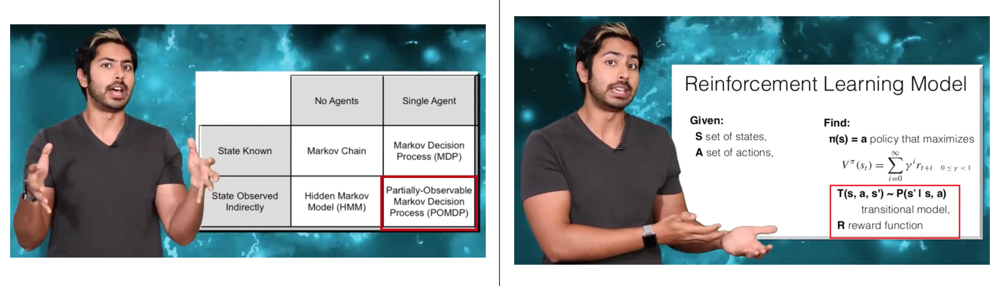

# Keras를 활용한 주식 가격 예측


> 이 문서는 Keras 기반의 딥러닝 모델(LSTM, Q-Learning)을 활용해 주식 가격을 예측하는 튜토리얼입니다. 유명 딥러닝 유투버인 Siraj Raval의 영상을 요약하여 문서로 제작하였습니다. 이 문서를 통해 Keras를 활용하여 간단하고 빠르게 주식 가격을 예측하는 딥러닝 모델을 구현할 수 있습니다.

- 주식 예측

- LSTM

- Q-learning

- 강화학습


모두 부자가 되고 싶지 않으세요? 부자가 되기 위해서는 일해서 얻는 근로 소득 외에도 일하지 않고 얻는 불로 소득(e.g. 투자 이윤)을 확보하는 것이 중요한데요. 프로그래밍을 할 수 있다면 **자동화된 트레이딩 봇**을 통해 불로 소득을 창출할 수 있습니다! 그것도 꽤 간단하게 몇 가지 단계만 거치면 자동화된 트레이딩 봇을 만들 수 있죠. 이 튜토리얼에서는 주식 가격을 예측하거나, 최적화된 거래 시기를 찾아주는 트레이딩 봇을 만드는 방법에 대해 알려드리고자 합니다. 


이 튜토리얼은 같은 주제의 여러 영상을 통합하여 정리한 내용을 담고 있습니다. 튜토리얼에서 쓰인 코드와 주된 설명은 유명 유투버 Siraj Raval를 비롯한 개발자들에 의해 제작되었음을 밝힙니다. 원만한 이해를 돕기 위해 역자가 영상의 내용 및 코드를 적절히 편집하여 다시 작성했습니다. 역자의 개인적인 의견도 다수 포함되어 있습니다.

이 튜토리얼을 제작하는 데 참고한 원본 영상과 Github Repository는 이 문서의 하단에 정리되어 있습니다.


## LSTM을 활용한 S&P 종가 예측

원본 코드와 데이터는 [여기](https://github.com/llSourcell/How-to-Predict-Stock-Prices-Easily-Demo)에서 확인할 수 있습니다.

> 유의: 이 코드는 python 2를 기반으로 작성되었습니다. 만약 python 3에서 실행하고 싶으시다면 `lstm.py` 코드 내의 `print`와 `xrange` 함수만 적절히 수정해주시면 가능합니다.

### 사용할 데이터

우리는 S&P 500 지수 데이터를 사용하려고 합니다. S&P 500이란 국제 신용평가기관인 미국의 스탠다드 푸어스(Standard & Poors, 약칭 S&P)가 작성한 주가 지수로, 500개 대형기업(대부분이 미국 기업)의 주식을 포함한 지수입니다. 우리가 사용할 데이터는 `sp500.csv` 파일에 들어있으며, S&P 500의 2000년 1월부터 2016년 8월까지의 종가(장 마감 시점의 가격)로 구성되어 있습니다. 


### 데이터 불러오기 및 전처리

```python
from keras.layers.core import Dense, Activation, Dropout
from keras.layers.recurrent import LSTM
from keras.models import Sequential
import lstm, time #도움을 주는 라이브러리들
```

`lstm.py`에는 데이터를 불러오는 `load_data`나 전처리를 해주는 `normalise_windows`과 같은 유용한 함수들이 미리 작성되어 있습니다. 이런 함수들을 활용해 빠르고 간단하게 모델 생성과 전처리를 진행해봅니다.


```python
#1단계: 데이터 불러오기
X_train, y_train, X_test, y_test = lstm.load_data('sp500.csv', 50, True)
#데이터 확인
print(X_train)
```

=> [[\[0.][0.00751348]\[0.00370998]...,[0.02149596]\[0.01727155]\[0.02352239]]]]...

데이터를 불러온 후 출력해보면, 0부터 1사이의 값으로 이루어져 있다는 것을 알 수 있습니다.

이는 `load_data`내의 `normalise_windows` 함수에서 먼저 `정규화(normalization)`를 해주기 때문인데요. 신경망이 빠르고 수월하게 학습하려면 데이터들을 -1과 1 사이의 값으로 작게 만들어야 합니다. 그래서 우리가 다루려는 S&P 500 데이터의 경우  첫 데이터인 2000년 1월 첫 거래일의 종가를 기준으로 각 종가가 얼마나 증가했는지 그 비율을 구해줍니다. 이런 방법을 통해 주가 데이터의 `정규화`를 할 수 있습니다. 코드와 수식으로 표현하자면 다음과 같습니다.

```python
def normalise_windows(window_data):
    normalised_data = []
    for window in window_data:
        normalised_window = [((float(p) / float(window[0])) - 1) for p in window]
        normalised_data.append(normalised_window)
    return normalised_data
```


이 때 p_i는 변환하고자 하는 종가, p_0는 첫 거래일의 종가를 뜻합니다. 학습 후 예측한 값을 다시 비율이 아닌 원래 값으로 되돌리고 싶다면(denormalization), 다음과 같은 수식을 활용하면 됩니다.


### 모델 생성과 학습

다음은 모델을 생성해볼 차례입니다. 우리는 `LSTM(Long Short Term Memory)` 모델을 사용하려고 합니다. `LSTM`을 사용하려는 이유는 주가 데이터가 순서가 있는 `시계열(Time-series)` 데이터이기 때문입니다.


`LSTM`은 `RNN(Recurrent Neural Network)`의 일종입니다. `RNN`은 학습을 할 때 현재 입력값뿐만 아니라 이전에 들어온 입력값을 함께 고려하기 때문에 `시계열 데이터`를 학습하기에 적합합니다. 신경망 중간에 있는 `히든 레이어`의 결과값들이 다시 입력값으로 들어가기 때문에 순환(Recurrent) 신경망(Neural Network)이라는 이름이 붙었습니다.

그러나 `RNN`은 만약 데이터가 너무 길어져 이를 표현하는 신경망이 깊어져야만 할 경우 문제가 발생합니다. `RNN`은 `역전파(Backpropagation)`라는 방법을 통해 학습하는데, 위와 같은 경우 그래디언트가 너무 작아져 학습이 잘 안 되는 문제(Vanishing Gradient Problem)가 발생하는 것입니다. 이 문제를 해결하기 위해 `LSTM`이 만들어졌습니다. 


`LSTM`은 `셀 스테이트(cell state)`라는 개념을 도입하여 그 내부에 있는 `게이트(gate)`들을 통해 어떤 정보를 기억하고 어떤 정보를 버릴지 추가적인 학습을 가능하게 합니다. 이를 통해 `RNN`이 가진 문제(Vanishing Gradient Problem)를 해결할 수 있었습니다.

`LSTM`에 대한 보다 자세한 설명은 [여기](https://brunch.co.kr/@chris-song/9)를 참고하면 좋을 것 같습니다.


그럼 다시 우리가 풀던 문제로 돌아가볼까요. 다음과 같은 코드로 `LSTM` 모델을 생성합니다.

```python
#2단계: 모델 생성
model = Sequential()

model.add(LSTM(
    input_dim=1,
    output_dim=50,
    return_sequences=True))
model.add(Dropout(0.2))

model.add(LSTM(
    100,
    return_sequences=False))
model.add(Dropout(0.2))

model.add(Dense(
    output_dim=1))
model.add(Activation('linear'))

start = time.time()
model.compile(loss='mse', optimizer='rmsprop')
print 'compilation time : ', time.time() - start
```

입력으로 들어가는 데이터는 1차원이기 때문에 이 에 따라 `input_dim`을 설정합니다. 다음 `LSTM` 레이어로 들어가는 입력값을 설정하기 위해 `output_dim` 값을 정하고 `return_sequences`을 `True`로 설정해줍니다. 또 `과적합(overfitting)`을 피하기 위한 `드롭아웃(dropout)`을 20%로 설정합니다. 

다음 `LSTM` 레이어에서는 노드를 100개, 그리고 마지막 `Dense` 레이어에 들어가기 전이므로 `return_sequences`를 `False`로 설정해줍니다. 마찬가지로 `과적합(overfitting)`을 피하기 위해 `드롭아웃(dropout)`을 20%로 설정합니다. 

마지막으로 `Dense` 레이어와 `linear` 활성화 함수(activation function)을 통해 마지막 결과값을 계산해줍니다.

그리고 모델의 학습 과정을 정해주는데요. `회귀(Regression)` 문제를 풀 때 가장 일반적인 `손실 함수(loss function)`인 `평균 제곱근 편차(Mean Squared Error, MSE)`를 설정하고, `최적화 방법(Optimization)`으로는 `RMSProp`을 설정해줍니다.


그 후 다음과 같은 코드를 통해 모델을 학습합니다.

```python
#3단계: 모델 학습
model.fit(
    X_train,
    y_train,
    batch_size=512,
    nb_epoch=1,
    validation_split=0.05)
```


### 주가 예측 시각화하기

다음과 같은 코드를 통해 앞으로의 추세를 그려볼 수 있습니다.

```python
#4단계: 주가 예측한 것을 그려보자!
predictions = lstm.predict_sequences_multiple(model, X_test, 50, 50)
lstm.plot_results_multiple(predictions, y_test, 50)
```

=>


간단한 학습만으로도 비교적 잘 예측하는 모습을 보여줍니다. 자, 그럼 이제 돈을 벌러 가 볼까요?


## `강화학습`을 활용한 주식 가격 예측

자, 이번엔 `강화학습`을 주식 시장에 적용해볼까요?

다만 `강화학습`을 활용하기 전에, 먼저 `지도학습(supervised)` 으로 학습시킨 딥러닝 모델을 활용한 트레이딩 방법에 대해 알아보도록 하겠습니다. 그리고 나서 둘을 비교해보도록 하죠.

### `지도학습`모델을 활용한 트레이딩 방법

만약에 주식 가격이 올라갈 것이라고 예측한다면, 주식을 지금 산 뒤 오르고 나서 팔면 됩니다. 반대로, 주식 가격이 내려갈 것 같으면, 공매도(주식을 빌려서 팔고 일정 시간이 지난 뒤 다시 사서 돌려주는 것)를 해서 지금 팔고 나중에 가격이 내려간 뒤 사면 됩니다. 그렇다면 문제는, **'어떻게 주식을 예측할 것인가'** 겠죠? 사실 주식 가격은 그렇게 쉽게 정해지는 것이 아닙니다. 우리가 어떤 주식을 검색했을 때 당장 보이는 가격, 그 하나의 가격에 우리가 원하는 모든 주식의 수량만큼 살 수는 없습니다. 우리가 실제로 사게 되는 주식의 가격은 지금 당장 시장에서 거래되는 주식의 거래량에 따라, 호가창에 나와 있는 매수/매도 잔량에 따라, 또 거래 수수료에 따라 달라지기 마련이죠.


그래서 우리는 `지도학습`으로 주식 가격을 예측할 때는 호가창 내의 중간 가격(Midprice)을 예측하려고 합니다. 사실 이 가격은 우리가 주식을 주문했을 때 실제 체결되는 정확한 가격은 아니지만, 이론적으로 현재 매수와 매도 가격의 중간 가격이기 때문에 중요합니다. 현재 호가창의 상태가 어떤지에 따라 그 매수-매도 사이의 가격 스프레드(spread)는 크게 차이가 날 수 있습니다.


주의해야 할 점은, 우리가 지금 딥러닝 모델을 활용해 가격을 예측하려고 하지만, 이 모델은 네트워크 지연 시간(network latency), 수수료, 가장 유리한 호가 수준에서의 유동성 등을 고려하지 않는다는 점입니다. 그래서 이런 단순한 주가 예측 전략으로 돈을 벌기 위해서는 장기적으로 봤을 때의 큰 가격 변동을 예측하거나, 수수료 또는 매수/매도 주문 관리를 똑똑하게 하는 것이 필요합니다. 하지만 이것은 쉬운 문제가 아니죠.

그리고 만약 `지도학습`으로 학습을 시켰다면, 전략의 변화가 없기 때문에 생기는 문제도 있습니다. 운이 좋게 우리가 예측한 대로 가격이 오르면 좋겠지만, 만약 그게 아니라 가격이 내려간다면 어떻게 해야 할까요? 혼란에 빠진 짐승처럼 주식을 가져다 팔아야 할까요? 만약 가격이 올랐다가 다시 내려가는 경우는 어떨까요? 또, 우리가 주식 매수/매도 주문을 넣기 위해서는 모델이 얼마 정도의 확신(certainty)를 가질 때를 기준으로 해야 할까요? 

그래서 우리는 단순히 주식 가격을 예측하는 것 이상의 모델을 만들어야 합니다. 모델이 예측한 주식 가격을 입력받아 매수/매도 주문을 넣을지, 그냥 보유하고 있을지, ~~춤을 출지~~ 등의 행동을 결정하는  `규칙 기반의 정책(Rule based policy)`이 필요합니다. 하지만 어떻게 이 모든 정책에 필요한 파라미터(policy parameter)를 최적화할 수 있을까요? 휴리스틱이나 인간의 직관은 이런 것을 결정하는 데 약간의 도움만 될 뿐입니다.


### `강화학습`을 활용한 트레이딩 방법

그렇다면 이에 대한 해결책은.. `강화학습`을 활용한 트레이딩입니다. 다음과 같은 방식으로 `강화학습` 문제를 설계할 수 있는데요.


#### 강화학습이란?

- `환경(Environment)` 내에서 `행동(action)`을 취하는 `에이전트(agent)`가 있습니다. 

- 이 `에이전트`는 매 시간 단위(time step)마다 현재 `상태(state)`를 입력으로 받고, `행동`을 취한 뒤 이에 따른 `보상(reward)`과 다음 `상태`를 받습니다. 

- 이 `에이전트`는  `정책(policy)`에 따라 어떤 `행동`을 할지를 결정하는데요. 

- 우리의 목표는 주어진 기간 동안 누적 `보상`을 최대한으로 얻는 `정책`을 찾아내는 것입니다. 


#### 주식 시장에서의 강화학습이란?

주식 시장에서의 관점으로는, 

- `에이전트`가 바로 우리가 만드려는 트레이딩 봇이고, 
- 이것이 언제 주식을 사고 팔지를 결정하는 `행동`을 하며,
-  `환경`은 우리가 주식을 사고파는 시장이 됩니다. 
- 이 환경의 `상태`에 대해 설명하자면, 완전정보적(complete)이지 않습니다. 우리는 다른 `에이전트`들에 대해서 자세히 알 수 없고, 계좌 잔액이나 그들이 넣은 대기 주문에 대해서도 알 수 없죠. 우리가 관찰할 수 있는 것은 `환경` 내의 정확한 `상태`라기보다는 그것에서부터 파생된 제한적인 정보를 가진 `상태`인 것입니다. 

- 매 시간 단위마다 우리가 알 수 있는 것은 그때까지 체결된 거래 기록들과 우리의 계좌 잔액 정도입니다.

트레이딩 봇이 거래하는 시간 간격도 상당히 중요한데요, 며칠 간격으로 거래를 해야 할까요? 나노 초(ns) 단위는 어떤가요? 초단타매매용 트레이딩 봇은 나노 초 단위로 거래합니다.


딥러닝은 복잡한 문제를 풀 수 있는 것으로 잘 알려져 있습니다. 많은 데이터를 입력으로 받아 학습하여 패턴을 찾죠. 그러나 딥러닝은 상대적으로 느립니다. 나노 초 단위로 결정을 내릴 수는 없기 때문에, 초단타매매용 봇을 이길 수는 없죠. 

그래서 우리는 사람이 데이터를 분석하는 것보다 빠르게 결정을 내리며 (물론 초단타매매매처럼 나노 초 단위까지는 가지 못하겠지만요), 대신 더 똑똑하여 초단타매매용 봇을 이길 수 있는 트레이딩 봇을 만들고자 합니다.

사실 `강화학습`의 트레이딩 전략은 어떤 측면에서는 `지도학습` 방식의 트레이딩 전략보다 간단할 수도 있습니다. `지도학습`은 가격을 예측하는 모델 외에도 직접 수작업으로 만든 `규칙 기반의 정책`(예-모델이 80% 이상의 확신을 할 때 사거나 팔기, ~~스카이넷 작동시키기~~)이 필요합니다. 하지만 `강화학습`은 그런 것이 모두 학습한 `정책` 내에 포함되어 있습니다. 그래서 더 강력하고 사람을 뛰어넘을 수도 있죠. 또 네트워크 지연이나 실수 같은 것까지 `환경` 내에서 시뮬레이션하여 트레이딩 봇을 학습시킬 수도 있습니다. 


### Q Learning을 활용한 트레이딩 봇 만들기


#### 마르코프 결정 프로세스(MDP, Markov Decision Process)


트레이딩 봇을 만들기 위해, 주식시장을 강화학습 문제로 좀 더 정교하게 모델링해봅시다. 강화학습 문제를 풀기 위해서는 풀고자 하는 문제를 `상태`, `행동`, `상태 전이 확률(State transition probability)`, `보상`으로 정의하는 마르코프 결정 프로세스가 필요합니다. 주식시장에서의 `상태`와 `행동` 등에 대해 위에서 간단하게 언급하기는 했지만, 이번에는 좀 더 자세히 들여다봅시다.

- `상태`: `상태`는 우리가 가진 **주식의 개수**와 **현재 주식의 가격**, 그리고 **계좌의 잔액**으로 정의할 수 있습니다. 만약 우리가 구글 주식 50주(주당 \$100)와 아마존 주식 20주(주당 \$230) 가지고 있고 계좌 잔액으로 \$1500이 있다면, `상태`는 [50, 100, 20, 230, 1500]과 같이 할 수 있습니다.

- `행동`: 주어진 상태에서 `에이전트`는 **매수**, **매도**, **보유**라는 3가지 `행동`을 할 수 있습니다. 주식마다 3가지 `행동`을 할 수 있기 때문에, 만약 우리가 포트폴리오 내에 n개의 주식을 가지고 있다면 `에이전트`가 할 수 있는 `행동`의 개수는 **3^n**개입니다.

- `보상`: `보상`을 공식화하는 방법은 정말 많습니다. 그리고 좋은 `보상` 함수를 만드는 것이 좀 더 빠르게 학습하는 데 도움이 되죠. 다음과 같은 방법들 중에 뭐가 더 좋은 방법일까요?

  1. 현재 포트폴리오 가치가 처음 포트폴리오 가치보다 높으면 +1, 아니면 -1

  2. 현재 포트폴리오 가치가 처음 포트폴리오 가치보다 높으면 +1, 아니면 -1000

  3. 이전 시점과 현재 시점의 가치를 비교했을 때, 그 가치의 차이만큼 +/- 

  

  사실 여기에 정답은 없지만, 첫번째와 두번째 방법은 위와 같은 그래프의 경우 잘 학습하지 못하게 됩니다. 그래서 우리는 세번째 `보상` 방법을 선택할 것입니다.


그렇다면 `상태 전이 확률`은 어떻게 정의할까요?



주의해야 할 점은, 위에서 얘기했듯 우리에게 관찰 가능한 `상태`가 완전하지 않다는 점입니다. 주식시장에는 다양한 참여자가 있고, 우리는 그들의 결정 과정을 알지 못하기 때문에 '부분적으로만 관찰 가능'하죠. 따라서 우리가 풀고자 하는 주식 시장 문제에서 `상태 전이 확률`은 주어지지 않습니다. 따라서 기존의 `모델 기반(model-based) 강화학습` 방법론에 따르면 우리는 이 `상태 전이 확률`에 대한 함수를 직접 구해야 합니다.


#### Q Learning


`강화학습`의 종류에는 `모델 기반(model-based) 강화학습`과 `모델 프리(model-free) 강화학습`이 있습니다. 여기서 모델이란 마르코프 결정 프로세스에서의 `상태 전이 확률`에 대한 모델을 뜻합니다. 그래서 만약 `모델 기반 강화학습`을 하고 싶다면, `상태 전이 확률`에 대한 함수를 추정하고 난 후에야 학습을 할 수 있습니다. 하지만 `모델 프리 강화학습` 방법을 사용한다면, 이 모델을 당장은 알지 못하더라도 학습이 가능합니다. `모델 프리 강화학습`에서는 `에이전트`가 `환경` 내에서 `행동`을 하고, 그 결과로 주어지는 `보상`과 다음 `상태`를 받아 학습에 활용하면 됩니다. `상태 전이 확률`에 대한 모델을 열심히 새로 찾아 학습하는 것보다 훨씬 간단한 과정이죠.


Q Learning은 이러한 `모델 프리 강화학습`에서 가장 유명한 학습 방법입니다. Q Learning에서는 현재 `상태`에서 어떤 `행동`을 했을 때  `보상`의 기대값을 계산하는 Q 함수, Q(`상태`,`행동`)값을 학습하고 추정합니다. 그리고 결국 `강화학습`의 목적은 `보상`을 최대한으로 얻는 `정책`을 찾아내는 것인데, Q Learning의 경우 학습 과정이 진행됨에 따라 `보상`을 보다 잘 계산하는 Q 함수를 찾게 됩니다. 그러므로 Q 함수에 따른 최대 `보상`값을 주는 `행동`을 따라가는 것이 바로 `정책`이라 할 수 있죠.


Q Learning은 다음과 같은 순서로 이루어집니다.

1. 먼저 임의로 Q 함수를 초기화합니다.
2. 그리고 Q 함수와 `정책`에 따라, `보상`을 최대화해주는 `행동`을 선택합니다.
3. `행동`을 한 뒤, 이에 따른 `보상`과 다음 `상태`를 관찰합니다.
4. 이에 따라 Q 함수를 업데이트 해줍니다.
5. 다시 2번, `행동`을 선택하는 단계로 돌아가 반복합니다. 이러한 하나의 반복을 `에피소드`라 합니다.
6. 학습이 끝나고 나면 `행동`의 `보상`값을 잘 예측해주는 새로운 Q 함수를 얻을 수 있습니다.


이러한 Q Learning에 있어, Q 함수를 Deep Neural Network로 구성하면 그게 바로 **Deep Q Learning**이 됩니다. 우리는 이러한 Deep Q Network를 활용해 트레이딩 봇을 만들 것입니다.


그럼 알고리즘에 대해서 이해했으니, 실제 데이터에 적용하러 가봅시다!


#### 활용할 코드와 데이터

원본 코드와 데이터는 [여기](https://github.com/llSourcell/Q-Learning-for-Trading)에서 확인할 수 있습니다. `Python 2.7.`로 쓰여 있습니다.

- `agent.py`: Deep Q Learning `에이전트`가 구현되어 있습니다.
- `envs.py`: 3개의 주식에 대한 거래 환경이 구현되어 있습니다.
- `model.py`: Q 함수로 쓰이는 Multi-layer Perceptron이 구현되어 있습니다.
- `utils.py`: 유용한 함수들이 포함되어 있는 파일입니다.
- `run.py`: 학습/테스트를 할 수 있는 메인 코드입니다.
- `requirement.txt`: 의존성 파일입니다. `pip install -r requirements.txt`로 필요한 라이브러리를 설치할 수 있습니다.
- `data/`: 데이터는 `data` 폴더 내에 있는 3개의 csv 파일을 활용합니다. 각각 IBM, MSFT, QCOM의 주가 데이터로, 2000년 1월 3일부터 2017년 12월 27일까지 5629 거래일의 데이터가 포함되어 있습니다. 이 데이터들은 [Alpha Vantage API](https://www.alphavantage.co/)를 활용해 받았습니다.


#### 코드 실행시키는 방법

- **Deep Q `에이전트`를 훈련시키려면**

  `python run.py --mode train` 명령어를 실행합니다. 여러가지 추가 옵션이 있는데, 다음과 같습니다.

  - `-e`, `--episode`: (기본값: 2000) 실행시킬 `에피소드`의 수를 정해줍니다.
  - `-b`, `--batch_size`: (기본값: 32) `배치 사이즈`를 정해줍니다.
  - `-i`, `--inital_invest`: (기본값: 20000) 초기 투자 금액을 정해줍니다.

- **훈련된 모델의 성능을 테스트하려면**

  `python run.py --mode test --weights <trained_model>` 명령어를 실행합니다. `<trained_model>` 는 훈련된 모델의 `weight`가 저장된 경로입니다. 이 명령어를 실행하면 테스트 데이터 포트폴리오의 `에피소드` 당 가치 변화가 저장됩니다.


#### 코드 설명

모든 코드를 설명하기보다는 학습 메인 코드인 `run.py`를 중심으로 설명하겠습니다.

```python
import pickle
import time
import numpy as np
import argparse
import re

from envs import TradingEnv
from agent import DQNAgent
from utils import get_data, get_scaler, maybe_make_dir


if __name__ == '__main__':
  parser = argparse.ArgumentParser()
  parser.add_argument('-e', '--episode', type=int, default=2000,
                      help='number of episode to run')
  parser.add_argument('-b', '--batch_size', type=int, default=32,
                      help='batch size for experience replay')
  parser.add_argument('-i', '--initial_invest', type=int, default=20000,
                      help='initial investment amount')
  parser.add_argument('-m', '--mode', type=str, required=True,
                      help='either "train" or "test"')
  parser.add_argument('-w', '--weights', type=str, help='a trained model weights')
  args = parser.parse_args()

  maybe_make_dir('weights')
  maybe_make_dir('portfolio_val')
```

먼저 학습에 필요한 라이브러리와 다른 파일에 있는 함수들을 불러와줍니다.

그 후 `argparse`를 활용해 학습 인자를 받을 수 있도록 설정해줍니다.


```python
  timestamp = time.strftime('%Y%m%d%H%M')

  data = np.around(get_data())
  train_data = data[:, :3526]
  test_data = data[:, 3526:]

  env = TradingEnv(train_data, args.initial_invest)
  state_size = env.observation_space.shape
  action_size = env.action_space.n
  agent = DQNAgent(state_size, action_size)
  scaler = get_scaler(env)
    
  portfolio_value = []

  if args.mode == 'test':
    # remake the env with test data
    env = TradingEnv(test_data, args.initial_invest)
    # load trained weights
    agent.load(args.weights)
    # when test, the timestamp is same as time when weights was trained
    timestamp = re.findall(r'\d{12}', args.weights)[0]
```

`get_data` 함수를 통해 데이터를 불러온 후, 이를 학습/테스트 데이터로 나눠줍니다.

` env.py` 파일 내에 있는 `TradingEnv`로 `환경`을, `agent.py` 파일 내에 있는 `DQNAgent`로 `에이전트`를 생성합니다.

또 `get_scaler` 함수를 통해 데이터의 `정규화`를 진행합니다.

만약 `test` 모드일 경우에는 훈련 데이터가 아니라 테스트 데이터를 가지고 `환경`을 생성하며, 사전 훈련된 모델의 `weight`를 불러와줍니다.


```python
 for e in range(args.episode):
    state = env.reset()
    state = scaler.transform([state])
    for time in range(env.n_step):
      action = agent.act(state)
      next_state, reward, done, info = env.step(action)
      next_state = scaler.transform([next_state])
      if args.mode == 'train':
        agent.remember(state, action, reward, next_state, done)
      state = next_state
      if done:
        print("episode: {}/{}, episode end value: {}".format(
          e + 1, args.episode, info['cur_val']))
        portfolio_value.append(info['cur_val']) # 에피소드가 끝날 때의 포트폴리오 가치를 기록합니다.
        break
      if args.mode == 'train' and len(agent.memory) > args.batch_size:
        agent.replay(args.batch_size)
    if args.mode == 'train' and (e + 1) % 10 == 0:  # weights를 중간중간에 저장합니다.
      agent.save('weights/{}-dqn.h5'.format(timestamp))

  # 포트폴리오 가치 변화를 저장합니다.
  with open('portfolio_val/{}-{}.p'.format(timestamp, args.mode), 'wb') as fp:
    pickle.dump(portfolio_value, fp)
```

사용자가 입력으로 넘겨주는 `에피소드` 수에 따라 학습을 진행합니다. 각 `에피소드`마다 `에이전트`가 `행동`을 하고 그 결과로 `보상`과 다음 `상태`를 받습니다. 만약 이렇게 쌓인 `에피소드` 데이터의 수가 `배치 사이즈`만큼 많아지면 학습을 진행합니다. 10번의 학습을 진행할 때마다 `weight`를 중간중간에 저장해줍니다.

그렇게 학습이 모두 끝나면, 포트폴리오의 가치를 기록한 파일을 생성합니다.


#### 테스트 결과


모델을 훈련한 뒤 테스트 데이터에 대해 성능을 측정하면 다음과 같은 그래프가 나타납니다. 빨간 선(\$20,000)은 초기 투자 금액을 의미하고, 초록 선은 2000번 실행한 결과의 평균인 \$23,788을 의미합니다. 1000일 동안 \$3,788을 벌었네요! 그렇지만 우리가 이 `에이전트`를 활용해 투자를 시작해도 될까요? 아마도 안 될 것 같습니다. 그래프에서 나타난 포트폴리오 가치가 상당히 변동성이 크다는 것에서도 알 수 있듯, 우리의 `에이전트`는 상당히 불안정합니다.


#### 앞으로 해야 할 것

평균 \$3,788라는 꽤 괜찮은 수익을 확인했지만, 그럼에도 그 리스크가 너무 커서 사용할 수 없을 정도입니다. 또한 이것은 단지 이 아이디어가 실제로 먹힐까 시범적으로 시도해본 것이지 거래 비용과 같은 실제 현실을 완전히 반영하지는 못합니다. 또 지금 당장은 3개의 주식만 가지고 진행했기 때문에, 만약 주식의 수를 늘린다면 `행동`과 `상태` 공간이 지수적으로 커져 학습이 어려울지도 모릅니다.


즉, 이 실험에서는 주식 시장에서 `강화학습`으로 문제를 푸는 것이 불가능하지 않다라는 것을 보여준 정도입니다. 만약 좋은 특징(feature)들을 뽑아내 적절한 `강화학습` 알고리즘과 함께 섞어 학습할 수 있다면 상당히 효과적인 중기 트레이딩 시스템을 만들 수 있을 것입니다. 앞으로 할 수 있는 것들은(새로 뽑을 수 있는 특징의 관점에서 봤을 때) 다음과 같습니다.

- 회사에 대한 뉴스 (예-긍정/부정 트윗)
- 회사의 성과에 대한 정보 (시장 점유, 성장률, 시장 가치, 수입, 매출, 영업이익 등)
- 경쟁 회사의 뉴스나 성과
- 산업군의 뉴스
- 거시경제
- 정부 정책
- 주식의 수요와 공급
- 등등


> 역자 추가 코멘트: 원본 유투브에 댓글이 달리기도 했지만, 사실 Q Learning은 주식 시장에 적용하는 데 있어서 좋은 방법은 아닙니다. PPO(Proximal Policy Optimization)와 같은 Policy Gradient 방법이 좀 더 효과적이라고 알려져 있습니다. 
>
> 그러나 이 튜토리얼의 경우 '주식 시장에 강화학습을 적용해보는 것'에 좀 더 초점을 맞추었기에, 가장 대중적인 강화학습인 Q Learning을 적용했다고 Siraj가 밝혔습니다. 
>
> 만약 Policy Gradient 방법에 대해 좀 더 자세히 알고 싶으시다면 RL Korea에서 제작한 [PG여행](https://reinforcement-learning-kr.github.io/2018/06/29/0_pg-travel-guide/) 페이지를 추천드립니다.


## 참고 자료

[Siraj Raval의 유투브 채널](https://www.youtube.com/channel/UCWN3xxRkmTPmbKwht9FuE5A)

|  원본   |  |  |  |
| :-----: | :----------------------------------------------------------: | ------------------------------------------------------------ | ------------------------------------------------------------ |
| Youtube | [How to Predict Stock Prices Easily - Intro to Deep Learning #7](https://www.youtube.com/watch?v=ftMq5ps503w) | [Q Learning for Trading](https://www.youtube.com/watch?v=rRssY6FrTvU) | [Reinforcement Learning for Stock Prediction](https://www.youtube.com/watch?v=05NqKJ0v7EE) |
| GitHub  | https://github.com/llSourcell/How-to-Predict-Stock-Prices-Easily-Demo | https://github.com/llSourcell/Q-Learning-for-Trading         | https://github.com/llSourcell/Reinforcement_Learning_for_Stock_Prediction |
|  내용   |             LSTM을 활용하여 S&P 500의 종가 예측              | Q-Learning을 활용하여 S&P 500의 종가 예측                    | Q-Learning을 활용하여 S&P 500의 종가 예측                    |

[송호연 님의 `LSTM` 설명 번역 자료](https://brunch.co.kr/@chris-song/9)

[Teach Machine to Trade](https://shuaiw.github.io/2018/02/11/teach-machine-to-trade.html)


> 이 글은 2018 컨트리뷰톤에서 [`Contributue to Keras`](https://github.com/KerasKorea/KEKOxTutorial) 프로젝트로 진행했습니다.
>
>
>
> Translator : [karl6885](https://github.com/karl6885)(김영규)
>
>
>
> Translator Email : karl6885@gmail.com

