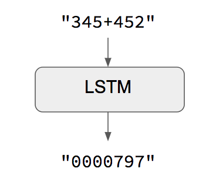
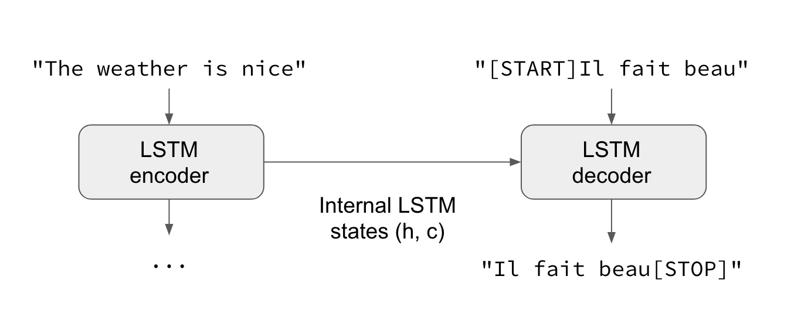

## Keras를 이용해 seq2seq를 10분안에 알려주기  
원문 : [A ten-minute introduction to sequence-to-sequence learning in Keras](https://blog.keras.io/a-ten-minute-introduction-to-sequence-to-sequence-learning-in-keras.html)
> 본 문서는 케라스를 이용해 RNN(Recurrent Neural Networks)모델인 Seq2Seq를 10분안에 알려주는 튜토리얼 한글버전입니다. Seq2Seq의 의미부터 케라스를 이용한 모델 구현을 다루고 있으며 본 문서 대상자는 recurrent networks와 keras에 대한 경험이 있다는 가정하에 진행합니다.

* Keras
* RNN
* LSTM
* NLP
* Seq2Seq
* GRU layer

#### sequence-to-sequence 학습이란?
sequence-to-sequence(Seq2Seq)은 한 도메인(예: 영문장)에서 다른 도메인(예: 불어로 된 문장)으로 문장을 변환하는 모델 학습에 대한 것입니다.

```bash
    "the cat sat on the mat" -> [Seq2Seq model] -> "le chat etait assis sur le tapis"
``` 

이 모델은 기계 번역 혹은 자유로운 질의응답에 사용됩니다.(주어진 자연어 질문에 대한 자연어 응답 생성) 
--일반적으로, 텍스트를 생성할 때마다 적용 가능합니다.  
 
해당 작업을 다루기 위해 여러가지 방법이(**RNN**을 사용하거나 **1D convnets**를 사용) 있습니다.  

#### 자명한(명확한) 사실 : 입출력 문장이 동일한 길이일 때
입출력 두가지 문장이 동일한 길이일 경우, 케라스의 Long Short-Term Memory(LSTM) models 혹은 GRU 계층(혹은 stack thereof)같은 모델들을 구현할 수 있습니다. [예제 스크립트](https://github.com/fchollet/keras/blob/master/examples/addition_rnn.py)에선 어떻게 RNN이 숫자를 추가하고 문자열로 인코딩하는 방법을 어떻게 학습하는지 보여주고 있습니다.



이러한 접근법의 주의사항은 주어진 `input[...t]`로 `target[...t]`를 생성 가능하다고 추정합니다. 일부의 경우(예: 숫자 문자열 추가)에선 정상작동하지만 대다수의 경우는 아닙니다. 일반적인 경우, 전체 입력 문장에 대한 정보는 목표 문장 생성을 시작하기 위해 필수적입니다.

#### 일반적인 사례 : 표준 sequence-to-sequence



추론 방식(예: 알 수 없는 입력 문장을 해독하려고 할 때)에선 약간 다른 처리를 거치게 됩니다.


#### 케라스 예제

```python
from keras.models import Model
from keras.layers import Input, LSTM, Dense

# 입력 문장의 정의와 처리
encoder_inputs = Input(shape=(None, num_encoder_tokens))
encoder = LSTM(latent_dim, return_state=True)
encoder_outputs, state_h, state_c = encoder(encoder_inputs)
# `encoder_outputs`는 버리고 상태(`state_h, state_c`)는 유지
encoder_states = [state_h, state_c]

# `encoder_states`를 초기 상태로 사용해 decoder를 설정
decoder_inputs = Input(shape=(None, num_decoder_tokens))
# 전체 출력 문장을 반환하고 내부 상태도 반환하도록 decoder를 설정. 
# 학습 모델에서 상태를 반환하도록 하진 않지만, inference에서 사용할 예정.
decoder_lstm = LSTM(latent_dim, return_sequences=True, return_state=True)
decoder_outputs, _, _ = decoder_lstm(decoder_inputs,
                                     initial_state=encoder_states)
decoder_dense = Dense(num_decoder_tokens, activation='softmax')
decoder_outputs = decoder_dense(decoder_outputs)
   
# `encoder_input_data`와 `decoder_input_data`를 `decoder_target_data`로 반환하도록 모델을 정의
model = Model([encoder_inputs, decoder_inputs], decoder_outputs)
```

```python
# 학습 실행
model.compile(optimizer='rmsprop', loss='categorical_crossentropy')
model.fit([encoder_input_data, decoder_input_data], decoder_target_data,
          batch_size=batch_size,
          epochs=epochs,
          validation_split=0.2)

```

```python
encoder_model = Model(encoder_inputs, encoder_states)

decoder_state_input_h = Input(shape=(latent_dim,))
decoder_state_input_c = Input(shape=(latent_dim,))
decoder_states_inputs = [decoder_state_input_h, decoder_state_input_c]
decoder_outputs, state_h, state_c = decoder_lstm(
    decoder_inputs, initial_state=decoder_states_inputs)
decoder_states = [state_h, state_c]
decoder_outputs = decoder_dense(decoder_outputs)
decoder_model = Model(
    [decoder_inputs] + decoder_states_inputs,
    [decoder_outputs] + decoder_states)
```

```python
def decode_sequence(input_seq):
    # 상태 벡터로서 입력값을 encode
    states_value = encoder_model.predict(input_seq)

    # 길이가 1인 빈 목표 문장을 생성
    target_seq = np.zeros((1, 1, num_decoder_tokens))
    # 대상 문장의 첫번째 문자를 시작 문자로 기입.
    target_seq[0, 0, target_token_index['\t']] = 1.

    # 문장들의 batch에 대한 샘플링 반복(간소화를 위해, 배치사이즈는 1로 상정)
    stop_condition = False
    decoded_sentence = ''
    while not stop_condition:
        output_tokens, h, c = decoder_model.predict(
            [target_seq] + states_value)

        # 토큰으로 샘플링
        sampled_token_index = np.argmax(output_tokens[0, -1, :])
        sampled_char = reverse_target_char_index[sampled_token_index]
        decoded_sentence += sampled_char

        # 탈출 조건 : 최대 길이에 도달하거나
        # 종료 문자를 찾을 경우
        if (sampled_char == '\n' or
           len(decoded_sentence) > max_decoder_seq_length):
            stop_condition = True

        # (길이 1인)목표 문장을 최신화
        target_seq = np.zeros((1, 1, num_decoder_tokens))
        target_seq[0, 0, sampled_token_index] = 1.

        # 상태 최신화
        states_value = [h, c]

    return decoded_sentence
```

```bash
Input sentence: Be nice.
Decoded sentence: Soyez gentil !
-
Input sentence: Drop it!
Decoded sentence: Laissez tomber !
-
Input sentence: Get out!
Decoded sentence: Sortez !
```

### 참고문서
* [Sequence to Sequence Learning with Neural Networks](https://arxiv.org/abs/1409.3215)
* [Learning Phrase Representations using RNN Encoder-Decoder for Statistical Machine Translation](https://arxiv.org/abs/1406.1078)

----

### 추가 FAQ

#### LSTM대신 GRU 계층을 사용하려면 어떻게 해야합니까?
```python
encoder_inputs = Input(shape=(None, num_encoder_tokens))
encoder = GRU(latent_dim, return_state=True)
encoder_outputs, state_h = encoder(encoder_inputs)

decoder_inputs = Input(shape=(None, num_decoder_tokens))
decoder_gru = GRU(latent_dim, return_sequences=True)
decoder_outputs = decoder_gru(decoder_inputs, initial_state=state_h)
decoder_dense = Dense(num_decoder_tokens, activation='softmax')
decoder_outputs = decoder_dense(decoder_outputs)
model = Model([encoder_inputs, decoder_inputs], decoder_outputs)
```


#### 정수 문장이 포함된 단어단계 모델을 사용하려면 어떻게 해야합니까?
```python
# 입력 문장의 정의와 처리.
encoder_inputs = Input(shape=(None,))
x = Embedding(num_encoder_tokens, latent_dim)(encoder_inputs)
x, state_h, state_c = LSTM(latent_dim,
                           return_state=True)(x)
encoder_states = [state_h, state_c]

# `encoder_states`를 초기 상태로 사용해 decoder를 설정.
decoder_inputs = Input(shape=(None,))
x = Embedding(num_decoder_tokens, latent_dim)(decoder_inputs)
x = LSTM(latent_dim, return_sequences=True)(x, initial_state=encoder_states)
decoder_outputs = Dense(num_decoder_tokens, activation='softmax')(x)

# `encoder_input_data`와 `decoder_input_data`를 `decoder_target_data`로 반환하도록 모델을 정의
model = Model([encoder_inputs, decoder_inputs], decoder_outputs)

# 컴파일 & 학습 실행
model.compile(optimizer='rmsprop', loss='categorical_crossentropy')
# `decoder_target_data`는  `decoder_input_data`같은 정수배열이 아닌,one-hot 인코딩 형식이 되어야 함.
model.fit([encoder_input_data, decoder_input_data], decoder_target_data,
          batch_size=batch_size,
          epochs=epochs,
          validation_split=0.2)
```

#### 학습하는 동안 teacher forcing(?)를 사용하지 않으려면 어떻게 해야 합니까?
```python
from keras.layers import Lambda
from keras import backend as K

# 첫 부분은 바꿀 부분 없음.
encoder_inputs = Input(shape=(None, num_encoder_tokens))
encoder = LSTM(latent_dim, return_state=True)
encoder_outputs, state_h, state_c = encoder(encoder_inputs)
states = [state_h, state_c]


# 한번에 한개의 타임스텝이 진행되도록 decoder를 설정
decoder_inputs = Input(shape=(1, num_decoder_tokens))
decoder_lstm = LSTM(latent_dim, return_sequences=True, return_state=True)
decoder_dense = Dense(num_decoder_tokens, activation='softmax')

all_outputs = []
inputs = decoder_inputs
for _ in range(max_decoder_seq_length):
    # 한개의 타임스텝에서 decoder 실행
    outputs, state_h, state_c = decoder_lstm(inputs,
                                             initial_state=states)
    outputs = decoder_dense(outputs)
    # 현재 예측치를 저장(나중에 모든 예측치들을 연결할 수 있음)
    all_outputs.append(outputs)
    # 다음 반복을 위해 현 출력 데이터를 입력 데이터로 재지정하고 상태 또한 최신화.
    inputs = outputs
    states = [state_h, state_c]

# 모든 예측치들을 연결
decoder_outputs = Lambda(lambda x: K.concatenate(x, axis=1))(all_outputs)

# 앞에서처럼 모델을 정의하고 컴파일.
model = Model([encoder_inputs, decoder_inputs], decoder_outputs)
model.compile(optimizer='rmsprop', loss='categorical_crossentropy')

# 시작문자가 포함된 decoder 입력 정보
decoder_input_data = np.zeros((num_samples, 1, num_decoder_tokens))
decoder_input_data[:, 0, target_token_index['\t']] = 1.

# 앞에서처럼 모델 학습
model.fit([encoder_input_data, decoder_input_data], decoder_target_data,
          batch_size=batch_size,
          epochs=epochs,
          validation_split=0.2)
```