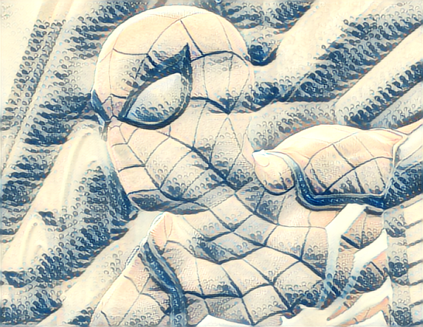
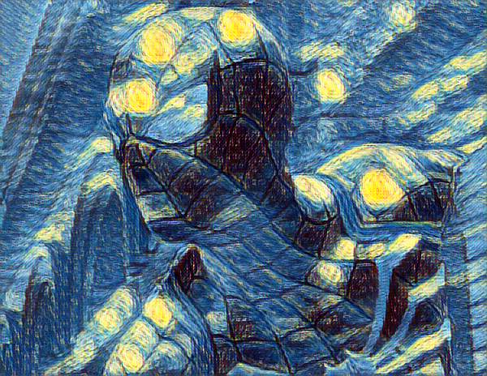
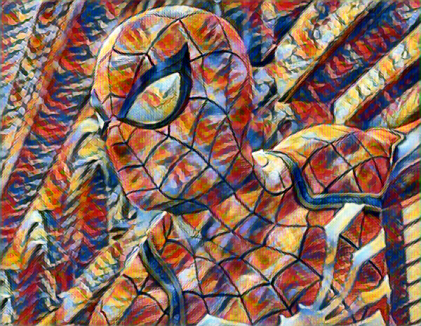
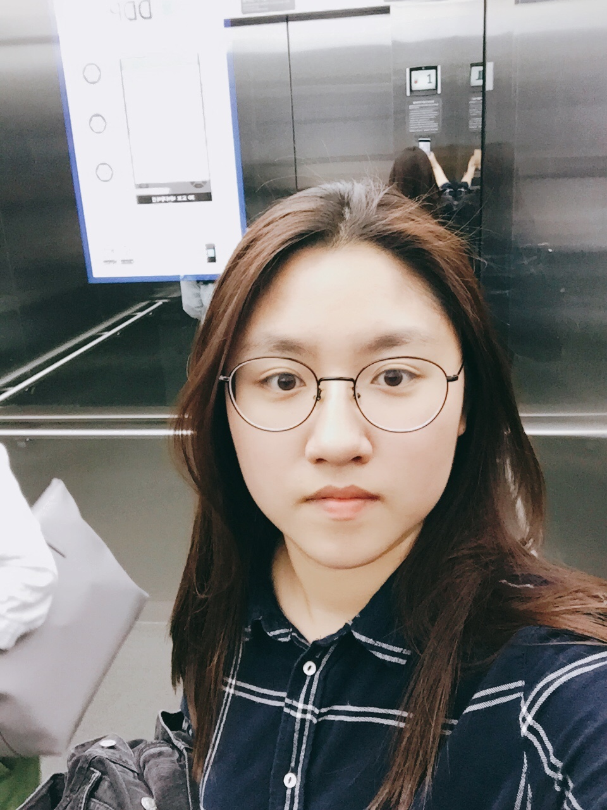
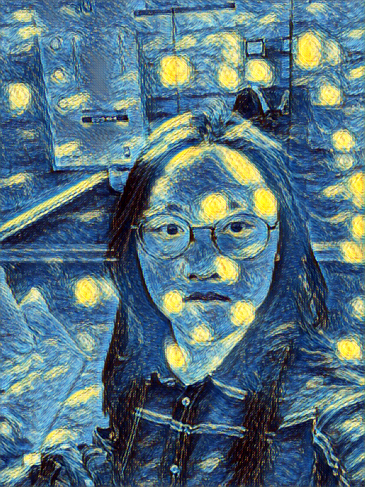

## OpenCV를 사용한 Neural Style Transfer(Neural Style Transfer with OpenCV)
[원문 링크](https://www.pyimagesearch.com/2018/08/27/neural-style-transfer-with-opencv/)
> 이 문서는 Neural Style Transfer 를 하는 방법을 `Keras` 와 `OpenCV` 를 이용해서 보여줍니다. 많은 예제들이 content 이미지에 style 이미지의 style 을 합치지만, 이 튜토리얼에서는 OpenCV 를 사용해서 content 이미지 뿐만 아니라 실시간으로 촬영되는 비디오에도 style 이미지의 style 을 합칩니다. 원작자의 튜토리얼에 대한 부가설명은 `인용구` 를 이용해서 표현할 것입니다.

* 케라스
* Neural Style transfer
* Gram matrix

<br></br>
<center></center>

<br></br>

### Introduction
이 튜토리얼에서, 당신은 neural style transfer 를 OpenCV, 파이썬, 딥러닝을 이용해서 이미지 뿐만 아니라 실시간으로 촬영되는 비디오에도 적용해볼 수 있을거에요. 튜토리얼이 끝날 때 쯤, 당신은 neural style transfer 를 이용한 아주 아름다운 작품을 만들 수 있을 겁니다.

오리지널 neural style transfer 알고리즘은 2015년에 Gatys 와 몇몇에 의해 그들의 논문인 [`A Neural Algorithm of Artistic Style`](https://arxiv.org/abs/1508.06576) 소개되었습니다.

2016 년에 Johnson 과 몇몇이 실시간 Perceptual Losses for Real-Time Style Transfer and Super- Resolution (Style Trasfer 및 Super-Resolution 를 위한 perceptual 손실)을 발표했는데, 이는 perceptual 손실을 사용하는 Super-Resolution 문제를 Neural Style Transfer 에 적용한 것입니다.
결과는  Gatys 등이 발표했던 neural style transfer 알고리즘 방법보다 최대 3배 정도 빠르다는 것입니다(그러나 몇 가지 단점이 있으며, 이 가이드에서 나중에 논의할 예정입니다).

이 포스트의 마지막엔 당신은 neural style transfer 알고리즘은 당신의 이미지와 비디오 스트림에 어떻게 적용하는지 알 수 있을 것입니다.

[Nueral style transfer with OpenCV 데모 영상](https://youtu.be/DRpydtvjGdE)

> 위의 데모 영상은 이 튜토리얼이 끝난 후에 우리가 어떤 것을 배우게 되었는지에 대해 잘 보여주는 영상입니다. 한 번 보시는 것을 추천합니다!
오늘 가이드의 나머지 부분에서는 OpenCV 및 Python을 사용하여 자신의 예술 작품을 생성하기 위해 신경 스타일 전송 알고리즘을 적용하는 방법을 시연합니다.

오늘 가이드의 나머지 부분에서는 OpenCV 및 Python을 사용하여 자신의 예술 작품을 생성하기 위해 Neural style transfer 알고리즘을 적용하는 방법을 시연합니다.

제가 오늘 여기서 논의하는 방법은 CPU에서 거의 실시간으로 실행될 수 있으며 GPU에서 완전히 실시간 성능을 얻을 수 있습니다.

우리는 Neural style transfer 에 대해서 그것이 무엇이고 어떻게 작동하는지를 포함하는 간단한 논의를 시작할 것입니다.

여기서부터 우리는 OpenCV와 Python을 이용하여 실제로 Neural style transfer 를 적용할 것입니다.

<br></br><br></br>

### Neural style transfer 란 무엇일까?
<br></br>

<center>figure1:OpenCV 를 사용한 Neural style transfer 의 예. content 이미지 (왼쪽). Style 이미지 (중앙). 스타일화 된 결과(Stylized output) (오른쪽). </center>

<br></br>

Neural style transfer 는 다음의 프로세스입니다:

1. 어떤 한 이미지의 스타일을 가져온다.
2. 그리고 그 스타일을 다른 이미지에 적용한다.

Neural style transfer 의 프로세스는 **Figure1** 에서 확인할 수 있습니다. **왼쪽** 사진은 우리의 content 이미지입니다. 독일의 Black Forest 의 산 저상에서 맥주를 즐기고 있는 나의 모습입니다.

**중앙** 에 위치한 사진은 우리의 스타일 이미지입니다. [빈센트 반 고흐](https://en.wikipedia.org/wiki/Vincent_van_Gogh)의 유명한 그림인 별이 빛나는 밤이죠.

그리고 **오른쪽** 은 반 고흐의 별이 빛나는 밤의 스타일을 content 이미지인 내 사진에 적용한 결과입니다. 어떻게 언덕, 숲, 나, 그리고 심지어 맥주의 내용까지 보존했는지 보세요. 저것들을 보존하면서도 별의 빛나는 밤의 스타일을 적용되었습니다. 마치 반 고흐가 그의 뛰어난 페인트 스트로크를 산 위에서의 경치에 바친 것 같습니다!

그래서 질문은 흠.. 우리가 Neural style transfer 를 하는 뉴럴 네트워크를 어떻게 정의할까요?

가능한 일이긴 한걸까요?

물론 가능합니다! 그리고 우리는 다음 섹션에서 Neural style transfer 가 어떻게 가능한지에 대해 토론할 것입니다.

<br></br><br></br>

### Neural style transfer 는 어떻게 동작할까?
<br></br>


Figure 2: Neural Style Transfer with OpenCV possible (Figure 1 of Gatys et. al. 2015).

<br></br>

이 시점에서 여러분은 아마 머리를 긁적이며 "우리가 어떻게 신경망을 정의해서 스타일 전달을 할 수 있을까?"라는 생각을 하고 있을 것입니다.

> Gatys et al, Johnson et al 은 해석하지 않고 바로 쓰겠습니다. Gatys 와 그 외 연구진들, Johnson 과 그 외 연구진들 이라는 뜻입니다.

흥미롭게도, 2015년에 [Gatys et al 이 작성한 논문](https://arxiv.org/abs/1508.06576)은 새로운 구조를 전혀 필요로 하지 않는 Neural style transfer 알고리즘을 제안했습니다! 대신 미리 학습된 네트워크( pre-trained network, 일반적으로 ImageNet)를 사용하고 스타일 전송의 최종 목표를 달성하기 위해 필요한 손실 함수를 정의합니다.

<br></br>
**그러면 질문은 "어떤 뉴럴 네트워크를 우리가 써야할까" 가 아니라 "어떤 손실 함수를 우리가 써야할까?" 겠네요.**

<br></br>
그에 대한 대답은 세가지 구성요소로 이야기할 수 있습니다.

1. Content loss
2. Style loss
3. Total-variation loss

<br></br>

각각의 구성요소는 개별적으로 계산이 된 후 한 개의 meta 손실 함수로 합쳐집니다. meta 손실 함수값을 최소화 시키기 위해서 우리는 content, style, total-variation 들의 손실을 최소화 시켜야 합니다.

Gatys et al 은 아름다운 결과를 만들어냈지만 문제는 그것이 꽤 느리다는 것이었습니다.

Johnson et al 등(2016)은 Gatys 외 연구진(Gatys et al)의 연구를 기반으로 했고, 최대 3배 까지 빠른 Neural style transfer 알고리즘을 제안하였습니다. Johnson et al 들의 방법은 perceptual loss 함수를 기반으로하는 super-resolution 문제로 Neural style transfer 를 프레임화합니다.

Johnson et al 들의 방법이 확실히 빠르지만 가장 큰 단점은 Gatys et al 들의 방법에서와 같이 스타일 이미지를 임의로 선택할 수 없다는 것입니다.

<br></br>

대신 먼저 원하는 이미지의 스타일을 재현하기 위해 네트워크를 명시적으로 학습해야 합니다. 네트워크가 학습이 되면 당신이 원하는 어떠한 content 이미지도 네트워크에 적용할 수 있습니다. 당신은 Johnson et al 의 방법을 확인해봐야 합니다.

Johnson et al 들은 그들이 어떻게 Neural style transfer 모델을 학습시켰는지에 대한 문서를 그들의 [GitHub 페이지](https://github.com/jcjohnson/fast-neural-style)에서 제공합니다.

마지막으로, 2017 년에 발표한 Ulyanov 외 연구진들의 논문인 [ Instance Normalization: The Missing Ingredient for Fast Stylization](https://arxiv.org/abs/1607.08022) 역시 주목할 가치가 있습니다. 배치 정규화를 instance normalization 으로 대체 함으로서(instance normalization 학습과 테스트 모두에 적용하였습니다.) 실시간으로 더욱 빠른 퍼포먼스와 이론적으로 더 만족스러운 결과를 이끌어 냈습니다.

나는 Johnson et al 이 사용한 두 가지 모델을 ECCV 논문에 Ulyanov 외 연구진들의 모델들과 함께 이 게시물의 "다운로드" 섹션에 포함시켰습니다.

<br></br><br></br>

> 이 튜토리얼에서는 loss function 에 대한 이야기를 더 이상 하지 않습니다.
>
> 그래서 코드와 함께 짧게 설명할까 합니다. [이곳](https://medium.com/tensorflow/neural-style-transfer-creating-art-with-deep-learning-using-tf-keras-and-eager-execution-7d541ac31398) 을 참고하였고, 이를 번역한 Keras Tutorial 의 문서 Neural Style Transfer : tf.keras와 eager execution를 이용한 딥러닝 미술 작품 만들기(Neural Style Transfer: Creating Art with Deep Learning using tf.keras and eager execution) 를 참고하시면 좋을 것 같습니다. 또한 code 는 Team-Keras 의 코드를 가져왔습니다. 그것은 [여기](https://github.com/keras-team/keras/blob/master/examples/neural_style_transfer.py)를 고해주세요.
>
> `content loss` 는 아주 간단합니다. 미리 학습된 신경망(예를 들어, VGG19) 으로 부터 얻은, 우리가 바꾸고 싶은 입력 이미지 x 의 feature map 과 content 이미지 p 사이의 feature map 의 loss 를 구하는 것과 같습니다! 수식으로 표현하면 아래의 수식과 같습니다.
>
>  :  번 째 레이어의 filter 개수
>  : filter 의 output 개수
>  :  는 Feature map
> 입력 이미지 , content 이미지  의 Feature map 을  ,  이라고 할 때 `content loss` 는 다음과 같습니다.
> <br></br> 
> ```python
> from keras import backend as K
>
> def content_loss(base, combination):
>    return K.sum(K.square(combination - base))
> ```
> <br></br>
> `style loss` 는 조금 더 어렵지만, content loss 와 같은 원리입니다. 이번에는 feature map에 대해 Gram matrix를 구하고, Gram matrix 간 차의 제곱을 loss 로 정의합니다. 그렇다면 아래와 같은 수식이 되겠죠? Gram matrix 는 같은 레이어의 서로 다른 filter 들의 correlation 입니다. filter 가  개 있으므로 Gram matrix  입니다.
>
> 
>
> 따라서 Gram matrix 는 위와 같이 표현이 됩니다. `style loss` 는 레이어마다 계산한 후 weighted sum 을 합니다. 한 레이어의 style loss 는 아래와 같이 표현됩니다.
>
> 
>
> 전체 style loss 는 아래와 같이 표현됩니다.
> <br></br> 
> <br></br>
> ```Python
> def gram_matrix(x):
>    assert K.ndim(x) == 3
>    # image_data_format() 함수의 return 값은 'channels_first' 또는 'channels_last'
>    if K.image_data_format() == 'channels_first':
>        features = K.batch_flatten(x)
>    else:
>        features = K.batch_flatten(K.permute_dimensions(x, (2, 0, 1)))
>    # 필터들의 correlation 을 계산
>    gram = K.dot(features, K.transpose(features))
>    return gram
>
>
> def style_loss(style, combination):
>    assert K.ndim(style) == 3
>    assert K.ndim(combination) == 3
>    # style 이미지의 Gram matrix
>    S = gram_matrix(style)
>    # 바꾸고 싶은 이미지의 Gram matrix
>    C = gram_matrix(combination)
>    channels = 3
>    size = img_nrows * img_ncols
>    # python 에서 ** 은 거듭제곱 연산으로 사용됩니다.
>    # 위에서 말한 E 표현
>    return K.sum(K.square(S - C)) / (4. * (channels ** 2) * (size ** 2))
> ```
> channels_first, channels_last 에 대한 이야기는 keras 문서 혹은 한글로는 [김태영님의 블로그](https://tykimos.github.io/2017/01/27/CNN_Layer_Talk/) 에 잘 설명되어 있습니다.


<br></br>
<br></br>
### 프로젝트 구조

프로젝트는 몇 개의 파일을 가지고 있는데, 이 프로젝트는 <strong>*"Downloads"*</strong> 섹션에서 다운로드 받을 수 있습니다.

scripts + models + images 들을 다운로드 받은 후에 `tree` 커맨드를 입력하면 아래와 같은 디렉토리 및 파일 구조를 확인할 수 있습니다.
<br></br>
```
$ tree --dirsfirst
.
├── images
│   ├── baden_baden.jpg
│   ├── giraffe.jpg
│   ├── jurassic_park.jpg
│   └── messi.jpg
├── models
│   ├── eccv16
│   │   ├── composition_vii.t7
│   │   ├── la_muse.t7
│   │   ├── starry_night.t7
│   │   └── the_wave.t7
│   └── instance_norm
│       ├── candy.t7
│       ├── feathers.t7
│       ├── la_muse.t7
│       ├── mosaic.t7
│       ├── starry_night.t7
│       ├── the_scream.t7
│       └── udnie.t7
├── neural_style_transfer.py
├── neural_style_transfer_examine.py
└── neural_style_transfer_video.py

4 directories, 18 files
```
<br></br>
<strong>*"Downloads"*</strong> 섹션에서 .zip 파일을 다운받으면, 당신은 이 프로젝트를 위해서 온라인의 그 어떤곳에서 다른 것을 다운로드 받을 필요가 없습니다. 제가 test 에 도움이 될 이미지들을 `images/` 에, 모델들은 `models/` 에 준비를 해놓았습니다. 이 모델들은 Johnson 외 연구진들이 미리 학습시켜놓은 것입니다.
당신은 또한 세개의 파이썬 스크립트를 찾을 수 있을 것입니다.

<br></br>
<br></br>

### Neural Style Transfer 구현하기

이제 OpenCV와 Python으로 Neural Style Transfer 를 구현해 보겠습니다.

`neural_style_transfer.py` 파일을 열고, 아래의 코드를 넣어보세요.


```python
# 필요한 패키지들 import
import argparse
import imutils
import time
import cv2

# argument parser 를 정의하고, argument 를 파싱합니다.
ap = argparse.ArgumentParser()
ap.add_argument("-m", "--model", required=True,
	help="neural style transfer model")
ap.add_argument("-i", "--image", required=True,
	help="input image to apply neural style transfer to")
args = vars(ap.parse_args())
```

첫 번째, 우리는 우리가 필요로하는 패키지들을 import 하고 커맨드 라인 arguement 를 파싱합니다.

우리가 import 할 것은 아래와 같습니다.
* [imutils](https://github.com/jrosebr1/imutils): 이 패키지는 `pip install --upgrade imutils` 로 설치가 가능합니다. 최근에 imutils==0.5.1 버전이 배포되었으니 업그레이드 하는 것을 잊지마세요!
* [OpenCV](https://opencv.org): 이 튜토리얼을 위해서 OpenCV 3.4 또는 그 이상의 버전이 필요합니다. 제가 업로드한 또 다른 튜토리얼을 이용해서 [Ubuntu](https://www.pyimagesearch.com/2018/08/15/how-to-install-opencv-4-on-ubuntu/)와 [macOS](https://www.pyimagesearch.com/2018/08/17/install-opencv-4-on-macos/) 를 위한 OpenCV 4 를 설치할 수도 있을 거에요.

<br></br>

우리는 또한 두 줄의 커맨드 라인 arguments 가 필요합니다.
* `--model` : Neural style transfer 모델의 path(위치) 입니다. 11 개의 미리 학습된 모델들이 <strong>*"Downloads"*</strong> 에 있습니다.
* `--image` : 우리가 스타일을 적용할 입력 이미지입니다. 이미 4 개의 샘플 이미지를 준비해뒀습니다. 튜토리얼을 진행하는데 부담갖지 마세요!

<br></br>
당신은 커맨드 라인 arguments 코드를 바꿀 필요가 없습니다. - arguments 는 실행시간동안 처리될 것 입니다. 만약 이런 방식이 익숙하지 않다면, [커맨드 라인 arguments + argparse](https://www.pyimagesearch.com/2018/03/12/python-argparse-command-line-arguments/) 에 대한 블로그 포스트를 한 번 읽어보세요.

이제는 재미있는 파트입니다. - 우리는 우리의 이미지와 모델을 가져올 것이고, 그 다음엔 neural style transfer 를 해볼 것입니다.

<br></br>

```python
# neural style transfer model 로드 합니다.
print("[INFO] loading style transfer model...")
net = cv2.dnn.readNetFromTorch(args["model"])

# input image 를 로드하고, width of 600 pixels 로 사이즈를 버꿉니다.
# then grab the image dimensions
image = cv2.imread(args["image"])
image = imutils.resize(image, width=600)
(h, w) = image.shape[:2]

# 이미지로부터 blob 처리를 하고, 뉴럴넷의 forward pass 를 진행합니다.
blob = cv2.dnn.blobFromImage(image, 1.0, (w, h),
	(103.939, 116.779, 123.680), swapRB=False, crop=False)
net.setInput(blob)
start = time.time()
output = net.forward()
end = time.time()
```
<br></br>
이 코드 블록에서 우리는 아래 사항을 진행합니다 :

* pre-trained(학습된) neural style transfer 모델을 로드합니다.
* input `이미지`를 로드하고 사이즈를 바꿉니다.
* mean subtraction 을 통해서 `blob` 구성을 수행합니다. [`cv2.dnn.blobFromImage`](https://www.pyimagesearch.com/2017/11/06/deep-learning-opencvs-blobfromimage-works/)를 읽어보세요. blob 이 무엇인지 이해하는데 도움이 될 것입니다.
* forward pass 를 수행해서 결과 이미지를 얻습니다. (i.e. neural style transfer 프로세스의 결과는 time.time() 사이에 있습니다. 결과를 얻는데까지의 시간 측정을 해보기 위해 time.time() 을 이용했습니다.)

<br></br>

> 위의 설명에서 `blob` 이라는 것이 나옵니다. 원작자가 추천한 글을 읽으셔도 되고 제가 지금 간단히 설명할 이 글을 읽으셔도 됩니다. 원작자 설명은 영어입니다 :)
>
> OpenCV 는 이미지처리를 위한 전처리 함수를 제공하는데, 전처리 함수는 다음과 같습니다.
> * cv2.dnn.blobFromImage
> * cv2.dnn.blobFromImages
>
> 이 함수들이 하는 일은 총 세가지 입니다.
> 1. Mean subtraction (평균 빼기)
> 2. Scaling (이미지 사이즈 바꾸기)
> 3. And optionally channel swapping (옵션, 이미지 채널 바꾸기)
>
> 위의 과정들을 거치면 아래의 왼쪽 이미지는 오른쪽 이미지처럼 바뀔 것입니다.
>
> <center></center>
>
> <br></br>
>
> Mean subtraction 을 산하기 위해서 input 이미지로 사용할 이미지의 R(Red), G(Green), B(Blue) 채널의 평균값을 각각 구합니다.
> 각 채널의 평균값을   ,       ,   로 표현한다고 했을 때, 각각의 진짜 채널 값에서 평균 값을 뺍니다. 아래와 같이 표현할 수 있을 것입니다.
>
><center>
>
> 
>
></center>
>
>
> 그 다음에는 2 단계인 scaling 을 위해서 표준편차인  를 사용합니다.
>
> <center>
>
> 
>
> </center>
>
> 평균을 빼주고, 표준편차로 나눠줌으로써 데이터를 정규화시켜줍니다.
>
> <strong>모든 딥러닝 아키텍처들이 mean subtraction 및 scaling 을 수행하는 것은 아닙니다!</strong>
>


<br></br>

다시 튜토리얼로 돌아와서, 지금까지 전처리를 하고 forward pass 를 실행하고 결과를 이미지를 얻었으니 다음으로 `출력 이미지` 를 후처리하는 것이 중요합니다.

<br></br>

```Python
# 결과 tensor 를 reshape 하고, mean subtraction 했던 만큼 더해줍니다.
# 그리고 채널 순서를 바꿉니다.
output = output.reshape((3, output.shape[2], output.shape[3]))
output[0] += 103.939
output[1] += 116.779
output[2] += 123.680
output /= 255.0
output = output.transpose(1, 2, 0)
```

이 예제에서 쓰고 있는 특정한 이미지는, 결과로 나온 Numpy 배열의 shape `(1, 3, 452, 600)` 와 같습니다.

* `1` 은 네트워크를 통해 하나의 배치 크기(즉, 단일 이미지)를 전달했음을 나타냅니다.
* OpenCV 는 channels-first ordering 를 여기서 사용하고 있는데, 이는 `3 개`의 채널이 output 이미지에 사용된다는 것과 같습니다.
* Output shape 의 마지막 두 개의 값들은 행 수(높이)와 열 수(너비)입니다.

우리는 결과 매트릭스의 모양을 간단한 (3, H, W) 모양으로 바꿔주고, "de-process" 시킬 것입니다.:

1. Mean subtraction 으로 뺀 평균값을 다시 더해주고
2. Scaling 해주고
3. channels-last ordering 할 수 있도록 매트릭스의 전치행렬로 바꿉니다.

마지막 단계는 neural style transfer 프로세스의 결과를 화면에 보여주는 것입니다.

```Python
# neural style transfer 가 얼마나 걸렸는지 보여줍니다.
print("[INFO] neural style transfer took {:.4f} seconds".format(
	end - start))

# 이미지를 보여줍니다.
cv2.imshow("Input", image)
cv2.imshow("Output", output)
cv2.waitKey(0)
```

<br></br>
<br></br>

### Neural style transfer 결과들

내 결과를 복사하려면 이 블로그 게시물에 대한 "다운로드"를 받아야 합니다.

파일을 다운 받은 후 터미널을 열고 다음 명령을 실행합니다.
아래와 같은 명령어로 content 이미지와 style 이미지에 대해서 결과를 얻을 수 있습니다.

```
$ python neural_style_transfer.py --image images/giraffe.jpg \
	--model models/eccv16/the_wave.t7
[INFO] loading style transfer model...
[INFO] neural style transfer took 0.3152 seconds
```
<br></br>

<center>

<br></br>

다른 이미지로 style transfer 된 결과 이미지를 얻고 싶다면 커맨드의 이미지 path와 와 모델 path 를 변경해 보세요.

<br></br>


<br></br>

</center>

위의 세 개의 예제처럼, 우리는 딥러닝 예술작품을 만들었습니다! 터미널 출력에서 출력 이미지를 계산하는 데 경과된 시간이 표시됩니다. 각 CNN 모델은 약간 다르므로 각 모델에 대해 서로 다른 타이밍을 예상해야 합니다.

도전! 신경 스타일의 전이가 있는 화려한 딥러닝 작품을 만들 수 있나요? 저는 당신이 작품을 트윗하는 것을 보고 싶습니다. 해시태그, #noralstyletransfer를 사용하여 트윗(@PyImageSearch)에서 저를 언급하세요. 또한, 아티스트와 사진작가가 트위터에 있다면 태그를 달아주세요.

<br></br>
<br></br>

### 실시간 neural style transfer

이제 단일 영상에 신경 스타일 전송을 적용하는 방법을 배웠으니 실시간 비디오에도 이 프로세스를 적용하는 방법을 알아보겠습니다.

이 과정은 정적 이미지에서 신경 스타일 전송을 수행하는 것과 매우 유사합니다.

<br></br>
> 웹캠에서 한 프레임을 가져오는 것은 이미지 하나를 처리하는 것과 같기 때문입니다.

<br></br>

이 스크립트에서는 다음을 수행합니다. :

* `모델` 경로에서 사용 가능한 모든 신경 스타일 전송 모델을 순환시킬 수 있는 특별한 Python iterator 를 사용합니다.

* 웹캠 비디오 스트림을 시작합니다.  - 우리의 웹캠 프레임은 거의 실시간으로 처리될 것 입니다. 속도가 느린 시스템은 특정 대형 모델에서는 상당히 지연될 수 있습니다.
* 프레임 위로 반복합니다.
* 프레임에서 신경 스타일 전송을 수행하고 출력을 후 처리한 후 화면에 결과를 표시합니다(위에서와 거의 동일하므로 이를 인식할 수 있음).
* 사용자가 키보드의 "n" 키를 누르면 스크립트를 중지/재시작하지 않고도 iterator 를 사용하여 다음 신경 스타일 전달 모델로 순환합니다.

일단 시작해봅시다!

`neural_style_transfer_video.py` 를 열고 다음 코드를 삽입하세요.

<br></br>
```python
# 필요한 패키지들 import
from imutils.video import VideoStream
from imutils import paths
import itertools
import argparse
import imutils
import time
import cv2

# argument parser 를 정의하고, argument 를 파싱합니다.
ap = argparse.ArgumentParser()
ap.add_argument("-m", "--models", required=True,
	help="path to directory containing neural style transfer models")
args = vars(ap.parse_args())
```
<br></br>

먼저 필요한 패키지/모듈을 가져옵니다.

We begin by importing required packages/modules.

여기서는 `모델` 디렉토리의 경로만 필요합니다(이미 <strong>"다운로드"</strong> 에는 일부 모델이 포함되어 있습니다). 명령어의 인수인 `--models` 를 argparse 와 결합하면 런타임에 path를 통과할 수 있습니다.

Next, let’s create our model path iterator:
다음은, 모델 path iterator 를 만들어 봅시다. :

<br></br>
```Python
# 모든 neurl style transfer 모델이 들어있는 model 디렉토리의 path 를 설정하세요.
# 디렉토리에 있는 모든 모델은 '.t7' file 확장자입니다.
modelPaths = paths.list_files(args["models"], validExts=(".t7",))
modelPaths = sorted(list(modelPaths))

# 각 모델 path 에 대한 고유한 ID 들을 만드세요. 그리고 두 개의 리스트를 합치세요.
models = list(zip(range(0, len(modelPaths)), (modelPaths)))

# 모든 모델에 대해서 순환을 할 수 있도록 itertools 순환(반복)을 하는 함수를 사용할 거에요. 그리고 마지막까지 다 돌았을 때 다시 시작하게 해줍니다.
modelIter = itertools.cycle(models)
(modelID, modelPath) = next(modelIter)
```
<br></br>

위의 코드 블록을 보면 중간 반복문에서 프레임을 처리하기 시작하면, "n" 키를 눌렀을 때 iterator 에 "다음" 모델이 로드됩니다. 이렇게 하면 스크립트를 중지하고 모델 경로를 변경한 다음 다시 시작하지 않고도 비디오 스트림에서 각 neural style 의 효과를 볼 수 있습니다.

모델 iterator 를 구성하기 위해 다음과 같은 작업을 수행합니다 :

* 모든 신neural style transfer 모델의 경로를 정렬합니다.
* 고유 ID를 할당합니다.
* `Itertools` 의  `cycle` 을 사용하여 iterator를 만듭니다. 기본적으로 `cycle` 은 순환 리스트 만들 수 있게 해줍니다. 이 리스트는 끝 부분에 도달하면 처음부터 다시 시작됩니다.
* `next` 함수로 `modelIter` 의 다음 `modelID` 와 `modelPath` 를 가져옵니다.

만약 당신이 Python iterators 또는 반복문(대부분의 프로그래밍 언어가 이를 구현함)을 처음 접하는 경우 [RealPython](https://realpython.com/python-itertools/)의 기사를 반드시 읽어 보십시오.

이제 neural style transfer 모델을 로드하고 비디오 스트림을 초기화 합시다! :

<br></br>

```Python
# neural style transfer 모델을 로드합니다.
print("[INFO] loading style transfer model...")
net = cv2.dnn.readNetFromTorch(modelPath)

# 비디오 스트림을 초기화하고, 카메라 센서를가시작하도록 설정합니다.
print("[INFO] starting video stream...")
vs = VideoStream(src=0).start()
time.sleep(2.0)
print("[INFO] {}. {}".format(modelID + 1, modelPath))
```
<br></br>

위의 코드 블록에서는 우리는 우리의 첫 번째 neural style transfer 모델의 경로를 이용해서 모델을 사용합니다.

그 다음, 웹캠으로 영상을 촬영할 수 있도록 비디오 스트림을 초기화합니다.

<br></br>

프레임 반복을 하는 과정을 구현해 봅시다 :

```Python
while True:
  # 비디오 스트림에 있는 한 개의 프레임을 가져옵니다.
  frame = vs.read()

  # 프레임의 사이즈를 가로 600 픽셀로 바꿉니다.
  # then grab the image dimensions
  frame = imutils.resize(frame, width=600)
  orig = frame.copy()
  (h, w) = frame.shape[:2]

  # 이미지로부터 blob 처리를 하고, 뉴럴넷의 forward pass 를 진행합니다.
  blob = cv2.dnn.blobFromImage(frame, 1.0, (w, h),
  	(103.939, 116.779, 123.680), swapRB=False, crop=False)
  net.setInput(blob)
  output = net.forward()
```

<br></br>

우리는 `while` 을 이용해서 반복문을 사용할 것입니다.

코드 블록은 우리가 검토한 이전 스크립트와 거의 비슷합니다. 유일한 차이는 이미지 파일이 아니라 비디오 스트림에서 프레임을 로드한다는 것입니다.

본질적으로 우리는 `프레임` 을 로드해서 `blob` 처리를 하고, CNN 의 input 으로 사용합니다. 위에서 설명한 이 과정에 대해서 읽지 않았다면, 꼭 읽고 오세요.

input 이미지에 대해 CNN에서는 많은 연산이 이루어집니다. 케라스로 neural style transfer 모델을 어떻게 훈련시키는지 궁금하다면, 제 책 ["Deep Learning for Computer Vision with Python"](https://www.pyimagesearch.com/deep-learning-computer-vision-python-book/)을 참고하세요.

그런 다음 `output 이미지` 를 후처리하고 표시합니다.
<br></br>

```Python
  # 결과 tensor 를 reshape 하고, mean subtraction 했던 만큼 더해줍니다.
  # 그리고 채널 순서를 바꿉니다.
  output = output.reshape((3, output.shape[2], output.shape[3]))
  output[0] += 103.939
  output[1] += 116.779
  output[2] += 123.680
  output /= 255.0
  output = output.transpose(1, 2, 0)

  # neural style transfer 의 결과를 보여줍니다.
  cv2.imshow("Input", frame)
  cv2.imshow("Output", output)
  key = cv2.waitKey(1) & 0xFF
```
<br></br>

정적 이미지 신경 스타일 스크립트와 동일합니다. 우리의 출력 이미지는 reshape, 평균 추가(평균을 이전에 뺀 이후)를 통해 "de-processed"됩니다.

원래의 프레임과 가공된 프레임이 모두 화면에 표시됩니다.
<br></br>

```Python
  # "다음" 이라는 의미의 `n` 키가 눌리면, 다음 neural style transfer 모델을 가져옵니다.
  if key == ord("n"):
    (modelID, modelPath) = next(modelIter)
    print("[INFO] {}. {}".format(modelID + 1, modelPath))
    net = cv2.dnn.readNetFromTorch(modelPath)

  # `q` 키를 누르면 반복문이 종료됩니다.
  elif key == ord("q"):
    break

# 정리 코드
cv2.destroyAllWindows()
vs.stop()
```
<br></br>

스크립트가 실행되는 동안 다른 동작을 유발하는 두 가지 키가 있습니다.

"n": "다음" 신경 스타일 전달 모델 경로 + ID를 가져와서 로드합니다. 마지막 모델에 도달한 경우, iterator는 처음부터 다시 순환합니다.
"q": "q" 키를 누르면 `while` 루프(라인 83 및 84)가 "종료"됩니다.

<br></br>
<br></br>

### 실시간 neural style transfer 의 결과

이 튜토리얼의 <strong>*"다운로드"*</strong> 섹션을 사용하여 소스 코드와 신경 스타일 전송 모델을 다운로드했으면 다음 명령을 실행하여 당신의 비디오 스트림에 neural style transfer 를 적용할 수 있습니다.

<center></center>


보시는 바와 같이, 한 번의 키 누름 버튼을 사용하여 neural style transfer 모델을 순환(반복)하기 쉽습니다.

<br></br>
<br></br>

### neural style transfer 에 대해 조금 더 알아보기
["Deep Learning for Computer Vision with Python"](https://www.pyimagesearch.com/deep-learning-computer-vision-python-book/) 을 참조하세요.

<br></br>
<br></br>

### Summary
오늘 블로그 게시물에서 OpenCV와 Python을 사용하여 이미지와 비디오 모두에 neural style transfer를 적용하는 방법을 배웠습니다.

특히, 우리는 2016년 Johnson 과 연구진들이 발표한 논문의 모델을 활용하였습니다. 당신의 편의를 위해, 저는 이 블로그 포스트의 <strong>*"다운로드"*</strong> 섹션에 모델을 포함시켰습니다.

오늘 신경 전달에 관한 튜토리얼 즐거우셨기를 바랍니다!

트위터와 코멘트 섹션을 사용하여 여러분만의 아름다운 예술작품에 대한 링크를 게시하십시오.

<br><br>

> neural style transfer 를 실행해보았습니다.
> style 이미지의 스타일 뿐만 아니라 content 이미지의 윤곽을 굉장히 잘 살려주는 모델이라고 느껴집니다.
> <br></br>
> <center>input image</center>
>
> > <center><figure></figure></center>
>
> <br></br>
>
> <center>output image : spiderman with wave</center>
>
> > <center><figure></figure></center>
>
> <br></br>
>
> <center>output image : spiderman with starry night</center>
>
> > <center><figure></figure></center>
>
> <br></br>
>
> <center>output image : spiderman with composition_vii</center>
>
> > <center><figure></center>
>
> 스파이더맨의 수트의 선 뿐만 아니라 배경의 모양 윤곽도 잘 살렸습니다.
> <br></br>
> 그래서 제 Github 프로필 사진으로도 시도해 보았습니다.
> <br></br>
> <center>input image : my pic of inside the lift</center>
>
> > <center><figure></figure></center>
> <br></br>
> <center>output image : my pic with starry night</center>
>
> > <center><figure></figure></center>
>
> <br></br>
> <center>output image : my pic with composition_vii</center>
>
> > <center><figure></figure></center>
>
> input 이미지를 보면 사진이 셀피이기 때문에 거울에 비친 뒷모습이 있고, 체크무늬 셔츠를 입은것을 볼 수 있는데 output 이미지를 봤을 때도 거울에 비친 모습과 체크무늬 셔츠가 아주 선명하게 style transfer 되서 나타난 것을 볼 수 있습니다!

### 참고 사이트
* [케라스 공식 홈페이지](https://keras.io/)
* [김태영의 케라스 블로그](https://tykimos.github.io/)
* [Neural Style Transfer: Creating Art with Deep Learning using tf.keras and eager execution](https://medium.com/tensorflow/neural-style-transfer-creating-art-with-deep-learning-using-tf-keras-and-eager-execution-7d541ac31398)
* [Image Style Transfer Using Convolutional Neural Networks](https://www.cv-foundation.org/openaccess/content_cvpr_2016/papers/Gatys_Image_Style_Transfer_CVPR_2016_paper.pdf)

> 번역 및 정리: 박정현(parkjh688@gmail.com)
