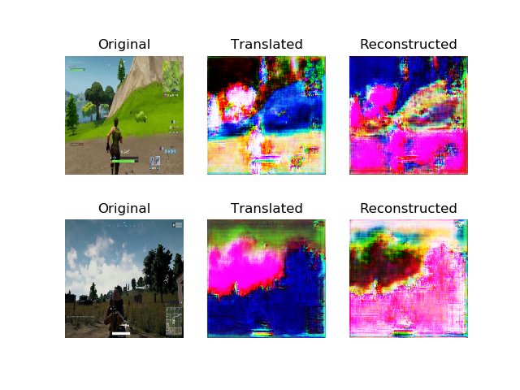
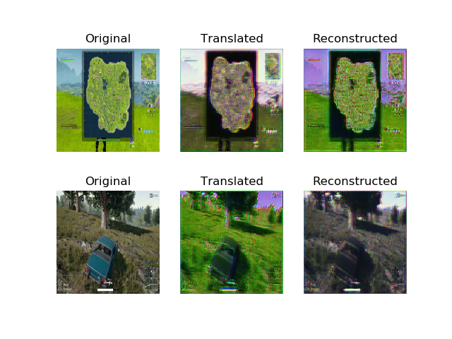
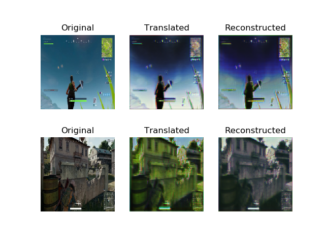
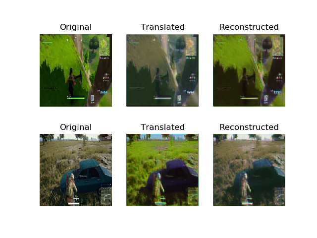
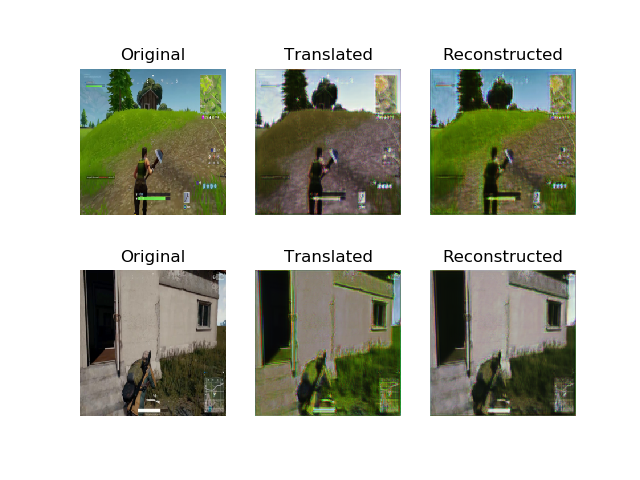

# 딥러닝(CycleGAN)을 이용해 Fortnite 를 PUBG 로 바꾸기
(Turning Fortnite into PUBG with Deep Learning (CycleGAN))
[원문 링크](https://towardsdatascience.com/turning-fortnite-into-pubg-with-deep-learning-cyclegan-2f9d339dcdb0)
> 이 문서는 `CycleGAN` 을 이용해 Image Style Trasfer 를 게임 배경에 적용해봅니다. 원작자의 튜토리얼에 대한 부가설명은 `인용구` 를 이용해서 표현할 것입니다. CycleGAN 을 설명하기 위해서 많은 글들이 Pix2Pix, GANs 에 대해서 이야기를 하는데 이 문서에서도 CycleGAN 설명을 위해 부가적인 설명을 할 것입니다.

* Keras
* GANs
* CycleGAN
* Style Transfer

### introduction
Image Style Trasfer 를 위한 CycleGAN 이해 및 게임용 그래픽 모듈에 대한 적용 탐색을 할 것 입니다.


*figure1 : 신경망은 PUBG 의 시각적 스타일로 Fortnite 를 재창조하려고 시도합니다.*

<br></br>
만약 여러분이 게이머라면, 여러분은 미친듯한 인기를 누리고 있는 Battle Royale 게임인 Fortnite 와 PUBG에 대해 들어봤을 것입니다. 두 게임 모두 100명의 선수들이 단지 한 명의 생존자가 남아있을 때까지 작은 섬에서 경기를 하는 방식이 매우 유사합니다.

저는 Fortnite 의 게임 플레이를 좋아하지만 PUBG 의 더 현실적인 시각화를 더 좋아합니다. 이것이 저를 생각하게 만들었죠. 게임 개발자들이 우리에게 그 옵션을 제공할 필요 없이 우리가 좋아하는 시각 효과를 선택할 수 있는 게임용 그래픽 모드를 가질 수 있을까? 만약 PUBG 의 비주얼을 Fortnite 의 프레임 렌더링할 수 있는 방법이 있다면 어떨까요?

그 때 저는 딥러닝이 도움이 될 수 있는지 알아보기로 결심했습니다. 그리고 저는 CycleGAN 이라고 불리는 신경 네트워크를 찾게 되었습니다. 이 글에서는 CycleGANs 의 작동 방식을 검토하고 Fortnite 를 PUBG 의 스타일로 시각적인 변환을 시도해보겠습니다.

<br></br>


*figure2 : 카툰같은 비주얼의 Fortnite (왼쪽) 와 조금 더 현실 같은 비주얼의 PUBG (오른쪽)*


<br></br>
<br></br>

#### What are CycleGANs? (CycleGANs 이 뭘까요?)
`CycleGANs` 는 도메인 사이의 `image style transfer` 에 사용되는 [Generative Adversarial Network(GAN)](https://skymind.ai/wiki/generative-adversarial-network-gan) 입니다. CycleGANs 을 사용하면 Fortnite 와 같은 한 영역의 이미지를 PUBG 와 같은 다른 영역으로 변환하도록 훈련할 수 있습니다. 이 작업은 비지도학습(unsupervised learning) 으로 수행됩니다. 즉, 두 도메인 모두에서 영상을 일대일 매핑을 하지 않습니다.

<br></br>

> `CycleGAN` 의 논문 제목은 [`Unpaired Image-to-Image Translation using Cycle-Consistent Adversarial Networks
`](https://arxiv.org/pdf/1703.10593.pdf) 입니다. 논문의 제목에서 알 수 있듯이 CycleGAN 은 **Unpaired Data** 를 사용합니다.
>
> figure3은 Unpaired Data를 사용하는 이유를 설명하기 위한 이미지입니다. 왼쪽은 `Pix2Pix` 에 필요한 `Paired Data`, 오른쪽은 `CycleGAN` 에서 사용하는 `Unpaired Data` 입니다. Pix2Pix 모델에서 신발 윤곽선에 맞는 신발 이미지를 생성할 때는 왼쪽 그림처럼 (신발 윤곽, 완전한 신발이미지) 가 쌍으로(pair,   )로 필요합니다.
>
> 
>
> *figure3 : paired 데이터와 unpaired 데이터*
>
> 하지만 Paired Data를 를 얻는 것은 어렵고 비용이 많이 들 수 있습니다. 또한 아래의 이미지 같이 말 형태를 보존한채 얼룩말로 무늬만 넣어줄 때, Paired Data처럼 똑같은 포즈를 가진 얼룩말을 구하는 것은 쉽지 않습니다.
>
> 
>
> *figure4 : CycelGAN 결과*
>
> 이런 문제가 있기 때문에 CycleGAN 은 Unpaired Data를 이용해서 학습하는 방법을 소개합니다.


<br></br>


*figure5 : CycelGAN 다른 도메인의 결과들*

원본 Github implementation 과 그에 따른 결과는 [여기](https://github.com/junyanz/pytorch-CycleGAN-and-pix2pix)서 볼 수 있습니다.

<br></br>

네트워크는 오리지널 도메인의 이미지에 있는 개체를 이해하고 대상 도메인의 이미지에 있는 동일한 개체의 모양과 일치하도록 필요한 변환을 적용합니다. 이 [알고리즘](https://junyanz.github.io/CycleGAN/) 적용 방식은 말들을 얼룩말, 사과들을 오렌지로, 그리고 사진을 그림으로 바꾸는 놀라운 결과들을 보여줍니다.

> 원작자가 가르쳐준 github repository 는 PyTorch 로 만들어진 코드이므로, 우리는 아래에서 Keras 코드로 튜토리얼을 진행할 것 입니다.

<br></br>
<br></br>

#### How do they work? (어떻게 동작하는 것일까요?)

> **<U>CycleGAN 의 목표는 두 개의 도메인 X 와 Y 사이의 mapping function 을 학습하는 것입니다.**</U>
>
> 
>
> *figure6 : How do they work?*
>
> CycleGAN model은 위 이미지와 같이 G : X → Y and F : Y → X 해주는 두 개의 mapping function 이 있고, F(Y) 를 판별하는 Dx and G(X) 를 판별하는 Dy 가 있습니다.
>
> 논문에서는 CycleGAN 은 생성된 이미지의 분포를 대상 도메인의 데이터 분포와 일치시키기 위한 `Adversarial loss` 와 학습된 매핑 G와 F가 서로 모순되는 것을 방지하기 위해 `Cycle consistency loss` 를 포함합니다. 여기서 말하는 <U>모순</U> 은 아래 Cycle consistency loss 에서 설명합니다.
>
> **Adversarial loss**
>
>  
>
> **Cycle consistency loss**
> Adversarial training으로 각각 대상 도메인 Y와 X로 동일하게 분포된 출력을 생성하는 mapping G와 F를 배울 수 있지만, large capacity에서는 네트워크는 동일한 입력 이미지 세트를 대상 도메인에서 이미지에 맵핑할 수 있으며, 학습된 맵핑 중 하나라도 목표가 아닌 출력 분포를 유도할 수 있습니다. 이 문제가 위에서 말했던 모순입니다. 따라서 input  를 우리가 원하는  에 맵핑할 수 있다고 보장할 수는 없기 때문에 `Cycle consistency` 를 사용합니다.
>
> 
>
> *figure7 : Cycle consistency*
>
>  (b) forward cycle-consistency loss: x → G(x) → F (G(x)) ≈ x, and (c) backward cycle-consistency loss: y → F (y) → G(F (y)) ≈ y
>
> X 가 G 를 거쳐서 G(X) 가 되고 다시 F 를 거쳐 F(G(X)) 가 된 값이 X 가 되어야하고, 똑같이 Y 가 F 를 거쳐서 F(Y) 가 되고 다시 G 를 거쳐서 G(F(Y)) 가 된 값이 Y가 되야한다는 이야기입니다.
> 한 바퀴를 돌아도 다시 내 자신이 되어야 합니다.
>
> 

<br></br>

`CycleGAN` 이 어떻게 동작을 하는지 알아보기 위해 입력 도메인으로 Fortnite 을 사용하고, PUBG 를 타겟 도메인으로 사용해보겠습니다. 많은 양의 두 게임에서 찍은 스크린샷을 사용하여 한 쌍의 `Generative Adversarial Networks` 를 학습합니다. 신경망은 Fortnite 의 시각적 스타일과 PUBG의 시각적 스타일을 학습할 것 입니다.

이 두 네트워크는 순환(cyclic) 방식으로 동시에 훈련되어 두 게임 모두에서 동일한 개체 간의 관계를 형성하고 적절한 시각적 변환을 만듭니다. 다음 그림은 이러한 두 네트워크의 순환(cyclic) 설정의 일반적인 아키텍처를 보여줍니다.

<br></br>


*figure8 : “Real Fortnite” 에서 “Fake PUBG” 로, 그리고 또  “Reconstructed Fortnite” 로 도는 주기(Cycle)*

<br></br>

우리는 Fortnite 의 원본 이미지를 가지고 학습을 시작합니다. 우리는 두개의 신경망을 훈련시킬 것이고, 하나는 generator 와 다른 하나는 discriminator 입니다.

이 discriminator 는 시간이 흐르면서 Fortnite 의 실제 이미지와 가짜 이미지를 구별하는 법을 배우게 될 것입니다. generator 는 학습 데이터에서 PUBG 의 랜덤 스크린샷을 사용하여 입력 이미지를 오리지널 도메인에서 타겟 도메인으로 변환하도록 학습됩니다.

 > generator 는 계속 입력 이미지를 타겟 도메인의 이미지처럼 바꿔서 가짜 이미지를 생성하고, discriminator 는 generator 가 만든 가짜 이미지를 구별하는 법을 학습하게 됩니다.

이러한 변화가 의미 있는지 확인하기 위해 우리는 재구성 조건(condition of reconstruction)을 적용합니다.

이것은 우리가 동시에 가짜 도메인에서 원본 영역의 이미지를 재구성하는 또 다른 generator/discriminator를 훈련한다는 것을 의미합니다. 우리는 이 재구성이 원래 이미지와 유사해야 한다는 조건을 적용하여 학습 과정에서 최소화하고자 하는 cycle loss값을 제공합니다.

이것은 우리가 중간 단계 latent space 에서 인코딩을 찾는 것이 아니라 우리의 목표 영역에 있는 전체 이미지를 찾는다는 것을 제외하면 오토인코더와 비슷합니다.

<br></br>


*figure9 : 이전 이미지에 나온 Generator 의 모습*

<br></br>

여기에서 사용되는 generator 네트워크(F2P)는 세 가지 주요 `convolution` 블록으로 이루어져 있습니다. 첫 번째 convolution 에서는 Fortnite 스크린샷의 인코딩을 낮은 차수의 latent space 에서 찾아냅니다. 이 인코딩은 동일한 latent space 에서 PUBG 를 나타내는 인코딩으로 변환됩니다. 그런 다음 디코더는 변환된 인코딩에서 출력 이미지를 생성하므로 PUBG 처럼 보이는 Fortnite 이미지를 구성합니다.

이 학습 과정에서 직면했던 한 가지 문제는 GPU 메모리 제한으로 인해 256x256 이미지로만 작업할 수 있다는 것이었습니다. 이는 결과에 큰 영향을 미치지만 비디오 메모리가 8gb보다 많은 경우 최대 512x512개의 이미지를 생성할 수 있습니다. 만약 당신이 512x512 가 가능하다면, [나에게 알려주세요!](https://twitter.com/deepgamingai)

<br></br>
<br></br>

### Results (결과)
12시간의 훈련 후 `CycleGAN` 에서 생성된 이미지는 매우 성공적입니다. 이 신경망은 Fortnite 스타일에서 PUBG 스타일로 하늘색, 나무, 잔디색을 성공적으로 전환할 수 있었다. Fortnite 의 지나치게 강렬한 색깔은 PUBG 의 더 사실적인 색상으로 변화되었습니다.

<br></br>


*figure10 : fortnite - pubg CycleGAN 적용 결과*
<br></br>

하늘은 덜 푸르스름해 보이고, 만화 같은 잔디와 나무들은 PUBG 에서 볼 수 있는 나무와 훨씬 더 가까워 보입니다. 심지어 신경망은 화면 하단에 있는 상태표시창을 PUBG의 총과 탄약 표시기로 교체하는 것도 배웠습니다!

두 영역에서 연결할 수 없었던 것은 플레이어의 모습이었기 때문에 플레이어 주변의 픽셀이 흐릿합니다. 전반적으로, 신경망은 두 도메인에서 개체를 식별하고 그들의 외관을 변화시키는 일을 잘 한 것 같습니다.

더 긴 결과를 보려면 아래에 포함된 [비디오](https://www.youtube.com/watch?v=xkLtgwWxrec)를 보십시오. 만약 여러분이 보는 것을 좋아한다면, 여기를 클릭하여 내 유튜브 채널을 구독하는 것을 잊지 마세요!

<br></br>
<br></br>

### Application to graphic mods in games (게임 그래픽 모드에 적용)
결과는 정말 좋아 보이지만, 제가 실제로 PUBG 그래픽을 가지고 Fortnite 를 하려면 아직 갈 길이 멀다는 것은 분명합니다. 하지만 이러한 네트워크를 사용하여 실시간으로 고해상도 이미지를 생성할 수 있게 되면 향후 게임 개발자에게 의존하지 않고도 게임용 그래픽 모듈 엔진을 구축할 수 있게 될 것입니다. 우리가 좋아하는 게임의 시각적 스타일을 사용하여 다른 게임에 적용할 수 있습니다!

저는 글에서 논의했던 것과 같은 기술을 사용하여 게임 영상을 실제 사진으로 변환함으로써 게임에서 어떻게 실제 사진화를 이룰 수 있는지 알아보겠습니다. 계속 진행하시려면, 제 [블로그](https://medium.com/@chintan.t93)를 보거나 [유튜브 채널](http://youtube.com/c/DeepGamingAI)에 오세요. 읽어주셔서 감사합니다!

<br></br>
<br></br>

> ### CycleGAN Keras 코드 보기
> 여기서부터는 원문에 있는 글이 아닌 추가 글입니다. [여기](https://github.com/eriklindernoren/Keras-GAN/tree/master/cyclegan) 의 `CycleGAN` 코드를 사용했습니다. 전체 코드는 링크를 참고해주시고, 저는 코드의 부분들을 가져와서 이야기해보겠습니다.
>
> 이야기할 코드에서는 CycleGAN 이라는 클래스를 만듭니다. 그리고 CycleGAN 클래스는 init(), build_generator(), build_discriminator(), train(), sample_images() 함수를 가지고 있습니다. 차례대로 함수를 어떻게 구현했는지 봐야겠죠?
> <br></br>
> #### **1. init()**
>
> init() 에서 하는 일을 간단히 이야기한다면, 딥러닝 모델을 학습하기 전까지의 과정이라고 할 수 있을 것 같습니다. **모델의 입력 이미지 사이즈를 결정** 하고, **Discriminator의 output 이미지 사이즈를 계산** 하고, **CycleGAN 의 구조를 잡는 것** 의 역할을 수행합니다.
>
```python
def __init__(self):
        # 입력 이미지 shape
        self.img_rows = 128 # 이미지의 가로 픽셀
        self.img_cols = 128 # 이미지의 세로 픽셀
        self.channels = 3   # 이미지 채널(색)
        self.img_shape = (self.img_rows, self.img_cols, self.channels)

        # data loader 설정
        self.dataset_name = 'apple2orange' # 데이터셋 디렉토리 이름
        self.data_loader = DataLoader(dataset_name=self.dataset_name,
                                      img_res=(self.img_rows, self.img_cols))


        # Discriminator output 사이즈 계산 (PatchGAN 사용)
        patch = int(self.img_rows / 2**4)
        self.disc_patch = (patch, patch, 1)

        # Generator 와 Discriminator 의 첫 번째 레이어 필터 개수
        self.gf = 32
        self.df = 64

        # Loss weights
        self.lambda_cycle = 10.0                    # Cycle-consistency loss
        self.lambda_id = 0.1 * self.lambda_cycle    # Identity loss

        optimizer = Adam(0.0002, 0.5)

        # Discriminators 를 Build, compile
        self.d_A = self.build_discriminator()
        self.d_B = self.build_discriminator()
        self.d_A.compile(loss='mse',
            optimizer=optimizer,
            metrics=['accuracy'])
        self.d_B.compile(loss='mse',
            optimizer=optimizer,
            metrics=['accuracy'])

        #-------------------------
        # Construct Computational
        #   Graph of Generators
        #-------------------------

        # Build the generators
        self.g_AB = self.build_generator()
        self.g_BA = self.build_generator()

        # 각 도메인의 이미지를 입력합니다. Keras 의 Input 을 사용
        img_A = Input(shape=self.img_shape)
        img_B = Input(shape=self.img_shape)

        # 각각의 서로 다른 도메인으로 이미지를 바꿔(Translate)줌
        # 사과, 오렌지 도메인이 있다고 할 때 사과는 오렌지처럼, 오렌지는 사과처럼 바꿔줌
        fake_B = self.g_AB(img_A)
        fake_A = self.g_BA(img_B)
        # 이미지의 원래 도메인으로 다시 바꿔(Translate)줌
        reconstr_A = self.g_BA(fake_B)
        reconstr_B = self.g_AB(fake_A)
        # Identity Loss 를 위해
        img_A_id = self.g_BA(img_A)
        img_B_id = self.g_AB(img_B)

        # generaotr를 학습할 때는 discriminator는 학습하지 않습니다.
        self.d_A.trainable = False
        self.d_B.trainable = False

        valid_A = self.d_A(fake_A)
        valid_B = self.d_B(fake_B)

        self.combined = Model(inputs=[img_A, img_B],
                              outputs=[ valid_A, valid_B,
                                        reconstr_A, reconstr_B,
                                        img_A_id, img_B_id ])
        self.combined.compile(loss=['mse', 'mse',
                                    'mae', 'mae',
                                    'mae', 'mae'],
                            loss_weights=[  1, 1,
                                            self.lambda_cycle, self.lambda_cycle,
                                            self.lambda_id, self.lambda_id ],
                            optimizer=optimizer)
```
> #### **2. build_generator()**
>
> build_generator() 는 **Generator의 구조** 를 만듭니다. 이 코드에서는 U-Net 을 Generator 로 사용했습니다.
>
> conv2d는 downsampling을 통해 input image의 특징을 추출하고, deconv2d는 upsampling을 통해 이미지의 스타일을 바꿔(translation)주는 용도로 사용합니다.
>
```python
def build_generator(self):
        """U-Net Generator"""

        def conv2d(layer_input, filters, f_size=4):
            """Downsampling 하는 레이어"""
            d = Conv2D(filters, kernel_size=f_size, strides=2, padding='same')(layer_input)
            d = LeakyReLU(alpha=0.2)(d)
            d = InstanceNormalization()(d)
            return d

        def deconv2d(layer_input, skip_input, filters, f_size=4, dropout_rate=0):
            """Upsampling 하는 레이어"""
            u = UpSampling2D(size=2)(layer_input)
            u = Conv2D(filters, kernel_size=f_size, strides=1, padding='same', activation='relu')(u)
            if dropout_rate:
                u = Dropout(dropout_rate)(u)
            u = InstanceNormalization()(u)
            u = Concatenate()([u, skip_input])
            return u

        # 이미지 입력. Keras 의 Input 을 사용.
        d0 = Input(shape=self.img_shape)

        # Downsampling
        d1 = conv2d(d0, self.gf)
        d2 = conv2d(d1, self.gf*2)
        d3 = conv2d(d2, self.gf*4)
        d4 = conv2d(d3, self.gf*8)

        # Upsampling
        u1 = deconv2d(d4, d3, self.gf*4)
        u2 = deconv2d(u1, d2, self.gf*2)
        u3 = deconv2d(u2, d1, self.gf)

        u4 = UpSampling2D(size=2)(u3)
        output_img = Conv2D(self.channels, kernel_size=4, strides=1, padding='same', activation='tanh')(u4)

        return Model(d0, output_img)
```
> #### **3. build_discriminator()**
>
> build_discriminator()가 하는 일은 이미지가 진짜인지 가짜인지 판별하는 것입니다. 여기서 진짜라는 의미는 우리가 input 으로 넣은 이미지이고 가짜라는 의미는 generator가 만든 이미지입니다.
>
```python
def build_discriminator(self):

        def d_layer(layer_input, filters, f_size=4, normalization=True):
            """Discriminator layer"""
            d = Conv2D(filters, kernel_size=f_size, strides=2, padding='same')(layer_input)
            d = LeakyReLU(alpha=0.2)(d)
            if normalization:
                d = InstanceNormalization()(d)
            return d

        img = Input(shape=self.img_shape)

        d1 = d_layer(img, self.df, normalization=False)
        d2 = d_layer(d1, self.df*2)
        d3 = d_layer(d2, self.df*4)
        d4 = d_layer(d3, self.df*8)

        validity = Conv2D(1, kernel_size=4, strides=1, padding='same')(d4)

        return Model(img, validity)
```
>
> #### **4. train()**
>
> train()은 batch만큼의 데이터로 이미지 데이터로 빌드한 generator, discriminator를 epochs 만큼 학습하는 과정입니다.
>
```python
def train(self, epochs, batch_size=1, sample_interval=50):

        start_time = datetime.datetime.now()

        # Adversarial loss ground truths
        valid = np.ones((batch_size,) + self.disc_patch)
        fake = np.zeros((batch_size,) + self.disc_patch)

        for epoch in range(epochs):
            for batch_i, (imgs_A, imgs_B) in enumerate(self.data_loader.load_batch(batch_size)):

                # ----------------------
                #  Train Discriminators
                # ----------------------

                # 반대의 도메인으로 이미지 translate
                fake_B = self.g_AB.predict(imgs_A)
                fake_A = self.g_BA.predict(imgs_B)

                # discriminators 학습
                # (original images = real / translated = Fake)
                dA_loss_real = self.d_A.train_on_batch(imgs_A, valid)
                dA_loss_fake = self.d_A.train_on_batch(fake_A, fake)
                dA_loss = 0.5 * np.add(dA_loss_real, dA_loss_fake)

                dB_loss_real = self.d_B.train_on_batch(imgs_B, valid)
                dB_loss_fake = self.d_B.train_on_batch(fake_B, fake)
                dB_loss = 0.5 * np.add(dB_loss_real, dB_loss_fake)

                # Total disciminator loss
                d_loss = 0.5 * np.add(dA_loss, dB_loss)


                # ------------------
                #  Train Generators
                # ------------------

                # generators 학습
                g_loss = self.combined.train_on_batch([imgs_A, imgs_B],
                                                        [valid, valid,
                                                        imgs_A, imgs_B,
                                                        imgs_A, imgs_B])

                elapsed_time = datetime.datetime.now() - start_time

                # Plot the progress
                print ("[Epoch %d/%d] [Batch %d/%d] [D loss: %f, acc: %3d%%] [G loss: %05f, adv: %05f, recon: %05f, id: %05f] time: %s " \
                                                                        % ( epoch, epochs,
                                                                            batch_i, self.data_loader.n_batches,
                                                                            d_loss[0], 100*d_loss[1],
                                                                            g_loss[0],
                                                                            np.mean(g_loss[1:3]),
                                                                            np.mean(g_loss[3:5]),
                                                                            np.mean(g_loss[5:6]),
                                                                            elapsed_time))

                # If at save interval => save generated image samples
                if batch_i % sample_interval == 0:
                    self.sample_images(epoch, batch_i)
```

<br></br>

figure11 - figure15는 번역자가 위의 코드를 변형하여 얻은 결과입니다. 데이터는 직접 유튜브의 fortnite, pubg 게임 영상으로부터 얻어서 사용하였습니다. 각 batch 마다 변해가는 과정을 보여줄 것입니다. 시간과 좋지 않은 환경으로 인해 튜토리얼 만큼 좋은 결과를 내진 못했습니다. 이 점 참고 바랍니다.



*figure11 : 0번째 batch*

<br></br>



*figure12 : 200번째 batch*

<br></br>



*figure13 : 400번째 batch*

<br></br>



*figure14 : 600번째 batch*

<br></br>



*figure15 : 400번째 batch*

<br></br>

다른 도메인으로 translate 후 다시 원래 도메인으로 reconstruction 합니다.
잘 되는 것 같나요?

원하는 데이터를 모아서 직접 해보세요!

<br></br>
<br></br>

### 참고문서
* [김태영의 케라스 블로그](https://tykimos.github.io/)
* [초짜 대학원생 입장에서 이해하는 Generative Adversarial Nets](http://jaejunyoo.blogspot.com/2017/01/generative-adversarial-nets-1.html)
* [GAN을 이용한 Image to Image Translation: Pix2Pix, CycleGAN, DiscoGAN](https://taeoh-kim.github.io/blog/gan%EC%9D%84-%EC%9D%B4%EC%9A%A9%ED%95%9C-image-to-image-translation-pix2pix-cyclegan-discogan/)
* [코딩 셰프의 3분 딥러닝](https://github.com/jskDr/keraspp)

<br></br>

> 이 글은 2018 컨트리뷰톤에서 Contribute to Keras 프로젝트로 진행했습니다.
>
> Translator: [박정현](https://github.com/parkjh688)
>
> Translator email : <parkjh688@gmail.com>
