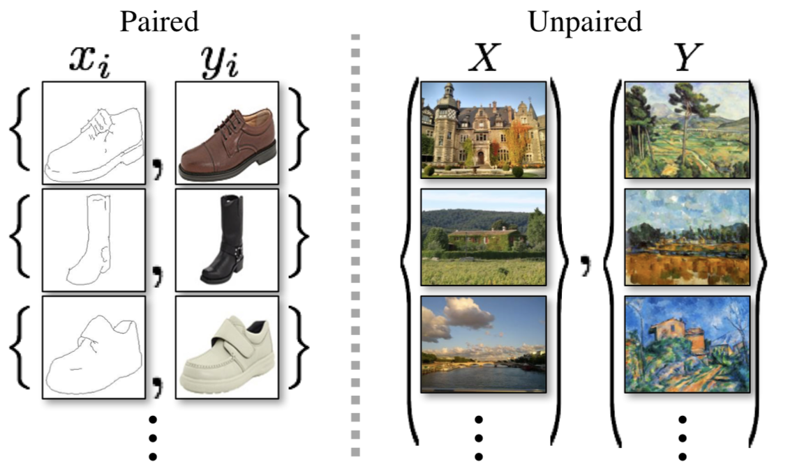
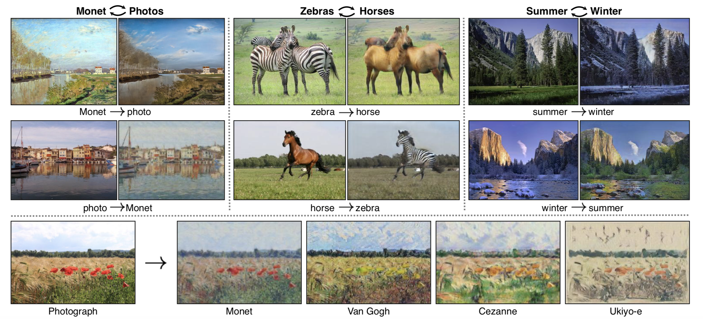
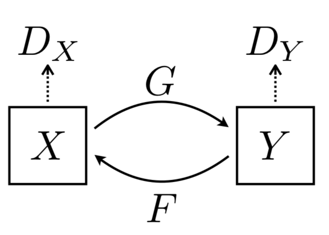
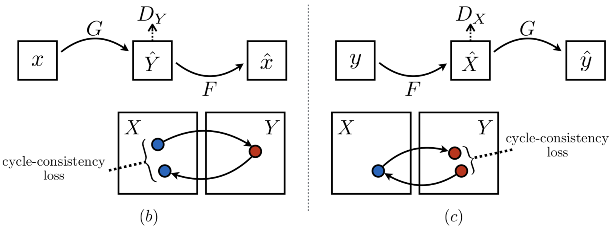

# 딥러닝(CycleGAN)을 이용해 Fortnite 를 PUBG 로 바꾸기
(Turning Fortnite into PUBG with Deep Learning (CycleGAN))
[원문 링크](https://towardsdatascience.com/turning-fortnite-into-pubg-with-deep-learning-cyclegan-2f9d339dcdb0)
> 이 문서는 `CycleGAN` 을 이용해 Image Style Trasfer 를 게임 배경에 적용해봅니다. 원작자의 튜토리얼에 대한 부가설명은 `인용구` 를 이용해서 표현할 것입니다. CycleGAN 을 설명하기 위해서 많은 글들이 Pix2Pix, GANs 에 대해서 이야기를 하는데 이 문서에서도 CycleGAN 설명을 위해 부가적인 설명을 할 것입니다.

* Keras
* GANs
* CycleGAN
* Style Transfer

### introduction
Image Style Trasfer 를 위한 CycleGAN 이해 및 게임용 그래픽 모듈에 대한 적용 탐색을 할 것 입니다.

  

신경망은 PUBG 의 시각적 스타일로 Fortnite 를 재창조하려고 시도합니다.
  
만약 여러분이 게이머라면, 여러분은 미친듯한 인기를 누리고 있는 Battle Royale 게임인 Fortnite 와 PUBG 에 대해 들어봤을 것입니다. 두 게임 모두 100명의 선수들이 단지 한 명의 생존자가 남아있을 때까지 작은 섬에서 경기를 하는 방식이 매우 유사합니다.

저는 Fortnite 의 게임 플레이를 좋아하지만 PUBG 의 더 현실적인 시각화를 더 좋아합니다. 이것이 저를 생각하게 만들었죠. 게임 개발자들이 우리에게 그 옵션을 제공할 필요 없이 우리가 좋아하는 시각 효과를 선택할 수 있는 게임용 그래픽 모드를 가질 수 있을까? 만약 PUBG 의 비주얼을 Fortnite 의 프레임 렌더링할 수 있는 방법이 있다면 어떨까요?

그 때 저는 딥러닝이 도움이 될 수 있는지 알아보기로 결심했습니다. 그리고 저는 CycleGAN 이라고 불리는 신경 네트워크를 찾게 되었습니다. 이 글에서는 CycleGANs 의 작동 방식을 검토하고 Fortnite 를 PUBG 의 스타일로 시각적인 변환을 시도해보겠습니다.

  

Figure1 : 카툰같은 비주얼의 Fortnite (왼쪽) 와 조금 더 현실 같은 비주얼의 PUBG (오른쪽)

  
  

#### What are CycleGANs? (CycleGANs 이 뭘까요?)
`CycleGANs` 는 도메인 사이의 `image style transfer` 에 사용되는 [Generative Adversarial Network(GAN)](https://skymind.ai/wiki/generative-adversarial-network-gan) 입니다. CycleGANs 을 사용하면 Fortnite 와 같은 한 도메인의 이미지를 PUBG 와 같은 다른 도메인으로 변환하도록 훈련할 수 있습니다. 이 작업은 비지도학습(unsupervised learning) 으로 수행됩니다. 즉, 각 도메인에 대한 이미지들의 일대일 매핑을 하지 않습니다. <U>이미지에 대한 일대일 매핑을 하지 않는다는 것</U>에 대한 설명을 아래에서 하겠습니다.

  

> `CycleGAN` 의 논문 제목은 [`Unpaired Image-to-Image Translation using Cycle-Consistent Adversarial Networks
`](https://arxiv.org/pdf/1703.10593.pdf) 입니다. 논문의 제목에서 알 수 있듯이 CycleGAN 은 **Unpaired Data** 데이터를 사용합니다.
>
> 아래의 Figure2 는 Unpaired 데이터를 사용하는 이유를 설명하기 위한 이미지입니다. 왼쪽은 `Pix2Pix` 에 필요한 `Paired Data`, 오른쪽은 `CycleGAN` 에서 사용하는 `Unpaired Data` 입니다. Pix2Pix 모델에서 신발 윤곽선에 맞는 신발 이미지를 생성할 때는 왼쪽 그림처럼 (신발 윤곽, 완전한 신발이미지) 가 쌍으로(pair,   )로 필요합니다.
>
> 
>
> Figure2 : Pix2Pix의 학습 데이터, CycleGAN의 학습 데이터
>
>   
> 하지만 paired data 를 얻는 것은 어렵고 비용이 많이 들 수 있습니다. 또한 Figure3 같이 말 형태를 놔두고 얼룩말로 무늬만 넣어줄 때, paired data 처럼 똑같은 포즈를 가진 얼룩말을 구하는 것은 쉽지 않습니다.
>
> 
>
> Figure3 : CycleGAN의 결과 1
>
>   
> 이러한 데이터 셋을 만들거나 구하는데 어려움이 있기 때문에 CycleGAN 은 Unpaired Data 를 이용해서 학습하는 방법을 소개합니다.
>   

  

Figure4 : CycleGAN의 결과 2

원본 Github implementation 과 그에 따른 결과는 [여기](https://github.com/junyanz/pytorch-CycleGAN-and-pix2pix)서 볼 수 있습니다.

  

네트워크는 오리지널 도메인의 이미지에 있는 개체를 이해하고 대상 도메인의 이미지에 있는 동일한 개체의 모양과 일치하도록 필요한 변환을 적용할 수 있습니다. 이 [알고리즘의 기존 적용](https://junyanz.github.io/CycleGAN/) 방식은 Figure4 에서 보이듯 말들을 얼룩말, 사과들을 오렌지로, 그리고 사진을 그림으로 바꾸는 놀라운 결과들을 보여줍니다.

  

> 원작자가 가르쳐준 github repository 는 PyTorch 로 만들어진 코드이므로, 우리는 아래에서 Keras 코드로 튜토리얼을 진행할 것 입니다.

  
  

#### How do they work? (어떻게 동작하는 것일까요?)

> **<U>CycleGAN 의 목표는 두 개의 도메인 X 와 Y 사이의 mapping function 을 학습하는 것입니다.**</U>
>
> 
> Figure5: CycleGAN 모델
>
> CycleGAN model 은 위 Figure5 에서 보이는 것과 같이 G : X → Y and F : Y → X 해주는 두 개의 mapping function 이 있고, F(Y) 를 판별하는 Dx and G(X) 를 판별하는 Dy 가 있습니다.
>
> 논문에서는 CycleGAN 은 생성된 이미지의 분포를 대상 도메인의 데이터 분포와 일치시키기 위한 `Adversarial loss` 와 학습된 매핑 G와 F가 서로 모순되는 것을 방지하기 위해 `Cycle consistency loss` 를 포함합니다. 여기서 말하는 <U>모순</U> 은 아래 Cycle consistency loss 에서 설명합니다.
>
> **Adversarial loss**
>
>  
>
> **Cycle consistency loss**
> Adversarial training 으로 각각 대상 도메인 Y와 X로 동일하게 분포된 출력을 생성하는 mapping G와 F를 배울 수 있지만, large capacity 에서는 네트워크는 동일한 입력 이미지 세트를 대상 도메인에서 이미지의 임의 허용에 맵핑할 수 있으며, 학습된 맵핑 중 하나라도 목표 위반과 일치하는 출력 분포를 유도할 수 있습니다. 이 문제가 위에서 말했던 모순입니다. 따라서 input  를 우리가 원하는  에 맵핑할 수 있다고 보장할 수는 없기 때문에 `Cycle consistency` 를 사용합니다.
>
> 
> Figure6 : CycleGAN 과 Cycle consistency
> (b) forward cycle-consistency loss: x → G(x) → F (G(x)) ≈ x, and (c) backward cycle-consistency loss: y → F (y) → G(F (y)) ≈ y
>
> X 가 G 를 거쳐서 G(X) 가 되고 다시 F 를 거쳐 F(G(X)) 가 된 값이 X 가 되어야하고, 똑같이 Y 가 F 를 거쳐서 F(Y) 가 되고 다시 G 를 거쳐서 G(F(Y)) 가 된 값이 Y가 되야한다는 이야기입니다.
> 한 바퀴를 돌아도 다시 내 자신이 되어야 합니다.
>
> 
>
> **CycleGAN Full loss**
>
> 

  

`CycleGAN` 이 어떻게 동작을 하는지 알아보기 위해 입력 도메인으로 Fortnite 을 사용하고, PUBG 를 타겟 도메인으로 사용해보겠습니다. 두 게임에서 찍은 많은 양의 스크린샷을 사용하여 한 쌍의 `Generative Adversarial Networks` 를 학습합니다. 신경망은 Fortnite 의 시각적 스타일과 PUBG의 시각적 스타일을 학습할 것 입니다.

이 두 네트워크는 순환(cyclic) 방식으로 동시에 훈련되어 두 게임 모두에서 동일한 개체 간의 관계를 형성하고 적절한 시각적 변환을 만듭니다. 다음 그림은 이러한 두 네트워크의 순환(cyclic) 설정의 일반적인 아키텍처를 보여줍니다.

  

Figure7 : “Real Fortnite” 에서 “Fake PUBG” 로, 그리고 또  “Reconstructed Fortnite” 로 도는 순환(Cycle)

  

우리는 Fortnite 의 원본 이미지를 가지고 학습을 시작합니다. 우리는 두개의 신경망을 훈련시킬 것이고, 하나는 generator 와 다른 하나는 discriminator 입니다.

이 discriminator 는 시간이 흐르면서 Fortnite 의 실제 이미지와 가짜 이미지를 구별하는 법을 배우게 될 것입니다. generator 는 학습 데이터에서 PUBG 의 랜덤 스크린샷을 사용하여 입력 이미지를 오리지널 도메인에서 타겟 도메인으로 변환하도록 교육됩니다.

 > generator 는 계속 입력 이미지를 타겟 도메인의 이미지처럼 바꿔서 가짜 이미지를 생성하고, discriminator 는 generator 가 만든 가짜 이미지를 구별하는 법을 학습하게 됩니다.

이러한 변화가 의미 있는지 확인하기 위해 우리는 재구성 조건(condition of reconstruction)을 적용합니다.

이것은 우리가 동시에 가짜 도메인에서 원본 영역의 이미지를 재구성하는 또 다른 generator/discriminator 를 훈련한다는 것을 의미합니다. 우리는 이 재구성이 원래 이미지와 유사해야 한다는 조건을 적용하여 학습 과정에서 최소화하고자 하는 cycle loss 값을 제공합니다.

> 위에서 말했던 `Cycle consistency` 를 쓴다는 말입니다.
>

이것은 우리가 중간 단계 latent space 에서 인코딩을 찾는 것이 아니라 우리의 목표 영역에 있는 전체 이미지를 찾는다는 것을 제외하면 오토인코더와 비슷합니다.

  

Figure8 : Figure7 에 나온 Generator 의 모습

  

여기에서 사용되는 generator 네트워크(F2P)는 세 가지 주요 `convolution` 블록으로 이루어져 있습니다. 첫 번째 convolution 에서는 Fortnite 스크린샷의 인코딩을 낮은 차수의 latent space 에서 찾아냅니다. 이 인코딩은 동일한 latent space 에서 PUBG 를 나타내는 인코딩으로 변환됩니다. 그런 다음 디코더는 변환된 인코딩에서 출력 이미지를 생성하므로 PUBG 처럼 보이는 Fortnite 이미지를 구성합니다.

이 교육 과정에서 직면했던 한 가지 문제는 GPU 메모리 제한으로 인해 256x256 이미지로만 작업할 수 있다는 것이었습니다. 이는 결과에 큰 영향을 미치지만 비디오 메모리가 8gb보다 많은 경우 최대 512x512개의 이미지를 생성할 수 있습니다. 만약 당신이 512x512 가 가능하다면, [나에게 알려주세요!](https://twitter.com/deepgamingai)

  
  

### Results (결과)
12시간의 훈련 후 `CycleGAN` 에서 생성된 이미지는 매우 성공적입니다. 이 신경망은 Fortnite 스타일에서 PUBG 스타일로 하늘색, 나무, 잔디색을 성공적으로 전환할 수 있었다. Fortnite 의 지나치게 강렬한 색깔은 PUBG 의 더 사실적인 색상으로 변화되었습니다.

  

  

하늘은 덜 푸르스름해 보이고, 만화 같은 잔디와 나무들은 PUBG 에서 볼 수 있는 나무와 훨씬 더 가까워 보입니다. 심지어 신경망은 화면 하단에 있는 상태표시창을 PUBG의 총과 탄약 표시기로 교체하는 것도 배웠습니다!

두 영역에서 연결할 수 없었던 것은 플레이어의 모습이었기 때문에 플레이어 주변의 픽셀이 흐릿합니다. 전반적으로, 신경망은 두 도메인에서 개체를 식별하고 그들의 외관을 변화시키는 일을 잘 한 것 같습니다.

더 긴 결과를 보려면 아래에 포함된 [비디오](https://www.youtube.com/watch?v=xkLtgwWxrec)를 보십시오. 만약 여러분이 보는 것을 좋아한다면, 여기를 클릭하여 내 유튜브 채널을 구독하는 것을 잊지 마세요!

  
  

### Application to graphic mods in games (게임 그래픽 모드에 적용)
결과는 정말 좋아 보이지만, 제가 실제로 PUBG 그래픽을 가지고 Fortnite 를 하려면 아직 갈 길이 멀다는 것은 분명합니다. 하지만 이러한 네트워크를 사용하여 실시간으로 고해상도 이미지를 생성할 수 있게 되면 향후 게임 개발자에게 의존하지 않고도 게임용 그래픽 모듈 엔진을 구축할 수 있게 될 것입니다. 우리가 좋아하는 게임의 시각적 스타일을 사용하여 다른 게임에 적용할 수 있습니다!

저는 글에서 논의했던 것과 같은 기술을 사용하여 게임 영상을 실제 사진으로 변환함으로써 게임에서 어떻게 실제 사진화를 이룰 수 있는지 알아보겠습니다. 계속 진행하시려면, 제 [블로그](https://medium.com/@chintan.t93)를 보거나 [유튜브 채널](http://youtube.com/c/DeepGamingAI)에 오세요. 읽어주셔서 감사합니다!

  
  

### 참고문서
* [김태영의 케라스 블로그](https://tykimos.github.io/)
* [초짜 대학원생 입장에서 이해하는 Generative Adversarial Nets](http://jaejunyoo.blogspot.com/2017/01/generative-adversarial-nets-1.html)
* [Unpaired Image-to-Image Translation using Cycle-Consistent Adversarial Networks
](https://arxiv.org/pdf/1703.10593.pdf)
* [코딩 셰프의 3분 딥러닝](https://github.com/jskDr/keraspp)

  

> 이 글은 2018 컨트리뷰톤에서 Contribute to Keras 프로젝트로 진행했습니다.
>
> Translator: [박정현](https://github.com/parkjh688)
>
> Translator email : <parkjh688@gmail.com>
