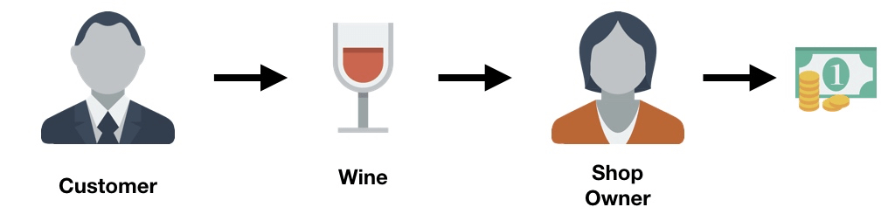
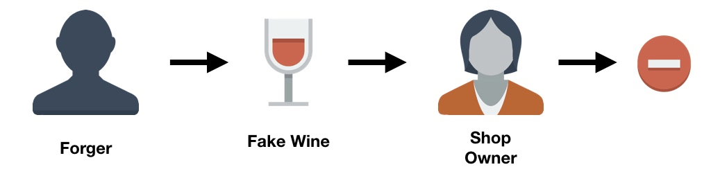
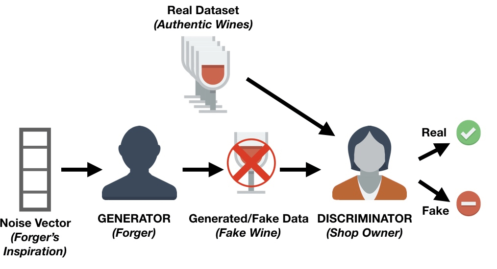
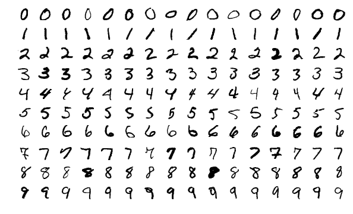
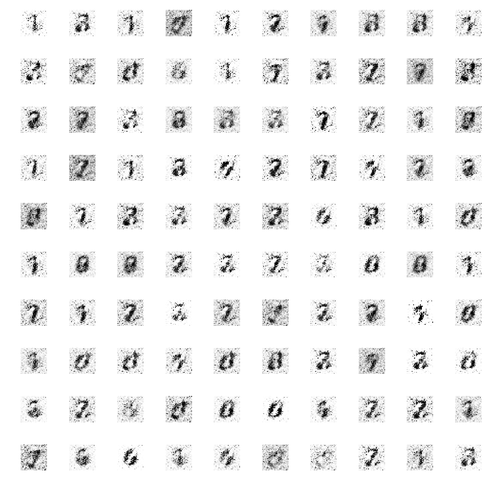
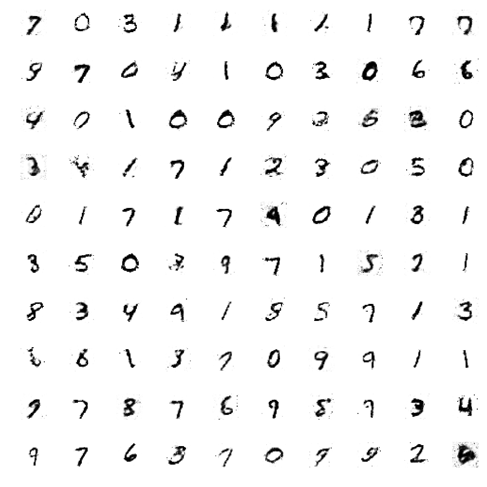
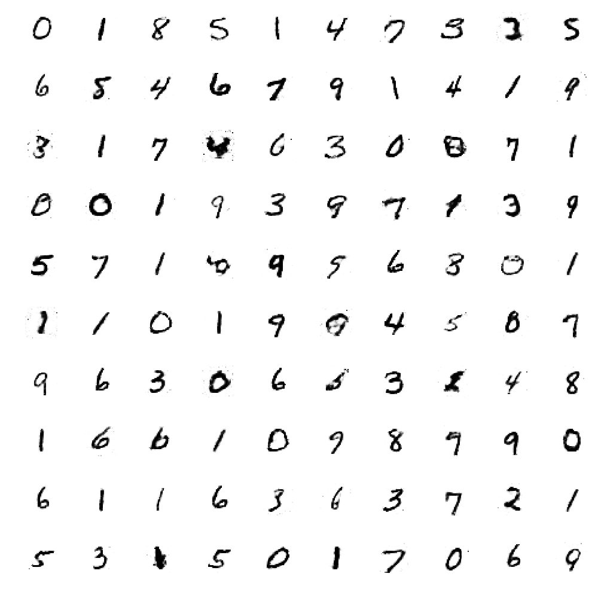

# Generative Adversarial Nets (GANs) 이해하기
[원문링크](https://www.datacamp.com/community/tutorials/generative-adversarial-networks)
> 이 문서는 Generative Adversarial Networks (GANs) 의 개념을 설명하고, `MNIST Data`, `Keras`, `Tensorflow` 를 이용해서 간단한 GANs 모델을 만들어 볼 것입니다. 원작자의 튜토리얼에 대한 부가설명은 `인용구` 를 이용해서 표현할 것입니다.

* GANs
* MNIST Data
* Keras
* Tensorflow

### Introduction (소개)

이 튜토리얼에서는 수학없이 Generative Adversarial Networks 가 무엇인지 배우고, 숫자를 생성해내는 간단한 `GANs` 모델을 만들어 봅시다!

<br></br>

### Analogy (비유)
GAN이 무엇인지 이해하는 가장 쉬운 방법은 다음과 어떤 것에 비유를 통해 배우는 것입니다:

고객들에게서 어떤 특정 와인을 사들이는 가게가 하나있다고 가정해봅시다.



공정한 거래가 오갔으면 평화롭지만, 돈을 벌기 위해 가짜 와인을 파는 사악한 고객들도 있습니다. 이 경우 가게 주인은 가짜 와인과 진품 와인을 구분할 수 있어야 합니다.



여러분은 처음에 위조 와인을 팔려고 할 때 가짜 와인을 파는 위조범이 많은 실수를 할지도 모른다고 상상할 수 있습니다. 그렇다면 가게 주인은 그 와인이 진짜가 아니라는 것을 쉽게 알아낼 것입니다.

이러한 실패로 인해, 가짜 와인 위조범은 진품 와인처럼 만들기 위해서 다른 기술을 계속 시도할 것이고 일부는 결국 성공하게 될 것이다. 이제 가짜 와인 위조범은 자신의 특정 기술이 상점 주인이 알아차릴 수 있는 수준을 넘어갔다는 것을 알았고, 이 기술을 바탕으로 가짜 와인을 더 발전시키기 시작할 수 있습니다.

동시에, 가게 주인은 다른 가게 주인이나 와인 전문가들로부터 그녀가 가지고 있는 와인의 일부가 진짜가 아니라는 피드백을 받을 것입니다. 이것은 가게 주인이 진짜 와인과 가짜와인을 판단하는 방법을 개선해야 한다는 것을 의미합니다.

따라서 가짜 와인 위조범의 목적은 진품과 구별이 안 되는 와인을 만드는 것이고, 가게 주인의 목표는 와인이 진짜인지 아닌지 정확하게 알아내는 것이 됩니다.

<U>**위조범과 위조를 구분해내려는 자의 경쟁이 `GANs`의 기본 아이디어가 됩니다.**</U>

<br></br>

### Components of a Generative Adversarial Network (GANs의 구성요소)
위의 예제를 이용하여, 우리는 `GANs`의 아키텍처를 그려볼 수 있습니다.



여기에 GANs의 주요 구성요소가 있습니다: `Generator(생성자)` 와 `Discriminator(식별자)` 입니다.

위의 예제에서 와인이 진짜인지 가짜인지 식별하는 가게 주인이 바로 `Discriminator` 의 예이고, 주로 어떤 이미지가 진짜인지 아닌지에 대한 확률을 주는 [Convolutional Neural Networks](https://www.datacamp.com/community/tutorials/convolutional-neural-networks-python) (GANs은 주로 이미지 쪽에서 많이 쓰이기 때문에) 를 사용합니다.

가짜 와인 위조범은 `Generator` 이고, 이 네트워크 역시 일반적으로 Convolutional Neural Network 를 사용합니다. ([deconvolutional layer](https://blog.openai.com/generative-models/) 와 함께). 이 네트워크는 노이즈 벡터를 가져와서 이미지를 출력합니다. `Generative 네트워크` 를 훈련할 때, `Discriminator` 가 생성된 이미지를 실제 이미지와 구분하는 데 어려움을 겪도록 이미지에서 개선/변경 영역을 학습합니다.

`Generative 네트워크` 는 실제 이미지와 비슷한 모습을 계속해서 생성하는 반면, `Discriminative 네트워크` 는 실제 이미지와 가짜 이미지의 차이를 확인하려고 노력합니다. 궁극적인 목표는 실제 이미지와 구별할 수 없는 이미지를 생성할 수 있는 생성 네트워크를 갖는 것입니다.

<br></br>

### A Simple Generative Adversarial Network with Keras (케라스로 만드는 간단한 Generative Adversarial Network)

이제 `GANs`이 무엇이고 그 주요 구성 요소가 무엇인지 이해하셨으니, 아주 간단한 코드를 만들 수 있습니다. `Keras` 를 사용하고 이 Python 라이브러리에 익숙하지 않은 경우 계속하기 전에 이 [튜토리얼](https://www.datacamp.com/community/tutorials/deep-learning-python) 을 읽어야 합니다. 본 튜토리얼은 [여기](https://github.com/Zackory/Keras-MNIST-GAN/blob/master/mnist_gan.py) 에서 개발된 `GAN`을 기반으로 합니다.

가장 먼저 해야될 일은 `pip` 을 이용해서 필요한 패키지들을 다운 받는 것입니다:

* `Keras`
* `matplotlib`
* `Tensorflow`
* `tqdm`

`matplotlib`는 plot 을 그리는데 사용할 것이고, `Tensorflow` 를 벡엔드로 사용한 `Keras` 를 이용할 것입니다. 또한 `tqdm` 을 이용해서 우리의 모델이 각 epoch 마다 얼마나 멋진 결과를 내고 있는지 보여줄 것입니다.

```python
import os
import numpy as np
import matplotlib.pyplot as plt
from tqdm import tqdm


from keras.layers import Input
from keras.models import Model, Sequential
from keras.layers.core import Dense, Dropout
from keras.layers.advanced_activations import LeakyReLU
from keras.datasets import mnist
from keras.optimizers import Adam
from keras import initializers
```

이제 변수를 설정합니다:

```python
# Keras 가 Tensorflow 를 벡엔드로 사용할 수 있도록 설정합니다.
os.environ["KERAS_BACKEND"] = "tensorflow"

# 실험을 재현하고 동일한 결과를 얻을 수 있는지 확인하기 위해 seed 를 설정합니다.
np.random.seed(10)

# 우리의 랜덤 노이즈 벡터의 차원을 설정합니다.
random_dim = 100
```

`Discriminator` 와 `Generator` 를 만들기 전에 먼저 데이터를 수집하고 전처리해야 합니다. 0 부터 9 까지의 단일 자릿수의 이미지 세트인 인기쟁이 데이터셋 `MNIST` 를 사용할 것입니다.



```python
def load_minst_data():
    # 데이터를 로드합니다.
    (x_train, y_train), (x_test, y_test) = mnist.load_data()

    # 데이터를 -1 ~ 1 사이 값으로 normalize 합니다.
    x_train = (x_train.astype(np.float32) - 127.5)/127.5

    # x_train 의 shape 를 (60000, 28, 28) 에서 (60000, 784) 로 바꿉니다.
    # 따라서 우리는 한 row 당 784 columns 을 가지게 됩니다.
    x_train = x_train.reshape(60000, 784)
    return (x_train, y_train, x_test, y_test)
```

**Note** `mnist.load_data()` 는 `Keras` 의 일부이고, `MNIST` 데이터 셋을 우리가 쉽게 사용할 수 있도록 해줍니다.

> `MNIST` 가 `Keras` 의 일부라는 것은, `Keras` 를 설치했다면 `MNIST` 데이터 셋을 위의 함수 `mnist.load_data()` 를 이용해서 쉽게 다운로드 받을 수 있다는 뜻입니다.

이제 `Generator` 및 `Discriminatora` 네트워크를  만들어 볼 수 있습니다. 두 네트워크에 모두 [Adam Optimizer](https://machinelearningmastery.com/adam-optimization-algorithm-for-deep-learning/) 를 사용합니다. `Generator` 와 `Discriminator` 의 경우 모두 세 개의 숨겨진 레이어가 있는 신경 네트워크를 생성하며 activation function(활성 함수)은 [Leaky Relu](https://www.quora.com/What-are-the-advantages-of-using-Leaky-Rectified-Linear-Units-Leaky-ReLU-over-normal-ReLU-in-deep-learning) 를 사용합니다. 또한 `Discriminator` 가 보이지 않는 영상에서 견고성을 향상시킬 수 있도록 [Dropout(드롭아웃)](https://medium.com/@amarbudhiraja/https-medium-com-amarbudhiraja-learning-less-to-learn-better-dropout-in-deep-machine-learning-74334da4bfc5) 레이어를 추가해야 합니다.

```python
# Adam Optimizer 를 사용합니다.
def get_optimizer():
    return Adam(lr=0.0002, beta_1=0.5)

# Generator 만들기
def get_generator(optimizer):
    generator = Sequential()
    generator.add(Dense(256, input_dim=random_dim, kernel_initializer=initializers.RandomNormal(stddev=0.02)))
    generator.add(LeakyReLU(0.2))

    generator.add(Dense(512))
    generator.add(LeakyReLU(0.2))

    generator.add(Dense(1024))
    generator.add(LeakyReLU(0.2))

    generator.add(Dense(784, activation='tanh'))
    generator.compile(loss='binary_crossentropy', optimizer=optimizer)
    return generator

# Discriminator 만들기
def get_discriminator(optimizer):
    discriminator = Sequential()
    discriminator.add(Dense(1024, input_dim=784, kernel_initializer=initializers.RandomNormal(stddev=0.02)))
    discriminator.add(LeakyReLU(0.2))
    discriminator.add(Dropout(0.3))

    discriminator.add(Dense(512))
    discriminator.add(LeakyReLU(0.2))
    discriminator.add(Dropout(0.3))

    discriminator.add(Dense(256))
    discriminator.add(LeakyReLU(0.2))
    discriminator.add(Dropout(0.3))

    discriminator.add(Dense(1, activation='sigmoid'))
    discriminator.compile(loss='binary_crossentropy', optimizer=optimizer)
    return discriminator
```

이제 `Generator` 와 `Discriminator` 를 함께 모아야 할 때입니다!

```python
def get_gan_network(discriminator, random_dim, generator, optimizer):
    # 우리는 Generator 와 Discriminator 를 동시에 학습시키고 싶을 때 trainable 을 False 로 설정합니다.
    discriminator.trainable = False

    # GAN 입력 (노이즈) 은 위에서 100 차원으로 설정했습니다.
    gan_input = Input(shape=(random_dim,))

    # Generator 의 결과는 이미지 입니다.
    x = generator(gan_input)

    # Discriminator 의 결과는 이미지가 진짜인지 가짜인지에 대한 확률입니다.
    gan_output = discriminator(x)

    gan = Model(inputs=gan_input, outputs=gan_output)
    gan.compile(loss='binary_crossentropy', optimizer=optimizer)
    return gan
```

완벽함을 위해 20 epoch 마다 생성된 이미지를 저장하는 기능을 만들 것입니다. 이 과정은 튜토리얼의 핵심이 아니기 때문에 완전히 이해할 필요는 없습니다.

```python
# 생성된 MNIST 이미지를 보여주는 함수
def plot_generated_images(epoch, generator, examples=100, dim=(10, 10), figsize=(10, 10)):
    noise = np.random.normal(0, 1, size=[examples, random_dim])
    generated_images = generator.predict(noise)
    generated_images = generated_images.reshape(examples, 28, 28)

    plt.figure(figsize=figsize)
    for i in range(generated_images.shape[0]):
        plt.subplot(dim[0], dim[1], i+1)
        plt.imshow(generated_images[i], interpolation='nearest', cmap='gray_r')
        plt.axis('off')
    plt.tight_layout()
    plt.savefig('gan_generated_image_epoch_%d.png' % epoch)
```

이제 네트워크의 대부분을 코딩했습니다. 남은 것은 이 네트워크를 훈련하고 당신이 만든 이미지를 보는 것입니다.

```python
def train(epochs=1, batch_size=128):
    # train 데이터와 test 데이터를 가져옵니다.
    x_train, y_train, x_test, y_test = load_minst_data()

    # train 데이터를 128 사이즈의 batch 로 나눕니다.
    batch_count = x_train.shape[0] // batch_size

    # 우리의 GAN 네트워크를 만듭니다.
    adam = get_optimizer()
    generator = get_generator(adam)
    discriminator = get_discriminator(adam)
    gan = get_gan_network(discriminator, random_dim, generator, adam)

    for e in range(1, epochs+1):
        print '-'*15, 'Epoch %d' % e, '-'*15
        for _ in tqdm(xrange(batch_count)):
            # 입력으로 사용할 random 노이즈와 이미지를 가져옵니다.
            noise = np.random.normal(0, 1, size=[batch_size, random_dim])

            image_batch = x_train[np.random.randint(0, x_train.shape[0], size=batch_size)]

            # MNIST 이미지를 생성합니다.
            generated_images = generator.predict(noise)
            X = np.concatenate([image_batch, generated_images])

            y_dis = np.zeros(2*batch_size)
            y_dis[:batch_size] = 0.9

            # Discriminator 를 학습시킵니다.
            discriminator.trainable = True
            discriminator.train_on_batch(X, y_dis)

            # Generator 를 학습시킵니다.
            noise = np.random.normal(0, 1, size=[batch_size, random_dim])
            y_gen = np.ones(batch_size)
            discriminator.trainable = False
            gan.train_on_batch(noise, y_gen)

        if e == 1 or e % 20 == 0:
            plot_generated_images(e, generator)

if __name__ == '__main__':
    train(400, 128)
```

400 epochs 를 학습한 후 생성된 이미지를 보세요. 1 epoch 이후에 생성된 영상을 보면, 실제 구조가 없다는 것을 알 수 있습니다. 하지만 40 epochs 이후의 이미지를 보면, 숫자가 형성되기 시작하고 마지막으로, 400 epochs 후에 생성된 영상은 숫자가 뚜렷하게 나타납니다.

| 1 epoch | 40 epochs | 400 epochs |
|:--------:|:--------:|:--------:|
|  |  |  |

이 코드는 CPU 에서 epoch 별로 약 2분이 소요되고, 이것이 이 코드를 선택한 주된 이유입니다. `Generator` 와 `Discriminator` 에 더 많은(그리고 다른) 레이어를 추가하여 실험할 수 있습니다. 그러나 더 복잡하고 깊은 아키텍처를 사용하는 경우 CPU 만 사용하는 경우에도 런타임이 증가합니다. 하지만, 그런 제약 사항들이 여러분이 실험하는 것을 멈추게 하지 마세요!

<br></br>

### Conclusion (결과)

축하합니다. 이 튜토리얼을 마치셨습니다. `GAN(Generative Adversarial Networks)` 의 기본을 직관적으로 배웠습니다. 또한 `Keras` 라이브러리의 도움을 받아 첫 번째 모델을 구현했습니다. Python 을 사용한 심층 학습에 대해 자세히 알아보려면 DataCamp의 Deep Learning을 Python 과정으로 수강해보세요.

<br></br>
> 이 글은 2018 컨트리뷰톤에서 [`Contribute to Keras`](https://github.com/KerasKorea/KEKOxTutorial) 프로젝트로 진행했습니다.  
> Translator: [박정현](https://github.com/parkjh688)
> Translator email : <parkjh688@gmail.com>
