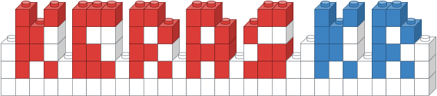
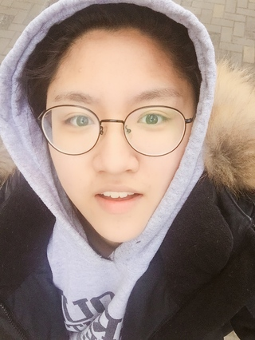
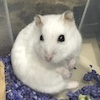
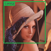

# KEKOxTutorial
`2018 오픈소스 컨트리뷰톤`으로 시작된 케라스 문서 번역 프로젝트 입니다. 전 세계의 멋진 케라스 문서 및 튜토리얼을 한글화하여 `케라스x코리아`를 널리널리 이롭게합니다. 🇰🇷

### 케라스 코리아 블로그
`KEKOxTutorial` 프로젝트를 통해 번역된 문서는 케라스 코리아 블로그에서 편하게 읽을 수 있습니다. 다양함과 유익함에 재미까지 더 했답니다. 즐겨찾기에 추가하는거 잊지 마세요 😉

[케라스 코리아 블로그 바로가기](https://keraskorea.github.io)

### 함께 작업하는 방법에 관하여 📖
케라스 문서 번역 작업 방식 및 순서 등 작업이 어떻게 이뤄지고, 어떻게 참여할 수 있는지 궁금하다면 아래 링크를 참고해주세요.  

[작업방식 살펴보기](https://github.com/KerasKorea/KEKOxTutorial/blob/master/00_work_flow.md)

## 멋쟁이 컨트리뷰터 🦄

| 😁 | NAME | HOBBY | CONTRIBUTIONs |
|------|----------|----------|-----------|
|     |  [김수정](https://github.com/SooDevv)    |  🕹 게임하기   덕질하기  |  [Fasion-MNIST](https://keraskorea.github.io/posts/2018-09-28-딥러닝의%20Hello%20World,%20Fashion-MNIST/)     [안드로이드에 MNIST 심기]() |
|  | [김영규](https://github.com/karl6885) |고양이, 춤, 유투브 보기|[파이썬과 케라스를 이용한 알파제로 만들기](https://keraskorea.github.io/posts/2018-10-23-파이썬과_케라스를_이용한_알파제로_만들기/)  [Keras의 Autoencoder를 활용해 신용카드 이상 거래 탐지하기](https://keraskorea.github.io/posts/2018-10-23-Keras의%20Autoencoder를%20활용해%20신용카드%20이상%20거래%20탐지하기/)  [Keras를 활용한 주식 가격 예측](https://github.com/KerasKorea/KEKOxTutorial/blob/master/22_Keras를%20활용한%20주식%20가격%20예측.md)|
|</img> | [박정현](https://github.com/parkjh688)| 위키피디아, 나무위키 읽기 📙  서브웨이 샌드위치 먹기 🥪   운동하기 💪 | [케라스 LSTM 모델로 작곡하기](https://keraskorea.github.io/posts/2018-09-01-케라스%20LSTM%20모델로%20작곡하기/)   [OpenCV를 사용한 Neural Style Transfer](https://keraskorea.github.io/posts/2018-09-10-OpenCV를%20사용한%20Neural%20Style%20Transfer/)  [딥러닝(CycleGAN)을 이용해 Fornite 를 PUBG 로 바꾸기](https://keraskorea.github.io/posts/2018-10-24-딥러닝(CycleGAN)을%20이용해%20Fornite%20를%20PUBG%20로%20바꾸기/)  [뉴럴 네트워크 임베딩을 이용한 추천 시스템](https://keraskorea.github.io/posts/2018-10-16-뉴럴%20네트워크%20임베딩을%20이용한%20추천%20시스템%20만들기/)   [Keras 와 Gym 과 함께하는 Deep Q-Learning 을 향한 여행](https://keraskorea.github.io/posts/2018-10-25-Keras%20%EC%99%80%20Gym%20%EA%B3%BC%20%ED%95%A8%EA%BB%98%ED%95%98%EB%8A%94%20Deep%20Q-Learning%20%EC%9D%84%20%ED%96%A5%ED%95%9C%20%EC%97%AC%ED%96%89/)  [Tensorflow와 Keras를 활용한 가상화폐 가격 예측하기](https://keraskorea.github.io/posts/2018-10-24-Tensorflow와%20Keras를%20활용한%20가상화폐%20가격%20예측하기/)   [Generative Adversarial Nets (GANs) 이해하기](https://keraskorea.github.io/posts/2018-09-18-Generative%20Adversarial%20Nets%20(GANs)%20이해하기/)  [Neural Style Transfer ](https://github.com/KerasKorea/KEKOxTutorial/blob/master/15_Neural_Style_Transfer_Creating_Art_with_Deep_Learning_using_tf.keras_and_eager_execution.md) with [mike2ox](https://github.com/mike2ox)|
| | [mike2ox (송문혁)](https://github.com/mike2ox)| :man_cook: 요리하기   🕹 게임하기   :airplane: 여행가기|[케라스로 작곡하기](https://github.com/KerasKorea/KEKOxTutorial/blob/master/09_How%20to%20Generate%20Music%20using%20a%20LSTM%20Neural%20Network%20in%20Keras/09_%EC%BC%80%EB%9D%BC%EC%8A%A4%20LSTM%20%EB%AA%A8%EB%8D%B8%EB%A1%9C%20%EC%9E%91%EA%B3%A1%ED%95%98%EA%B8%B0.md)  with [parkjh668](https://github.com/parkjh668)   [GAN으로 이미지 흐림 제거](https://github.com/KerasKorea/KEKOxTutorial/blob/master/12_GAN_with_Keras-Application_to_Image_Deblurring.md)  [Neural Style Transfer ](https://github.com/KerasKorea/KEKOxTutorial/blob/master/15_Neural_Style_Transfer_Creating_Art_with_Deep_Learning_using_tf.keras_and_eager_execution.md) with [parkjh668](https://github.com/parkjh668)   [CNN Ensemble](https://github.com/KerasKorea/KEKOxTutorial/blob/master/16_Ensembling%20ConvNets%20using%20Keras.md) with [sulki.kim](http://github.com/5taku)    [seq2seq 배워보기](https://github.com/KerasKorea/KEKOxTutorial/blob/master/28_A_ten-minute_introduction_to_sequence-to-sequence_learning_in_Keras.md)   [ 모델을 REST API로 배포하기](https://github.com/KerasKorea/KEKOxTutorial/blob/master/32_building_a_simple_keras_deep_learning_rest_api.md)  [Keras/examples : Generative models](https://github.com/KerasKorea/KEKOxTutorial/tree/master/25_Keras_examples_3_Generative_models_examples)   [Keras vs PyTorch 당신의 선택은?](https://github.com/KerasKorea/KEKOxTutorial/blob/master/42_keras_or_pytorch_as_your_first_deep_learning_framework.md)|
|  | [오시영(ohahohah)](https://github.com/ohahohah) | 행사 기획 |[텐서플로우 워크플로우로서 케라스 사용하기 완전 가이드](https://keraskorea.github.io/posts/2018-10-24-텐서플로우%20워크플로우로서%20케라스%20사용하기%20완전%20가이드/)  |
|  | [윤정인](https://github.com/wjddlsy) |유튜브 보기!|[케라스로 이해하는 Autoencoder](https://keraskorea.github.io/posts/2018-10-23-keras_autoencoder/)  [Keras와 GPU Kaggle Kernel으로 LSTM 활용하기](https://github.com/KerasKorea/KEKOxTutorial/blob/master/33_LSTM%20을%20이용한%20텍스트%20generation%2C%20keras%20와%20gpu%20사용.md)|
|  | [visionNoob (이재원)](https://github.com/insurgent92) |조촐하게 모여서 한 잔 🏃🍻🍻🍺🍺🐶💀 |[딥러닝으로 당뇨망막병증 검출하기](https://github.com/KerasKorea/KEKOxTutorial/blob/master/13_%EB%94%A5%EB%9F%AC%EB%8B%9D%EC%9C%BC%EB%A1%9C%20%EB%8B%B9%EB%87%A8%EB%A7%9D%EB%A7%89%EB%B3%91%EC%A6%9D%20%EA%B2%80%EC%B6%9C%ED%95%98%EA%B8%B0.md)  |
|  | [정연준](https://github.com/fuzzythecat) | 배드민턴:badminton: | [케라스를 이용한 다중 라벨 분류](https://github.com/KerasKorea/KEKOxTutorial/blob/master/35_%EC%BC%80%EB%9D%BC%EC%8A%A4%EB%A5%BC%20%EC%9D%B4%EC%9A%A9%ED%95%9C%20%EB%8B%A4%EC%A4%91%20%EB%9D%BC%EB%B2%A8%20%EB%B6%84%EB%A5%98.md)   [케라스를 이용한 멀티 GPU 학습](https://github.com/KerasKorea/KEKOxTutorial/blob/master/37_%EC%BC%80%EB%9D%BC%EC%8A%A4%EB%A5%BC%20%EC%9D%B4%EC%9A%A9%ED%95%9C%20%EB%A9%80%ED%8B%B0%20GPU%20%ED%95%99%EC%8A%B5.md)  |
|  | [조아라](https://github.com/ahracho) | 뭐니뭐니해도 돈쓰는 게 제일 재밌죠 :money_with_wings:   덕질도 좋아합니다! (어덕행덕 :two_hearts:) | [환각 딥강화학습(작업중)](https://github.com/KerasKorea/KEKOxTutorial/blob/issue_06/06_Python%EA%B3%BC%20Keras%EB%A5%BC%20%EC%9D%B4%EC%9A%A9%ED%95%9C%20%ED%99%98%EA%B0%81%20%EB%94%A5%EA%B0%95%ED%99%94%ED%95%99%EC%8A%B5.md)    [KEKOxTutorial 블로그](https://keraskorea.github.io/) |

> 오해하지 마세요, 외모 순서가 아니라 ㄱ-ㄴ-ㄷ순서입니다.

----

**MENTORED BY**

| 😁 | NAME | HOBBY |
|------|------|--------|
|  |   [김태영](https://github.com/tykimos)  |   다른 사람 취미 같이하기   |
|    |   [전미정](https://github.com/mijeongjeon)  |   🐱☕️🍷🥖🛫📸📝    |

##### 컨트리뷰터가 되어 함께 작업하고 싶다면 언제든 연락주세요! [📮](mailto:ninevincentg@gmail.com)

